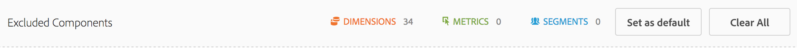

# Overzicht van het vergelijkingspaneel voor segmenten {#segment-comparison-overview}

<!-- markdownlint-disable MD034 -->

>[!CONTEXTUALHELP]
>id="workspace_segmentcomparison_button"
>title="Segmentvergelijking"
>abstract="Vergelijk snel twee segmenten in alle gegevenspunten om automatisch relevante verschillen te vinden."

<!-- markdownlint-enable MD034 -->

<!-- markdownlint-disable MD034 -->

>[!CONTEXTUALHELP]
>id="workspace_segmentcomparison_panel"
>title="Het vergelijkingspaneel Segment"
>abstract="Vergelijk snel twee segmenten in alle gegevenspunten om automatisch relevante verschillen te vinden.  **Parameters ** **voegen een segment** toe: Het eerste segment u wilt analyseren. **vergelijk tegen**: Het tweede segment u tegen wilt vergelijken. Dit zal automatisch met *Eenieder anders* bevolken die het omgekeerde van uw eerste segment is. U kunt dit desgewenst vervangen door een ander segment. **Geavanceerde montages**: De capaciteit om componenten van worden geanalyseerd in de segmentvergelijking uit te sluiten."
<!-- markdownlint-enable MD034 -->

>[!BEGINSHADEBOX]

_dit artikel documenteert het de vergelijkingspaneel van het Segment in_  _**Adobe Analytics**._ _er is geen gelijkwaardig paneel in_  _**Customer Journey Analytics**._

>[!ENDSHADEBOX]

Het de vergelijkingspaneel van het Segment is een hulpmiddeldeel van [ IQ van het Segment ](../../segment-iq.md) dat de statistisch meest significante verschillen onder een onbeperkt aantal segmenten ontdekt. De functie doorloopt een geautomatiseerde analyse van alle dimensies en metriek waartoe u toegang hebt. Het ontdekt automatisch zeer belangrijke kenmerken van de publiekssegmenten die KPIs van uw bedrijf drijven en laat u zien hoeveel om het even welke segmenten overlappen.

+++ Hier volgt een video over het vergelijken van segmenten:

>[!VIDEO](https://video.tv.adobe.com/v/23976/?quality=12)

+++

## Gebruiken

Een deelvenster **[!UICONTROL Attribution]** gebruiken:

1. Maak een deelvenster **[!UICONTROL Attribution]** . Voor informatie over hoe te om een paneel tot stand te brengen, zie [ een paneel ](../panels.md#create-a-panel) creëren.

1. Specificeer de [ input ](#panel-input) voor het paneel.

1. Neem de [ output ](#panel-output) voor het paneel waar.

### Deelvensterinvoer

1. Selecteer segmenten die u wilt vergelijken en zet ze neer in het deelvenster.

   

   Nadat u een segment naar het deelvenster hebt gesleept, maakt Analytics automatisch een [!UICONTROL 'Everyone Else'] -segment dat alle NOT-componenten bevat in het segment dat u hebt gekozen. Het is een vaak gebruikt segment in het vergelijkingspaneel, maar u kunt het wel verwijderen en een ander keuzesegment vergelijken.

   

1. Als u hebt bepaald welke twee segmenten moeten worden vergeleken, klikt u op [!UICONTROL Build] .

   Deze actie begint een achterste proces dat statistische verschillen tussen de twee geselecteerde segmenten en alle dimensies, metriek en andere segmenten zoekt. Een voortgangsbalk boven in het deelvenster geeft de resterende tijd aan totdat elke meting en dimensie wordt geanalyseerd. De meest gebruikte metriek, de afmetingen, en de segmenten worden voorrang gegeven aan looppas eerst zodat zijn de meest relevante resultaten op een geschikte manier teruggekeerd.

## Componenten uitsluiten van vergelijking

Soms is het gewenst om bepaalde afmetingen, maateenheden of segmenten uit te sluiten van segmentvergelijkingen. U wilt bijvoorbeeld het segment &#39;Amerikaanse mobiele gebruikers&#39; vergelijken met &#39;Duitse mobiele gebruikers&#39;. Het zou niet zinvol zijn om geografische dimensies op te nemen, aangezien deze segmenten al deze verschillen inhouden.

1. Klik op [!UICONTROL 'Show Advanced Options'] nadat de gewenste twee segmenten in het deelvenster zijn opgenomen.
1. Sleep componenten die u wilt uitsluiten naar het deelvenster [!UICONTROL Excluded Components] .

   

Klik op [!UICONTROL 'Set as default'] om uw huidige componenten automatisch uit te sluiten bij alle toekomstige segmentvergelijkingen. Als u uitgesloten componenten wilt uitgeven, klik een componenttype, dan klik &quot;X&quot;naast een component om het in uw analyse opnieuw op te nemen. Klik op Alles wissen om alle componenten opnieuw op te nemen in de segmentvergelijking.

### Deelvensteruitvoer

Wanneer de Adobe klaar is met het analyseren van de twee gewenste segmenten, worden de resultaten ervan in verschillende visualisaties weergegeven:

#### Grootte en overlapping

Hiermee worden de relatieve grootten van elk geselecteerd segment en de mate waarin ze met elkaar overlappen, geïllustreerd met behulp van een vlinderdiagram. U kunt de muisaanwijzer boven het visuele gedeelte plaatsen om te zien hoeveel bezoekers zich in elke overlappende of niet-overlappende sectie bevonden. U kunt ook met de rechtermuisknop op de overlapping klikken om een gloednieuw segment te maken voor verdere analyse. Als de twee segmenten elkaar uitsluiten, wordt geen overlapping getoond tussen de twee cirkels (typisch gezien met segmenten gebruikend een klapcontainer).

#### Samenvattingen van de populatie

Rechts van de visualisatie Grootte en Overlap wordt het totale aantal unieke bezoekers in elk segment en de overlapping weergegeven.

#### Metrische gegevens bovenaan

Geeft de statistisch meest significante cijfers weer tussen de twee segmenten. Elke rij in deze tabel vertegenwoordigt een differentiërende metrische waarde, gerangschikt op basis van de verschillen tussen de segmenten. Een verschilscore van 1 betekent dat deze statistisch significant is, terwijl een verschilscore van 0 betekent dat er geen statistische significantie is.

Deze visualisatie lijkt op vrije-vormtabellen in Analysis Workspace. Als u een diepgaande analyse van een bepaalde metrische waarde wilt uitvoeren, plaatst u de muisaanwijzer boven een regelitem en klikt u op &#39;Zichtbaar maken&#39;. Er wordt een nieuwe tabel gemaakt om die specifieke metrische waarde te analyseren. Als metrisch voor uw analyse irrelevant is, houd over het lijnpunt en klik &quot;X&quot;om het te verwijderen.

>[!NOTE]
>
>De metriek die aan deze lijst wordt toegevoegd nadat de segmentvergelijking is gebeëindigd ontvangen geen Score van het Verschil.

#### Metrisch in de tijd per segment

Rechts van de tabel Metriek bevindt zich een gekoppelde visualisatie. U kunt op een regelitem in de tabel aan de linkerkant klikken en deze visualisatie wordt bijgewerkt om aan te geven dat metrische waarden in de loop der tijd zijn trended.

#### Bovenste afmetingen

Toont de statistisch meest significante afmetingspunten over al uw dimensies. Elke rij toont het percentage van elk segment dat dit afmetingspunt tentoonstelt. Deze tabel laat bijvoorbeeld zien dat 100% van de bezoekers in &#39;Segment A&#39; het dimensie-item &#39;Browsertype: Google&#39; had, terwijl slechts 19,6% van &#39;Segment B&#39; dit dimensie-item had. Een verschilscore van 1 betekent dat deze statistisch significant is, terwijl een verschilscore van 0 betekent dat er geen statistische significantie is.

Deze visualisatie lijkt op vrije-vormtabellen in Analysis Workspace. Als u een diepgaande analyse van een specifiek dimensie-item wilt uitvoeren, plaatst u de muisaanwijzer boven een lijstitem en klikt u op &#39;Zichtbaar maken&#39;. Er wordt een nieuwe tabel gemaakt om dat specifieke dimensie-item te analyseren. Als een dimensie-item irrelevant is voor uw analyse, plaatst u de muisaanwijzer boven het lijstitem en klikt u op de X-toets om het item te verwijderen.

>[!NOTE]
>
>De punten van het Dimension die aan deze lijst worden toegevoegd nadat de segmentvergelijking is gebeëindigd ontvangen geen Score van het Verschil.

#### Items Dimensionen per segment

Rechts van de tabel met afmetingen bevindt zich een gekoppelde staafdiagramvisualisatie. Het toont alle getoonde afmetingspunten in een staafdiagram. Als u op een regelitem in de tabel links klikt, wordt de visualisatie rechts bijgewerkt.

#### Bovenste segmenten

Geeft aan welke andere segmenten (behalve de twee segmenten die ter vergelijking zijn geselecteerd) statistisch significant overlappen. Deze tabel kan bijvoorbeeld laten zien dat een derde segment, &#39;Bezoekers herhalen&#39;, sterk overlapt met &#39;Segment A&#39;, maar niet overlapt met &#39;Segment B&#39;. Een verschilscore van 1 betekent dat deze statistisch significant is, terwijl een verschilscore van 0 betekent dat er geen statistische significantie is.

Deze visualisatie lijkt op vrije-vormtabellen in Analysis Workspace. Als u een diepgaande analyse van een specifiek segment wilt uitvoeren, plaatst u de muisaanwijzer boven een lijstitem en klikt u op &#39;Zichtbaar maken&#39;. Er wordt een nieuwe tabel gemaakt om dat specifieke segment te analyseren. Als een segment irrelevant voor uw analyse is, beweegt u de muisaanwijzer over het lijstitem en klikt u op de X om het te verwijderen.

>[!NOTE]
>
>De segmenten die aan deze lijst worden toegevoegd nadat de segmentvergelijking is gebeëindigd ontvangen geen Score van het Verschil.

#### Segmentoverlapping

Rechts van de segmenttabel bevindt zich een gekoppelde venn-schemavisualisatie. Het toont het statistisch meest significante segment dat op uw vergeleken segmenten wordt toegepast. Bijvoorbeeld &#39;Segment A&#39; + &#39;Statistisch significant segment&#39; vs. &#39;Segment B&#39; + &#39;Statistisch significant segment&#39;. Wanneer u op een segmentregelitem in de tabel links klikt, wordt het vlinderdiagram rechts bijgewerkt.

