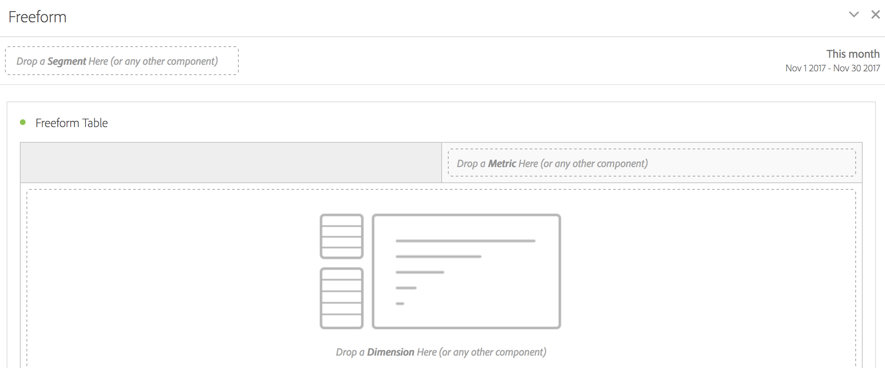

# Deelvenster Vrije vorm

>[!BEGINSHADEBOX]

_Dit artikel documenteert het deelvenster Vrije vorm in_  _&#x200B;**Adobe Analytics**._ _zie [ het deelvenster Vrije vorm ](https://experienceleague.adobe.com/nl/docs/analytics/analyze/analysis-workspace/panels/freeform-panel) voor_  _&#x200B;**Customer Journey Analytics** versie van dit artikel._

>[!ENDSHADEBOX]

A **[!UICONTROL Freeform panel]** is een leeg paneel met de lijst van de a [ Vrije vorm ](/help/analyze/analysis-workspace/visualizations/freeform-table/freeform-table.md) visualisatie als standaardbeginnende staat.

## Gebruiken

Een **[!UICONTROL Freeform panel]** gebruiken:

1. Maak een **[!UICONTROL Freeform panel]** . Voor informatie over hoe te om een paneel tot stand te brengen, zie [ een paneel ](panels.md#create-a-panel) creëren.

   

1. Zie [&#128279;](/help/components/home.md) de componentengids van 0&rbrace; Analytics &lbrace;hoe u componenten aan het vrije paneel van de Vorm en [ vrije lijst ](/help/analyze/analysis-workspace/visualizations/freeform-table/freeform-table.md) visualisatie kunt toevoegen.

>[!MORELIKETHIS]
>
>[ creeer een paneel ](/help/analyze/analysis-workspace/c-panels/panels.md#create-a-panel)
>&#x200B;>[De componentengids van de Analytics ](/help/components/home.md)
>&#x200B;>[Visualisatie voor vrije-vormtabellen ](/help/analyze/analysis-workspace/visualizations/freeform-table/freeform-table.md)
>
