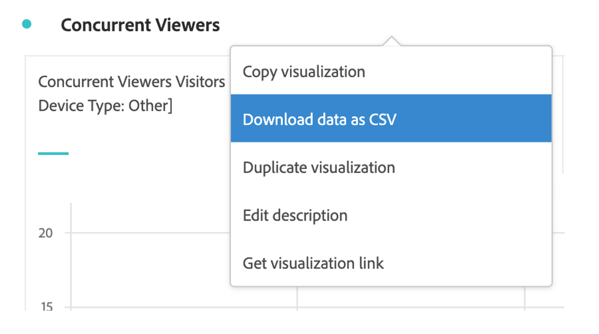

# Deelvenster Mediagelijktijdige viewers {#media-concurrent-viewers-panel}

<!-- markdownlint-disable MD034 -->

>[!CONTEXTUALHELP]
>id="workspace_mediaconcurrentviewers_button"
>title="Gelijktijdige viewers voor media"
>abstract="Maak een deelvenster om het gemiddelde aantal minuten voor specifieke inhoud of over een bepaalde periode te analyseren."

<!-- markdownlint-enable MD034 -->

<!-- markdownlint-disable MD034 -->

>[!CONTEXTUALHELP]
>id="workspace_mediaconcurrentviewers_panel"
>title="Gelijktijdige viewers voor media"
>abstract="Analyseer gelijktijdige viewers in de loop der tijd, bekijk de piektijkgelijktijdige, of onderbreek en vergelijk.  **Korreligheid**: Selecteer tijdspanne om gezamenlijke kijkers door te bekijken. **de summiere aantallen van het Comité**:  Optie om summiere aantallen met datum of tijddetails voor elke lijn te tonen. Bij Maximaal worden details voor de piekfrequentie weergegeven. Bij Minimaal worden details voor de trog weergegeven. **(Facultatieve) de indeling van de Reeks**: Onderbreking visualisatie door segmenten, dimensies, afmetingspunten of datumwaaiers. U kunt maximaal 10 regels tegelijk weergeven. Uitsplitsingen zijn beperkt tot één niveau."

<!-- markdownlint-enable MD034 -->

>[!BEGINSHADEBOX]

_dit artikel documenteert het Medium gezamenlijke kijkers in_  _&#x200B;**Adobe Analytics Analytics**._ _zie [ Medium gezamenlijke kijkers ](https://experienceleague.adobe.com/en/docs/analytics/analyze/analysis-workspace/panels/media-concurrent-viewers) voor_  _&#x200B;**Customer Journey Analytics** versie van dit artikel._

>[!ENDSHADEBOX]

>[!NOTE]
>
>Het deelvenster Medium voor het aantal minuten publiek is alleen beschikbaar voor klanten die Adobe Analytics voor de invoegtoepassing voor streaming media hebben aangeschaft.
>
>Neem contact op met uw Adobe Sales-vertegenwoordiger of Adobe-accountteam voor meer informatie.
>

Met het deelvenster **[!UICONTROL Media concurrent viewers]** kunt u in de loop der tijd gelijktijdige viewers analyseren, met details over de piekfrequentie en de mogelijkheid om af te breken en te vergelijken.

U kunt gelijktijdige viewers analyseren om te zien waar de piekgelijktijdige uitvoering plaatsvond of waar drop-outs waardevolle insight hebben verschaft voor de kwaliteit van de inhoud en de betrokkenheid van de viewer. En voor hulp bij het oplossen van problemen of het plannen voor volume of schaal.

In Analysis Workspace is de metrische waarde voor Gelijktijdige viewers het aantal unieke personen dat uw mediastreams op een bepaald tijdstip weergeeft, ongeacht het aantal sessies.

>[!BEGINSHADEBOX]

Zie  [ het gezamenlijke paneel van kijkers van Media ](https://video.tv.adobe.com/v/330177?quality=12&learn=on){target="_blank"} voor een demo video.

>[!ENDSHADEBOX]

## Gebruiken

Een deelvenster **[!UICONTROL Media concurrent viewers]** gebruiken:

1. Maak een deelvenster **[!UICONTROL Media concurrent viewers]** . Voor informatie over hoe te om een paneel tot stand te brengen, zie [ een paneel ](panels.md#create-a-panel) creëren.

1. Selecteer een gegevensweergave voor het deelvenster waarin componenten zijn geconfigureerd via Adobe Analytics voor Streaming Media Add-on.

1. Specificeer de [ input ](#panel-input) voor het paneel.

1. Neem de [ output ](#panel-output) voor het paneel waar.

### Deelvensterinvoer

U kunt het deelvenster Mediagelijktijdige viewers configureren met de volgende invoerinstellingen:

| Instelling | Beschrijving |
|---|---|
| **[!UICONTROL Panel date range]** | Het standaarddatumbereik van het deelvenster is Vandaag.  U kunt de presentatie bewerken om een enkele dag of maanden tegelijk weer te geven.     Deze visualisatie is beperkt tot 1440 rijen van gegevens (bijvoorbeeld, 24 uur bij miniem-vlakke granulariteit).  Als een datumbereik en de combinatie van granulariteit meer dan 1440 rijen opleveren, wordt de granulariteit automatisch bijgewerkt om het volledige datumbereik te kunnen gebruiken. |
| **[!UICONTROL Granularity]** | De standaardwaarde voor granulariteit is Minute.  Deze visualisatie is beperkt tot 1440 rijen van gegevens (bijvoorbeeld, 24 uur bij miniem-vlakke granulariteit).  Als een datumbereik en de combinatie van granulariteit meer dan 1440 rijen opleveren, wordt de granulariteit automatisch bijgewerkt om het volledige datumbereik te kunnen gebruiken. |
| **[!UICONTROL Panel summary numbers]** | Er is een samenvattingsnummer beschikbaar om de datum- of tijdgegevens van gelijktijdige viewers weer te geven. Bij Maximaal worden details voor de piekfrequentie weergegeven. In **[!UICONTROL Minimum]** worden de details van de trog weergegeven.  In het standaardvenster wordt alleen Maximum weergegeven, maar u kunt dit wijzigen in Minimum of zowel Maximaal als Minimaal.   als u onderverdelingen gebruikt, wordt een samenvattingsaantal getoond voor elk. |
| **[!UICONTROL Series breakdown]** | U kunt desgewenst de visualisatie opsplitsen in filters, dimensies, dimensiepunten of datumbereiken.  u kunt tot 10 lijnen tegelijkertijd bekijken. Uitsplitsingen zijn beperkt tot één niveau.  wanneer het slepen van een afmeting, worden de hoogste afmetingspunten geselecteerd automatisch gebaseerd op de geselecteerde waaier van de paneeldatum.  om datumwaaiers te vergelijken, sleep 2 of meer datumwaaiers in de filter van de reeksindeling. |

Hier volgt een voorbeeld van het deelvenster dat is geconfigureerd voor **[!UICONTROL Minute]** granularity, met **[!UICONTROL Maximum only]** -samenvattingsnummers. En gesplitst naar **[!UICONTROL Other]**, **[!UICONTROL Table]**, **[!UICONTROL Mobile Phone]**, **[!UICONTROL Gaming Console]**, **[!UICONTROL Media Player]**, **[!UICONTROL Set-top Box]**, **[!UICONTROL Television]** .

### Deelvensteruitvoer

Het deelvenster Mediagelijktijdige viewers retourneert een regeldiagram en een samenvattingsnummer met gegevens voor de maximum- en/of minimale gelijktijdige viewers.  Boven in het deelvenster ziet u een samenvattingsregel waarmee u de deelvensterinstellingen die u hebt geselecteerd, kunt herinneren.

Op elk ogenblik, uitgezocht  uit om het paneel uit te geven en opnieuw te bouwen.

Als u een reeksindeling selecteert, worden een regel in het lijndiagram en een samenvattingsnummer voor elke regel weergegeven:

### Gegevensbron

De enige metrische waarde die in dit deelvenster kan worden gebruikt, is **[!UICONTROL Concurrent viewers]** :

| Metrisch | Beschrijving |
|---|---|
| **[!UICONTROL Concurrent viewers]** | Het aantal unieke personen dat uw mediastreams op een bepaald tijdstip weergeeft, ongeacht het aantal sessies. |

In deze weergave is geen tabel voor vrije vorm beschikbaar.  Als u de gegevensbron wilt weergeven, kunt u de gegevensbron downloaden in het contextmenu voor de visualisatie van het lijndiagram en **[!UICONTROL Download data as CSV]** selecteren.  Uitsplitsingen naar reeksen worden opgenomen.

## Veelgestelde vragen

| Vraag | Antwoord |
|---|---|
| Waar is de tabel voor vrije vorm? Hoe kan ik de gegevensbron zien? | De tabel Freeform is niet beschikbaar in deze weergave.  U kunt de gegevensbron downloaden van het contextmenu van het lijndiagram en selecteren **[!UICONTROL Download data as CSV]**. |
| Waarom veranderde mijn granulariteit? | Deze visualisatie is beperkt tot 1440 rijen gegevens (bijvoorbeeld 24 uur bij granulariteit op minaniveau).  Als een datumbereik en de combinatie van granulariteit meer dan 1440 rijen opleveren, wordt de granulariteit automatisch bijgewerkt om het volledige datumbereik te kunnen gebruiken.   wanneer het veranderen van een grotere datumwaaier in kleinere, wordt granularity bijgewerkt aan het laagste die detail toelaat zodra de datumwaaier wordt veranderd. Als u een hogere granulariteit wilt weergeven, bewerkt u het deelvenster en maakt u het opnieuw. |
| Hoe vergelijk ik videonamen, filters, inhoudstypen en andere? | Als u deze items wilt vergelijken in één visualisatie, sleept u filters, dimensies of specifieke dimensiepunten in het filter voor de reeksafbraak.   de mening is beperkt tot 10 uitsplitsingen.  Als u meer dan 10 wilt weergeven, moet u meerdere deelvensters gebruiken. |
| Hoe vergelijk ik datumbereiken? | Om datumwaaiers in één enkele visualisatie te vergelijken, gebruik de reeksonderverdelingen door 2 of meer datumwaaiers te slepen.  De datumbereiken overschrijven het datumbereik van het deelvenster. |
| Hoe kan ik het visualisatietype wijzigen? | In dit deelvenster kunt u alleen de lijnen voor de tijdreeks visualiseren. |
| Kan ik anomaliedetectie uitvoeren? | Nee.  Anomaly-detectie is niet beschikbaar voor dit deelvenster. |
| Waarom unieke personen gebruiken in plaats van actieve sessies? | Door unieke personen te gebruiken, kunt u ongewenste spikes verwijderen bij het weergeven van de grenzen (waar de sessies tegelijkertijd eindigen en beginnen). |
| Wat betekent het om gelijktijdige kijkers bij hogere granulariteit dan minuut te hebben? | Met een granulariteit die groter is dan een minuut, zijn gelijktijdige viewers de som van unieke gelijktijdige viewers voor alle minuten binnen dat tijdbereik.  Gelijktijdige viewers op uurniveau zijn bijvoorbeeld de som van unieke gelijktijdige viewers voor alle minuten in het uur. |
| Geeft het deelvenster Werkruimte dezelfde informatie als het rapport Gelijktijdige viewers? | Nee.  In Analysis Workspace wordt de metrische waarde voor Gelijktijdige viewers gedefinieerd als het aantal unieke personen dat uw mediastream op een bepaald tijdstip weergeeft. Ongeacht het aantal sessies.   dit metrisch is verschillend dan Gelijktijdige kijker die in de sectie van Rapporten rapporteert, die Gelijktijdige Actieve Zittingen gebruikt. Door unieke personen te gebruiken, worden ongewenste pieken bij de grenzen van de show verwijderd (waar sessies tegelijkertijd eindigen en beginnen). |

<!-- For more information about Media Concurrent Viewers, visit [MA doc page]( https://url). -->

>[!MORELIKETHIS]
>
>[ creeer een paneel ](/help/analyze/analysis-workspace/c-panels/panels.md#create-a-panel)
>&#x200B;>[De playbacktijd van media bestede paneel ](media-playback-time-spent.md)
>&#x200B;>[Mediagemiddelde minieme publiekspaneel ](average-minute-audience-panel.md)
>
<!--
# Media Concurrent Viewers panel

Customers who have purchased the Streaming Media Collection Add-on can analyze concurrent viewers to understand where peak concurrency occurred or where drop-offs happened to provide valuable insight into the quality of content and viewer engagement, and to help with troubleshooting or planning for volume or scale.

In Analysis Workspace, Concurrent Viewers is the number of unique visitors viewing your media stream(s) at a specific point in time, regardless of the number of sessions.

The Media Concurrent Viewers panel enables analysis of concurrent viewers over time, with details on peak concurrency and the ability to break down and compare.  To access the Media Concurrent Viewers panel, navigate to a report suite with streaming media components enabled. Then, click the panel icon on the far-left and drag the panel into your Analysis Workspace project.

Here is a video overview of this panel:

>[!VIDEO](https://video.tv.adobe.com/v/330177/?quality=12)

## Panel Inputs {#Input}

You can configure the Media Concurrent Viewers panel using these input settings:

|Setting|Description|
|---|---|
|Panel date range|The panel date range default is Today.  You may edit it to view a single day or many months at a time.    This visualization is limited to 1440 rows of data (for example, 24-hours at minute-level granularity).  If a date range and granularity combination results in more than 1440 rows, the granularity is automatically updated to accommodate the full date range.|
|Granularity|The granularity default is Minute.    This visualization is limited to 1440 rows of data (for example, 24-hours at minute-level granularity).  If a date range and granularity combination results in more than 1440 rows, the granularity is automatically updated to accommodate the full date range.|
|Panel summary numbers| To see date or time details for concurrent viewers, a summary number is available. The Maximum shows details for peak concurrency. The Minimum shows details for the trough.  The panel default shows Maximum only, but you can change it to show Minimum or both Maximum and Minimum.  If you are using breakdowns, a summary number is displayed for each.|
|Series breakdown| Optionally, you can break down your visualization by segments, dimensions, dimension items, or date ranges.   - You may view up to 10 lines at a time. Breakdowns are limited to a single level.  - When dragging a dimension, the top dimension items will be automatically selected based on the selected panel date range.  - To compare date ranges, drag 2 or more date ranges into the series breakdown filter.|

### Default view

### Series breakdown view

## Panel Output {#Output}

The Media Concurrent Viewers panel returns a line chart and summary numbers to include details for the maximum and/or minimum concurrent viewers.  At the top of the panel, a summary line is provided to remind you of the panel settings you selected.

At any time, you can edit and rebuild the panel by clicking the edit pencil on the top right.

If you selected series breakdown, a line on the line chart and a summary number is displayed for each:

### Data Source

The only metric that can be used in this panel is Concurrent Viewers:

|Metric|Description|
|---|---|
|Concurrent Viewers| Number of unique visitors viewing your media stream(s) at a specific point in time, regardless of the number of sessions.  This is different than Concurrent Viewer reporting in the Reports section, which uses Concurrent Active Sessions.  Using unique visitors accounts for removal of unwanted 'spikes' at show boundaries (where sessions are ending and starting at the same time).|

A Freeform table is not available in this view.  In order to view the data source, you may right-click on the line chart and download as a .csv file.  Series breakdowns will be included.

## FAQs {#FAQ}

|Question|Answer|
|---|---|
|Where is the Freeform table? How can I see the data source?| The Freeform table is not available in this view.  You can download the data source by right-clicking on the line chart and downloading the CSV file.|
|Why did my granularity change?|This visualization is limited to 1440 rows of data (for example, 24-hours at minute-level granularity).  If a date range and granularity combination results in more than 1440 rows, the granularity will be automatically updated to accommodate the full date range.  When changing from a larger date range to a smaller one, the granularity will be updated to the lowest detail allowable once the date range is changed. To view a higher granularity, edit the panel and rebuild.|
|How do I compare video names, segments, content types, etc?|To compare these in a single visualization, drag segments, dimensions, or specific dimension items in the series breakdown filter.  The view is limited to 10 breakdowns.  To view more than 10, you must use multiple panels.|
|How do I compare date ranges?|To compare date ranges in a single visualization, use the series breakdowns by dragging 2 or more date ranges.  These date ranges will override the panel date range.|
|How do I change the visualization type?|This panel only allows for the line visualization for the time series.|
|Can I run anomaly detection?|No.  Anomaly detection is not available for this panel.|
|Why use unique visitors instead of active sessions?|Using unique visitors enables removal of unwanted spikes at show boundaries (where sessions are ending and starting at the same time).|
|What does it mean to have concurrent viewers at higher granularity than minute?|With a granularity larger than a minute, concurrent viewers is the sum of unique concurrent viewers for all minutes within that time range.  For example, at hour-level granularity concurrent viewers is the sum of unique concurrent viewers for all minutes within the hour.|
|Does the workspace panel show the same information as the Concurrent Viewers Report?|No.  In Analysis Workspace, Concurrent viewers is defined as the number of unique visitors viewing your media stream at a specific point in time, regardless of the number of sessions.  This is different than Concurrent Viewer reporting in the Reports section, which uses Concurrent Active Sessions.  Using unique visitors accounts for removal of unwanted spikes at show boundaries—where sessions are ending and starting at the same time.|

-->
