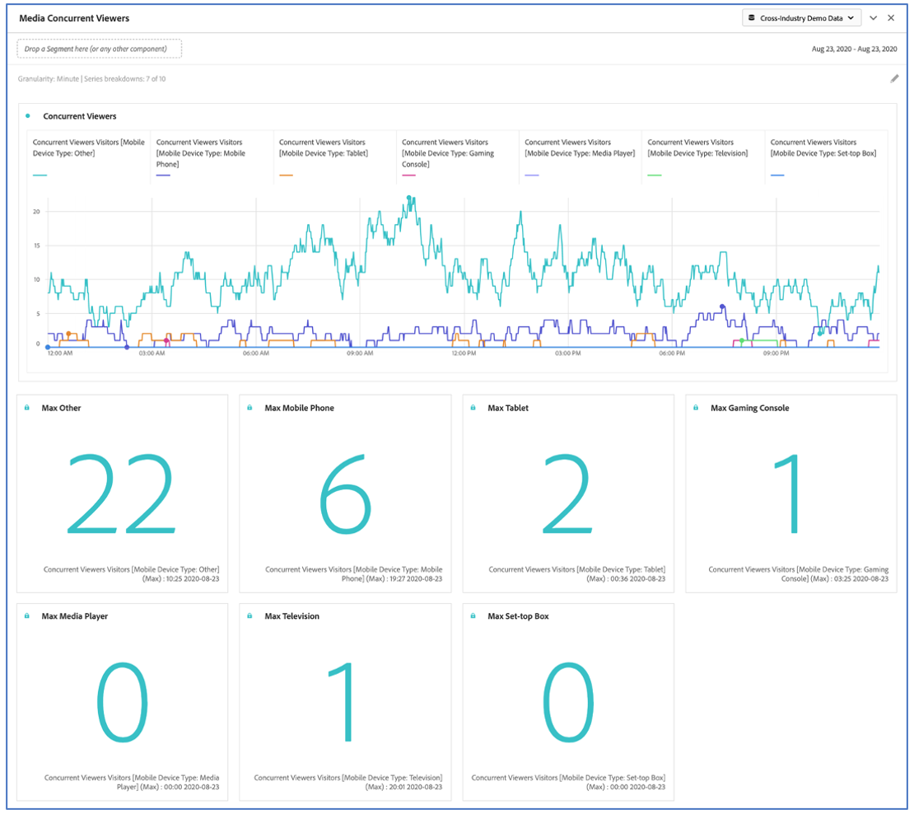

# Deelvenster Mediagelijktijdige viewers

Klanten die de invoegtoepassing voor de verzameling van streamingmedia hebben aangeschaft, kunnen gelijktijdige viewers analyseren om te begrijpen waar de meeste gelijktijdige aanvallen hebben plaatsgevonden of waar drop-outs waardevolle inzichten hebben opgeleverd in de kwaliteit van de betrokkenheid van inhoud en viewers, en om hulp te bieden bij het oplossen van problemen of het plannen van volumes of schaal.

In Analysis Workspace is Gelijktijdige viewers het aantal unieke bezoekers dat uw mediastream(s) op een bepaald tijdstip weergeeft, ongeacht het aantal sessies.

Met het deelvenster Mediagelijktijdige viewers kunt u in de loop van de tijd gelijktijdige viewers analyseren, met details over de piekfrequentie en de mogelijkheid om af te breken en te vergelijken.  Navigeer naar een rapportsuite met streaming-mediacomponenten om het deelvenster Mediagelijktijdige viewers te openen. Klik vervolgens op het deelvensterpictogram helemaal links en sleep het deelvenster naar uw Analysis Workspace-project.

Hier volgt een video-overzicht van dit deelvenster:

>[!VIDEO](https://video.tv.adobe.com/v/330177/?quality=12)

## Deelvensterinvoer {#Input}

U kunt het deelvenster Mediagelijktijdige viewers configureren met de volgende invoerinstellingen:

| Instelling | Beschrijving |
|---|---|
| Datumbereik van deelvenster | Het standaarddatumbereik van het deelvenster is Vandaag.  U kunt de presentatie bewerken om een enkele dag of maanden tegelijk weer te geven.    Deze visualisatie is beperkt tot 1440 rijen gegevens (bijvoorbeeld 24 uur bij granulariteit op minaniveau).  Als een datumbereik en de combinatie van granulariteit meer dan 1440 rijen opleveren, wordt de granulariteit automatisch bijgewerkt om het volledige datumbereik te kunnen gebruiken. |
| Granulariteit | De standaardwaarde voor granulariteit is Minute.    Deze visualisatie is beperkt tot 1440 rijen gegevens (bijvoorbeeld 24 uur bij granulariteit op minaniveau).  Als een datumbereik en de combinatie van granulariteit meer dan 1440 rijen opleveren, wordt de granulariteit automatisch bijgewerkt om het volledige datumbereik te kunnen gebruiken. |
| Samenvattingsnummers deelvenster | Er is een samenvattingsnummer beschikbaar om de datum- of tijdgegevens van gelijktijdige viewers weer te geven. Bij Maximaal worden details voor de piekfrequentie weergegeven. Bij Minimum worden details voor de dal weergegeven.  In het standaardvenster wordt alleen Maximum weergegeven, maar u kunt dit wijzigen in Minimum of zowel Maximaal als Minimaal.  Als u onderverdelingen gebruikt, wordt een samenvattingsaantal getoond voor elk. |
| Uitsplitsing naar serie | U kunt desgewenst de visualisatie opsplitsen in segmenten, dimensies, dimensiepunten of datumbereiken.   - U kunt maximaal 10 regels tegelijk weergeven. Uitsplitsingen zijn beperkt tot één niveau.  - Wanneer u een dimensie sleept, worden de bovenste dimensie-items automatisch geselecteerd op basis van het geselecteerde datumbereik van het deelvenster.  - Als u datumbereiken wilt vergelijken, sleept u twee of meer datumbereiken naar het filter voor reeksindeling. |

### Standaardweergave

### Uitsplitsingsweergave van reeksen

## Deelvensteruitvoer {#Output}

Het deelvenster Mediagelijktijdige viewers retourneert een regeldiagram en een samenvattingsnummer met gegevens voor de maximum- en/of minimale gelijktijdige viewers.  Boven in het deelvenster ziet u een samenvattingsregel waarmee u de deelvensterinstellingen die u hebt geselecteerd, kunt herinneren.

U kunt het deelvenster op elk gewenst moment bewerken en opnieuw samenstellen door op het bewerkingspotlood in de rechterbovenhoek te klikken.

Als u reeksindeling hebt geselecteerd, worden een regel in het lijndiagram en een samenvattingsnummer voor elke regel weergegeven:

### Data Source

De enige metrische waarde die in dit deelvenster kan worden gebruikt, zijn Gelijktijdige viewers:

| Metrisch | Beschrijving |
|---|---|
| Gelijktijdige viewers | Aantal unieke bezoekers dat uw mediastream(s) op een bepaald tijdstip weergeeft, ongeacht het aantal sessies.  Dit is anders dan de Gelijktijdige viewer die rapporteert in de sectie Rapporten, waarin Gelijktijdige actieve sessies worden gebruikt.  Unieke bezoekersaccounts gebruiken voor het verwijderen van ongewenste &#39;spikes&#39; bij showgrenzen (waar sessies tegelijkertijd eindigen en starten). |

In deze weergave is geen tabel voor vrije vorm beschikbaar.  Als u de gegevensbron wilt weergeven, klikt u met de rechtermuisknop op het lijndiagram en downloadt u dit als een CSV-bestand.  Uitsplitsingen naar reeksen worden opgenomen.

## Veelgestelde vragen {#FAQ}

| Vraag | Antwoord |
|---|---|
| Waar is de tabel voor vrije vorm? Hoe kan ik de gegevensbron zien? | De tabel Freeform is niet beschikbaar in deze weergave.  U kunt de gegevensbron downloaden door met de rechtermuisknop op het lijndiagram te klikken en het CSV-bestand te downloaden. |
| Waarom veranderde mijn granulariteit? | Deze visualisatie is beperkt tot 1440 rijen gegevens (bijvoorbeeld 24 uur bij granulariteit op minaniveau).  Als een datumbereik en de combinatie van granulariteit meer dan 1440 rijen opleveren, wordt de granulariteit automatisch bijgewerkt om het volledige datumbereik te kunnen gebruiken.  Wanneer u van een groter datumbereik overschakelt op een kleiner datumbereik, wordt de granulariteit bijgewerkt naar het laagste detailniveau dat is toegestaan nadat het datumbereik is gewijzigd. Als u een hogere granulariteit wilt weergeven, bewerkt u het deelvenster en maakt u het opnieuw. |
| Hoe vergelijk ik videonamen, segmenten, inhoudstypen, enzovoort? | Om deze in één enkele visualisatie te vergelijken, sleep segmenten, dimensies, of specifieke afmetingspunten in de filter van de reeksafbraak.  De weergave is beperkt tot tien uitsplitsingen.  Als u meer dan 10 wilt weergeven, moet u meerdere deelvensters gebruiken. |
| Hoe vergelijk ik datumbereiken? | Om datumwaaiers in één enkele visualisatie te vergelijken, gebruik de reeksonderverdelingen door 2 of meer datumwaaiers te slepen.  Deze datumbereiken overschrijven het datumbereik van het deelvenster. |
| Hoe kan ik het visualisatietype wijzigen? | In dit deelvenster kunt u alleen de lijnen voor de tijdreeks visualiseren. |
| Kan ik anomaliedetectie uitvoeren? | Nee.  Anomaly-detectie is niet beschikbaar voor dit deelvenster. |
| Waarom unieke bezoekers gebruiken in plaats van actieve sessies? | Door unieke bezoekers te gebruiken, kunt u ongewenste spikes verwijderen bij het weergeven van de grenzen (waar de sessies tegelijkertijd eindigen en beginnen). |
| Wat betekent het om gelijktijdige kijkers bij hogere granulariteit dan minuut te hebben? | Met een granulariteit die groter is dan een minuut, zijn gelijktijdige viewers de som van unieke gelijktijdige viewers voor alle minuten binnen dat tijdbereik.  Gelijktijdige viewers op uurniveau zijn bijvoorbeeld de som van unieke gelijktijdige viewers voor alle minuten in het uur. |
| Geeft het deelvenster Werkruimte dezelfde informatie als het rapport Gelijktijdige viewers? | Nee.  In Analysis Workspace wordt onder Gelijktijdige viewers verstaan het aantal unieke bezoekers dat uw mediastream op een bepaald tijdstip weergeeft, ongeacht het aantal sessies.  Dit is anders dan de Gelijktijdige viewer die rapporteert in de sectie Rapporten, waarin Gelijktijdige actieve sessies worden gebruikt.  Door unieke bezoekersaccounts te gebruiken voor het verwijderen van ongewenste spikes bij het weergeven van grenzen, waarbij sessies tegelijkertijd worden beëindigd en gestart. |

<!-- For more information about Media Concurrent Viewers, visit [MA doc page]( https://url). -->
