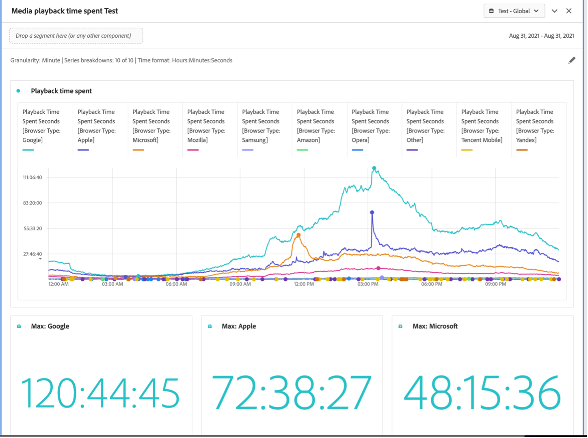

# Afspeeltijd van media in deelvenster {#media-playback-time-spent-panel}

<!-- markdownlint-disable MD034 -->

>[!CONTEXTUALHELP]
>id="workspace_mediaplaybacktimespent_button"
>title="De afspeeltijd van media is verstreken"
>abstract="Maak een deelvenster voor het analyseren van het videoverbruik in de loop der tijd, met verschillende granulariteitsniveaus en de mogelijkheid om af te breken en te vergelijken."

<!-- markdownlint-enable MD034 -->

<!-- markdownlint-disable MD034 -->

>[!CONTEXTUALHELP]
>id="workspace_mediaplaybacktimespent_panel"
>title="De afspeeltijd van media is verstreken"
>abstract="Analyseer het videoverbruik in de loop der tijd, selecteer verschillende granulariteiten, verdeel en vergelijk het.  **Korreligheid**: Selecteer tijdspanne om gezamenlijke kijkers door te bekijken. **de summiere aantallen van het Comité (facultatief)**: Optie om summiere aantallen met datum of tijddetails voor elke lijn te tonen. Bij Maximaal worden details voor de piekafspeeltijd weergegeven. Bij Minimaal worden details voor de trog weergegeven. De som zal details voor de totale som bestede playbacktijd tonen. **(Facultatieve) de indeling van de Reeks**: Onderbreking visualisatie door segmenten, dimensies, afmetingspunten of datumwaaiers. U kunt maximaal 10 regels tegelijk weergeven. Uitsplitsingen zijn beperkt tot één niveau. **formaat van de Tijd**: Optie om het tijdformaat voor visualisaties in of uren of notulen te tonen."

<!-- markdownlint-enable MD034 -->

>[!BEGINSHADEBOX]

_Dit artikel documenteert de tijd doorgebrachte paneel van de playback van Media in_  _&#x200B;**Adobe Analytics**._ _zie [&#x200B; de playbacktijd van Media bestede paneel &#x200B;](/help/analyze/analysis-workspace/c-panels/media-playback-time-spent.md)) voor_  _&#x200B;**Customer Journey Analytics** versie van dit artikel._

>[!ENDSHADEBOX]

>[!NOTE]
>
>Het deelvenster Medium voor het aantal minuten publiek is alleen beschikbaar voor klanten die Adobe Analytics voor de invoegtoepassing voor streaming media hebben aangeschaft.
>
>Neem contact op met uw Adobe-verkoper of Adobe-accountteam voor meer informatie.
>

In het deelvenster **[!UICONTROL Media playback time spent]** kunt u het afspelen in de loop van de tijd analyseren met details over de piekfrequentie en de mogelijkheid om af te breken en te vergelijken.

In Analysis Workspace is de afspeeltijd de tijd die nodig is om uw mediastreams op een bepaald tijdstip weer te geven. Het omvat pauze, buffer, en tijd om te beginnen.

Klanten die de Adobe Analytics voor Streaming Media Add-on hebben aangeschaft, kunnen de afspeeltijd analyseren om waardevolle insight te winnen voor de kwaliteit van de inhoud en de betrokkenheid van de viewer. En om te helpen bij het oplossen van problemen of het plannen voor volume of schaal.

De bestede afspeeltijd kan u helpen begrijpen:

* waar de piek van de gelijktijdige optreden zich voordeed.

* Waar is een offsite opgetreden.

>[!BEGINSHADEBOX]

Zie  [&#x200B; de playbacktijd bestede van Media paneel &#x200B;](https://video.tv.adobe.com/v/338699?quality=12&learn=on){target="_blank"} voor een demo video.

>[!ENDSHADEBOX]

## Gebruiken

Een deelvenster **[!UICONTROL Media playback time spent]** gebruiken:

1. Maak een deelvenster **[!UICONTROL Media playback time spent]** . Voor informatie over hoe te om een paneel tot stand te brengen, zie [&#x200B; een paneel &#x200B;](panels.md#create-a-panel) creëren.

1. Selecteer een rapportsuite voor het deelvenster waarin componenten zijn geconfigureerd via Adobe Analytics voor Streaming Media Add-on.

1. Specificeer de [&#x200B; input &#x200B;](#panel-input) voor het paneel.

1. Neem de [&#x200B; output &#x200B;](#panel-output) voor het paneel waar.

### Deelvensterinvoer

U kunt het deelvenster Tijd voor afspelen van media configureren met de volgende invoerinstellingen:

| Instelling | Beschrijving |
|---|---|
| Datumbereik van deelvenster | Het standaarddatumbereik van het deelvenster is Vandaag. U kunt de presentatie bewerken om een enkele dag of maanden tegelijk weer te geven.  Deze visualisatie is beperkt tot 1440 rijen van gegevens (bijvoorbeeld, 24 uur bij miniem-vlakke granulariteit). Als een datumbereik en de combinatie van granulariteit meer dan 1440 rijen opleveren, wordt de granulariteit automatisch bijgewerkt om het volledige datumbereik te kunnen gebruiken. |
| Granulariteit | De standaardwaarde voor granulariteit is Minute.  Deze visualisatie is beperkt tot 1440 rijen van gegevens (bijvoorbeeld, 24 uur bij miniem-vlakke granulariteit). Als een datumbereik en de combinatie van granulariteit meer dan 1440 rijen opleveren, wordt de granulariteit automatisch bijgewerkt om het volledige datumbereik te kunnen gebruiken. |
| Samenvattingsnummers deelvenster | Er is een samenvattingsnummer beschikbaar om datum- of tijdgegevens voor de afspeeltijd te zien. Bij Maximaal worden details voor de piekfrequentie weergegeven. Bij Minimum worden details voor de dal weergegeven. De som verhoogt de totale playbacktijd die voor de selectie wordt doorgebracht. De paneelstandaard toont slechts Maximum, maar u kunt het veranderen om Minimum, Som, of om het even welke combinatie drie te tonen.  als u onderverdelingen gebruikt, wordt een samenvattingsaantal getoond voor elk. |
| Uitsplitsing naar serie | U kunt desgewenst de visualisatie opsplitsen in filters, dimensies, dimensiepunten of datumbereiken.
- U kunt maximaal 10 regels tegelijk weergeven. Uitsplitsingen zijn beperkt tot één niveau.

- Wanneer u een dimensie sleept, worden de bovenste dimensie-items automatisch geselecteerd op basis van het datumbereik van het geselecteerde deelvenster.
- Als u datumbereiken wilt vergelijken, sleept u twee of meer datumbereiken naar het filter voor reeksindeling. |
| Tijdnotatie | U kunt de afspeeltijd in `Hours:Minutes:Seconds` (standaard) of in `Minutes` (die in gehele getallen wordt weergegeven, naar boven afgerond op 0,5) weergeven. |
| Weergave datumvolgorde | Als u minstens twee filters van het datumbereik als reeksonderverdelingen hebt geplaatst, ziet u de optie om of bedekking (gebrek) of opeenvolgend te selecteren. Met Bedekking worden de lijnen weergegeven met een gemeenschappelijke beginpunt op de x-as, zodat deze parallel lopen. De lijnen met hun specifieke beginpunt op de x-as worden opeenvolgend weergegeven. Als de gegevenslijnen omhoog (bijvoorbeeld, beëindigt filter 1 bij 8 :44 pm en filter 2 begint bij 8 :45 pm), dan tonen de lijnen in opeenvolging. |

### Deelvensteruitvoer

In het deelvenster Afspeeltijd van media worden een regeldiagram en samenvattingsnummers geretourneerd met gegevens over de maximale, minimale en/of totale afspeeltijd. Boven in het deelvenster ziet u een samenvattingsregel waarmee u de deelvensterinstellingen die u hebt geselecteerd, kunt herinneren.

Op elk ogenblik, uitgezocht  om het paneel uit te geven en opnieuw te bouwen.

Als u reeksindeling selecteert, worden een regel in het lijndiagram en een samenvattingsnummer voor elke regel weergegeven:

### Gegevensbron

De enige metrische waarde die in dit deelvenster kan worden gebruikt, is Afspeeltijd.

| Metrisch | Beschrijving |
|---|---|
| Afspeeltijd besteed | Totaal `hours:minutes:seconds` (of `minutes` ) van inhoud die tijdens de geselecteerde granulariteit wordt weergegeven, inclusief pauze, buffer en begintijd. |

## Veelgestelde vragen

| Vraag | Antwoord |
|---|---|
| Waar is de tabel voor vrije vorm? Hoe kan ik de gegevensbron zien? | 

De tabel Freeform is niet beschikbaar in deze weergave. Als u de gegevensbron wilt downloaden, selecteert u in het contextmenu in het lijndiagram de optie waarmee u het CSV-bestand wilt downloaden.
 |
| 
Waarom veranderde mijn granulariteit?
 | 
Deze visualisatie is beperkt tot 1440 rijen gegevens (bijvoorbeeld 24 uur bij granulariteit op minaniveau). Als een datumbereik en de combinatie van granulariteit meer dan 1440 rijen opleveren, wordt de granulariteit automatisch bijgewerkt om het volledige datumbereik te kunnen gebruiken.

Wanneer u overschakelt van een groter datumbereik naar een kleiner datumbereik, wordt de granulariteit bijgewerkt naar het laagste detailniveau dat is toegestaan als het datumbereik wordt gewijzigd. Als u een hogere granulariteit wilt weergeven, bewerkt u het deelvenster en maakt u het opnieuw.
 |
| 

Hoe vergelijk ik videonamen, filters, inhoudstypen en meer?
 | 
Als u deze in één visualisatie wilt vergelijken, sleept u filters, dimensies of specifieke dimensiepunten in het filter voor de reeksafbraak.

De weergave is beperkt tot tien uitsplitsingen. Als u meer dan 10 wilt weergeven, moet u meerdere deelvensters gebruiken.
 |
| Hoe vergelijk ik datumbereiken? | Om datumwaaiers in één enkele visualisatie te vergelijken, gebruik de reeksonderverdelingen door 2 of meer datumwaaiers te slepen. Deze datumbereiken overschrijven het datumbereik van het deelvenster. |
| Hoe kan ik het visualisatietype wijzigen? | 

In dit deelvenster kunt u alleen de lijnen voor de tijdreeks visualiseren.
 |
| Kan ik anomaliedetectie uitvoeren? | 

Nee. Anomaly-detectie is niet beschikbaar voor dit deelvenster.
 |

>[!MORELIKETHIS]
>
>[&#x200B; creeer een paneel &#x200B;](/help//analyze/analysis-workspace/c-panels/panels.md#create-a-panel)
>[Mediagemiddelde minieme publiekspaneel &#x200B;](average-minute-audience-panel.md)
>[Deelvenster Mediagelijktijdige viewers &#x200B;](media-concurrent-viewers.md)
>

<!--
# Media Playback Time Spent panel

In Analysis Workspace, Playback Time Spent is the amount of time spent viewing your media streams at a specific point in time. It includes pause, buffer, and time to start.

The Media Playback Time Spent panel enables analysis of playback over time, with details on peak concurrency and the ability to break down and compare. 

Customers who have purchased the Streaming Media Collection Add-on can analyze playback time spent to gain valuable insight into the quality of content and viewer engagement, and to help when troubleshooting or planning for volume or scale.

Playback Time Spent can help you understand:

* Where peak concurrency occurred

* Where drop-offs occurred 

Following is a video overview of this panel:

>[!VIDEO](https://video.tv.adobe.com/v/338699)

## Use the Media Playback Time Spent panel

1. Go to a report suite with streaming media components enabled. 
1. Select the panel icon on the far-left, then drag the panel into your Analysis Workspace project.
1. Continue with the following sections to customize the Media Playback Time Spent panel

   * [Panel Inputs](#panel-inputs)
   * [Panel Output](#panel-output)

## Panel Inputs {#Input}

You can configure the Media Playback Time Spent panel using these input settings:

|Setting|Description|
|---|---|
|Panel date range|The panel date range default is Today. You may edit it to view a single day or many months at a time. This visualization is limited to 1440 rows of data (for example, 24-hours at minute-level granularity). If a date range and granularity combination results in more than 1440 rows, the granularity is automatically updated to accommodate the full date range.|
|Granularity|The granularity default is Minute. This visualization is limited to 1440 rows of data (for example, 24-hours at minute-level granularity). If a date range and granularity combination results in more than 1440 rows, the granularity is automatically updated to accommodate the full date range.|
|Panel summary numbers|To see date or time details for playback time spent, a summary number is available. The Maximum shows details for peak concurrency. The Minimum shows details for the trough. Sum adds up the total playback time spent for the selection. The panel default shows Maximum only, but you can change it to show Minimum, Sum, or any combination of the three. If you are using breakdowns, a summary number is displayed for each.|
|Series breakdown|Optionally, you can break down your visualization by segments, dimensions, dimension items, or date ranges.
- You may view up to 10 lines at a time. Breakdowns are limited to a single level.

- When dragging a dimension, the top dimension items will be automatically selected based on the selected panel date range.
- To compare date ranges, drag 2 or more date ranges into the series breakdown filter.|
|Time format|You can view the playback time spent in either `Hours:Minutes:Seconds` (default) or in `Minutes` (which is displayed in whole numbers, rounded up at .5). |
|Date sequence display|If you've placed at least two date range segments as series breakdowns you'll see the option to select either overlay (default) or sequential. Overlay will display the lines with a common x-axis start so that they run in parallel, while sequential will display the lines with their specific x-axis start. If the data lines up (for example, segment 1 ends at 8:44 pm and segment 2 starts at 8:45 pm), then the lines will show in sequence. |

## Default view

## Panel Output {#Output}

The Media Playback Time Spent panel returns a line chart and summary numbers to include details for the maximum, minimum, and/or sum of playback time spent. At the top of the panel, a summary line is provided to remind you of the panel settings you selected.

At any time, you can edit and rebuild the panel by clicking the edit pencil on the top right.

If you selected series breakdown, a line on the line chart and a summary number is displayed for each:

### Data Source

The only metric that can be used in this panel is Playback Time Spent.

|Metric|Description|
|---|---|
|Playback Time Spent|Total `hours:minutes:seconds` (or `minutes`) of content viewed during the selected granularity including pause, buffer, and time to start.|

## FAQs

|Question|Answer|
|---|---|
|Where is the Freeform table? How can I see the data source?|The Freeform table is not available in this view. You can download the data source by right-clicking on the line chart and downloading the CSV file.|
|Why did my granularity change?|This visualization is limited to 1440 rows of data (for example, 24-hours at minute-level granularity). If a date range and granularity combination results in more than 1440 rows, the granularity will be automatically updated to accommodate the full date range. 
When changing from a larger date range to a smaller one, the granularity will be updated to the lowest detail allowable once the date range is changed. To view a higher granularity, edit the panel and rebuild.
|
| How do I compare video names, segments, content types, etc?| To compare these in a single visualization, drag segments, dimensions, or specific dimension items in the series breakdown filter.The view is limited to 10 breakdowns. To view more than 10, you must use multiple panels.|
|How do I compare date ranges?|To compare date ranges in a single visualization, use the series breakdowns by dragging 2 or more date ranges. These date ranges will override the panel date range.|
|How do I change the visualization type?|This panel only allows for the line visualization for the time series.|
|Can I run anomaly detection?|No. Anomaly detection is not available for this panel.|

-->
