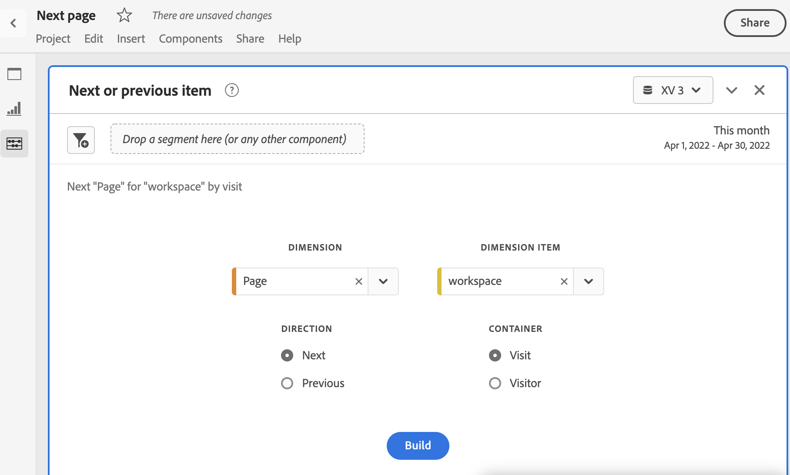
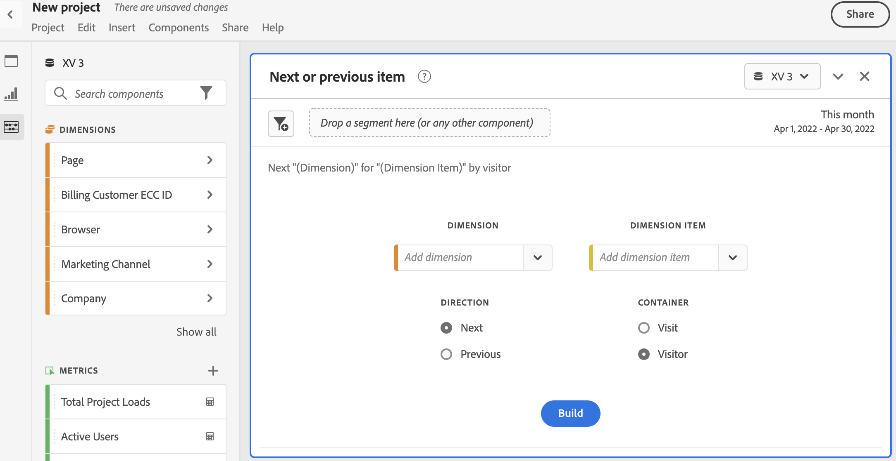

# Volgend of vorig deelvenster met items {#next-or-previous-item-panel}

>[!CONTEXTUALHELP]
>id="workspace_nextorpreviousitem_button"
>title="Volgende of vorige item"
>abstract="Maak een deelvenster om te begrijpen welke dimensies mensen uit het verleden hebben gekregen of waar mensen uit de volgende dimensie naar toe gaan."

>[!CONTEXTUALHELP]
>id="workspace_nextorpreviousitem_panel"
>title="Nesten of vorig item"
>abstract="Analyseer wat de meest gangbare plaatsen zijn waar bezoekers eerder vandaan kwamen of naar de volgende gaan.  **Dimension**: Selecteer een afmeting. Bijvoorbeeld **Pagina**. **het punt van Dimension**: Selecteer een specifiek afmetingspunt. Bijvoorbeeld **Homepage**. **Richting**: Selecteer **daarna** om de afmetingspunten onmiddellijk na uw geselecteerd afmetingspunt te zien. Selecteer **Vorige** om de afmetingspunten te zien die tot uw geselecteerd afmetingspunt leiden. **Container**: Selecteer **Zitting** om de volgende/vorige afmetingspunten binnen de zelfde zitting te zien, of **Persoon** te selecteren om het volgende/vorige afmetingspunt voor de zelfde persoon te zien."

>[!BEGINSHADEBOX]

_dit artikel documenteert het Volgende of vorige puntenpaneel in_  _&#x200B;**Adobe Analytics**._ _zie [&#x200B; Volgende of vorig puntenpaneel &#x200B;](/help/analyze/analysis-workspace/c-panels/next-previous.md) voor_  _&#x200B;**Customer Journey Analytics** versie van dit artikel._

>[!ENDSHADEBOX]

Het deelvenster **[!UICONTROL Next or previous item]** bevat een aantal tabellen en visualisaties om het volgende of vorige dimensie-item voor een specifieke dimensie te identificeren. U kunt bijvoorbeeld bekijken naar welke pagina&#39;s klanten het vaakst zijn gegaan nadat ze de startpagina hebben bezocht.

## Gebruiken

Een deelvenster **[!UICONTROL Next or previous item]** gebruiken:

1. Maak een deelvenster **[!UICONTROL Next or previous item]** . Voor informatie over hoe te om een paneel tot stand te brengen, zie [&#x200B; een paneel &#x200B;](panels.md#create-a-panel) creëren.

1. Specificeer de [&#x200B; input &#x200B;](#panel-input) voor het paneel.

1. Neem de [&#x200B; output &#x200B;](#panel-output) voor het paneel waar.

### Deelvensterinvoer

U kunt het deelvenster [!UICONTROL Next or previous item] configureren met de volgende invoerinstellingen:

| Invoer | Beschrijving |
| --- | --- |
| **[!UICONTROL Dimension]** | Selecteer de dimensie waarvoor u volgende of vorige punten wilt onderzoeken. |
| **[!UICONTROL Dimension item]** | Selecteer het specifieke dimensie-item in het midden van uw volgende/vorige vraag. |
| **[!UICONTROL Direction]** | Geef op of u naar het dimensie-item [!UICONTROL Next] of [!UICONTROL Previous] zoekt. |
| **[!UICONTROL Container]** | Selecteer de container **[!UICONTROL Visit]** of **[!UICONTROL Visitor]** (standaard) om het bereik van uw vraag te bepalen. |

{style="table-layout:auto"}

Selecteer **[!UICONTROL Build]** om het deelvenster te maken.

### Deelvensteruitvoer

Het deelvenster [!UICONTROL Next or previous item] retourneert een uitgebreide set gegevens en visualisaties om u te helpen beter te begrijpen welke instanties specifieke dimensie-items volgen of hieraan voorafgaan.

| Visualisatie | Beschrijving |
| --- | --- |
| **[!UICONTROL Horizontal bar]** | Hiermee geeft u de volgende (of vorige) items weer op basis van het dimensie-item dat u selecteert. Als u de cursor boven een afzonderlijke balk houdt, wordt het bijbehorende item in de tabel Vrije vorm gemarkeerd. |
| **[!UICONTROL Summary number]** | Samenvattingsaantal op hoog niveau van alle volgende of vorige instanties van afmetingspunten voor de huidige maand (tot nu toe). |
| **[!UICONTROL Freeform table]** | Hiermee geeft u de volgende (of vorige) items weer op basis van het dimensie-item dat u selecteert, in een tabelindeling. Dit waren bijvoorbeeld de populairste pagina&#39;s (op voorvallen) die mensen na (of vóór) de startpagina of de werkruimtenpagina hebben weergegeven. |

{style="table-layout:auto"}

>[!MORELIKETHIS]
>
>[&#x200B; creeer een paneel &#x200B;](/help//analyze/analysis-workspace/c-panels/panels.md#create-a-panel)
>

<!--
# Next or previous item panel

This panel contains a number of tables and visualizations to easily identify the next or previous dimension item for a specific dimension. For example, you might want to explore which pages customers went to most often after they visited the Home page.

## Access the panel

You can access the panel from within [!UICONTROL Reports] or within [!UICONTROL Workspace].

| Access point | Description |
| --- | --- |
| [!UICONTROL Reports] | <ul><li>The panel is already dropped into a project.</li><li>The left rail is collapsed.</li><li>If you selected [!UICONTROL Next page], default settings have already been applied, such as [!UICONTROL Page] for [!UICONTROL Dimension], and the top page as the [!UICONTROL Dimension Item], [!UICONTROL Next] for [!UICONTROL Direction] and [!UICONTROL Visit] for [!UICONTROL Container]. You can modify all these settings.</li></ul>|
| Workspace | Create a new project and select the Panel icon in the left rail. Then drag the [!UICONTROL Next or previous item] panel above the Freeform table. Notice that the [!UICONTROL Dimension] and [!UICONTROL Dimension Item] fields are left blank. Select a dimension from the drop-down list. [!UICONTROL Dimension items] are populated based on the [!UICONTROL dimension] you chose. The top dimension item gets added, but you can select a different item. The defaults are Next and Visitor. Again, you can modify these as well.
 |

{style="table-layout:auto"}

## Panel Inputs {#Input}

You can configure the [!UICONTROL Next or previous item] panel panel using these input settings:

| Setting | Description |
| --- | --- |
| Segment (or other component) drop zone | You can drag and drop segments or other components to further filter your panel results. |
| Dimension | The dimension for which you want to explore next or previous items. |
| Dimension Item | The specific item at the center of your next/previous inquiry. |
| Direction | Specify whether you are looking for the [!UICONTROL Next] or the [!UICONTROL Previous] dimension item. |
| Container | [!UICONTROL Visit] or [!UICONTROL Visitor] (default) determine the scope of your inquiry. |

{style="table-layout:auto"}

Click **[!UICONTROL Build]** to build the panel.

## Panel output {#output}

The [!UICONTROL Next or previous item] panel returns a rich set of data and visualizations to help you better understand what occurrences follow or precede specific dimension items.

| Visualization | Description |
| --- | --- |
| Horizontal bar | Lists the next (or previous) items based on the dimension item you chose. Hovering over an individual bar highlights the corresponding item in the Freeform table. |
| Summary number | High-level summary number of all next or previous dimension item occurrences for the current month (so far.) |
| Freeform table | Lists the next (or previous) items based on the dimension item you chose, in a table format. For example, which were the most popular pages (by occurrences) that people went to after (or before) the home page or the workspace page. |

{style="table-layout:auto"}

-->