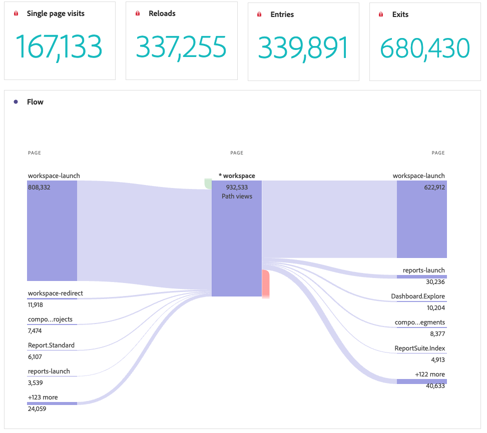

# Het deelvenster Paginaoverzicht

De [!UICONTROL Page summary] begon als een rapport in Rapporten &amp; Analytics, onder Rapporten > Betrokkenheid > de analyse van de Pagina > het overzicht van de Pagina. Het is nu ook een deelvenster Werkruimte. In dit deelvenster kunt u eenvoudig belangrijke statistieken over specifieke pagina&#39;s bekijken.

## Het deelvenster openen

U hebt vanuit [!UICONTROL Reports] of binnen [!UICONTROL Workspace].

| Toegangspunt | Beschrijving |
| --- | --- |
| [!UICONTROL Reports] | <ul><li>Het deelvenster is al neergezet in een project.</li><li>De linkerspoorstaaf is samengevouwen.</li><li>Alleen de pagina-afmeting wordt ondersteund.</li><li>Er is al een standaardinstelling toegepast, in dit geval de bovenste bezochte pagina voor de[!UICONTROL Page] dimensie. U kunt deze instelling wijzigen.</li></ul> |
| Werkruimte | Maak een nieuw project en selecteer het deelvensterpictogram in de linkerspoorstaaf. Sleep de [!UICONTROL Page summary] boven de tabel voor vrije vorm. De pagina [!UICONTROL Dimension Item] veld is leeg. Selecteer een dimensie-item in de vervolgkeuzelijst. |

## Deelvensterinvoer {#Input}

U kunt de [!UICONTROL Page summary] met deze invoerinstellingen:

| Instelling | Beschrijving |
| --- | --- |
| Segment (of andere component) dropzone | U kunt segmenten of andere componenten slepen en neerzetten om de resultaten van het deelvenster verder te filteren. |
| Pagina-dimensie-item | Selecteer in de vervolgkeuzelijst het item Paginadimensie waarvan u de belangrijkste statistieken wilt bekijken. |

{style="table-layout:auto"}

Klikken **[!UICONTROL Build]** om het deelvenster samen te stellen.

## Deelvensteruitvoer {#output}

De [!UICONTROL Page summary] retourneert een uitgebreide set metrische gegevens en visualisaties om u te helpen statistieken over specifieke pagina&#39;s beter te begrijpen.

| Metrisch/visualisatie | Beschrijving |
| --- | --- |
| [!UICONTROL Page views] - Huidige maand, tot nu toe | Aantal paginaweergaven voor deze pagina voor de huidige maand. |
| [!UICONTROL Page views] - 4 weken | Aantal paginaweergaven voor deze pagina in de afgelopen maand. |
| [!UICONTROL Page views] - 52 weken vóór | Aantal paginaweergaven voor deze pagina in het afgelopen jaar. |
| [!UICONTROL Trend] | Een overzicht met trendpaginaweergaven voor deze maand, 4 weken eerder en 52 weken daarvoor. |
| [!UICONTROL Percentage of all page views] | Een samenvattingsnummer voor het percentage van alle paginaweergaven die naar deze pagina zijn gegaan. |
| [!UICONTROL Time spent on page] | Een horizontaal staafdiagram waarin de tijd wordt weergegeven die aan deze pagina is besteed. |
| [!UICONTROL Single page visits] | Een samenvattingsnummer met het aantal paginaweergaven waarop dit de enige bezochte pagina was. |
| [!UICONTROL Reloads] | De [!UICONTROL Reloads] metrisch toont het aantal tijden een afmetingspunt tijdens een herlading aanwezig was. Een bezoeker die zijn browser vernieuwt, is de meest gebruikelijke manier om een nieuwe laadbewerking te starten. |
| [!UICONTROL Entries] | De [!UICONTROL Entries] Met de metrische waarde wordt aangegeven hoe vaak een bepaald dimensie-item wordt vastgelegd als de eerste waarde in een bezoek. |
| [!UICONTROL Exits] | De [!UICONTROL Exits] Met de metrische waarde wordt aangegeven hoe vaak een bepaald dimensie-item wordt vastgelegd als de laatste waarde in een bezoek. |
| [!UICONTROL Flow] | Een stroomdiagram met de geselecteerde pagina als brandpunt. U kunt verder naar de gegevens gaan, net als in alle andere [Stroomdiagram](/help/analyze/analysis-workspace/visualizations/c-flow/create-flow.md). |

{style="table-layout:auto"}

