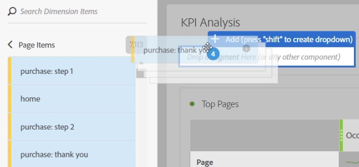

# Overzicht van deelvensters

Een deelvenster is een verzameling tabellen en visualisaties. U hebt toegang tot deelvensters via het pictogram linksboven in Workspace. Deelvensters zijn handig wanneer u uw projecten wilt ordenen op basis van tijdsperiodes, bedrijfseenheden, geografie, enzovoort. Deze zes soorten panelen zijn beschikbaar in de Werkruimte van de Analyse: [Leeg deelvenster](/help/analyze/analysis-workspace/c-panels/blank-panel.md), [deelvenster](/help/analyze/analysis-workspace/c-panels/quickinsight.md) Snelle inzichten (binnenkort beschikbaar), [Analytics voor het deelvenster](/help/analyze/analysis-workspace/c-panels/a4t-panel.md) Doel (binnenkort beschikbaar), deelvenster Kenmerken, deelvenster Vrije vorm en deelvenster Segmentvergelijking.

Met de deelvensters Snelle inzichten, Lege en Vrije vorm kunt u uw analyse starten, terwijl Analytics voor Target, Attribution IQ en Segment Comparison zich lenen voor geavanceerdere analyses. Er is ook een knop van het plusteken (+) toegevoegd, zodat u op elk gewenst moment lege deelvensters kunt toevoegen.

Het standaardbeginvenster is het deelvenster Vrije vorm, maar u kunt ook het [lege deelvenster](/help/analyze/analysis-workspace/c-panels/blank-panel.md) instellen als standaard.

## Vervolgkeuzefilters in deelvensters {#section_D2828EEDD52944528E87F470EAB581CF}

De dropzone van het deelvenster heeft vervolgkeuzemogelijkheden voor filteren. Met deze filters kunt u op beheerste wijze werken met de projectgegevens, zodat u diepgaande analyses kunt uitvoeren, uw projecten kunt vereenvoudigen en/of inzichten met anderen kunt delen.

Hier is een voorbeeld van een vereenvoudigd project: Stel dat u verschillende versies van een project/deelvenster hebt om landenspecifieke rapporten op te stellen. U kunt deze projecten/deelvensters nu samenvouwen tot één deelvenster en in een vervolgkeuzelijst met landen toevoegen om te filteren tussen verschillende gegevenssets.

Houd dit in gedachten:

* U kunt in veelvoudige componenten (of afmetingspunten) vallen, en dan tussen hen in een dropdown schakelen om de paneelinhoud te filtreren.
* U kunt ook meerdere vervolgkeuzelijsten maken in hetzelfde deelvenster.
* U kunt de titel van de vervolgkeuzelijst aanpassen door op de titel te klikken en deze te wijzigen, of u kunt de titel helemaal verwijderen door op de x naast de titel te klikken.
* U kunt drop-down filters tot stand brengen gebruikend om het even welk componententype: afmetingen, datumbereiken, segmenten en metriek. De datumbereiken in de vervolgkeuzelijst hebben altijd voorrang op de datumbereiken in het deelvenster.
* De kleuren van de component blijven behouden vanaf de linkerspoorstaaf: geel voor de dalingen van afmetingspunt, groen voor metriek, blauw voor segmenten, en paars voor datumwaaiers.
* De dropzone maakt nog steeds raaksegmenten voor items die als segmenten worden gesleept. U kunt deze zoals gewoonlijk wijzigen door het informatiepictogram (i) naast het segment, dan het potloodvormig uitgeeft pictogram te klikken en het in de Bouwer van het Segment uit te geven.

**Vervolgkeuzefilters maken en gebruiken:**

1. Selecteer items in het linkerspoor en zet ze, **terwijl u de toets** ingedrukt houdt, neer in de neerzetzone van het deelvenster.

   

   Hierdoor worden de componenten omgezet in een vervolgkeuzelijst in plaats van in een segment. (U kunt ook segmenten toevoegen door de toets niet ingedrukt te houden.)

   

1. Selecteer een van de opties in het vervolgkeuzemenu om de gegevens in het onderstaande deelvenster te wijzigen. (U kunt er ook voor kiezen om geen van de deelvenstergegevens te filteren door te selecteren **[!UICONTROL No filter]**.)
1. Als u de gegevens bijvoorbeeld ook via een marketingkanaal wilt segmenteren, kunt u een ander vervolgkeuzemenu met de naam &quot;Marketing Channel&quot; toevoegen:

   

