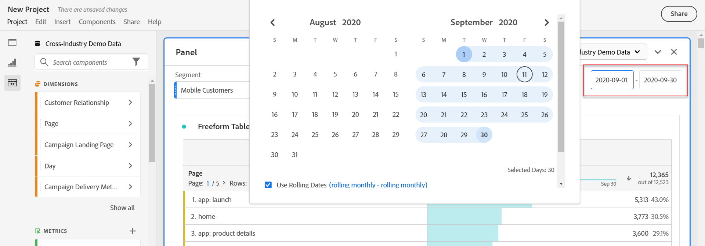
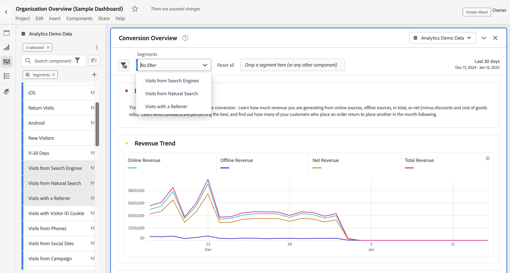

# Overzicht van deelvensters

A [!UICONTROL panel] is een verzameling tabellen en visualisaties. U kunt tot panelen van het top-linker pictogram in Workspace of a [ leeg paneel ](/help/analyze/analysis-workspace/c-panels/blank-panel.md) toegang hebben. Deelvensters zijn handig wanneer u uw projecten wilt ordenen op basis van een tijdsperiode, een rapport of een analyse.

## Deelvenstertypen

De volgende deelvenstertypen zijn beschikbaar in Analysis Workspace voor [!UICONTROL Adobe Analytics] :

| Vensternaam | Beschrijving |
| --- | --- |
| [Leeg deelvenster](/help/analyze/analysis-workspace/c-panels/blank-panel.md) | Kies uit de beschikbare deelvensters en visualisaties om uw analyse te starten. |
| [ Attributie ](attribution.md) | Vergelijk en visualiseer snel om het even welk aantal attributiemodellen gebruikend om het even welke afmeting en omzettingsmetrisch. |
| [ Analytics voor Doel ](a4t-panel.md) | Doelactiviteiten en ervaringen in Analysis Workspace analyseren. |
| [ Vrije vorm ](freeform-panel.md) | Voer onbeperkte vergelijkingen en onderverdelingen uit, dan voeg visualisaties toe om een rijk gegevensverhaal te vertellen. |
| [ gemiddelde minieme publiek van Media ](average-minute-audience-panel.md) | Analyseer het gemiddelde minutenpubliek voor een specifiek stuk van inhoud, of over een aangepaste tijdspanne. |
| [ Medium gezamenlijke kijkers ](media-concurrent-viewers.md) | Analyseer gelijktijdige viewers in de loop van de tijd met details over de piekconsistentie en de mogelijkheid om af te breken en te vergelijken. |
| [ bestede tijd van de media playback ](/help/analyze/analysis-workspace/c-panels/media-playback-time-spent.md) | Analyseer de afspeeltijd die wordt doorgebracht om te begrijpen waar piekmomenten voorkomen of waar drop-outs optreden. |
| [ Volgende of vorig punt ](next-previous.md) | Toon de volgende of vorige pagina&#39;s waarnaar mensen gaan. |
| [ Snelle inzichten ](quickinsight.md) | Snel een vrije-vormlijst en een begeleidende visualisatie bouwen om inzichten sneller te analyseren en te ontdekken. |
| [ de vergelijking van het Segment ](/help/analyze/analysis-workspace/c-panels/c-segment-comparison/segment-comparison.md) | Vergelijk snel twee segmenten in alle gegevenspunten om automatisch relevante verschillen te vinden. |

Deelvensters [!UICONTROL Quick insights] , [!UICONTROL Blank] en [!UICONTROL Freeform] zijn ideale startpunten voor uw analyse, terwijl [!UICONTROL Attribution] zichzelf aan geavanceerdere analyses leent. A  is beschikbaar bij de bodem van uw canvas, zodat kunt u lege panelen op elk ogenblik toevoegen.

Het gebrek beginnende paneel is het [!UICONTROL Freeform] paneel, maar u kunt het [ Lege paneel ](/help/analyze/analysis-workspace/c-panels/blank-panel.md) of [ Snelle inzichten ](/help/analyze/analysis-workspace/c-panels/quickinsight.md) ook uw gebrek maken. Zie [ Projecten &amp; de voorkeur van de Analyse ](/help/analyze/analysis-workspace/user-preferences.md#projects--analyses-preferences).

## Een deelvenster maken

Een deelvenster maken:

* Sleep een deelvenster vanuit het linkerdeelvenster van **[!UICONTROL Panels]** naar het canvas.
* Selecteer een paneel van het [ Lege paneel ](blank-panel.md).
* Gebruik **[!UICONTROL Insert]** in Workspace en selecteer het deelvenster. Alternatief, kunt u om het even welke [ kortere weg ](../build-workspace-project/fa-shortcut-keys.md) gebruiken om een paneel op te nemen.

  

U kunt:

* Selecteer  **binnen** om het even welk paneel om een andere visualisatie toe te voegen. Er verschijnt een pop-up waarmee u een visualisatie kunt selecteren.

  

  | Selecteren... | Een... |
  |---|---|
  |  | [Vrije-vormentabel](/help/analyze/analysis-workspace/visualizations/freeform-table/freeform-table.md) |
  |  | [Lijn](/help/analyze/analysis-workspace/visualizations/line.md) |
  |  | [ Bar ](/help//analyze/analysis-workspace/visualizations/bar.md) |
  |  | [ Summiere aantal ](/help/analyze/analysis-workspace/visualizations/summary-number-change.md) |
  |  | [Tekst](/help/analyze/analysis-workspace/visualizations/text.md) |
  |  | [Uitval](/help/analyze/analysis-workspace/visualizations/fallout/fallout-flow.md) |
  |  | [Stroom](/help/analyze/analysis-workspace/visualizations/c-flow/flow.md) |
  |  | [ Gebied gestapeld ](/help/analyze/analysis-workspace/visualizations/area.md) |
  |  | [ Lijst van de Cohort ](/help/analyze/analysis-workspace/visualizations/cohort-table/t-cohort.md) |
  |  | [ Opsommingsteken ](/help/analyze/analysis-workspace/visualizations/bullet-graph.md) |
  |  | [Cirkeldiagram](/help/analyze/analysis-workspace/visualizations/donut.md) |
  |  | [ Summiere verandering ](/help/analyze/analysis-workspace/visualizations/summary-number-change.md) |
  |  | [Histogram](/help/analyze/analysis-workspace/visualizations/histogram.md) |
  |  | [ Spreiding ](/help/analyze/analysis-workspace/visualizations/scatterplot.md) |
  |  | [Venn](/help/analyze/analysis-workspace/visualizations/venn.md) |
  |  | [Boomstructuur](/help/analyze/analysis-workspace/visualizations/treemap.md) |

* Selecteer  **buiten** het laatste paneel in uw werkruimte om een ander [ Lege paneel ](blank-panel.md) toe te voegen.

## Rapportsuite

Elk paneel wordt geassocieerd met a [ rapportreeks ](/help/admin/admin/c-manage-report-suites/report-suites-admin.md), die door  **[!UICONTROL *wordt geïdentificeerd naam van rapportreeks *]**&#x200B;in het drop-down menu bij het hoogste recht van het paneel.

Wanneer u een nieuw deelvenster maakt, is de standaardrapportsuite gebaseerd op de rapportsuite van het deelvenster waarmee u het laatst hebt gewerkt in het Analysis Workspace-project.

Binnen een project, kunt u één of [ vele rapportreeksen ](https://experienceleague.adobe.com/docs/analytics/analyze/analysis-workspace/build-workspace-project/multiple-report-suites.html?lang=nl-NL) afhankelijk van uw gevallen van het analysegebruik gebruiken.

De lijst met rapportsuites wordt gesorteerd op relevantie, die Adobe definieert op basis van hoe recent en vaak de suite door de huidige gebruiker is gebruikt en hoe vaak de suite binnen de organisatie wordt gebruikt.

>[!IMPORTANT]
>
>De geselecteerde rapportreeks bepaalt welke afmetingen, metriek, en segmenten voor de bouw van visualisaties in een paneel beschikbaar zijn.
>
>
>Wanneer u een rapportreeks voor een paneel schakelt, zouden sommige componenten niet in die nieuwe rapportreeks beschikbaar kunnen zijn. Deze wijziging kan ertoe leiden dat uw visualisatie niet correct wordt weergegeven. U ziet mogelijk waarschuwingen zoals:
>
>* Dit deelvenster bevat componenten die niet zijn ingeschakeld in de geselecteerde rapportsuite. Wijzig de rapportsuite of schakel de vereiste componenten in de rapportsuite in.
>* Kan visualisatie niet renderen: controleer de kolommen en rijen om te controleren of deze geldige componenten bevatten.
>

## Kalender

De paneelkalender bepaalt de rapportdatumwaaier voor lijsten en visualisaties binnen een paneel.

>[!NOTE]
>
>Als de waaier van de a  component van de Datum binnen een visualisatie of een paneel (bijvoorbeeld, als segment) wordt gebruikt, treedt de component van de datumwaaier de paneelkalender met voeten.
>

1. Selecteer een datumbereik door eerst de begindatum en vervolgens de einddatum te selecteren.
Alternatief, kunt u a **[!UICONTROL Preset]** van [!UICONTROL *selecteren vooraf ingesteld*] drop-down menu.

1. Selecteer indien nodig **[!UICONTROL Show advanced settings]** tot en met:

   * Geef **[!UICONTROL Start time]** en **[!UICONTROL End time]** anders op dan de standaardinstellingen `12:00 AM` (`0:00`) en `11:59 PM` (`23:59`). Eindtijden omvatten altijd 59 seconden. Voor een datumbereik dat vele dagen omvat, geldt de begintijd voor de eerste dag van het datumbereik en de eindtijd voor de laatste dag in het datumbereik. Met **[!UICONTROL (Reset time values)]** kunt u de standaardinstellingen van de begin- en eindtijd herstellen.
   * **[!UICONTROL Make date range components relative to panel calendar]**. Als deze optie is uitgeschakeld, zijn de componenten voor het datumbereik die in het deelvenster worden gebruikt relatief ten opzichte van de huidige tijd. Als deze optie is ingeschakeld, zijn de componenten voor het datumbereik die in het deelvenster worden gebruikt, relatief ten opzichte van de agenda van het deelvenster.
   * **[!UICONTROL Use rolling dates]**. Indien ingeschakeld, worden vooraf ingestelde datumbereiken zoals **[!UICONTROL Last 7 full days]** dynamisch bijgewerkt als huidige datum- en tijdvoortgang. Als deze optie is uitgeschakeld, worden deze voorinstellingen niet bijgewerkt nadat ze zijn toegepast.

     

     U kunt de tekst tussen haakjes selecteren (bijvoorbeeld **[!UICONTROL fixed start - rolling daily]** ) om het deelvenster uit te breiden en details voor **[!UICONTROL Start]** en **[!UICONTROL End]** op te geven.

      1. Selecteer **[!UICONTROL Start of]**, **[!UICONTROL End of]** of **[!UICONTROL Fixed day]** .
      1. Wanneer u **[!UICONTROL Start of]** of **[!UICONTROL End of]** hebt geselecteerd, kunt u een volledige expressie maken. Bijvoorbeeld: **[!UICONTROL End of]** **[!UICONTROL current year]** **[!UICONTROL plus]** `1` **[!UICONTROL day]** . Kies de juiste waarde voor elk afzonderlijk deel van de expressie.
         * Selecteer een waarde voor de huidige. Bijvoorbeeld **[!UICONTROL current year]** .
         * Selecteer een waarde voor extra berekening. Bijvoorbeeld **[!UICONTROL plus]** .
         * Geef een waarde op wanneer u een aanvullende berekening hebt opgegeven. Bijvoorbeeld `1` .
         * Wanneer u aanvullende berekening hebt opgegeven, selecteert u de periode die u voor de berekening wilt gebruiken. Bijvoorbeeld **[!UICONTROL day]** .

     Selecteer **[!UICONTROL Hide details]** om de details voor het rollen datumberekening te verbergen.

1. Selecteer **[!UICONTROL Apply]** om het datumbereik toe te passen op het deelvenster van waaruit u de kalender hebt aangeroepen.
Selecteer **[!UICONTROL Apply to all panels]** om het datumbereik toe te passen op alle deelvensters in het Workspace-project.

## Valzone {#dropzone}

Met de dropzone van het deelvenster kunt u segmenten en vervolgkeuzelijsten toepassen op alle tabellen en visualisaties in een deelvenster. U kunt een of meerdere segmenten toepassen op een deelvenster.

### Segmenten

Sleep segmenten van het linkerdeelvenster naar de neerzetzone van het deelvenster om te beginnen met het segmenteren van het deelvenster. Herhaal dit proces om extra segmenten aan het deelvenster toe te voegen. Segmenten worden naast elkaar boven in het deelvenster weergegeven.

#### Snelle segmenten

De niet-segmentcomponenten kunnen ook direct in de dalingsstreek worden gesleept om snelle segmenten tot stand te brengen, die u de tijd en de inspanning sparen om naar de [ bouwer van het Segment ](/help/components/segmentation/segmentation-workflow/seg-build.md) te gaan. Segmenten die op deze manier worden gemaakt, worden automatisch gedefinieerd als segmenten op gebeurtenisniveau. Deze definitie kan snel worden gewijzigd door  naast de segmentnaam uit.

<!-- For more information, see [Quick segments](/help/components/segmentation/). -->

### Vervolgkeuzesegmenten

>[!BEGINSHADEBOX]

Zie  [ Dropdown segmenten ](https://video.tv.adobe.com/v/23877?quality=12&learn=on){target="_blank"} voor een demo video.

>[!ENDSHADEBOX]

#### Statische drop-down segmenten

De statische drop-down segmenten laten u toe om met de gegevens op een gecontroleerde manier in wisselwerking te staan. U kunt bijvoorbeeld een vervolgkeuzesegment toevoegen voor mobiele apparaattypen, zodat u het deelvenster kunt segmenteren op tablet, mobiele telefoon of bureaublad.

De statische drop-down segmenten kunnen ook worden gebruikt om vele projecten in te consolideren. Bijvoorbeeld, als u vele versies van het zelfde project met verschillende toegepaste segmenten van het Land hebt, kunt u alle versies in één enkel project consolideren en een drop-down segment van het Land toevoegen.

##### Statische vervolgkeuzelijsten maken

* Voor drop-down segmenten die afmetingspunten gebruiken, selecteer één enkele afmeting van het linkerpaneel en laat vallen de afmeting in de gebied van het paneeldrop terwijl het houden van ⇧ (*verschuiving*). Deze actie leidt tot een drop-down segment met alle afmetingspunten die met die afmeting worden geassocieerd.

  Of als u wilt dat het vervolgkeuzesegment alleen bepaalde dimensies bevat die aan een dimensie zijn gekoppeld, selecteert u het pictogram met de pijl-rechts naast de gewenste dimensie in het linkerdeelvenster. Deze actie stelt alle beschikbare afmetingspunten bloot. Selecteer veelvoudige afmetingspunten van deze lijst gebruikend ⇧+  (*verschuiving* + *uitgezocht*) of ^+  (*controle* + *uitgezocht*), dan laat vallen hen in de gebied van de paneeldaling **terwijl het houden van** ⇧.

* Voor drop-down segmenten die één enkel componenttype gebruiken (bijvoorbeeld, slechts dimensies, of slechts segmenten, of slechts metriek), selecteer veelvoudige punten van het zelfde type in het linkerpaneel gebruikend ⇧+  of ^+ . Dan laat vallen de punten in het paneel dalingsstreek **terwijl het houden van** ⇧.

  Er wordt één vervolgkeuzesegment gemaakt met componenten die u hebt geselecteerd.

* Voor drop-down segmenten die een mengeling van componententypes gebruiken (zoals 2 metriek en 3 segmenten), selecteer veelvoudige componenten gebruikend ⇧+  of ^+ . Daling de selectie in het paneel drop zone **terwijl het houden van** ⇧. In dit verband worden alle componenttypen behandeld als afzonderlijke vervolgkeuzelijsten. Bijvoorbeeld, als u zowel metriek als afmetingspunten in uw selectie omvat, worden twee afzonderlijke drop-down segmenten gecreeerd: één drop-down segment omvat afmetingspunten, en andere omvat metriek.

Een drop-down segment verstrekt de volgende opties van het contextmenu:

* **[!UICONTROL Delete drop-down]**: hiermee verwijdert u het vervolgkeuzesegment uit het deelvenster.
* **[!UICONTROL Delete label]**: verwijder de tekst die boven een drop-down segment wordt getoond. Om het etiket te wijzigen, over het etiket te bewegen en  uit.
* **[!UICONTROL Add label]**: Wanneer u een drop-down segment aan een project toevoegt, wordt een etiket automatisch geplaatst aan de componentennaam. Als u het label verwijdert, kunt u het opnieuw toevoegen met deze optie.
* **[!UICONTROL Require selection]**: vereist dat een segment is ingesteld in het deelvenster.

##### Statische drop-down segmenten gebruiken

Gebruikers kunnen het vervolgkeuzemenu voor segmenten van het deelvenster op een van de volgende manieren gebruiken:

* Pas één segment op het paneel toe door het segment van het drop-down segment te selecteren.

* Pas meerdere segmenten toe op het deelvenster door meer dan één segment te selecteren in het vervolgkeuzesegment. Het deelvenster wordt gesegmenteerd en bevat alle geselecteerde segmenten.

#### Dynamische vervolgkeuzelijsten

Met dynamische vervolgkeuzelijsten kunt u beschikbare waarden bepalen op basis van gegevens binnen het rapportagebereik van het deelvenster en waarden in andere vervolgkeuzelijsten. U kunt bijvoorbeeld twee dynamische vervolgkeuzelijsten maken met de dimensie Landen en de dimensie Steden. Wanneer u een land in de vervolgkeuzelijst **[!UICONTROL Countries]** selecteert, wordt de vervolgkeuzelijst **[!UICONTROL Cities]** dynamisch aangepast, zodat alleen de steden in dat land worden weergegeven.

Dit concept is van toepassing op alle dimensies. Alleen dimensie-items die binnen het datumbereik van het deelvenster verschijnen en geselecteerde segmenten zijn zichtbaar. Dimension-items die zijn geselecteerd in statische vervolgkeuzelijsten beïnvloeden de beschikbare waarden in dynamische vervolgkeuzelijsten. Inverse is echter niet waar. Dimension-items die zijn geselecteerd in dynamische vervolgkeuzelijsten hebben geen invloed op de beschikbare waarden in statische vervolgkeuzelijsten.

Handmatige selectie van dimensie-items is beschikbaar als u verwacht dat een bepaald dimensie-item in de toekomst wordt verzameld. U kunt een dynamisch drop-down segment ook ontruimen zodat het geen waarde bevat, toestaand andere dynamische drop-down segmenten om meer waarden te bevatten. Selecteer **[!UICONTROL Reset all]** om de selectie uit alle drop-down segmenten voor dat paneel te ontruimen.

Een dynamisch vervolgkeuzesegment maken:

* De belemmering en laat vallen één enkele afmeting in de sectie van de paneeldaling **terwijl het houden van** ⇧.

De dynamische drop-down segmenten zijn niet beschikbaar voor metriek, segmenten, of datumwaaiers.

Een dynamisch drop-down segment verstrekt de zelfde opties van het contextmenu zoals statische drop-down segmenten.

## Contextmenu

Extra functionaliteit voor een deelvenster is beschikbaar via een contextmenu (klik met de rechtermuisknop) in de koptekst van het deelvenster.

De volgende opties zijn beschikbaar:

| Optie | Beschrijving |
| --- | --- |
| **[!UICONTROL Insert copied panel]** | Hiermee kunt u een gekopieerd deelvenster op een andere plaats in het project of in een ander project plakken. |
| **[!UICONTROL Insert copied visualization]** | Plak een gekopieerde visualisatie naar een andere locatie in het deelvenster, het project of in een ander project. |
| **[!UICONTROL Apply Report Suite to all panels]** | Pas de rapportsuite voor dit deelvenster toe op alle andere deelvensters in het project. |
| **[!UICONTROL Copy panel]** | Kopieer een deelvenster, zodat u het kunt invoegen op een andere locatie in het project of in een ander project. |
| **[!UICONTROL Duplicate panel]** | Hiermee maakt u een exacte kopie van het huidige deelvenster, dat u vervolgens kunt wijzigen. |
| **[!UICONTROL Collapse all panels]** | Vouw alle projectdeelvensters samen. |
| **[!UICONTROL Expand all panels]** | Vouw alle projectdeelvensters uit. |
| **[!UICONTROL Collapse all visualizations in panel]** | Vouw alle visualisaties in het huidige deelvenster samen. |
| **[!UICONTROL Expand all visualizations in panel]** | Vouw alle visualisaties in het huidige deelvenster uit. |
| **[!UICONTROL Edit Description]** | Voeg (of bewerk) een tekstbeschrijving voor het paneel toe. |
| **[!UICONTROL Get Panel Link]** | Stuur iemand naar een specifiek deelvenster in een project. Wanneer de koppeling is geselecteerd, moet de ontvanger zich aanmelden voordat deze wordt omgeleid naar het exacte deelvenster waarnaar deze is gekoppeld. |

## Configuratie

Sommige deelvensters (zoals [!UICONTROL Attribution] , [!UICONTROL Experimentation] , [!UICONTROL Media average minute audience] en andere) hebben een configuratiedialoogvenster dat u helpt bij het maken van de visualisatie. Het gebruik  bij de bovenkant van het paneel uit om tot de configuratie toegang te hebben en te veranderen.

<!--
## Panel types

The following panel types are available in Analysis Workspace:

| Panel name | Description |
| --- | --- |
| [Blank panel](blank-panel.md) | Choose from available panels and visualizations to start your analysis. |
| [Quick Insights panel](quickinsight.md) | Quickly build a freeform table and an accompanying visualization in order to analyze and uncover insights faster. |
| [Analytics for Target panel](a4t-panel.md) | Analyze Target activities and experiences in Analysis Workspace. |
| [Attribution panel](attribution.md) | Quickly compare and visualize any number of attribution models using any dimension and conversion metric. |
| [Freeform panel](freeform-panel.md) | Perform unlimited comparisons and breakdowns, then add visualizations to tell a rich data story. |
| [Media Average Minute Audience panel](average-minute-audience-panel.md) | Analyze average minute audience over time, with details on peak views and the ability to break down and compare. |
| [Media Concurrent Viewers panel](media-concurrent-viewers.md) | Analyze concurrent viewers over time, with details on peak concurrency and the ability to break down and compare. |
| [Media Playback Timespent panel](/help/analyze/analysis-workspace/c-panels/media-playback-time-spent.md) | Analyze concurrent viewers over time, with details on peak concurrency and the ability to break down and compare. |
| [Segment Comparison panel](c-segment-comparison/segment-comparison.md) | Quickly compare two segments across all data points to automatically find relevant differences. |

[!UICONTROL Quick Insights], [!UICONTROL Blank] and [!UICONTROL Freeform] panels are great places to start your analysis, while [!UICONTROL Analytics for Target], [!UICONTROL Attribution], [!UICONTROL Media Concurrent Viewers] and [!UICONTROL Segment Comparison] lend themselves to more advanced analyses. A `"+"` button is available in projects so you can add blank panels at any time.

The default starting panel is the [!UICONTROL Freeform] panel, but you can make the [blank panel](/help/analyze/analysis-workspace/c-panels/blank-panel.md) your default as well.

## Report suite {#report-suite}

Tables and visualizations within a panel derive data from the [!UICONTROL report suite] selected in the top right of the panel. The report suite also determines what components are available in the left rail. Within a project, you can use one or [many report suites](https://experienceleague.adobe.com/docs/analytics/analyze/analysis-workspace/build-workspace-project/multiple-report-suites.html?lang=nl-NL) depending on your analysis use cases. To apply a single report suite to all panels in a project, **right-click panel header > Apply report suite to all panels**.

The list of report suites is sorted on relevancy, which Adobe defines based on how recently and frequently the suite has been used by the current user, and how frequently the suite is used within the organization.

## Calendar {#calendar}

The panel calendar controls the reporting range for tables and visualizations within a panel.

>[!NOTE]
>If a (purple) date range component is used within a table, visualization or panel drop zone, it overrides the panel calendar.

You can apply a minute-level date range under the advanced settings of your panel calendar. If you are reporting on a date range that spans many days, start time applies to the first day and end time applies to the last day in your range.

## Drop zone {#dropzone}

The panel drop zone enables you to apply segment and drop-down filters to all tables and visualizations within a panel. You can apply one or many filters to a panel. 

### Segment filters

Drag and drop any segments from the left rail into the panel drop zone to begin filtering your panel. Repeat this process to add additional filters to the panel. Filters appear side by side at the top of the panel.

### Ad hoc segment filters

Non-segment components can also be dragged directly into the drop zone to create ad hoc segments, saving you the time and effort of going to the Segment Builder. Segments created in this way are automatically defined as hit-level segments. This definition can be modified by clicking the information icon (i) next to the segment, then the pencil-shaped edit icon and editing it in the Segment Builder.

Ad hoc segments are a type of quick segment, and are local to the project. They do not show up in the left rail unless you make them public.

For more information, see [Quick segments](/help/analyze/analysis-workspace/components/segments/quick-segments.md).

### Static drop-down segments

Static drop-down segments enable you to interact with the data in a controlled way. For example, you can add a drop-down segment for Mobile Device Types so that you can segment the panel by Tablet, Mobile Phone, or Desktop.

Static drop-down segments can also be used to consolidate many projects into one. For example, if you have many versions of the same project with different Country segments applied, you can consolidate all versions into a single project and add a Country drop-down segment.

#### Create static drop-down segments

* For drop-down segments using dimension items, select a single dimension from the left rail and drop it into the panel dropzone **while holding `[Shift]`**. This creates a drop-down segment with all the dimension items that are associated with that dimension. 

  Or, if you want the drop-down segment to include only specific dimension items that are associated with a dimension, click the right arrow icon next to the desired dimension in the left rail. This action exposes all available dimension items. Select multiple dimension items from this list using `[Shift + Click]` or `[Ctrl + Click]`, then drop them into the panel dropzone **while holding** `[Shift]`.

* For drop-down segments using a single component type (for example, only dimensions, or only segments, or only metrics), select multiple items of the same type in the left rail using `[Shift + Click]` or `[Ctrl + Click]`, then drop them into the panel dropzone **while holding `[Shift]`**.

  A single drop-down segment is created with components that you selected.

* For drop-down segments using a mix of component types (such as 2 metrics and 3 filters), select multiple components using `[Shift + Click]` or `[Ctrl + Click]`. Drop the selection into the panel dropzone **while holding `[Shift]`**. In this context, all component types are treated as separate drop-down segments. For example, if you include both metrics and dimension items in your selection, two separate drop-down segments are created: one drop-down segments includes dimension items, and the other includes metrics.

  

Right-clicking a drop-down segment provides the following options:

* **[!UICONTROL Delete drop-down]**: Removes the drop-down segment from the panel. 
* **[!UICONTROL Delete label]**: Remove the text above a drop-down segment. To modify the label, select the pencil icon.
* **[!UICONTROL Add label]**: When you add a drop-down segment to a project, a label is automatically set to the component name. If you delete the label, you can add it again with this option.
* **[!UICONTROL Require selection]**: Requires that a segment is set on the panel. 

[Watch the video](https://experienceleague.adobe.com/docs/analytics-learn/tutorials/analysis-workspace/using-panels/using-panels-to-organize-your-analysis-workspace-projects.html?lang=nl-NL) to learn more about how to add drop-down filters to your project.

#### Use static drop-down segments

Use the drop-down segments menu in any of the following ways in order to filter the panel:
     
* Apply a single segment to the panel by selecting the segment from the drop-down menu.

* Apply multiple segments to the panel by selecting more than one segment from the drop-down menu. The panel is filtered to include any of the selected segments. 

  To remove a segment from the list, select it again in the drop-down menu.

  

### Dynamic drop-down segments

Dynamic drop-down segments allow you to determine available values based on data within the panel's reporting range and values in other drop-down segments. For example, you can create two dynamic drop-downs using the [Countries](/help/components/dimensions/countries.md) dimension and [Cities](/help/components/dimensions/cities.md) dimension. When you select a country from the [!UICONTROL Countries] drop-down list, the [!UICONTROL Cities] drop-down list dynamically adjusts to only show cities within that country.

This same concept applies to all dimensions; only dimension items that appear within the panel's date range and selected segments are visible. Dimension items selected in static drop-down segments affect available values in dynamic drop-down segments. However, the inverse is not true; Dimension items selected in dynamic drop-down segments do not affect available values in static drop-down segments.

Manual selection of dimension items is available if you anticipate a certain dimension item to be collected in the future. You can also clear a dynamic drop-down segment so that it does not contain a value, allowing other dynamic drop-down segments to contain more values. Select **[!UICONTROL Reset all]** to clear the selection from all drop-down segments for that panel.

To create a dynamic drop-down segment:

* Drag and drop a single dimension into the panel dropzone **while holding `[Shift]`**.
* Dynamic drop-down segments are not available for metrics, segments, or date ranges.
* Right-click a drop-down segment and select **[!UICONTROL Delete dropdown]** to delete it.

Right-clicking a dynamic drop-down filter provides the same options as static drop-down filters.

## Right-click menu {#right-click}

Additional functionality for a panel is available by right-clicking on the panel header.

The following settings are available:

| Setting | Description |
| --- | --- |
| Insert Copied Panel/Visualization|Lets you paste ("insert") a copied panel or visualization to another place within the project, or into a different project.|
| Copy Panel | Lets you right-click and copy a panel, so that you can insert it to another place within the project, or into a different project.|
| Apply Report Suite to all panels | Lets you apply the active panel report suite to all panels in the project.|
| Duplicate Panel | Makes an exact duplicate of the current panel, which you can then modify. |
| Collapse/Expand all Panels | Collapses and expands all project panels. |
| Collapse/Expand all Visualizations in Panel | Collapses and expands all visualizations in the current panel. |
| Edit Description | Add (or edit) a text description for the panel. |
| Get Panel Link | Lets you direct someone to a specific panel within a project. When the link is clicked, the recipient will be required to login before being directed to the exact panel linked to. |

-->
