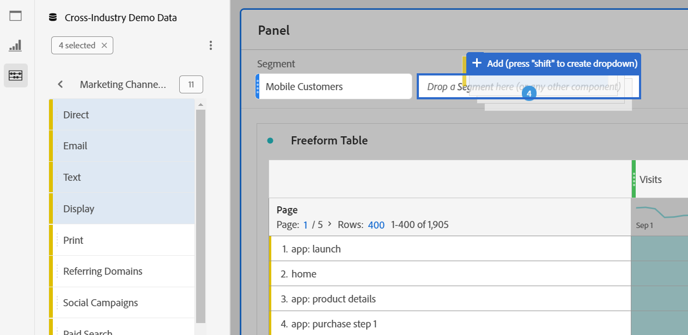

# Overzicht van deelvensters

A [!UICONTROL panel] is een verzameling tabellen en visualisaties. U hebt toegang tot deelvensters via het pictogram linksboven in Workspace of via een [leeg deelvenster](blank-panel.md). Deelvensters zijn handig wanneer u uw projecten wilt ordenen op basis van een tijdsperiode, een rapport of een analyse.

## Deelvenstertypen

De volgende deelvenstertypen zijn beschikbaar in Analysis Workspace:

| Vensternaam | Beschrijving |
| --- | --- |
| [Leeg deelvenster](blank-panel.md) | Kies uit de beschikbare deelvensters en visualisaties om uw analyse te starten. |
| [Deelvenster Snelle inzichten](quickinsight.md) | Snel een vrije-vormlijst en een bijbehorende visualisatie bouwen om inzichten sneller te analyseren en te ontdekken. |
| [Analyses voor venster Doel](a4t-panel.md) | Doelactiviteiten en ervaringen in Analysis Workspace analyseren. |
| [Kenmerk, deelvenster](attribution.md) | Vergelijk en visualiseer snel om het even welk aantal attributiemodellen gebruikend om het even welke afmeting en omzettingsmetrisch. |
| [Deelvenster Vrije vorm](freeform-panel.md) | Voer onbeperkte vergelijkingen en onderverdelingen uit, dan voeg visualisaties toe om een rijk gegevensverhaal te vertellen. |
| [Deelvenster Gemiddelde media - geluid](average-minute-audience-panel.md) | Analyseer het gemiddelde aantal minuten in de loop der tijd, met details over piekweergaven en de mogelijkheid om af te breken en te vergelijken. |
| [Deelvenster voor gelijktijdige mediaviewers](media-concurrent-viewers.md) | Analyseer gelijktijdige viewers in de loop van de tijd met details over de piekconsistentie en de mogelijkheid om af te breken en te vergelijken. |
| [Deelvenster Tijdlijn media afspelen](/help/analyze/analysis-workspace/c-panels/media-playback-time-spent.md) | Analyseer gelijktijdige viewers in de loop van de tijd met details over de piekconsistentie en de mogelijkheid om af te breken en te vergelijken. |
| [Deelvenster Segmentvergelijking](c-segment-comparison/segment-comparison.md) | Vergelijk snel twee segmenten in alle gegevenspunten om automatisch relevante verschillen te vinden. |

[!UICONTROL Quick Insights], [!UICONTROL Blank] en [!UICONTROL Freeform] deelvensters zijn ideale plaatsen om uw analyse te starten, terwijl [!UICONTROL Analytics for Target], [!UICONTROL Attribution], [!UICONTROL Media Concurrent Viewers] en [!UICONTROL Segment Comparison] lenen zich voor geavanceerdere analyses. A `"+"` Deze knop is beschikbaar in projecten, zodat u op elk gewenst moment lege deelvensters kunt toevoegen.

Het standaardbeginvenster is het [!UICONTROL Freeform] , maar u kunt het [leeg deelvenster](/help/analyze/analysis-workspace/c-panels/blank-panel.md) ook uw standaardinstelling.

## Rapportsuite {#report-suite}

Tabellen en visualisaties in een deelvenster leiden gegevens af van de [!UICONTROL report suite] in de rechterbovenhoek van het deelvenster geselecteerd. Het rapportpakket bepaalt ook welke componenten in de linkerspoorstaaf beschikbaar zijn. Binnen een project kunt u een of [veel rapportensuites](https://experienceleague.adobe.com/docs/analytics/analyze/analysis-workspace/build-workspace-project/multiple-report-suites.html) afhankelijk van uw analyse gebruik gevallen. Eén rapportsuite toepassen op alle deelvensters in een project **Klik met de rechtermuisknop op de koptekst van het deelvenster > Rapportsuite toepassen op alle deelvensters**.

De lijst van rapportsuites wordt gesorteerd op relevantie, die Adobe bepaalt gebaseerd op hoe onlangs en vaak de reeks door de huidige gebruiker is gebruikt, en hoe vaak de reeks binnen de organisatie wordt gebruikt.

## Kalender {#calendar}

De paneelkalender bepaalt het rapporteringswaaier voor lijsten en visualisaties binnen een paneel.

>[!NOTE]
>Als een (paarse) datumbereikcomponent wordt gebruikt binnen een tabel-, visualisatie- of deelvensterdropzone, wordt de deelvensterkalender hierdoor genegeerd.

U kunt een datumbereik op minaniveau toepassen onder de geavanceerde instellingen van uw deelvensterkalender. Als u op een datumwaaier rapporteert die vele dagen overspant, is de begintijd van toepassing op de eerste dag en de eindtijd op de laatste dag in uw waaier.

## Valzone {#dropzone}

Met de dropzone van het deelvenster kunt u segment- en vervolgkeuzefilters toepassen op alle tabellen en visualisaties in een deelvenster. U kunt een of meerdere filters toepassen op een deelvenster.

### Segmentfilters

Sleep segmenten van de linkerspoorstaaf naar de neerzetzone van het deelvenster om het deelvenster te filteren. Herhaal dit proces om extra filters aan het paneel toe te voegen. Filters worden naast elkaar boven in het deelvenster weergegeven.

### Ad-hocsegmentfilters

Niet-segmentcomponenten kunnen ook rechtstreeks in de dalingsstreek worden gesleept om ad hoc segmenten tot stand te brengen, die u de tijd en de inspanning besparen om naar de Bouwer van het Segment te gaan. Segmenten die op deze manier worden gemaakt, worden automatisch gedefinieerd als raaksegmenten. Deze definitie kan worden gewijzigd door op het informatiepictogram (i) naast het segment te klikken, vervolgens op het pictogram voor het bewerken van de vorm van een potlood te klikken en dit te bewerken in de Segment Builder.

Ad hoc segmenten zijn een type van snel segment, en zijn lokaal aan het project. Ze komen niet in de linkerspoorstaaf voor als je ze niet openbaar maakt.

Zie voor meer informatie [Snelle segmenten](/help/analyze/analysis-workspace/components/segments/quick-segments.md).

### Statische drop-down segmenten

De statische drop-down segmenten laten u toe om met de gegevens op een gecontroleerde manier in wisselwerking te staan. U kunt bijvoorbeeld een vervolgkeuzesegment toevoegen voor mobiele apparaattypen, zodat u het deelvenster kunt segmenteren op tablet, mobiele telefoon of bureaublad.

De statische drop-down segmenten kunnen ook worden gebruikt om vele projecten in te consolideren. Bijvoorbeeld, als u vele versies van het zelfde project met verschillende toegepaste segmenten van het Land hebt, kunt u alle versies in één enkel project consolideren en een drop-down segment van het Land toevoegen.

#### Statische vervolgkeuzelijsten maken

* Voor drop-down segmenten die afmetingspunten gebruiken, selecteer één enkele afmeting van het linkerspoor en laat vallen het in paneeldropzone **terwijl u`[Shift]`**. Dit leidt tot een drop-down segment met alle afmetingspunten die met die afmeting worden geassocieerd.

  Of als u wilt dat het vervolgkeuzesegment alleen bepaalde dimensies bevat die aan een dimensie zijn gekoppeld, klikt u op het pijlpictogram naar rechts naast de gewenste dimensie in het linkerspoor. Deze actie stelt alle beschikbare afmetingspunten bloot. Meerdere dimensie-items in deze lijst selecteren met `[Shift + Click]` of `[Ctrl + Click]`en zet ze vervolgens neer in de dropzone van het deelvenster **terwijl u** `[Shift]`.

* Voor drop-down segmenten die één enkel componenttype gebruiken (bijvoorbeeld slechts dimensies, of slechts segmenten, of slechts metriek), selecteer veelvoudige punten van het zelfde type in de linkerspoorstaaf gebruikend `[Shift + Click]` of `[Ctrl + Click]`en zet ze vervolgens neer in de dropzone van het deelvenster **terwijl u`[Shift]`**.

  Er wordt één vervolgkeuzesegment gemaakt met componenten die u hebt geselecteerd.

* Voor drop-down segmenten die een mengeling van componenttypes (zoals 2 metriek en 3 filters) gebruiken, selecteer veelvoudige componenten gebruikend `[Shift + Click]` of `[Ctrl + Click]`. De selectie neerzetten in de dropzone van het deelvenster **terwijl u`[Shift]`**. In dit verband worden alle componenttypen behandeld als afzonderlijke vervolgkeuzelijsten. Bijvoorbeeld, als u zowel metriek als afmetingspunten in uw selectie omvat, worden twee afzonderlijke drop-down segmenten gecreeerd: één drop-down segmenten omvat afmetingspunten, en andere omvat metriek.

  

Als u met de rechtermuisknop op een vervolgkeuzesegment klikt, hebt u de volgende opties:

* **[!UICONTROL Delete drop-down]**: Hiermee verwijdert u het vervolgkeuzesegment uit het deelvenster.
* **[!UICONTROL Delete label]**: Verwijder de tekst boven een vervolgkeuzesegment. Als u het label wilt wijzigen, selecteert u het potloodpictogram.
* **[!UICONTROL Add label]**: Wanneer u een drop-down segment aan een project toevoegt, wordt een etiket automatisch geplaatst aan de componentennaam. Als u het label verwijdert, kunt u het opnieuw toevoegen met deze optie.
* **[!UICONTROL Require selection]**: Hiervoor moet een segment in het deelvenster zijn ingesteld.

[De video bekijken](https://experienceleague.adobe.com/docs/analytics-learn/tutorials/analysis-workspace/using-panels/using-panels-to-organize-your-analysis-workspace-projects.html) voor meer informatie over het toevoegen van vervolgkeuzefilters aan uw project.

#### Statische drop-down segmenten gebruiken

Gebruikers kunnen het vervolgkeuzemenu voor segmenten op een van de volgende manieren gebruiken om het deelvenster te filteren:

* Pas één segment op het paneel toe door het segment van het drop-down menu te selecteren.

* U kunt meerdere segmenten op het deelvenster toepassen door meerdere segmenten in het keuzemenu te selecteren. Het deelvenster wordt gefilterd en bevat alle geselecteerde segmenten.

  

### Dynamische vervolgkeuzelijsten

Met dynamische vervolgkeuzelijsten kunt u beschikbare waarden bepalen op basis van gegevens binnen het rapportagebereik van het deelvenster en waarden in andere vervolgkeuzelijsten. U kunt bijvoorbeeld twee dynamische vervolgkeuzelijsten maken met de opdracht [Landen](/help/components/dimensions/countries.md) dimensie en [Plaatsen](/help/components/dimensions/cities.md) dimensie. Wanneer u een land selecteert in het menu [!UICONTROL Countries] vervolgkeuzelijst, de [!UICONTROL Cities] De vervolgkeuzelijst wordt dynamisch aangepast om alleen de steden in dat land weer te geven.

Dit concept is van toepassing op alle dimensies. Alleen dimensie-items die binnen het datumbereik van het deelvenster verschijnen en geselecteerde segmenten zijn zichtbaar. De punten van het Dimension die in statische drop-down segmenten worden geselecteerd beïnvloeden beschikbare waarden in dynamische drop-down segmenten. Omgekeerd is echter niet waar. Dimension-items die zijn geselecteerd in dynamische vervolgkeuzelijsten hebben geen invloed op de beschikbare waarden in statische vervolgkeuzelijsten.

Handmatige selectie van dimensie-items is beschikbaar als u verwacht dat een bepaald dimensie-item in de toekomst wordt verzameld. U kunt een dynamisch drop-down segment ook ontruimen zodat het geen waarde bevat, toestaand andere dynamische drop-down segmenten om meer waarden te bevatten. Selecteren **[!UICONTROL Reset all]** om de selectie uit alle drop-down segmenten voor dat paneel te ontruimen.

Een dynamisch vervolgkeuzesegment maken:

* Eén dimensie naar de dropzone van het deelvenster slepen **terwijl u`[Shift]`**.
* Dynamische drop-down segmenten zijn niet beschikbaar voor metriek, segmenten, of datumwaaiers.
* Klik met de rechtermuisknop op een vervolgkeuzesegment en selecteer **[!UICONTROL Delete dropdown]** om deze te verwijderen.

Als u met de rechtermuisknop op een dynamisch vervolgkeuzefilter klikt, hebt u dezelfde opties als statische vervolgkeuzefilters.

## Klikken met rechtermuisknop {#right-click}

Aanvullende functionaliteit voor een deelvenster is beschikbaar door met de rechtermuisknop op de koptekst van het deelvenster te klikken.

De volgende instellingen zijn beschikbaar:

| Instelling | Beschrijving |
| --- | --- |
| Gekopieerd deelvenster/visualisatie invoegen | Hiermee kunt u een gekopieerd deelvenster of een visualisatie plakken (&quot;invoegen&quot;) naar een andere locatie in het project of naar een ander project. |
| Deelvenster kopiëren | Hiermee kunt u met de rechtermuisknop klikken en een deelvenster kopiëren, zodat u het kunt invoegen op een andere locatie in het project of in een ander project. |
| Rapportsuite toepassen op alle deelvensters | Hiermee kunt u de rapportsuite van het actieve deelvenster toepassen op alle deelvensters in het project. |
| Deelvenster dupliceren | Hiermee maakt u een exacte kopie van het huidige deelvenster, dat u vervolgens kunt wijzigen. |
| Alle deelvensters samenvouwen/uitvouwen | Hiermee vouwt u alle projectdeelvensters samen en breidt u deze uit. |
| Alle visualisaties in deelvenster samenvouwen/uitvouwen | Hiermee vouwt u alle visualisaties in het huidige deelvenster samen en breidt u deze uit. |
| Beschrijving bewerken | Voeg (of bewerk) een tekstbeschrijving voor het paneel toe. |
| Deelvensterkoppeling ophalen | Hiermee kunt u iemand doorsturen naar een specifiek deelvenster binnen een project. Wanneer op de koppeling wordt geklikt, moet de ontvanger zich aanmelden voordat deze wordt omgeleid naar het exacte deelvenster dat is gekoppeld aan. |
