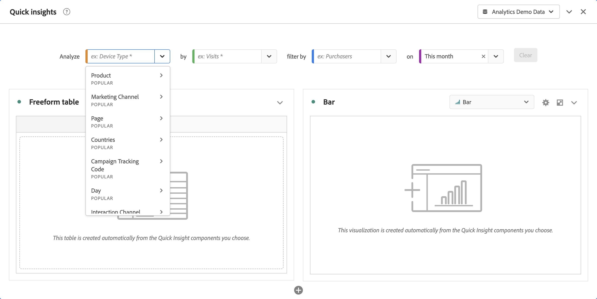
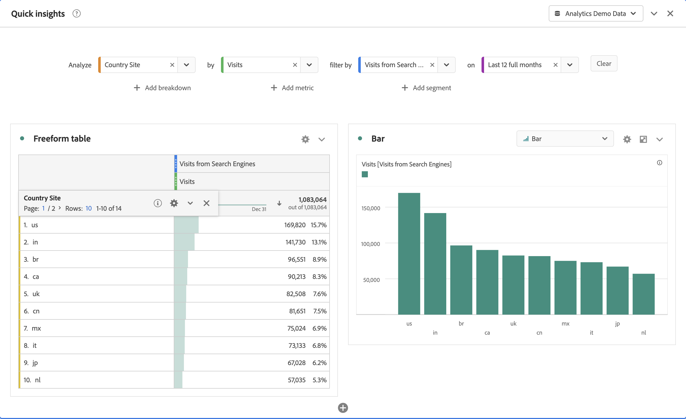
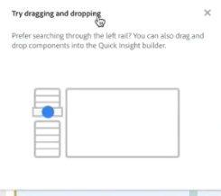
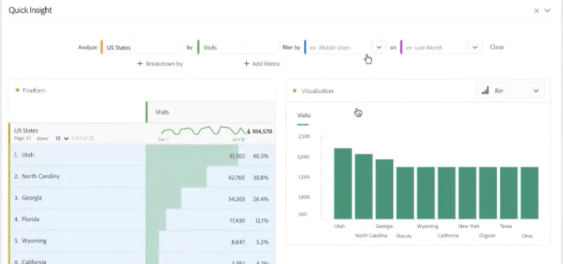
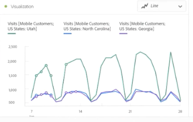

# Deelvenster Snelle inzichten {#quick-insights-panel}

<!-- markdownlint-disable MD034 -->

>[!CONTEXTUALHELP]
>id="workspace_quickinsights_button"
>title="Snelle inzichten"
>abstract="Maak een deelvenster om snel een vrije-vormtabel te maken en de bijbehorende visualisatie om inzichten sneller te analyseren en zichtbaar te maken."

<!-- markdownlint-enable MD034 -->

>[!BEGINSHADEBOX]

_dit artikel documenteert het Snelle paneel van Inzichten in_  _&#x200B;**Adobe Analytics**._ _zie [ Snelle Inzichten paneel ](https://experienceleague.adobe.com/en/docs/analytics/analyze/analysis-workspace/panels/quickinsight)) voor_  _&#x200B;**Customer Journey Analytics** versie van dit artikel._

>[!ENDSHADEBOX]

[!UICONTROL Quick Insights] biedt richtlijnen voor niet-analisten en nieuwe gebruikers van [!UICONTROL Analysis Workspace] over hoe ze zakelijke kwesties snel en eenvoudig kunnen beantwoorden. Het is ook een geweldig hulpmiddel voor geavanceerde gebruikers die snel een eenvoudige vraag willen beantwoorden zonder zelf een tabel te hoeven maken.

Wanneer u deze [!UICONTROL Analysis Workspace] voor het eerst gebruikt, vraagt u zich misschien af:

* welke visualisaties het nuttigst zouden zijn,
* welke dimensies en maatstaven inzichten zouden kunnen vergemakkelijken;
* waar items moeten worden gesleept en neergezet,
* de plaats waar een filter moet worden gemaakt;
* en meer.

Voor deze vragen gebruikt [!UICONTROL Quick insights] een algoritme dat u de populairste afmetingen, metriek, segmenten en datumbereiken voorstelt die uw bedrijf gebruikt. Dit algoritme is gebaseerd op het gebruik van gegevenscomponenten in [!UICONTROL Analysis Workspace] door uw eigen bedrijf. In feite ziet u afmetingen, metriek, en segmenten geëtiketteerd met [!UICONTROL POPULAR] in de drop-down lijst, zoals hier getoond:

[!UICONTROL Quick Insights] helpt u

* U moet een gegevenstabel en een bijbehorende visualisatie op de juiste wijze maken in [!UICONTROL Analysis Workspace] .
* Leer de terminologie en woordenschat voor basiscomponenten en stukken van [!UICONTROL Analysis Workspace].
* Voer eenvoudige dimensies uit, voeg meerdere metriek toe of vergelijk segmenten eenvoudig binnen een [!UICONTROL Freeform table] .
* U kunt verschillende visualisatietypen wijzigen of uitproberen om snel en intuïtief het zoekgereedschap voor uw analyse te vinden.

## Basistoets

Hieronder volgen enkele basistermen die u bekend moet maken. Elke gegevenslijst bestaat uit 2 of meer bouwstenen (componenten) die u gebruikt om uw gegevensverhaal te vertellen.

| Bouwsteen (component) | Definitie |
|---|---|
| **[!UICONTROL Dimension]** | Dimensies zijn beschrijvingen of kenmerken van metrische gegevens die in een project kunnen worden bekeken, uitgesplitst en vergeleken. Het zijn niet-numerieke waarden en datums die worden opgesplitst in dimensie-items. Bijvoorbeeld, *browser* of *pagina* is een afmeting. |
| **[!UICONTROL Dimension item]** | Dimension-items zijn afzonderlijke waarden voor een dimensie. Bijvoorbeeld, zouden de afmetingspunten voor de browser afmeting *Chrome* zijn, *Firefox*, *Edge*, of anderen. |
| **[!UICONTROL Metric]** | De metriek zijn kwantitatieve informatie over bezoekersactiviteit, zoals meningen, klik-door, herladingen, gemiddelde bestede tijd, eenheden, orden, opbrengst, etc. |
| **[!UICONTROL Visualization]** | Workspace biedt [ een aantal visualisaties ](/help/analyze/analysis-workspace/visualizations/freeform-analysis-visualizations.md) aan om visuele vertegenwoordiging van uw gegevens te bouwen. Bijvoorbeeld staafgrafieken, donutgrafieken, histogrammen, lijngrafieken, kaarten, scatterpercelen en andere. |
| **[!UICONTROL Dimension Breakdown]** | Een uitsplitsing naar dimensie is een manier om een dimensie naar andere dimensies uit te splitsen. U kunt bijvoorbeeld de VS-staten opdelen door Mobiele apparaten om de bezoeken aan mobiele apparaten per status op te halen. Of u kunt mobiele apparaten onderbreken op typen mobiele apparaten, op regio&#39;s, op interne campagnes en nog veel meer. |
| **[!UICONTROL Segments]** | Met segmenten kunt u subsets van bezoekers identificeren op basis van kenmerken of interacties van websites. U kunt bijvoorbeeld [!UICONTROL Visitor] -segmenten maken op basis van <li>kenmerken: browsertype, apparaat, aantal bezoeken, land, geslacht of</li><li>interacties: campagnes, sleutelwoordzoeker, zoekmachine, of</li><li>uitgang en invoer: bezoekers van Facebook, een gedefinieerde bestemmingspagina, een verwijzend domein, of</li><li> aangepaste variabelen: formulierveld, gedefinieerde categorieën, klant-id. |

## Gebruiken

Een deelvenster **[!UICONTROL Quick insights]** gebruiken:

1. Maak een deelvenster **[!UICONTROL Quick insights]** . Voor informatie over hoe te om een paneel tot stand te brengen, zie [ een paneel ](panels.md#create-a-panel) creëren.

1. Wanneer u een **[!UICONTROL Quick insights]** -deelvenster voor het eerst gebruikt, wilt u wellicht de korte [!UICONTROL Intro tutorial] doorlopen die u een aantal basisbeginselen leert. Selecteer  naast de Snelle titel van het deelvenster Inzichten en selecteer **[!UICONTROL Intro tutorial]** van popup.

1. Specificeer de [ input ](#panel-input) voor het paneel.

1. Neem de [ output ](#panel-output) voor het paneel waar.

### Deelvensterinvoer

Selecteer uw bouwstenen:

* **[!UICONTROL Analyze]** - specificeer een afmeting (oranje)
* **[!UICONTROL by]** - geef een metrische waarde op (groen)
* **[!UICONTROL filter by]** - een segment opgeven (blauw)
* **[!UICONTROL on]** - geef een datumbereik op (paars).

U moet ten minste één afmeting en één metrisch selecteren om de visualisatie goed te laten functioneren.

U kunt de bouwstenen op drie manieren specificeren:

* Componenten slepen en neerzetten vanuit het linkerdeelvenster.
* Begin in één van de bouwsteengebieden te typen. Wanneer invoer wordt gevonden, vult het bouwsteengebied met mogelijke waarden automatisch.
* Specificeer een bouwsteendrop-down (bijvoorbeeld **[!UICONTROL Country]** in **[!UICONTROL Analyze]**) en onderzoek de lijst van mogelijke waarde (gebruikend ) voor de waarde u (bijvoorbeeld, **[!UICONTROL Country code]**) wilt gebruiken.

Selecteer **[!UICONTROL Clear]** om alle invoervelden te wissen.

### Deelvensteruitvoer

1. Wanneer u minstens één afmeting en één metrisch hebt toegevoegd, kunt u de resultaten zien.

   

   * Een tabel met vrije vorm met de afmetingen ([!UICONTROL Country Site]) en metrisch ([!UICONTROL Visits]), gesegmenteerd door [!UICONTROL Visits] van [!UICONTROL Search Engines] for [!UICONTROL Last 12 months].

   * Een begeleidende visualisatie, in dit geval a [ staafgrafiek ](/help/analyze/analysis-workspace/visualizations/bar.md). De gegenereerde visualisatie is gebaseerd op het type gegevens dat u aan de tabel hebt toegevoegd. Op tijd gebaseerde gegevens (zoals [!UICONTROL Visits] per dag/maand) worden standaard ingesteld op een [!UICONTROL Line] -diagram. Niet-tijdgebonden gegevens (zoals [!UICONTROL Visits] per [!UICONTROL Device] ) worden standaard omgezet in een [!UICONTROL Bar] -grafiek. U kunt het type visualisatie wijzigen door op de vervolgkeuzepijl naast het visualisatietype te klikken.

1. Probeer toevoegend sommige meer verfijningen zoals hieronder beschreven onder [ Meer uiteinden ](#more-tips)

1. Mogelijk wilt u uw project opslaan met **[!UICONTROL Project > Save]** .

## Meer tips

Er verschijnen andere handige tips in de [!UICONTROL Quick Insights Builder] , waarvan sommige afhankelijk zijn van de laatste handeling.

* Eerst wilt u mogelijk de zelfstudie van **[!UICONTROL More tips]** voltooien. Dit leerprogramma toont omhoog 24 uren nadat u een project met minstens één afmeting en één metrisch hebt gecreeerd. Selecteer  naast de Snelle titel van het deelvenster Inzichten en selecteer **[!UICONTROL More tips]** van popup.

  

* U kunt meerdere dimensies en metriek analyseren, segmenten combineren of vergelijken en een datumbereik opgeven:

  

   * **[!UICONTROL Analyze]** afmetingen **[!UICONTROL Broken-Down by]** : u kunt maximaal 3 niveaus van onderverdelingen op dimensies gebruiken om naar de gegevens te gaan die u echt nodig hebt. Zie ➊ , ➋ en ➌ .

   * Meer metriek toevoegen **[!UICONTROL by]**: u kunt maximaal twee metriek toevoegen. Zie ➍ en ➎ .

   * **[!UICONTROL filter by]**: u kunt maximaal twee segmenten toevoegen. Bijvoorbeeld, voeg Boekingen als segment toe en combineer dat segment met de segmenten van Frequent Boeken en Eerste brochures u vergelijkt. Zie ➏ , ➐ en ➑ .

   * op: U kunt het datumbereik opgeven. Zie ➒ .

## Bekende beperkingen

Als u probeert rechtstreeks in de tabel te bewerken, is het deelvenster [!UICONTROL Quick Insights] mogelijk niet meer synchroon. Selecteer **[!UICONTROL Resync Builder]** rechtsboven in het deelvenster om de vorige [!UICONTROL Quick Insights] -instellingen te herstellen.

U krijgt een waarschuwing voordat u iets rechtstreeks aan de tabel toevoegt:

Anders, veroorzaakt het bouwen direct de lijst om zich als traditionele lijst van de Vrije vorm te gedragen, zonder de nuttige eigenschappen voor nieuwe gebruikers.

>[!MORELIKETHIS]
>
>[ creeer een paneel ](/help/analyze/analysis-workspace/c-panels/panels.md#create-a-panel)
>
<!--
# Quick Insights panel

[!UICONTROL Quick Insights] provides guidance for non-analysts and new users of [!UICONTROL Analysis Workspace] to learn how to answer business questions quickly and easily. It is also a great tool for advanced users who want to answer a simple question quickly without having to build a table themselves.

When you first start using this [!UICONTROL Analysis Workspace], you might wonder what visualizations would be most useful, which dimensions and metrics might facilitate insights, where to drag and drop items, where to create a segment, etc. 

To help with this, and based on your own company's usage of data components in [!UICONTROL Analysis Workspace], [!UICONTROL Quick Insights] leverages an algorithm that will present you with the most popular dimensions, metrics, segments, and date ranges your company uses. In fact, you will see dimensions, metrics, and segments tagged as [!UICONTROL Popular] in the drop-down list, as shown here:

[!UICONTROL Quick Insights] helps you

* Properly build a data table and an accompanying visualization in [!UICONTROL Analysis Workspace].
* Learn the terminology and vocabulary for basic components and pieces of [!UICONTROL Analysis Workspace].
* Do simple breakdowns of dimensions, add multiple metrics, or compare segments easily within a [!UICONTROL Freeform table].
* Change or try out various visualization types to find the find tool for your analysis quickly and intuitively.

Here is a video overview of the [!UICONTROL Quick Insights] panel:

>[!VIDEO](https://video.tv.adobe.com/v/37248/?quality=12)

## Basic key terminology

Following are some of the basic terms you need to be familiar with. Each data table consists of 2 or more building blocks (components) that you utilize to tell your data story.

|Building block (Component)|Definition|
|---|---|
|[!UICONTROL Dimension]|Dimensions are descriptions or characteristics of metric data that can be viewed, broken down, and compared in a project. They are non-numeric values and dates that break down into dimension items. For example, "browser", or "page" are dimensions.|
|[!UICONTROL Dimension item]|Dimension items are individual values for a dimension. For example, dimension items for the browser dimension would be "Chrome", "Firefox", "Edge", etc.|
|[!UICONTROL Metric]|Metrics are quantitative information about visitor activity, such as views, click-throughs, reloads, average time spent, units, orders, revenue, and so on.|
|[!UICONTROL Visualization]|Workspace offers [a number of visualizations](/help/analyze/analysis-workspace/visualizations/freeform-analysis-visualizations.md) to build visual representations of your data, such as bar charts, donut charts, histograms, line charts, maps, scatterplots, and others.|
|[!UICONTROL Dimension Breakdown]|A dimension breakdown is a way to literally break down a dimension by other dimensions. In our example, you could break down US States by Mobile Devices to get the mobile device visits per state, or you could break Mobile Devices down by Mobile Device types, by Regions, by Internal Campaigns, etc..|
|[!UICONTROL Segment]|Segments let you identify subsets of visitors based on characteristics or website interactions. For example, you can build [!UICONTROL Visitor] segments based on attributes: browser type, device, number of visits, country, gender, or based on interactions: campaigns, keyword search, search engine, or based on exits and entries: visitors from Facebook, a defined landing page, referring domain, or based on custom variables: form field, defined categories, customer ID.  |

## Get started with Quick Insights

1. Log in to Adobe Analytics using the credentials you have been provided with.
1. Go to [!UICONTROL Workspace] and click **[!UICONTROL Create New Project]** and then click **[!UICONTROL Quick Insights]**. (You can also access this panel from the **[!UICONTROL Panel]** menu in the left rail.)

    

    

1. When you first start out, go through the short tutorial that teaches you some of the [!UICONTROL Quick Insights panel] basics. Or, click to **[!UICONTROL Skip Tutorial]**.
1. Select your building blocks (also known as components): dimensions (orange), metrics (green), segments (blue), or date ranges (purple) You have to select at least one dimension and one metric for a table to be built automatically. 

    

    You have three ways of selecting the building blocks:
    * Drag and drop them from the left rail.
    * If you know what you are looking for: Start typing and [!UICONTROL Quick Insights] will fill in the blanks for you.
    * Click on the drop-down and search the list.

1. When you have added at least one dimension and one metric, the following will be created for you:

    * A Freeform table with the dimension (here, US States) vertically and the metric (here, Visits) horizontally at the top. Check out this table: 

    

    * An accompanying visualization, in this case a [bar chart](/help/analyze/analysis-workspace/visualizations/bar.md). The visualization that is generated is based on the type of data you added to the table. Any time-based data (such as [!UICONTROL Visits] per Day/Month) defaults to a [!UICONTROL Line] chart. Any non-time-based data (such as [!UICONTROL Visits] per [!UICONTROL Device]) defaults to a [!UICONTROL Bar] chart. You can change the type of visualization by clicking on the drop-down arrow next to the visualization type.

1. (Optional) Drill down on dimensions and see dimension items by clicking the > right-arrow next to the dimension.

1. Try adding some more refinements as described below under "More tips."

1. Save your project by clicking **[!UICONTROL Project > Save]**.

## More tips

Other useful hints will pop up in the [!UICONTROL Quick Insights Builder], some of them depending on your last action.

* First, complete the **[!UICONTROL More tips]** tutorial: Access it via the Help (?) icon next to the [!UICONTROL Quick Insights] title. This tutorial shows up 24 hours after you have created a project with at least one dimension and one metric.

    

* **Breakdown by**: You can use up to 3 levels of breakdowns on dimensions to drill down to the data you really need.

    

* **Add more metrics**: You can add up to 2 more metrics by using the AND operator to add them the table.

    

* **Add more segments**: You can add up to 2 more segments by using the AND or OR operators to add them the table. Look at what happens to the table when you add Mobile Users OR Loyal Visitors. They are next to each other, above the metrics. If you added Mobile Users AND Loyal Visitors, you would see results from both segments together, and they would be stacked on top of each other in the table.

    

## Known limitations

If you try to edit directly within the table, it will cause the [!UICONTROL Quick Insights] panel to become out of sync. You can restore it to the previous [!UICONTROL Quick Insights] settings by clicking **[!UICONTROL Resync Builder]** at the top right of the panel.

 

You will get a warning before adding anything directly to the table:

 

Otherwise, building directly will cause the table to now behave as a traditional Freeform table, without the helpful features for new users.

-->