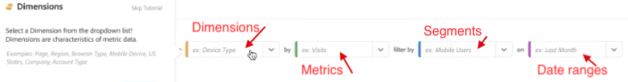

# Deelvenster Snelle inzichten

>[!IMPORTANT]
>
>**[!UICONTROL Quick Insights]** momenteel wordt slechts beperkt getest. [Meer informatie](https://docs.adobe.com/content/help/nl-NL/analytics/landing/an-releases.html)

[!UICONTROL Quick Insights] biedt begeleiding voor niet-analisten en nieuwe gebruikers van [!UICONTROL Analysis Workspace] om te leren hoe u bedrijfsvragen snel en gemakkelijk kunt beantwoorden. Het is ook een geweldig hulpmiddel voor geavanceerde gebruikers die snel een eenvoudige vraag willen beantwoorden zonder zelf een tabel te hoeven maken.

Wanneer u dit voor het eerst gaat gebruiken, vraagt u zich misschien af welke visualisaties het nuttigst zouden zijn, welke dimensies en metriek inzichten zouden kunnen vergemakkelijken, waar te om punten te slepen en te laten vallen, waar te om een segment tot stand te brengen, etc. [!UICONTROL Analysis Workspace]

Om met dit te helpen, en gebaseerd op het gebruik van uw eigen bedrijf van gegevenscomponenten in [!UICONTROL Analysis Workspace], [!UICONTROL Quick Insights] hefboomwerkingen een algoritme dat u met de populairste dimensies, metriek, segmenten, en datumwaaiers zal voorstellen uw bedrijf gebruikt. In feite zult u afmetingen, metriek, en segmenten zien die zoals [!UICONTROL Popular] in de drop-down lijst worden geëtiketteerd, zoals hier getoond:

[!UICONTROL Quick Insights] helpt u

* U moet op de juiste wijze een datatabel en een bijbehorende visualisatie maken in [!UICONTROL Analysis Workspace].
* Leer de terminologie en woordenschat voor basiscomponenten en stukken van [!UICONTROL Analysis Workspace].
* Voer eenvoudige dimensies uit, voeg meerdere metriek toe of vergelijk segmenten eenvoudig binnen een [!UICONTROL Freeform table]afbeelding.
* U kunt verschillende visualisatietypen wijzigen of uitproberen om snel en intuïtief het zoekgereedschap voor uw analyse te vinden.

## Basistoets

Hier volgen enkele basistermen die u bekend moet maken. Elke gegevenslijst bestaat uit 2 of meer bouwstenen (componenten) die u gebruikt om uw gegevensverhaal te vertellen.

| Bouwsteen (component) | Definitie |
|---|---|
| [!UICONTROL Dimension] | Dimensies zijn beschrijvingen of kenmerken van metrische gegevens die in een project kunnen worden bekeken, uitgesplitst en vergeleken. Het zijn niet-numerieke waarden en datums die worden opgesplitst in dimensie-items. Bijvoorbeeld &#39;browser&#39; of &#39;pagina&#39; zijn afmetingen. |
| [!UICONTROL Dimension item] | Dimensie-items zijn afzonderlijke waarden voor een dimensie. Dimensie-items voor de afmetingen van de browser zijn bijvoorbeeld &quot;Chrome&quot;, &quot;Firefox&quot;, &quot;Edge&quot;, enzovoort. |
| [!UICONTROL Metric] | De metriek zijn kwantitatieve informatie over bezoekersactiviteit, zoals meningen, klik-door, herladingen, gemiddelde bestede tijd, eenheden, orden, opbrengst, etc. |
| [!UICONTROL Visualization] | De werkruimte biedt [een aantal visualisaties](/help/analyze/analysis-workspace/visualizations/freeform-analysis-visualizations.md) om visuele vertegenwoordiging van uw gegevens, zoals bar grafieken, donut grafieken, histogrammen, lijngrafieken, kaarten, scatterpercelen, en anderen te bouwen. |
| [!UICONTROL Dimension Breakdown] | Een afbraak van dimensies is een manier om een dimensie letterlijk op andere dimensies in te delen. In ons voorbeeld kunt u de VS-staten opsplitsen op mobiele apparaten om de bezoeken aan mobiele apparaten per status op te halen, of u kunt mobiele apparaten opsplitsen op typen mobiele apparaten, op regio&#39;s, op interne campagnes, enz. |
| [!UICONTROL Segment] | Met segmenten kunt u subsets van bezoekers identificeren op basis van kenmerken of interacties van websites. U kunt bijvoorbeeld op kenmerken gebaseerde [!UICONTROL Visitor] segmenten maken: browsertype, apparaat, aantal bezoeken, land, geslacht of op basis van interacties: campagnes, sleutelwoordonderzoek, onderzoeksmotor, of gebaseerd op uitgang en ingangen: bezoekers van Facebook, een gedefinieerde bestemmingspagina, een verwijzend domein of gebaseerd op aangepaste variabelen: formulierveld, gedefinieerde categorieën, klant-id. |

## Aan de slag met Quick Insights

1. Meld u aan bij Adobe Analytics met de aanmeldingsgegevens die u hebt ontvangen.
1. Ga naar [!UICONTROL Workspace] en klik **[!UICONTROL Create New Project]** en klik vervolgens **[!UICONTROL Quick Insights]**. (U kunt dit deelvenster ook openen via het **[!UICONTROL Panel]** menu in de linkertrack.)

   

   

1. Wanneer u begint, doorloopt u de korte zelfstudie die u een aantal van de [!UICONTROL Quick Insights panel] basisbeginselen leert. Of klik om te **[!UICONTROL Skip Tutorial]**.
1. Selecteer uw bouwstenen (ook wel componenten genoemd): afmetingen (oranje), metriek (groen), segmenten (blauw), of datumwaaiers (paars) U moet minstens één afmeting en één metrisch selecteren voor een lijst die automatisch moet worden gebouwd.

   

   U kunt de bouwstenen op drie manieren selecteren:
   * Sleep en zet ze neer vanaf de linkerspoorstaaf.
   * Als u weet wat u zoekt: Begin te typen en vul de spaties voor u in. [!UICONTROL Quick Insights]
   * Klik op de vervolgkeuzelijst en zoek in de lijst.

1. Wanneer u minstens één afmeting en één metrisch hebt toegevoegd, zal het volgende voor u worden gecreeerd:

   * Een tabel met vrije vorm met de afmetingen (hier, Amerikaanse staten) verticaal en de metrische waarde (hier, Visit) horizontaal boven. Bekijk deze tabel:
   

   * Een bijbehorende visualisatie, in dit geval een [staafdiagram](/help/analyze/analysis-workspace/visualizations/bar.md). De gegenereerde visualisatie is gebaseerd op het type gegevens dat u aan de tabel hebt toegevoegd. Op tijd gebaseerde gegevens (zoals [!UICONTROL Visits] per dag/maand) worden standaard omgezet in een [!UICONTROL Line] grafiek. Alle niet-op tijd gebaseerde gegevens (zoals [!UICONTROL Visits] per [!UICONTROL Device]) worden standaard in een [!UICONTROL Bar] grafiek weergegeven. U kunt het type visualisatie wijzigen door op de vervolgkeuzepijl naast het visualisatietype te klikken.

1. (Optioneel) U kunt de dimensies uitvouwen en elementen van de dimensie bekijken door op de pijl-rechts naast de dimensie te klikken.

1. Voeg meer verfijningen toe zoals hieronder beschreven onder &quot;Meer tips.&quot;

1. Sla uw project op door op **[!UICONTROL Project > Save]** te klikken.

## Meer tips

Er verschijnen andere handige tips in de [!UICONTROL Quick Insights Builder]afbeelding, waarvan sommige afhankelijk zijn van de laatste handeling.

* Voltooi eerst de **[!UICONTROL More tips]** zelfstudie: Via de Help (?) naast de [!UICONTROL Quick Insights] titel. Dit leerprogramma toont omhoog 24 uren nadat u een project met minstens één afmeting en één metrisch hebt gecreeerd.

   

* **Uitsplitsing naar**: U kunt tot 3 niveaus van onderverdelingen op dimensies gebruiken om neer tot de gegevens te boren u echt nodig hebt.

   

* **Meer metriek** toevoegen: U kunt tot 2 meer metriek toevoegen door te gebruiken EN exploitant om hen toe te voegen de lijst.

   

* **Meer segmenten** toevoegen: U kunt maximaal twee segmenten toevoegen door de operatoren AND of OR te gebruiken om ze aan de tabel toe te voegen. Kijk wat er met de tabel gebeurt wanneer u mobiele gebruikers OF koninklijke bezoekers toevoegt. Ze zijn naast elkaar, boven de metriek. Als u Mobiele Gebruikers EN Weergavebezoekers toevoegt, ziet u de resultaten van beide segmenten samen en worden deze op elkaar gestapeld in de tabel.

   

## Bekende beperkingen

Als u probeert rechtstreeks in de tabel te bewerken, is het [!UICONTROL Quick Insights] deelvenster niet meer synchroon. U kunt de vorige [!UICONTROL Quick Insights] **[!UICONTROL Resync Builder]** instellingen herstellen door rechtsboven in het deelvenster te klikken.

Er verschijnt een waarschuwing voordat u iets rechtstreeks aan de tabel toevoegt:

Anders, zal het bouwen direct de lijst ertoe brengen om zich nu als traditionele lijst van de Vrije vorm te gedragen, zonder de nuttige eigenschappen voor nieuwe gebruikers.

