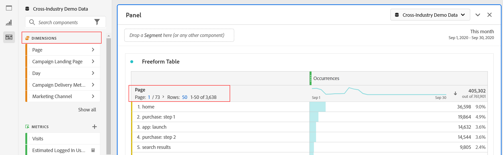

# Overzicht van componenten

Componenten zijn functies in Adobe Analytics die kunnen worden gebruikt in visualisaties (zoals een tabel in Freeform) of als aanvulling op rapportagefuncties.

Componenten beheren vanuit de Adobe Analytics-hoofdinterface:

1. Selecteer **[!UICONTROL Components]** in de bovenste balk.
1. Selecteer **[!UICONTROL Components]** om een overzicht te zien van de componenten die u kunt beheren of selecteer rechtstreeks de component die u wilt beheren in het menu.

U kunt de volgende componenten beheren:

* [ Segmenten ](/help/components/segmentation/seg-home.md): Bouw, beheer, deel, en pas krachtige, geconcentreerde publiekssegmenten op uw rapporten toe. Met segmenten kunt u subsets van personen identificeren op basis van kenmerken of interacties.
* [ Berekende metriek ](/help/components/c-calcmetrics/cm-overview.md): De metriek en de formules van het gebruik als nieuwe componenten voor gebruik in het melden
* [ waaiers van de Datum ](calendar-date-ranges/custom-date-ranges.md): Pas en verfijn de aanbiedingen van de datumwaaiers Analysis Workspace aan.
* [ Geplande projecten ](../curate-share/t-schedule-report.md): Beheer uw geplande projecten.
* [ Plaatsen ](../../../components/locations/locations-manager.md): beheer de plaatsen om uw projecten naar uit te voeren.
* [ Alarm ](/help/components/c-alerts/intellligent-alerts.md): Toestaan u om op veranderde percentages of specifieke gegevenspunten worden op de hoogte gebracht.
* [ Annotaties ](annotations/overview.md): Communiceer contextuele gegevensnuances en inzichten aan uw organisatie.
* [ Voorkeur ](/help/analyze/analysis-workspace/user-preferences.md): Beheer de voorkeur voor Analysis Workspace.

## Analysis Workspace-componenten

Componenten in Analysis Workspace bestaan uit metriek, afmetingen, segmenten en datumbereiken die u naar deelvensters en visualisaties in uw Workspace-project kunt slepen en neerzetten. Aangepaste componenten die u maakt, worden aan deze deelvensters toegevoegd, zoals een berekende metrische waarde of een aangepast datumbereik.

Om tot het paneel van Componenten toegang te hebben, selecteer  **[!UICONTROL Components]** in het knooppaneel.

Zie [ tot een project ](/help/analyze/analysis-workspace/home.md) voor informatie over hoe te om componenten in een project te gebruiken.

## Componenten beheren {#actions}

U kunt snel een nieuwe component maken met het menu **[!UICONTROL Components]** in Analysis Workspace. Zie het [ menu van Analysis Workspace ](/help/analyze/analysis-workspace/home.md#menu) voor meer details.

U kunt componenten beheren (afzonderlijk of door meerdere componenten te selecteren).

1. Selecteer een of meer componenten.

1. Van het contextmenu, of van de  knoop van de Acties van de Component (bij de bovenkant van Componenten), selecteer één van de volgende acties.

   >[!TIP]
   >
   >U kunt meerdere componenten selecteren door **[!UICONTROL Shift]** ingedrukt te houden of door **[!UICONTROL Command]** (in macOS) of **[!UICONTROL Ctrl]** (in Windows) ingedrukt te houden.

   

   | Component, actie | Beschrijving |
   |--- |--- |
   |  [!UICONTROL **Markering**] | U kunt componenten ordenen of beheren door er tags op toe te passen. U kunt dan door markering in het linkerpaneel zoeken door de  of het typen `#` te selecteren. Tags fungeren ook als filters in de componentmanagers. |
   |  [!UICONTROL **Favoriet**] | Voeg de component toe aan de lijst met favorieten. Net als tags kunt u zoeken op Favorieten in het linkerdeelvenster en door hen filteren in de componentmanagers. |
   |  **[!UICONTROL Un-favorite]** | Verwijder de component uit de lijst met favorieten. |
   |  [!UICONTROL **goedkeuren**] | Markeer componenten zoals Goedgekeurd om aan uw gebruikers te laten weten dat de component door de organisatie is goedgekeurd. Net als tags kunt u zoeken en filteren op Goedgekeurd in het linkerdeelvenster. A  identificeert goedgekeurde componenten. |
   |  [!UICONTROL **Aandeel**] | Delen van componenten naar gebruikers in uw organisatie. Deze optie is alleen beschikbaar voor aangepaste componenten, zoals segmenten of berekende maateenheden. |
   |  [!UICONTROL **Schrapping**] | Verwijder componenten die u niet meer nodig hebt. Deze optie is alleen beschikbaar voor aangepaste componenten, zoals segmenten of berekende maateenheden. |

De componenten van de douane kunnen ook door hun respectieve managers van de Component worden beheerd. Bijvoorbeeld, zie [ segmenten ](/help/components/segmentation/segmentation-workflow/seg-manage.md) beheren.

## De componentenlijst beheren

U kunt de lijst met componenten in het linkerdeelvenster van Analysis Workspace zoeken, filteren en sorteren om een bepaalde component te zoeken.

### Zoeken

1. Selecteer **het pictogram van Componenten**  in het linkerpaneel.

2. Typ in het zoekveld de naam van de component die u in het project wilt gebruiken.

   Een kleur en pictogram geven het type component aan. **het pictogram van Afmetingen** Dimension  Segmenten **&#x200B;**&#x200B;het pictogram van het Segment  de waaiers van de Datum **&#x200B;**&#x200B;het de waaierpictogram van de Datum is paars, en  **Metrisch pictogram** is groen.  het pictogram van Adobe  wijst of op een berekend metrisch malplaatje of een segmentmalplaatje. Het calculatorpictogram  wijst op berekende metrisch dat een beheerder in uw organisatie heeft gecreeerd.

3. Selecteer de component in het keuzemenu.

### Filter

1. Selecteer het **pictogram van Componenten** pictogram van Componenten  in het linkerpaneel.

2. Selecteer **&#x200B;**&#x200B;het pictogram van de Filter van het Woordenboek van de Filter van de Filter 1&rbrace; Filter  op het onderzoeksgebied in.`#`

3. Selecteer een van de volgende filteropties om de lijst met componenten te filteren:

   | Pictogram | Filter, optie | Beschrijving |
   |---------|---|----------|
   |  | **[!UICONTROL Approved]** | Alleen componenten tonen die zijn gemarkeerd als goedgekeurd door een beheerder. |
   |  | **[!UICONTROL Favorites]** | Alleen componenten tonen die zich in de lijst Favorieten bevinden.   voor informatie over het toevoegen van componenten aan uw lijst van favorieten, zie [ componenten ](#manage-components) leiden. |
   |  | **[!UICONTROL Dimensions]** | Alleen componenten weergeven die afmetingen hebben. |
   |  | **[!UICONTROL Metrics]** | Alleen componenten weergeven die Metrisch zijn. |
   |  | **[!UICONTROL Segments]** | Alleen componenten weergeven die segmenten zijn. |
   |  | **[!UICONTROL Date ranges]** | Alleen componenten tonen die Datumbereiken zijn. |
   |  | **[!UICONTROL *naam van de Markering *]** | Alleen componenten met de specifieke geselecteerde labels weergeven. Een specifieke markering is beschikbaar voor het Malplaatje van Adobe die de [ gebrek berekende metriek ](/help/components/c-calcmetrics/cm-reference/default-calcmetrics.md) van Adobe zijn. |

   Selecteer  in een filter om de filter te verwijderen.

4. U kunt naar keuze de componentenlijst sorteren, zoals die in [ wordt beschreven Soort de componentenlijst ](#sort-the-component-list).

### Sorteren

<!-- {{release-limited-testing-section}}-->

1. (Facultatief) pas om het even welke filters op de componentenlijst toe, zoals die in [ wordt beschreven Filter de componentenlijst ](#filter-the-component-list).

2. Selecteer **het pictogram van Componenten**  in het linkerpaneel.

3. Selecteer **&#x200B;**&#x200B;de componentenpictogram van de Soort van de Soort , dan om het even welke volgende filteropties om de lijst van componenten te sorteren.

De volgende sorteeropties zijn beschikbaar:

{{components-sort-options}}

## Toegangsmachtigingen

In Analysis Workspace, kunnen de beheerders [&#128279;](/help/analyze/analysis-workspace/curate-share/curate.md) leiden die de componenten aan gebruikers in het melden worden blootgesteld.

<!--
# Components overview

Components in Analysis Workspace consist of dimensions, metrics, segments, and date ranges that you can drag-and-drop onto a project. 

To access the Components menu, click the **[!UICONTROL Components]** icon in the left rail. You can switch among [panels](https://experienceleague.adobe.com/docs/analytics/analyze/analysis-workspace/panels/panels.html?lang=nl-NL), [visualizations](https://experienceleague.adobe.com/docs/analytics/analyze/analysis-workspace/visualizations/freeform-analysis-visualizations.html?lang=nl-NL), and components from the left rail icons or by using [hotkeys](/help/analyze/analysis-workspace/build-workspace-project/fa-shortcut-keys.md).

You can also adjust the [View density settings](https://experienceleague.adobe.com/docs/analytics/analyze/analysis-workspace/build-workspace-project/view-density.html?lang=nl-NL) for the project to see more values in the left rail at once by going to **[!UICONTROL Project > Project Info & Settings > View Density]**.

## Dimensions {#dimensions}

[**Dimensions**](https://experienceleague.adobe.com/docs/analytics/components/dimensions/overview.html?lang=nl-NL) are text attributes that describe your visitor behavior and can be viewed, broken down, and compared in your analysis. They can be found in the left Component rail (orange section) and are typically applied as rows of a table. 

Examples of dimensions include [!UICONTROL Page Name], [!UICONTROL Marketing Channels], [!UICONTROL Device Type], and [!UICONTROL Products]. Dimensions are provided by Adobe and are captured through your custom implementation (eVar, Props, classifications, etc).

Each dimension also contains **dimension items** within it. Dimension items can be found in the left Component rail by clicking the right-arrow next to any dimension name (items are yellow).

Examples of dimension items include [!UICONTROL Homepage] (within the [!UICONTROL Page] dimension), [!UICONTROL Paid Search] (within the [!UICONTROL Marketing Channel] dimension), [!UICONTROL Tablet] (within the [!UICONTROL Mobile Device Type] dimension), and so on.

## Metrics {#metrics}

[**Metrics**](https://experienceleague.adobe.com/docs/analytics/components/metrics/overview.html?lang=nl-NL) are quantitative measures about visitor behavior. They can be found in the left Component rail (green section) and are typically applied as columns of a table.

Examples of metrics include [!UICONTROL Page views], [!UICONTROL Visits], [!UICONTROL Orders], [!UICONTROL Average Time spent], and [!UICONTROL Revenue/Order]. Metrics are provided by Adobe, or captured through your custom implementation ([!UICONTROL Success events]), or created using the [Calculated metric builder](https://experienceleague.adobe.com/docs/analytics/components/calculated-metrics/calcmetric-workflow/cm-build-metrics.html?lang=nl-NL).

## Segments {#segments}

[**Segments**](https://experienceleague.adobe.com/docs/analytics/analyze/analysis-workspace/components/segments/t-freeform-project-segment.html?lang=nl-NL) are audience filters that are applied to your analysis. They can be found in the left Component rail (blue section) and are typically applied at the top of a panel or above metric columns in a table. 

Examples of segments include [!UICONTROL Mobile Device Visitors], [!UICONTROL Visits from Email], and [!UICONTROL Authenticated Hits]. Segments are provided by Adobe, or created in the [panel dropzone](https://experienceleague.adobe.com/docs/analytics/analyze/analysis-workspace/panels/panels.html?lang=nl-NL), or created using the [Segment builder](https://experienceleague.adobe.com/docs/analytics/components/segmentation/segmentation-workflow/seg-build.html?lang=nl-NL).

## Date Ranges {#date-ranges}

[**Date Ranges**](https://experienceleague.adobe.com/docs/analytics/analyze/analysis-workspace/components/calendar-date-ranges/calendar.html?lang=nl-NL) are the range of dates you conduct your analysis across. They can be found in the left Component rail (purple section) and are typically applied in the calendar of each panel.

You can make the date range components relative to the panel calendar. For additional information, see [About relative panel date ranges](/help/analyze/analysis-workspace/components/calendar-date-ranges/calendar.md#relative-panel-dates).

Examples of date ranges include July 2019, [!UICONTROL Last 4 weeks], and [!UICONTROL This month]. Date ranges are provided by Adobe, applied in the [panel calendar](https://experienceleague.adobe.com/docs/analytics/analyze/analysis-workspace/panels/panels.html?lang=nl-NL), or created using the [Date range builder](https://experienceleague.adobe.com/docs/analytics/analyze/analysis-workspace/components/calendar-date-ranges/custom-date-ranges.html?lang=nl-NL).

## Manage components {#actions}

You can manage components directly in the left rail. 

1. Right-click a component.

   Or
   
   Select a component, then select the **Action** (3-dot) icon at the top of the component list.

   >[!TIP]
   >
   >   You can select multiple components by holding Shift, or by holding Command (on Mac) or Ctrl (on Windows).

   

   | Component action | Description |
   |--- |--- |
   | [!UICONTROL **Tag**] | Organize or manage components by applying tags to them. You can then search by tag in the left rail by clicking the filter or typing #. Tags also act as filters in the component managers. |
   | [!UICONTROL **Favorite**] | Add the component to your list of favorites. Like tags, you can search by Favorites in the left rail and filter by them in the component managers. |
   | [!UICONTROL **Approve**] | Mark components as Approved to signal to your users that the component is organization-approved. Like tags, you can search by Approved in the left rail and filter by them in the component managers. |
   | [!UICONTROL **Share**] | Share components to users in your organization. This option is available for custom components only, such as segments or calculated metrics. |
   | [!UICONTROL **Delete**] | Delete components that you no longer need. This option is available for custom components only, such as segments or calculated metrics. |

Custom components can also be managed through their respective Component managers. For example, the [Segment Manager](/help/components/segmentation/segmentation-workflow/seg-manage.md).

## Search, filter, and sort the component list

You can search, filter, and sort the component list in the left rail of Analysis Workspace to quickly locate a particular component. 

### Search the component list

1. Select the **Components** icon  in the left rail.

2. In the search field, begin typing the name of the component you want to use in your project.

   The type of component can be identified by both color and icon. **Dimensions**  are orange, **Segments**  are blue, **Date ranges**  are purple, and **Metrics**  are green. The Adobe icon indicates either a calculated metric template or a segment template, and the calculator icon  indicated a calculated metric that was created by an Analytics administrator in your organization. 

3. Select the component when it appears in the drop-down list.

### Filter the component list

1. Select the **Components** icon  in the left rail.

2. Select the **Filter** icon .

   Or

   Type the pound sign (#) in the search field.

3. Select any of the following filter options to filter the list of components:

   |Option | Function |
   |---------|----------|
   | [!UICONTROL **Approved**] | Show only components that are marked as Approved by an administrator. |
   | [!UICONTROL **Favorites**] | Show only components that are in your list of Favorites. For information about adding components to your list of favorites, see [Components overview](/help/analyze/analysis-workspace/components/analysis-workspace-components.md). |
   | [!UICONTROL **Dimensions**] | Show only components that are Dimensions. |
   | [!UICONTROL **Metrics**] | Show only components that are Metrics. |
   | [!UICONTROL **Segments**] | Show only components that are Segments.  |
   | [!UICONTROL **Date ranges**] | Show only components that are Date Ranges. |
   | [!UICONTROL **Show all**] | Show all components. This option is available only for administrators. |
   | [!UICONTROL **Unapproved**] | Show only components that are not yet marked as Approved by an administrator. As an administrator, this is helpful when identifying components that require your review and approval. This option is available only for administrators. |

4. (Optional) To further hone the list, you can sort the component list, as described in [Sort the component list](#sort-the-component-list).

### Sort the component list

1. (Optional) Apply any filters to the component list, as described in [Filter the component list](#filter-the-component-list).

2. Select the **Components** icon  in the left rail.

3. Select the **Sort** icon , then select any of the following filter options to sort the list of components:

   {{components-sort-options}}

-->