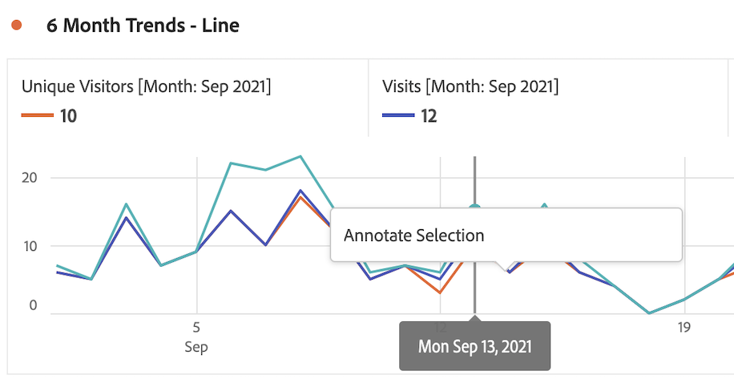
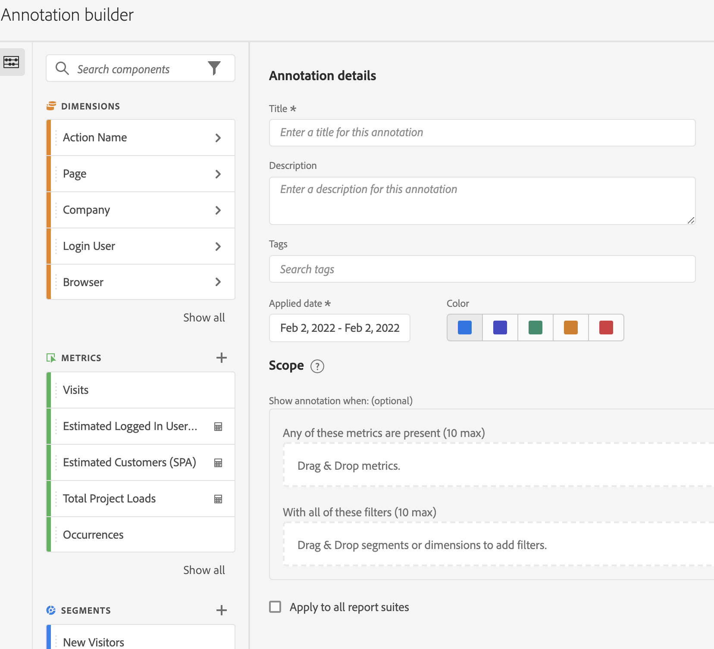

# Annotaties maken

1. U kunt op verschillende manieren annotaties maken:

| Aanmaakmethode | Details |
| --- | --- |
| **Ga naar [!UICONTROL Analytics] > [!UICONTROL Components] > [!UICONTROL Annotation].** | De pagina Annotatiebeheer wordt geopend. Klikken [!UICONTROL Create New Annotation] en de [!UICONTROL Annotation builder] wordt geopend. |
| **Klik met de rechtermuisknop op een punt in een tabel.** | [!UICONTROL The Annotation builder] wordt geopend. Merk op dat, door gebrek, de aantekeningen die op deze manier worden gecreeerd slechts in het project zichtbaar zijn waar zij werden gecreeerd. Maar u kunt ze beschikbaar maken voor alle projecten. U ziet ook dat de datum/data en metrische gegevens, enz. al zijn ingevuld.
 |
| **Klik met de rechtermuisknop op een punt in een [!UICONTROL Line] grafiek.** | De [!UICONTROL Annotation builder] wordt geopend. Merk op dat, door gebrek, de aantekeningen die op deze manier worden gecreeerd slechts in het project zichtbaar zijn waar zij werden gecreeerd. Maar u kunt ze beschikbaar maken voor alle projecten. U ziet ook dat de datum/data en metrische gegevens, enz. al zijn ingevuld.
 |
| **Ga in Workspace naar [!UICONTROL Components] > [!UICONTROL Create annotation].** | De [!UICONTROL Annotation builder] wordt geopend. |
| **Deze hotkey gebruiken** om de aannemer van de Annotatie te openen: (PC) `ctrl` `shift` + o, (Mac) `shift` + `command` + o | Houd er rekening mee dat u met de sneltoets een annotatie maakt voor de huidige datum zonder dat er een bereik (afmetingen of metriek) is geselecteerd. |

1. Vul de [!UICONTROL Annotation builder] elementen.

   

   | Element | Beschrijving |
   | --- | --- |
   | [!UICONTROL Project-only Annotation] | Standaard wordt de annotatie toegepast op het huidige project. Als u dit selectievakje inschakelt, kunt u de annotatie beschikbaar stellen voor alle projecten die u bezit.
  |
   | [!UICONTROL Title] | Geef de annotatie een naam, bijvoorbeeld &quot;Herdenkingsdag&quot; |
   | [!UICONTROL Description] | (Optioneel) Geef een beschrijving van de annotatie, bijvoorbeeld &quot;Publieke vakantie waargenomen in de VS&quot;. |
   | [!UICONTROL Tags] | (Optioneel) Organiseer annotaties door een tag te maken of toe te passen. |
   | [!UICONTROL Applied date] | Selecteer de datum of het datumbereik dat aanwezig moet zijn om de annotatie zichtbaar te maken. |
   | [!UICONTROL Color] | Pas een kleur toe op de annotatie. De annotatie wordt in het project weergegeven met de geselecteerde kleur. De kleur kan worden gebruikt om annotaties te categoriseren, zoals feestdagen, externe gebeurtenissen, problemen bij het bijhouden van wijzigingen, enzovoort. |
   | [!UICONTROL Scope] | (Optioneel) Sleep de metriek die de annotatie activeert en zet deze neer. Vervolgens sleept u alle afmetingen of segmenten die als filters fungeren (zodat de annotatie zichtbaar is). Als u geen bereik opgeeft, wordt de annotatie toegepast op al uw gegevens.<ul><li>**[!UICONTROL Any of these metrics are present]**: Sleep en zet tot 10 metriek neer die de annotatie zal teweegbrengen om te tonen.</li><li>**[!UICONTROL With all of these filters]**: Sleep tot 10 dimensies of segmenten die worden gefilterd wanneer de annotatie wordt weergegeven.</li></ul>
Gebruik hoofdletters/kleine letters: Een eVar is gestopt met het verzamelen van gegevens voor een specifiek datumbereik. Sleep de eVar naar de **[!UICONTROL Any of these metrics are present]** . Of uw [!UICONTROL Visits] metrisch rapporteert geen gegevens - volg het zelfde proces.
**Opmerking:** Elke annotatie die wordt toegepast op een component die vervolgens wordt gebruikt als onderdeel van een berekende definitie van metrisch object of segment, neemt de annotatie NIET automatisch over. De gewenste berekende metrisch moet ook aan de werkingsgebiedsectie worden toegevoegd om de aantekening te tonen. Er moet echter een nieuwe annotatie worden gemaakt voor elk segment dat u met dezelfde informatie wilt annoteren.
Voorbeeld: U past een aantekening toe op [!UICONTROL Orders] op een bepaalde dag. Vervolgens gebruikt u [!UICONTROL Orders] in een berekende metrische waarde voor hetzelfde datumbereik. De nieuwe berekende metrische waarde zal niet automatisch de aantekening voor orden tonen; de berekende metrische waarde moet ook aan de bereiksectie worden toegevoegd om de aantekening te tonen. |
   | [!UICONTROL Apply to all report suites] | Standaard wordt de annotatie toegepast op de oorspronkelijke rapportsuite. Als u dit selectievakje inschakelt, kunt u de annotatie toepassen op alle rapportsuites in het bedrijf. |

   {style=&quot;table-layout:auto&quot;}

1. Klik op **[!UICONTROL Save]**.
