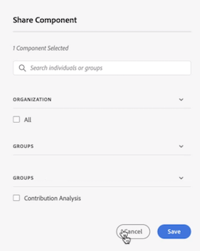

# Annotaties beheren

>[!NOTE]
>
>Deze functie is momenteel in beperkte tests.

De [!UICONTROL Components] > [!UICONTROL Annotations] de manager biedt vele manieren aan om annotaties te beheren, zoals het delen, het filtreren, het etiketteren, het goedkeuren, het kopiëren, het schrappen, en het merken als favorieten.

De [!UICONTROL Annotations] de manager toont u alle annotaties u bezit die aan al uw projecten zijn geweest, en die met u zijn gedeeld.

>[!NOTE]
>
>[!UICONTROL Annotations] dat u slechts voor een specifiek project creeerde verschijnt niet in de manager.

## Gebruikersinterface van Annotatiebeheer

| UI-element | Beschrijving |
| --- | --- | 
| [!UICONTROL Title and Description] | Opgegeven in de Annotations Builder. Als u de titel en beschrijving wilt bewerken, klikt u op de titelkoppeling. Hiermee gaat u terug naar de Annotatiebouwer. |
| [!UICONTROL Report Suite] | De rapportsuite(s) waarop deze aantekening van toepassing is. |
| [!UICONTROL Owner] | Geeft aan wie de annotatie bezit. Als niet-beheerder kunt u alleen annotaties zien die u bezit of die met u hebt gedeeld. |
| [!UICONTROL Applied Date Range] | De datum of het datumbereik waarop deze aantekening van toepassing is. |
| [!UICONTROL Shared with] | Hier wordt weergegeven met hoeveel personen of groepen u de annotatie hebt gedeeld. Klik voor meer details. |
| [!UICONTROL Date Modified] | Geeft de datum en tijd weer waarop de annotatie voor het laatst is gewijzigd. |

## Annotaties bewerken

Het uitgeven van een aantekening betekent dat u datumwaaiers, kleuren, werkingsgebied kunt aanpassen, of al dan niet het op alle rapportsuites of projecten van toepassing is. U kunt annotaties op twee manieren bewerken:

* Houd de aanwijzer boven de annotatie in een lijndiagram en klik op het potloodpictogram in de pop-up.

* In de [!UICONTROL Annotations Manager]klikt u op de titel van de aantekening.

Beide opties laten u terug in de Bouwer van Annotaties. In dat geval kunt u de benodigde aanpassingen aanbrengen en de nieuwe versie opslaan.

## Annotaties delen

1. Selecteer de annotatie(s) die u wilt delen en klik op [!UICONTROL Share].

1. In de [!UICONTROL Share Component] zoeken naar de personen of groepen met wie u de annotaties wilt delen.

1. Onder [!UICONTROL Organization], ....

1. Klik op [!UICONTROL Save].

## Tagannotaties

Ga als volgt te werk

