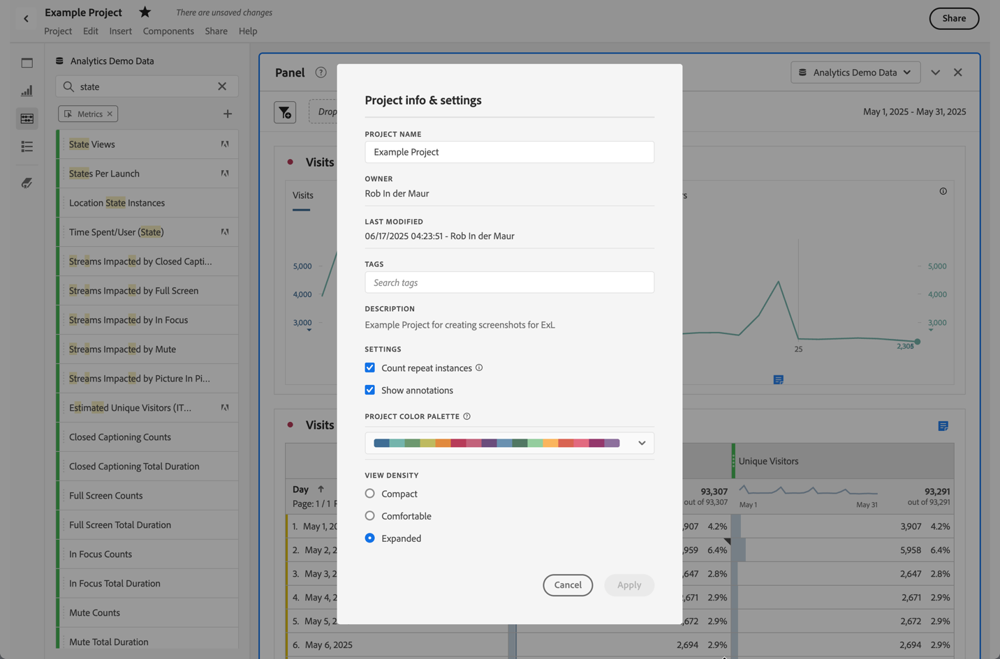

# Overzicht van annotaties

Met annotaties kunt u contextuele gegevensnuances en inzichten effectief doorgeven aan andere belanghebbenden in uw organisatie. Met annotaties kunt u kalendergebeurtenissen koppelen aan specifieke afmetingen en metriek. U kunt een datum- of datumbereik annoteren met bekende gegevensproblemen, feestdagen, startacties voor campagnes, enzovoort. Vervolgens kunt u gebeurtenissen grafisch weergeven en zien of campagnes of andere gebeurtenissen invloed hebben gehad op het verkeer van uw site, het gebruik van mobiele apps, inkomsten of andere metingen.

U deelt bijvoorbeeld projecten met uw organisatie. Als u een merkbare daling in uw unieke bezoekers had, kon u a **Bezoekers creëren die** annotation en werkingsgebied het voor uw volledige rapportreeks verminderen. Wanneer uw gebruikers om het even welke rapportreeks bekijken die die datum omvatte, zien zij de aantekening binnen hun projecten, naast hun gegevens.

Annotaties kunnen worden toegepast op:

* Een enkele datum of een datumbereik.

* Uw volledige dataset of specifieke metriek, afmetingen, of segmenten.

* Het project waarin annotaties worden gemaakt (standaard) of alle projecten.

* De gegevensweergave waarin annotaties worden gemaakt (standaard) of alle gegevensweergaven.

Zie [ Annotaties ](create-annotations.md) voor de diverse beschikbare opties creëren om annotaties tot stand te brengen. U bouwt dan, wijzigt, en bewaart annotaties in de [ aantekenaar van de Annotatie ](create-annotations.md#annotation-builder).

U gebruikt de [ manager van Annotaties ](manage-annotations.md) om annotaties te beheren.

## Annotaties in- of uitschakelen

Annotaties kunnen op verschillende niveaus worden in- of uitgeschakeld:

| Niveau | Procedure... |
|---|---|
| **Visualisatie** | Laat of maak  > **[!UICONTROL Settings]** toe onbruikbaar > **[!UICONTROL Show annotations]**.  toe |
| **Project** | Selecteer in een Workspace-projectmenu **[!UICONTROL Project]** > **[!UICONTROL Project info & settings]** en schakel **[!UICONTROL Show annotations]** in of uit.  toe |
| **Gebruiker** | Selecteer op het tabblad **[!UICONTROL Components]** **[!UICONTROL Preferences]** of in een Workspace-projectmenu de optie **[!UICONTROL Project]** > **[!UICONTROL User preferences]** .   In **[!UICONTROL Preferences]** selecteert u **[!UICONTROL Projects & Analysis]** . Selecteer **[!UICONTROL Data]** in de linkertabbalk. Schakel **[!UICONTROL Show annotations]** onder de kop **[!UICONTROL Freeform table]** in of uit.  toe |

<!--
# Annotations overview

Annotations in Workspace enable you to effectively communicate contextual data nuances and insights to your organization. They let you tie calendar events to specific dimensions/metrics. You can annotate a date or date range with known data issues, public holidays, campaign launches, etc. You can then graphically display events and see whether campaigns or other events have affected your site traffic, revenue, or any other metric.

For example, let's say you are sharing projects with your organization. If you had a major spike in traffic due to a marketing campaign, you could create a "Campaign launch date" annotation and scope it for your whole report suite. When your users view any data sets that included that date, they see the annotation within their projects, alongside their data.

Keep this in mind:

* Annotations can be tied to a single date or to a date range.

* They can apply to your entire data set or to specified metrics, dimensions, or segments.

* They can apply to the project in which they were created (default) or to all projects.

* They can apply to the report suite in which they were created (default) or to all report suites.

## Permissions {#permissions}

By default, only Admins can create annotations. Users have rights to view annotations like they do with other other Analytics components (such as segments, calculated metrics, etc.).

However, Admins can give the [!UICONTROL Annotation Creation] permission (Analytics Tools) to users via the [Adobe Admin Console](https://experienceleague.adobe.com/docs/analytics/admin/admin-console/permissions/analytics-tools.html).

## Turn annotations on or off {#annotations-on-off}

Annotations can be turned on or off at several levels:

* At the Visualization level: [!UICONTROL Visualization] settings > [!UICONTROL Show annotations]

* At the Project level: [!UICONTROL Project info & settings] > [!UICONTROL Show annotations]

* At the User level: [!UICONTROL Components] > [!UICONTROL User preferences] > [!UICONTROL Data] > [!UICONTROL Show annotations]

-->