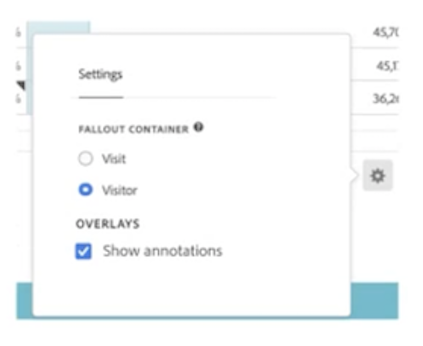

# Overzicht van annotaties

>[!NOTE]
>
>Deze functie is momenteel in beperkte tests.

Met annotaties kunt u op effectieve wijze contextuele gegevensnuances en inzichten aan uw organisatie meedelen. Met deze sjablonen kunt u kalendergebeurtenissen koppelen aan specifieke afmetingen/metriek. U kunt een datum- of datumbereik annoteren met bekende gegevensproblemen, feestdagen, startacties voor campagnes, enzovoort. U kunt gebeurtenissen dan grafisch tonen en zien of de campagnes of andere gebeurtenissen uw plaatsverkeer, opbrengst, of een andere metrisch hebben beïnvloed.

Bijvoorbeeld, laten wij zeggen u projecten deelt u met uw organisatie creeerde. U merkt een dip of een piek in verkeer of andere gegevens, en u bindt een aantekening aan de beïnvloede metriek, dimensies of segmenten. Deze annotaties verschijnen dan in een lijst of een lijnvisualisatie en verstrekken gegevenscontext voor u en de consumenten van uw projecten van de Werkruimte.

Houd dit in gedachten:

* Annotaties kunnen worden gekoppeld aan één datum of aan een datumbereik.

* Ze kunnen worden toegepast op de gehele gegevensset of op opgegeven metriek, afmetingen of segmenten.

* Zij kunnen op het project van toepassing zijn waarin zij (gebrek) werden gecreeerd of op alle projecten.

* Zij kunnen op de rapportreeks van toepassing zijn waarin zij (gebrek) werden gecreeerd of op alle rapportsuites.

## Toestemmingen

Standaard kunnen alleen beheerders annotaties maken. Gebruikers hebben rechten om annotaties weer te geven zoals ze doen met andere onderdelen van Analytics (zoals segmenten, berekende metriek, enz.).

Beheerders kunnen echter de opdracht [!UICONTROL Annotation Creation] toestemming (Analytics Tools) aan gebruikers via [Adobe Admin Console](https://experienceleague.adobe.com/docs/analytics/admin/admin-console/permissions/analytics-tools.html?lang=en).

## Annotaties in- of uitschakelen

Annotaties kunnen op verschillende niveaus worden in- of uitgeschakeld:

* Op visualisatieniveau: [!UICONTROL Visualization] instellingen > [!UICONTROL Show annotations]

* Op projectniveau: [!UICONTROL Project info & settings] > [!UICONTROL Show annotations]

* Op gebruikersniveau: [!UICONTROL Components] > [!UICONTROL User preferences] > [!UICONTROL Data] > [!UICONTROL Show annotations]

