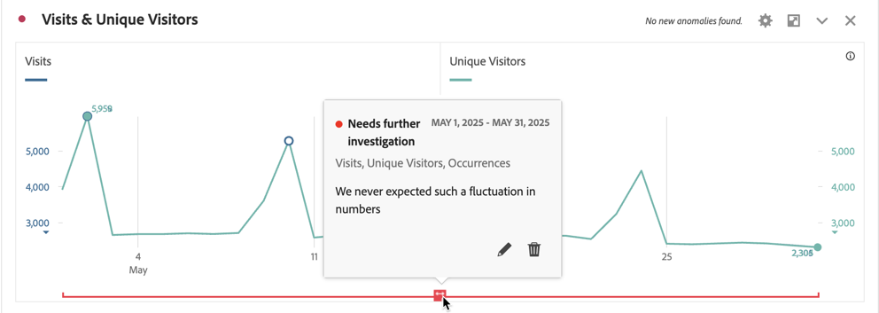
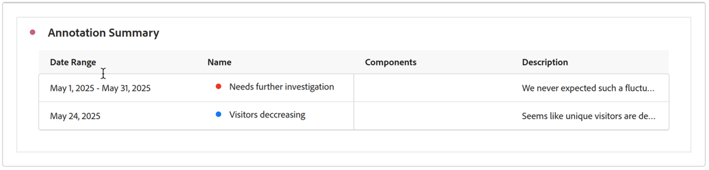

# Annotaties weergeven

Annotaties worden iets anders weergegeven, afhankelijk van de locatie waar ze worden weergegeven en van het feit of ze één dag of een datumbereik beslaan.

## Annotaties weergeven in Workspace

| Visualisatie   Type | Beschrijving |
| --- | --- |
| **Lijn &#x200B;** **Enige dag** | Wanneer u  in een lijnvisualisatie selecteert annoteert, ziet u popup met de annotatiedetails.   om de annotatie in de [&#x200B; Bouwer van de Annotatie uit te geven &#x200B;](create-annotations.md#annotation-builder) uitgezocht uitgeeft . Om de annotatie te schrappen, uitgezochte . |
| **waaier van de Lijn &#x200B;** **Datum** | Wanneer u  selecteert ziet u popup met de annotatiedetails en een lijn bij de bodem die op de datumwaaier wijzen.  om de annotatie in de [&#x200B; Bouwer van de Annotatie uit te geven &#x200B;](create-annotations.md#annotation-builder) uitgezocht uitgeeft . Om de annotatie te schrappen, uitgezochte . |
| **Vrije-vormentabel** | In een tabel met vrije vorm hebt u toegang tot alle annotaties via de knop Annotaties rechtsboven in de visualisatie. Selecteer  om a (het scrollen lijst) van alle annotaties te zien.   voor elke annotatie, kunt u  om de annotatie in de [&#x200B; Bouwer van de Annotatie &#x200B;](create-annotations.md#annotation-builder) uit te geven en  om de annotatie te schrappen. |

{style="table-layout:auto"}

## Annotaties weergeven in een PDF

Wanneer u uw project downloadt als een PDF of uw project verzendt als een PDF, worden annotaties in PDF samengevat in het overzichtsgedeelte Annotatie.

<!--
# View annotations

Annotations manifest slightly differently, depending on whether they span a single day or a date range.

## View annotations in Line charts or Tables

| Date | Appearance |
| --- | --- |
| **Single day** |   
When you hover over the annotation, you can see its details, you can edit it by selecting the pen icon, or you can delete it:
  |
| **Date range** |  The icon changes and when you hover over it, the date range appears.

When you select it in the line chart, the annotation metadata appear, and you can edit or delete it:
In a table, an icon appears on every date in the date range.
|
| **Overlapping annotations** | On days that have more than one annotation tied to them, the icon appears in a grey color.

When you hover over the grey icon, all overlapping annotations appear:
 |

{style="table-layout:auto"}

## View annotations in a .pdf file

Since you cannot hover over icons in a .pdf file, this file (after export) provides notes of explanations at the bottom of a panel. Here is an example:

## View annotations with non-trended data

Sometimes annotation are shown with non-trended data, but tied to a specific dimension. In that case, they appear only in a summary annotation in the bottom right corner. Here is an example:

The summary chart appears in all visualization types in the corner, not just in non-trended freeform tables and summary numbers. It also appears in visualizations like [!UICONTROL Donut], [!UICONTROL Flow],[!UICONTROL Fallout],[!UICONTROL Cohort], and so on.

-->