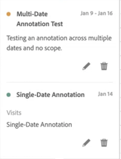
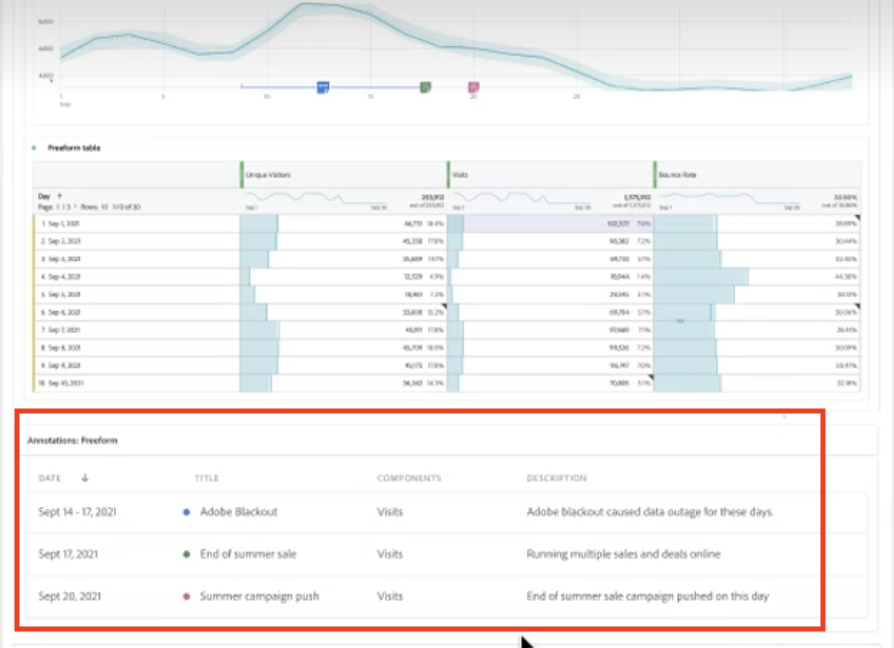

# Annotaties weergeven

>[!NOTE]
>
>Deze functie is momenteel in beperkte tests.

Annotaties worden iets anders weergegeven, afhankelijk van het feit of ze één dag of een datumbereik beslaan.

## Annotaties weergeven in lijngrafieken of tabellen

| Datum | Weergave |
| --- | --- |
| **Eén dag** | 
Wanneer u de aanwijzer boven de annotatie houdt, kunt u de details van de annotatie bekijken. U kunt deze bewerken door het penpictogram te selecteren of door de annotatie te verwijderen:
  |
| **Datumbereik** | Het pictogram verandert en wanneer u de muisaanwijzer op het pictogram plaatst, wordt het datumbereik weergegeven.

Wanneer u deze optie selecteert in het lijndiagram, worden de metagegevens van de annotatie weergegeven en kunt u deze bewerken of verwijderen:
In een tabel wordt op elke datum in het datumbereik een pictogram weergegeven.
 |
| **Overlappende annotaties** | Op dagen waarop meerdere annotaties zijn gekoppeld, wordt het pictogram weergegeven in een grijze kleur.

Wanneer u de cursor boven het grijze pictogram houdt, worden alle overlappende annotaties weergegeven:
 |

## Annotaties weergeven in een .pdf-bestand

Aangezien u de muisaanwijzer niet boven pictogrammen in een .pdf-bestand kunt plaatsen, bevat dit bestand (na het exporteren) onder in een deelvenster notities met uitleg. Hier volgt een voorbeeld:

## Annotaties met niet-trendgegevens weergeven

Soms wordt annotatie weergegeven met niet-trendgegevens, maar gekoppeld aan een specifieke dimensie. In dat geval worden ze alleen in een summiere annotatie in de rechterbenedenhoek weergegeven. Hier volgt een voorbeeld:

Het overzichtsdiagram wordt weergegeven in alle visualisatietypen in de hoek, niet alleen in niet-beheerde vrije-vormtabellen en samenvattingsnummers. Het wordt ook weergegeven in visualisaties zoals [!UICONTROL Donut], [!UICONTROL Flow],[!UICONTROL Fallout],[!UICONTROL Cohort], enzovoort.

