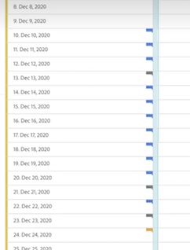

# Annotaties weergeven

>[!NOTE]
>
>Deze functie is momenteel in beperkte tests.

Annotaties worden iets anders weergegeven, afhankelijk van het feit of ze één dag of een datumbereik beslaan.

## Annotaties weergeven in lijngrafieken of tabellen

| Datum | Weergave |
| --- | --- |
| **Eén dag** |  |
| **Datumbereik** | Het pictogram verandert en wanneer u de muisaanwijzer op het pictogram plaatst, wordt het datumbereik weergegeven.

In een tabel wordt op elke datum in het datumbereik een pictogram weergegeven.

Let op het volgende: op dagen waarop meer dan één annotatie is gekoppeld, is het pictogram grijs. |

## Annotaties weergeven in een overzichtstabel

## Annotaties weergeven in een .pdf-bestand

Aangezien u de muisaanwijzer niet boven pictogrammen in een .pdf-bestand kunt plaatsen, bevat dit bestand (na het exporteren) onder in een deelvenster notities met uitleg. Hier volgt een voorbeeld:

