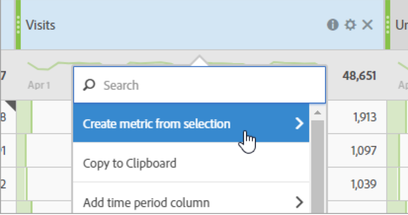

# Metrisch

Er zijn twee manieren om metriek in Analysis Workspace te gebruiken.

* U kunt een standaard metrische, berekende metrische of berekende metrische sjabloon slepen vanuit de [!UICONTROL Components] aan de tabel:

   

   >[!NOTE]
   >
   >Hoewel dit schijnbaar eenvoudig is, is het gebruik van metriek vrij krachtig. U kunt metriek aan een rapport toevoegen door aangewezen metrisch aan de metrieke sectie van een lijst te slepen. U kunt afmetingen ook onderverdelen door metriek, die u verfijnde controle over de lijstmening geven. Voorts kunt u metrisch als afmeting en een afmeting als metrisch opnemen om een overlooprapport tot stand te brengen. Speel rond met de diverse componenten en zie wat u kunt doen. De mogelijkheden zijn eindeloos.

* U kunt ook op **[!UICONTROL Components]** > **[!UICONTROL New Metric]**. Hiermee gaat u naar de [Berekende metrische bouwer](/help/components/c-calcmetrics/cm-overview.md), waar u aangepaste metriek kunt maken op basis van bestaande metriek.

Hier is een video over het werken met metriek in een lijst Freeform:

>[!VIDEO](https://video.tv.adobe.com/v/40817/?quality=12)

## Berekende standaarden

Om het gemakkelijker te maken om snel berekende metriek tot stand te brengen, **[!UICONTROL Create metric from selection]** is toegevoegd aan het met de rechtermuisknop aanklikken van de kolom in de Lijsten van de Vrije Vorm. Deze optie wordt weergegeven wanneer een of meer cellen met kopteksten zijn geselecteerd.

[Berekende waarden: Metriek zonder implementatie](https://experienceleague.adobe.com/docs/analytics-learn/tutorials/components/calculated-metrics/calculated-metrics-implementationless-metrics.html) (3:42)

## Metriek vergelijken met verschillende attributiemodellen

Als u het ene attributiemodel snel en gemakkelijk wilt vergelijken met het andere, klikt u met de rechtermuisknop op een metrische waarde en selecteert u **[!UICONTROL Compare Attribution Models]**:

Met deze sneltoets kunt u snel en eenvoudig een attributiemodel vergelijken met een ander attribuut zonder dat u dit model in een metrische modus hoeft te slepen en tweemaal hoeft te configureren.

## Gebruik de [!UICONTROL cumulative average] functie om metrisch vloeiend maken toe te passen

Hier volgt een video over het onderwerp:

>[!VIDEO](https://video.tv.adobe.com/v/27068/?quality=12)
