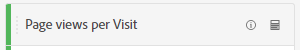
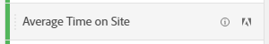

# Metrics

Met cijfers kunt u gegevenspunten in Analysis Workspace kwantificeren. Deze worden meestal gebruikt als kolommen in een visualisatie en zijn gekoppeld aan afmetingen.

## Soorten metingen

Adobe biedt verschillende typen maateenheden voor gebruik in Analysis Workspace:

* **Standaard metriek**: De meeste metriek die u in projecten gebruikt zijn standaardmetriek. De voorbeelden omvatten [ meningen van de Pagina ](/help/components/metrics/page-views.md), [ Inkomsten ](/help/components/metrics/revenue.md), of [ de gebeurtenissen van de Douane ](/help/components/metrics/custom-events.md). Zie [ Overzicht van Metriek ](/help/components/metrics/overview.md) in de de gebruikersgids van Componenten voor meer informatie.

  

* **Berekende metriek**: Gebruiker-bepaalde metriek die op standaardmetriek, statische aantallen, of algoritmische functies gebaseerd zijn. Door de gebruiker gedefinieerde berekende meetwaarden geven een rekenprijspictogram weer in de lijst met beschikbare componenten. Zie [ Berekend overzicht van Metriek ](/help/components/c-calcmetrics/cm-overview.md) in de de gebruikersgids van Componenten voor meer informatie.

  

* **Berekende metrische malplaatjes**: Adobe-bepaalde metriek die zich zo ook aan berekende metriek gedragen. U kunt ze ongewijzigd gebruiken in Workspace-projecten of een kopie opslaan om de logica ervan aan te passen. Berekende metrische sjablonen tonen een Adobe-pictogram in de lijst met beschikbare componenten.

  

## Metriek gebruiken in Analysis Workspace

Metriek kan op verschillende manieren in Analysis Workspace worden gebruikt. Voor informatie over hoe te om metriek en andere soorten componenten aan Analysis Workspace toe te voegen, zie [ de componenten van het Gebruik in Analysis Workspace ](/help/analyze/analysis-workspace/components/use-components-in-workspace.md).

>[!BEGINSHADEBOX]

Zie  [ metriek van het Gebruik ](https://video.tv.adobe.com/v/40817?quality=12&learn=on){target="_blank"} voor een demo video.

>[!ENDSHADEBOX]

## Berekende waarden maken

Met berekende meetwaarden kunt u eenvoudig zien hoe meetgegevens op elkaar betrekking hebben, met eenvoudige operatoren of statistische functies.

Er zijn verschillende manieren om berekende metriek te maken. De methode u kiest bepaalt of berekende metrisch van de componentenlijst over alle projecten, of slechts in het project beschikbaar is waar het werd gecreeerd.

### Berekende waarden maken voor alle projecten

U kunt de berekende metrische bouwer gebruiken om berekende metriek tot stand te brengen. Wanneer gecreeerd op deze manier, zijn de berekende metriek beschikbaar in de componentenlijst en kunnen dan in projecten door uw organisatie worden gebruikt.

Voor informatie over hoe te om tot de berekende metriebouwer toegang te hebben, zie [ metriek bouwen ](/help/components/c-calcmetrics/c-workflow/cm-workflow/c-build-metrics/cm-build-metrics.md).

### Berekende waarden maken voor één project

U kunt snelle berekende metriek tot stand brengen die slechts voor het project beschikbaar zijn waar zij werden gecreeerd.

Om berekende metrisch voor één enkel project tot stand te brengen:

1. Open in Analysis Workspace het project waar u de berekende metrische waarde wilt maken.

1. Klik in een vrije-vormlijst met de rechtermuisknop op de kolomkop van één kolom.

   of

   Selecteer twee kolommen terwijl u Shift ingedrukt houdt en klik vervolgens met de rechtermuisknop op een van de geselecteerde kolommen.

1. Selecteren **[!UICONTROL Create metric from selection]**

    benadrukt

1. Als u alleen voor dit project een berekende metrische waarde wilt maken, kiest u een van de beschikbare opties.

   Wanneer u één kolom selecteert, zijn de volgende opties beschikbaar:

   * [!UICONTROL **Gemiddeld**]: Creeert een nieuwe kolom die de gemiddelde waarde in de reeks afmetingselementen voor de kolom toont. Dit gebruikt de [ Mean ](/help/components/c-calcmetrics/cm-reference/cm-functions.md#mean) functie.

   * [!UICONTROL **Mediaan**]: Creeert een nieuwe kolom die de mediane waarde in de reeks afmetingselementen voor de kolom toont. Dit gebruikt de [ Mediaan ](/help/components/c-calcmetrics/cm-reference/cm-functions.md#median) functie.

   * [!UICONTROL **Kolom max**]: Creeert een nieuwe kolom die de grootste waarde in de reeks afmetingselementen voor de kolom toont. Dit gebruikt de [ Maximale functie van de Kolom ](/help/components/c-calcmetrics/cm-reference/cm-functions.md#column-maximum).

   * [!UICONTROL **Kolom min**]: Creeert een nieuwe kolom die de kleinste waarde in de reeks afmetingselementen voor de kolom toont. Dit gebruikt de [ Minimale functie van de Kolom ](/help/components/c-calcmetrics/cm-reference/cm-functions.md#column-minimum).

   * [!UICONTROL **som van de Kolom**]:Creeert een nieuwe kolom die alle numerieke waarden voor metrisch binnen een kolom (over de elementen van een afmeting) toevoegt. Dit gebruikt de [ functie van de Som van de Kolom ](/help/components/c-calcmetrics/cm-reference/cm-functions.md#column-sum).

   Wanneer u twee kolommen selecteert, zijn de volgende opties beschikbaar:

   * [!UICONTROL **verdeel**]: Creeert een nieuwe kolom die de waarden van de twee geselecteerde kolommen verdeelt.

   * [!UICONTROL **trekt af**]: Creeert een nieuwe kolom die de waarden van de twee geselecteerde kolommen aftrekt.

   * [!UICONTROL **voegt**] toe: Creeert een nieuwe kolom die de waarden van de twee geselecteerde kolommen toevoegt.

   * [!UICONTROL **vermenigvuldigt**]: Creeert een nieuwe kolom die de waarden van de twee geselecteerde kolommen vermenigvuldigt.

   * [!UICONTROL **de verandering van de Percentage**]: Creeert een nieuwe kolom die de percentenverandering van de twee geselecteerde kolommen toont.

[ Berekende Metriek: Implementatie-minder metriek ](https://experienceleague.adobe.com/docs/analytics-learn/tutorials/components/calculated-metrics/calculated-metrics-implementationless-metrics.html) (3:42)

## Metrische gegevens vergelijken met verschillende attribuutmodellen

Als u snel en gemakkelijk één attributiemodel aan een andere wilt vergelijken, klik metrisch met de rechtermuisknop aan en selecteer **[!UICONTROL Compare Attribution Models]**:

Met deze sneltoets kunt u snel en eenvoudig een attributiemodel vergelijken met een ander attribuut zonder dat u dit model in een metrische modus hoeft te slepen en tweemaal hoeft te configureren.

## Gebruik de functie [!UICONTROL cumulative average] om het vloeiend maken van metrische elementen toe te passen

Hier volgt een video over het onderwerp:

>[!BEGINSHADEBOX]

Zie  [ Cumulatief gemiddelde ](https://video.tv.adobe.com/v/27068?quality=12&learn=on){target="_blank"} voor een demo video.

>[!ENDSHADEBOX]

