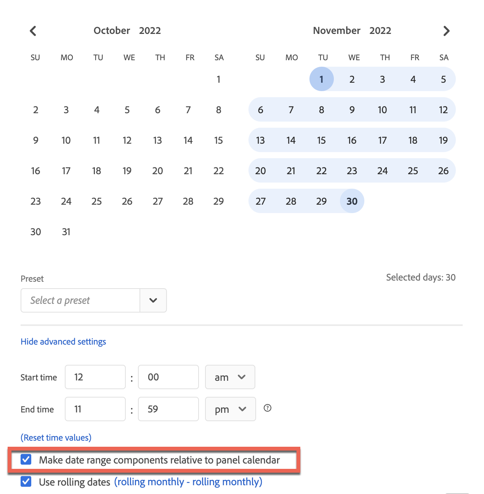

# Overzicht van datumbereiken

In een project van Workspace, gebruikt u typisch de [&#x200B; kalender in een paneel &#x200B;](/help/analyze/analysis-workspace/c-panels/panels.md#calendar) om de datumwaaier voor de visualisaties in dat paneel te specificeren.

Met datumbereikcomponenten kunt u de kalenderinstellingen voor het deelvenster definiëren en overschrijven.

## Datumbereiken gebruiken

U kunt een component met datumbereik gebruiken om de kalender voor het deelvenster opnieuw te definiëren.

Of u kunt een datumbereik in een tabel met vrije vorm gebruiken als metrisch of als een dimensie.

- **Metrisch**. Bijvoorbeeld, om een afmeting voor twee verschillende maanden voor specifieke metrisch te vergelijken.
- **Dimension**. Om metrisch op verschillende afmetingspunten voor de afmeting van de datumwaaier te vergelijken.

>[!NOTE]
>
>Wanneer u datumbereiken in een tabel met vrije vorm gebruikt, overschrijven de datumbereiken de kalender die is opgegeven voor het deelvenster waartoe de tabel met vrije vorm behoort.
>

U gebruikt een datumwaaier aangezien u [&#x200B; om het even welke component &#x200B;](/help/analyze/analysis-workspace/components/analysis-workspace-components.md#analysis-workspace-components) zou gebruiken. U sleept de datumwaaier van het  en laat vallen de component op:**[!UICONTROL Date ranges]**

- **[!UICONTROL Calendar]**: U  **[!UICONTROL Replace]** de huidige kalenderconfiguratie met de datumwaaier.
- **Metrische kolomkopbal**: U  **[!UICONTROL Replace]** metrisch, **[!UICONTROL Add]**&#x200B;de datumwaaier als metrisch toe, of **[!UICONTROL Filter]**&#x200B;metrisch gebruikend de component van de datumwaaier.
- **de kolomkopbal van Dimension**: U  **[!UICONTROL Replace]** de huidige afmetingen. De nieuwe dimensie is nu **[!UICONTROL Date ranges]** . Zodra de afmeting de waaiers van de Datum is, kunt u **[!UICONTROL Add]**.
- **het punt van Dimension**: U  **[!UICONTROL Breakdown]** het specifieke afmetingspunt door de datumwaaier.

U kunt ook rechtstreeks een kolom voor het datumbereik toevoegen in een visualisatie voor de tabel Vrije vorm:

1. In een metrische kolom, selecteer van het contextmenu:

   - **[!UICONTROL Add time period column]**. U kunt tussen voorgestelde opties selecteren die op de huidige kalender gebaseerd zijn of a [&#x200B; waaier van de douanedatum &#x200B;](#custom-date-ranges) creëren.
   - **[!UICONTROL Compare time periods]**. U kunt tussen een voorgestelde optie selecteren die op de huidige kalender gebaseerd is of a [&#x200B; waaier van de douanedatum &#x200B;](#custom-date-ranges) creëren.

1. Op basis van uw selectie worden extra kolommen voor het datumbereik toegevoegd aan de tabel Vrije vorm.

## Standaarddatumbereiken

Analysis Workspace biedt een aantal standaarddatumbereiken.

| Dag | Week | Maand | Kwart | Jaar |
|---|---|---|---|---|
| Vandaag | Deze week | Deze maand | Dit kwartaal | Dit jaar |
| Gisteren | Deze week (behalve vandaag) | Deze maand (behalve vandaag) | Dit kwartaal (exclusief vandaag) | Dit jaar (behalve vandaag) |
| 2 dagen geleden | 2 weken geleden | 2 maanden geleden |   |  |
| 3 dagen geleden | 3 weken geleden | 3 maanden geleden |  | |
| Laatste 7 dagen | Vorige week | Vorige maand | Laatste kwartaal | Vorig jaar |
| Laatste 14 dagen | Afgelopen 2 volledige weken | Laatste 2 volledige maanden | Afgelopen 4 volledige kwartalen | |
| Laatste 30 dagen | Afgelopen 3 volledige weken | Laatste 3 volledige maanden | | |
| Laatste 60 dagen | Laatste 4 volledige weken | Laatste 6 volledige maanden | | |
| Laatste 90 dagen | Afgelopen 12 volledige weken | Laatste 12 volledige maanden | | |
| Laatste 7 volledige dagen | Afgelopen 52 volledige weken | Laatste 13 volledige maanden | | |
| Laatste 14 volledige dagen | | | | |
| Laatste 30 volledige dagen | | | | |
| Laatste 90 volledige dagen | | | | |

<table style="table-layout:fixed">

## Aangepaste datumbereiken

U kunt uw eigen aangepaste datumbereiken maken. Zie [&#x200B; datumwaaier &#x200B;](create.md) voor de diverse opties tot stand brengen beschikbaar om datumwaaiers tot stand te brengen. U bouwt dan, wijzigt, en bewaart datumwaaiers in de [&#x200B; de waaierbouwer van de Datum &#x200B;](create.md#date-range-builder).

U gebruikt de [&#x200B; manager van de waaier van de Datum &#x200B;](manage.md) om datumwaaiers te beheren.

<!--
# Calendar and date ranges overview {#date-range}

>[!CONTEXTUALHELP]
>id="components_dateranges_endtime"
>title="End time"
>abstract="End times always include 59 seconds."

In the calendar, you can specify dates and date ranges, or select a preset.

>[!BEGINSHADEBOX]

See  [Calendar and date ranges overview](https://video.tv.adobe.com/v/23973?quality=12&learn=on){target="_blank"} for a demo video.

>[!ENDSHADEBOX]

Calendar selections apply at the panel level, but you have the option to apply them to all panels. When you click a date range in Workspace, the interface displays the current calendar month and the previous calendar month. You can adjust these two calendars by clicking the right and left arrows in each respective upper corner.

{width="60%"} 

## Select and apply date ranges {#select-apply}

The first click on a calendar starts a date range selection. The second click completes a date range selection, which becomes highlighted. If the `Shift` key is held down (or right-click is used), it appends to the currently selected range.

You can also drag dates (and time dimensions) into a Workspace project. You can select specific days, weeks, months, years, or a rolling date.

[Using Date Ranges and Calendar in Analysis Workspace](https://experienceleague.adobe.com/docs/analytics-learn/tutorials/analysis-workspace/calendar-and-date-ranges/using-dates-in-analysis-workspace.html?lang=nl-NL) (4:07)

| Setting | Description |
|--- |--- |
|Selected Days|Selected days/weeks/months/years.|
|Make date range components relative to panel calendar| If disabled, any date range components used within a table, visualization, or panel drop zone override the panel calendar. 
If enabled, any date range components used within a table, visualization, or panel drop zone are in relation to the panel date range. For example, if the panel date range is set to November 1 through November 30, and a Last Week date range component is used in a freeform table, the information in the freeform table refers to the last week in October. |
|Use rolling dates| Rolling dates allow you to generate a dynamic report that looks forward or backward for a set period of time based on when you ran the report. For example, if you want to report on all Orders placed "Last Month" (based on the Created Date field) and ran that report in December, you'd see orders placed in November. If you ran that same report in January, you'd see orders placed in December.<ul><li>**[!UICONTROL Date Preview]**: Indicates what time period the rolling calendar encompasses.</li><li>**[!UICONTROL Start]**: You can choose among current day, current week, current month, current quarter, current year.</li><li>**[!UICONTROL End]**: You can choose among current day, current week, current month, current quarter, current year.</li></ul>To view an example, see [Custom date ranges](/help/analyze/analysis-workspace/components/calendar-date-ranges/custom-date-ranges.md).  Selected by default.|
|Date Range|Lets you pick a preset date range. Last 30 days is the default. **[!UICONTROL This week/month/quarter/year (excluding today)]** lets you choose from date ranges that do not include partial-day data from today.|
|Apply to All Panels|Lets you not only change the selected date range for the current panel, but also for all other panels within the project.|
|Apply|Applies the date range to this panel only.|

## About relative panel date ranges {#relative-panel-dates}

If you're working in Workspace, you can make the date range components relative to the panel calendar. 
Three common use cases where you'll see relative panel dates take effect are Combo charts, Key metrics summary, and Freeform table date ranges.

To use relative panel date ranges

1. Select the **Workspace** tab.
1. Select **Blank project**.
1. Add dimensions, metrics, and segments from the left rail. 
1. Click the panel date range field to toggle the relative panel date range setting.
1. Select **Make date range components relative to panel calendar**.
    * Select the option to make the date range components relative to the panel calendar.
        If relative dates are selected, then rolling dates will be based on the start date of the panel calendar and not today's date.
    * If this option isn't selected, then rolling dates will be based on today's date.

    {width="60%"} 

1. Click **Apply**.
    The relative dates are shown in the upper-right.

    

## Guidelines for relative panel date ranges {#guidelines}

Keep in mind the following guidelines when using relative panel date ranges.

### Formulas and relative date ranges {#formula-relative-dates}

If you have relative dates selected, all date formulas will use the panel's start date as the starting point.

### Custom calendars and relative date ranges {#custom-calendar-formulas}

When you use a week-based custom calendar and you add months or years, the formula calculates the offset of the day in the given period. The actual date may be different because of the offset. The formula chooses the day landing in the same place in the custom calendar. For example, the third Friday of the third week in a custom calendar.

### About segments that use rolling dates and relative panel date ranges {#segments-relative-dates}

If you build a segment or use a segment with a rolling date, for example, the Last 7 Days or the Last 2 Weeks, and you click on the segment preview, it will start the rolling date from *Today* instead of the panel start date. As a result the preview for the segment will not match when you actually use the segment in the table. The preview is impacted, not the segment itself. 

## Guidelines for panel date ranges and previews {#guidelines-panel-dates}

* Starting with the February release, component and data previews will be based on the panel date range and not the last 90 days. 
* All components listed in the left rail will be available based on the panel date range. 
* All date previews in the segment and calculated metric builders will be based on the panel date range (unless accessed from the component managers, which do not have an associated panel, they will still be based on the last 90 days). 
* Any data previews will display data or components based on the panel date range.

-->