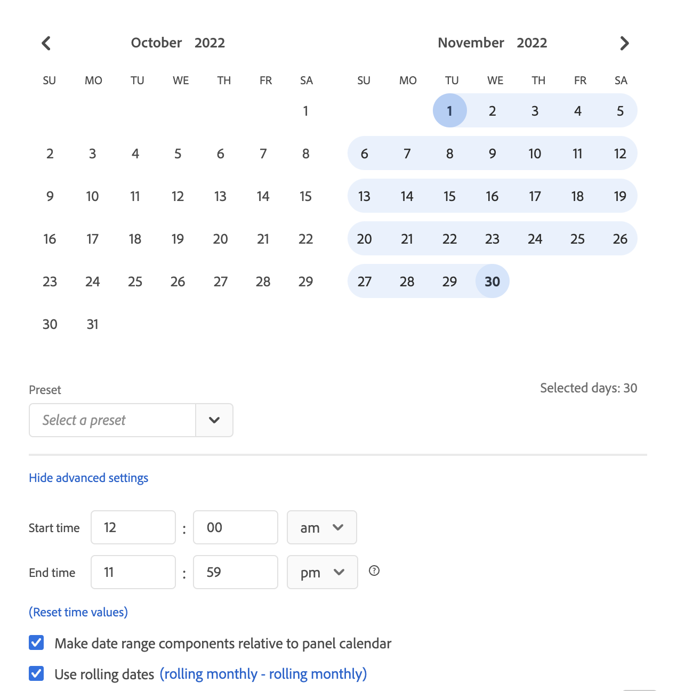

# Overzicht van kalender- en datumbereiken

In de kalender kunt u datums en datumbereiken opgeven of een voorinstelling selecteren.

Hier volgt een video over het gebruik van datumbereiken en kalenders in Analysis Workspace:

>[!VIDEO](https://video.tv.adobe.com/v/23973/?quality=12)

De kalenderselecties zijn van toepassing op paneelniveau, maar u hebt de optie om hen op alle panelen toe te passen. Wanneer u in Workspace op een datumbereik klikt, worden de huidige kalendermaand en de vorige kalendermaand in de interface weergegeven. U kunt deze twee kalenders aanpassen door op de rechter- en linkerpijlen in elke respectievelijke bovenhoek te klikken.

{width="60%"}

## Datumbereiken selecteren en toepassen {#select-apply}

Met de eerste klik op een kalender wordt een datumbereikselectie gestart. Met de tweede klik voltooit u een datumbereikselectie die wordt gemarkeerd. Als de `Shift` toets ingedrukt houdt (of met de rechtermuisknop klikt), wordt toegevoegd aan het momenteel geselecteerde bereik.

U kunt ook datums (en tijdafmetingen) naar een Workspace-project slepen. U kunt specifieke dagen, weken, maanden, jaren of een roldatum selecteren.

[Datumbereik en -kalender gebruiken in Analysis Workspace](https://experienceleague.adobe.com/docs/analytics-learn/tutorials/analysis-workspace/calendar-and-date-ranges/using-dates-in-analysis-workspace.html) (4:07)

| Instelling | Beschrijving |
|--- |--- |
| Geselecteerde dagen | Geselecteerde dagen/weken/maanden/jaren. |
| Componenten voor datumbereik ten opzichte van de deelvensterkalender maken | Datums consistent houden op basis van het datumbereik van het deelvenster. |
| Roldatums gebruiken | Het rollen datums staan u toe om een dynamisch rapport te produceren dat vooruit of achteruit voor een bepaalde periode kijkt die op wordt gebaseerd wanneer u het rapport in werking stelde. Bijvoorbeeld, als u op alle geplaatste Orden &quot;Vorige Maand&quot;wilt rapporteren (die op het Gemaakt gebied van de Datum wordt gebaseerd) en dat rapport in December in werking stellen, zou u orden zien die in november worden geplaatst. Als je datzelfde rapport in januari zou uitvoeren, zou je orders zien geplaatst in december.<ul><li>**[!UICONTROL Date Preview]**: Geeft aan welke tijdsperiode de schuivende kalender omspant.</li><li>**[!UICONTROL Start]**: U kunt kiezen uit de huidige dag, de huidige week, de huidige maand, het huidige kwartaal en het huidige jaar.</li><li>**[!UICONTROL End]**: U kunt kiezen uit de huidige dag, de huidige week, de huidige maand, het huidige kwartaal en het huidige jaar.</li></ul>Als u een voorbeeld wilt weergeven, raadpleegt u [Aangepaste datumbereiken](/help/analyze/analysis-workspace/components/calendar-date-ranges/custom-date-ranges.md).  Standaard geselecteerd. |
| Datumbereik | Hiermee kunt u een vooraf ingesteld datumbereik kiezen. De laatste 30 dagen is de standaardinstelling. **[!UICONTROL This week/month/quarter/year (excluding today)]** Hiermee kunt u kiezen uit datumbereiken zonder gegevens van vandaag over een hele dag. |
| Toepassen op alle deelvensters | Hiermee kunt u niet alleen het geselecteerde datumbereik voor het huidige deelvenster wijzigen, maar ook voor alle andere deelvensters in het project. |
| Toepassen | Hiermee past u het datumbereik alleen toe op dit deelvenster. |

## Over datumbereiken in het relatieve deelvenster {#relative-panel-dates}

Als u in Werkruimte werkt, kunt u de componenten van het datumbereik ten opzichte van de deelvensterkalender maken.
Drie veelvoorkomende gebruiksgevallen waarbij relatieve deelvensterdatums van kracht worden, zijn Combo-diagrammen, Overzicht van belangrijkste metriek en Datumbereiken van de Freeform-tabel.

Relatieve paneeldatumbereiken gebruiken

1. Selecteer **Werkruimte** tab.
1. Selecteren **Leeg project**.
1. Voeg afmetingen, metriek, en segmenten van het linkerspoor toe.
1. Klik op het veld voor het datumbereik van het deelvenster om de instelling voor het relatieve datumbereik van het deelvenster in of uit te schakelen.
1. Selecteren **Componenten voor datumbereik ten opzichte van de deelvensterkalender maken**.
   * Selecteer de optie om de componenten van het datumbereik te maken ten opzichte van de deelvensterkalender.
Als u relatieve datums selecteert, worden de roldatums gebaseerd op de begindatum van de deelvensterkalender en niet op de datum van vandaag.
   * Als deze optie niet wordt geselecteerd, dan zal het rollen van data op de datum van vandaag gebaseerd zijn.

   {width="60%"}

1. Klikken **Toepassen**.
De relatieve datums worden rechtsboven weergegeven.

   

## Richtlijnen voor datumbereiken in het relatieve deelvenster {#guidelines}

Houd rekening met de volgende richtlijnen wanneer u relatieve datumbereiken in het deelvenster gebruikt.

### Formulieren en relatieve datumbereiken {#formula-relative-dates}

Als u relatieve datums hebt geselecteerd, wordt in alle datumformules de begindatum van het deelvenster als beginpunt gebruikt.

### Aangepaste kalenders en relatieve datumbereiken {#custom-calendar-formulas}

Wanneer u een aangepaste weekkalender gebruikt en u maanden of jaren toevoegt, berekent de formule de verschuiving van de dag in de opgegeven periode. De werkelijke datum kan verschillen vanwege de verschuiving. De formule kiest de dag die op de zelfde plaats in de douanekalender aankomt. Bijvoorbeeld de derde vrijdag van de derde week in een aangepaste kalender.

### Informatie over segmenten die roldatums en relatieve paneeldatumbereiken gebruiken {#segments-relative-dates}

Als u een segment bouwt of een segment met een roldatum gebruikt, bijvoorbeeld de Laatste 7 Dagen of de Laatste 2 Weken, en u op de segmentvoorproef klikt, zal het de roldatum van beginnen *Vandaag* in plaats van de begindatum van het deelvenster. Dientengevolge zal de voorproef voor het segment niet aanpassen wanneer u werkelijk het segment in de lijst gebruikt. De voorvertoning wordt beïnvloed, niet het segment zelf.
