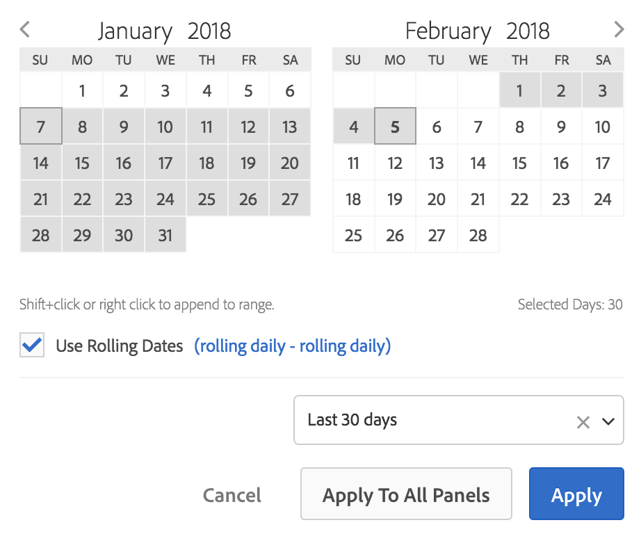

# Overzicht van kalender- en datumbereiken

In de kalender kunt u datums en datumbereiken opgeven of een voorinstelling selecteren.

De kalenderselecties zijn van toepassing op paneelniveau, maar u hebt de optie om hen op alle panelen toe te passen. Standaard wordt in de werkruimtekalender de huidige maand en vorige maand weergegeven.

Met de eerste klik begint u een datumbereikselectie. Markeer vervolgens het bereik in beide richtingen tot de tweede klik, waarmee het einde van het datumbereik wordt geselecteerd. Als u de `Shift` toets ingedrukt houdt (of met de rechtermuisknop klikt) terwijl u op de eerste datum klikt, wordt deze aan het bereik toegevoegd.

U kunt ook datums (en tijdafmetingen) naar een Workspace-project slepen. U kunt specifieke dagen, weken, maanden, jaren of een roldatum selecteren.

[Datumbereik en -kalender gebruiken in de analysewerkruimte op YouTube](https://www.youtube.com/watch?v=L4FSrxr3SDA&list=PL2tCx83mn7GuNnQdYGOtlyCu0V5mEZ8sS&index=28) (4:07)

| Instelling | Beschrijving |
|--- |--- |
| Geselecteerde dagen | Geselecteerde dagen/weken/maanden/jaren. |
| Roldatums gebruiken | Het rollen datums staan u toe om een dynamisch rapport te produceren dat vooruit of achteruit voor een bepaalde periode kijkt die op wordt gebaseerd wanneer u het rapport in werking stelde. Bijvoorbeeld, als u op alle geplaatste Orden &quot;Vorige Maand&quot;wilt rapporteren (die op het Gemaakt gebied van de Datum wordt gebaseerd) en dat rapport in December in werking stellen, zou u orden zien die in november worden geplaatst. Als je datzelfde rapport in januari zou uitvoeren, zou je orders zien geplaatst in december.  Voorvertoning datum: Geeft aan welke tijdsperiode de schuivende kalender omspant.  Begin: U kunt kiezen uit de huidige dag, de huidige week, de huidige maand, het huidige kwartaal en het huidige jaar.  Einde: U kunt kiezen uit de huidige dag, de huidige week, de huidige maand, het huidige kwartaal en het huidige jaar.  Een voorbeeld: ga [hier](/help/analyze/analysis-workspace/components/calendar-date-ranges/custom-date-ranges.md). |
| Datumbereik | Hiermee kunt u een vooraf ingesteld datumbereik kiezen. De laatste 30 dagen is de standaardinstelling. |
| Toepassen op alle deelvensters | Hiermee kunt u niet alleen het geselecteerde datumbereik voor het huidige deelvenster wijzigen, maar ook voor alle andere deelvensters in het project. |
| Toepassen | Hiermee past u het datumbereik alleen toe op dit deelvenster. |
