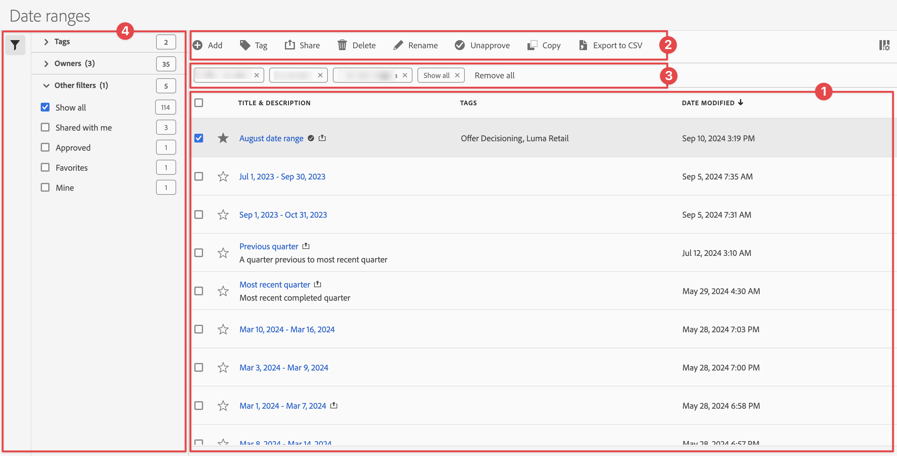

# Datumbereiken beheren

U kunt datumbereiken en datumbereiken als favorieten delen, filteren, labelen, goedkeuren, kopiëren, delen en verwijderen vanuit een centrale beheerinterface van [!UICONTROL Date ranges] . Datumbereiken beheren:

* Selecteer **[!UICONTROL Components]** in de hoofdinterface en selecteer vervolgens **[!UICONTROL Date ranges]** .

## Datumbereikbeheer

De manager van de waaiers van de Datum heeft de volgende interface elementen:

### Lijst met datumbereiken

In de lijst met datumbereiken ➊ worden alle datumbereiken weergegeven. De lijst heeft de volgende kolommen:

| Kolom | Beschrijving |
| --- | --- |
|  | Selecteer om  of niet-gunst  een datumwaaier te begunstigen. |
| **[!UICONTROL Title and description]** | Om de titel en de beschrijving uit te geven, selecteer de titelverbinding, die de [&#x200B; de waaierbouwer van de Datum &#x200B;](create.md#date-range-builder) opent. |
| **[!UICONTROL Owner]** | De eigenaar van het datumbereik. |
| **[!UICONTROL Tags]** | De labels voor dit datumbereik. |
| **[!UICONTROL Shared with]** | De personen of groepen met wie u het datumbereik hebt gedeeld. Selecteer deze optie om het dialoogvenster **[!UICONTROL Share Date range]** te openen. |
| **[!UICONTROL Date modified]** | Geeft de datum en tijd weer waarop het datumbereik voor het laatst is gewijzigd. |

{style="table-layout:auto"}

Gebruik  om te specificeren welke kolommen u wilt tonen.

### Actiebalk

U kunt actie uitvoeren op datumbereiken met de actiebalk ➋ . De actiebalk bevat de volgende handelingen:

| Pictogram | Handeling | Beschrijving |
|:---:|---|---|
|  | **[!UICONTROL Add]** | Voeg een andere datumwaaier toe, gebruikend de [&#x200B; de waaierbouwer van de Datum &#x200B;](create.md#date-range-builder). |
|  | [!UICONTROL *Onderzoek door titel*] | Wanneer er geen datumbereik is geselecteerd in de lijst, zoekt u naar datumbereiken met dit zoekveld. |
|  | **[!UICONTROL Tag]** | Label de geselecteerde datumbereiken. Selecteer in het dialoogvenster **[!UICONTROL Tag Date range]** de tags voor de geselecteerde datumbereiken of hef de selectie hiervan op. Selecteer **[!UICONTROL Save]** om de labels voor de geselecteerde datumbereiken op te slaan. |
|  | **[!UICONTROL Share]** | Deel de geselecteerde datumbereiken. In de **[!UICONTROL Share Date range]** dialoog, kunt u  *individuen of groepen van het Onderzoek* of u kunt selecteren **[!UICONTROL Organization]** of **[!UICONTROL Groups]**. Selecteer **[!UICONTROL Save]** om de deelgegevens voor de geselecteerde datumbereiken op te slaan. |
|  | **[!UICONTROL Delete]** | Verwijder de geselecteerde datumbereiken. U wordt gevraagd om een bevestiging. |
|  uit | **[!UICONTROL Rename]** | Wijzig de naam van één geselecteerd datumbereik. Als deze optie is geselecteerd, kunt u de naam van het datumbereik inline wijzigen. |
|  | **[!UICONTROL Approve]** | Geef de geselecteerde datumbereiken goed. |
|  | **[!UICONTROL Copy]** | Kopieer de geselecteerde datumbereiken. Nieuwe datumbereiken worden gemaakt met dezelfde naam en hetzelfde achtervoegsel (kopie) |
|  | **[!UICONTROL Export to CSV]** | Exporteer de geselecteerde datumbereiken naar een `Date ranges List.csv` -bestand. |

### Actieve filterbalk

De filterbalk ➌ geeft de actieve filters weer (indien aanwezig). U kunt een filter snel verwijderen gebruikend . Als er meer dan één filter is opgegeven, gebruikt u **[!UICONTROL Remove all]** om alle filters te verwijderen.

### Deelvenster Filter

U kunt datumbereiken filteren in het **[!UICONTROL Filter]** linkerdeelvenster ➍ . In het filterdeelvenster worden het type filter en het aantal datumbereiken weergegeven die aan het filter voldoen. Selecteer  om de vertoning van het filterpaneel van een knevel te voorzien.

De lijst met filters filteren:

1. Selecteer  om het paneel van Filters te openen. Als u meer ruimte voor de lijst van Filters nodig hebt, kunt u  selecteren opnieuw om het paneel te sluiten.
1. U kunt de datumwaaiers filtreren gebruikend om het even welke beschikbare [&#x200B; filtersecties &#x200B;](#filter-sections).

   >[!INFO]
   >
   >*Punten* verwijzen naar de punten van de datumwaaier die in de [&#x200B; lijst van de waaiers van de Datum &#x200B;](#date-ranges-list) worden getoond.
   > 

#### Secties filteren

{{tagfiltersection}}
{{ownerfiltersection}}
{{otherfiltersfiltersection}}

De [&#x200B; lijst van de waaiers van de Datum &#x200B;](#date-ranges-list) wordt automatisch bijgewerkt gebaseerd op uw filterconfiguratie. U kunt de gevormde filters in de [&#x200B; Actieve filterbar &#x200B;](#active-filter-bar) zien.

## Datumbereiken bewerken

U kunt een datumbereik op twee manieren bewerken:

* In een project van Workspace, gebruik het [&#x200B; pictogram van de Component info &#x200B;](/help/analyze/analysis-workspace/components/use-components-in-workspace.md#component-info).

* Selecteer in de [[!UICONTROL Date ranges] lijst &#x200B;](#date-ranges-list) de titel van het datumbereik.

U gebruikt de [&#x200B; de waaierbouwer van de Datum &#x200B;](create.md#date-range-builder) om de datumwaaier uit te geven.

Gebruik de manager van de datumwaaier om, datumwaaiers te delen anders te noemen of te schrappen. De datummanager bereiken:

1. Login aan [&#x200B; analytics.adobe.com &#x200B;](https://analytics.adobe.com) gebruikend uw geloofsbrieven van AdobeID.
1. Ga naar [!UICONTROL Components] > [!UICONTROL Date Ranges].

<!--

## Interface

The date range manager includes the following options:

* **Add**: Create a new date range. See [create a date range](create.md) for more information.
* **Search by title**: Search for a date range by title. Results are filtered based on text entered here.
* **Filter**: Filter date ranges using the left column. You can filter by custom tag, owner, created by you, your favorites, approved, or shared with you. You can also search for desired filters.
* **Favorite**: Click the  icon next to a date range to add it to your favorites.
* **Customize columns**: Click the  icon to show or hide columns in the date range manager.

Click the checkbox next to one or more date ranges for more options.

* **Tag**: Apply a tag to all selected date ranges. Tags help you organize date ranges, and let you filter them using the left column.
* **Share**: Share a date range to other Experience Cloud users. If you are a product administrator, you can also share to the entire organization or groups. Date ranges that are shared to other users in your organization include a  icon next to the title.
* **Delete**: Permanently delete the selected date range(s).
* **Rename**: If a single date range is selected, you can change its title.
* **Approve**: If you are a product admin, you can add a stamp of approval to a date range. Approved date ranges inform users in your organization that they are 'official', differentiating them from date ranges created by other users in your organization. Approved date ranges include a  icon next to the title.
* **Unapprove**: If you are a product admin and select a date range that is already approved, you can unapprove it.
* **Copy**: Create a copy of the selected date range(s). Copying date ranges appends `(Copy)` to the end of the title of the newly copied date range(s).
* **Export to CSV**: Exports all selected date ranges into a CSV file. Columns in the resulting CSV file include all visible columns in the date range manager.
-->
