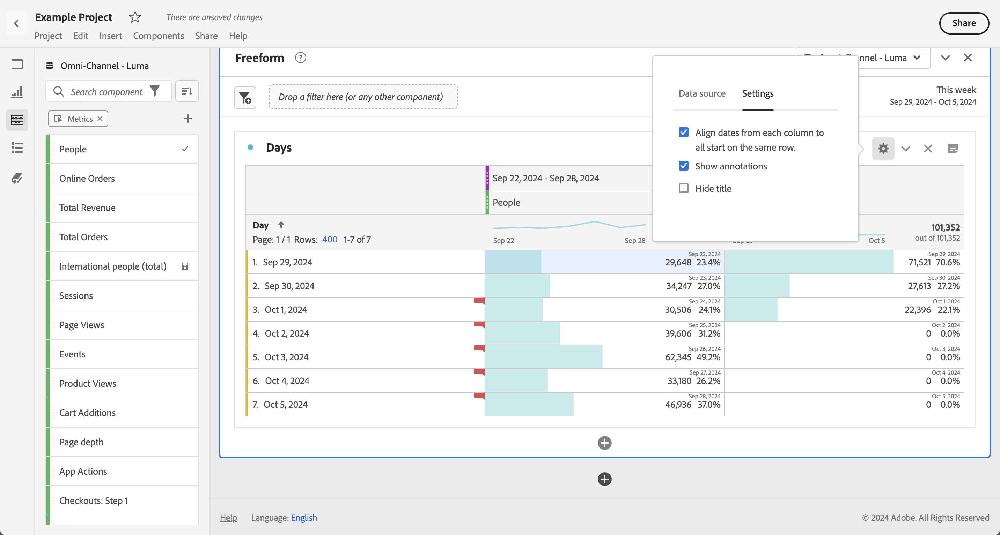

# Datumvergelijking

Met Datumvergelijking in Analysis Workspace kunt u elke kolom met een datumbereik gebruiken en een algemene datumvergelijking maken, zoals: jaar-over-jaar, kwartaal-over-kwartaal, maand-over-maand enzovoort.

## Vergelijk tijdsperiodes

De analyse vereist context, en vaak wordt die context verstrekt door een vorige tijdspanne. Bijvoorbeeld, de vraag *hoeveel beter of slechter doet u nu in vergelijking met dit tijd vorig jaar?* is essentieel voor het begrijpen van uw bedrijf. De vergelijking van de datum omvat automatisch de kolom van het a *verschil*, die de percentageverandering in vergelijking met een gespecificeerde tijdspanne toont.

1. Creeer de lijst van de a [ Vrije vorm ](/help/analyze/analysis-workspace/visualizations/freeform-table/freeform-table.md), met om het even welke afmetingen en metriek u over een tijdspanne wilt vergelijken.
1. Stel de tijdsperiode in het deelvenster of de kolom in om het vergelijkingstijdframe te bepalen en of het een roltijdvergelijking of een vergelijking met een vaste tijd betreft.

   Als u een vergelijking van de roltijd wilt maken, stelt u het deelvenster- of kolomdatumbereik in op een schuivend datumbereik (zoals **[!UICONTROL Last 7 days]** , **[!UICONTROL Last 30 days]** , enzovoort).

   Als u een vaste-tijdvergelijking wilt maken, stelt u het deelvenster- of kolomdatumbereik in op een aangepast datumbereik.
1. Open het contextmenu voor een tabelrij en selecteer **[!UICONTROL Compare time periods]** .

   

   >[!NOTE]
   >
   >Deze optie van het contextmenu is gehandicapt voor metrische rijen, de rijen van de datumwaaier, en rijen van de tijddimensie.

1. Afhankelijk van de manier waarop u het datumbereik van de tabel hebt ingesteld, kunt u het volgende vergelijken:

   | Optie | Beschrijving |
   |---|---|
   | **[!UICONTROL Prior *x *weken/maanden/kwartalen/jaar aan deze datumwaaier]** | Vergelijk met het geselecteerde datumbereik vlak voor dit datumbereik. |
   | **[!UICONTROL These x weeks / months / quarters / years last year to this date range]** | Vergelijk met dezelfde datumbereik een jaar geleden. |
   | **[!UICONTROL Custom date range to this date range]** | Hiermee kunt u een aangepast datumbereik definiëren. |

   >[!NOTE]
   >
   >Wanneer u een aangepast aantal dagen selecteert, bijvoorbeeld 7 oktober - 20 oktober (een bereik van 14 dagen), krijgt u slechts twee opties: **[!UICONTROL Prior 14 days before this date range]** en **[!UICONTROL Custom date range to this date range]** .

1. De resulterende vergelijking ziet er als volgt uit:

   

   Rijen in de kolom Percentage wijziging worden rood weergegeven voor negatieve waarden en groen voor positieve waarden.

## Een tijdspannekolom toevoegen ter vergelijking

U kunt nu een tijdsperiode toevoegen aan elke kolom in een tabel, zodat u een andere tijdsperiode kunt toevoegen dan de periode waarop uw kalender is ingesteld.

1. Klik met de rechtermuisknop op een kolom in de tabel en selecteer **[!UICONTROL Add time period column]** .

   

1. Afhankelijk van de manier waarop u het datumbereik van de tabel hebt ingesteld, kunt u het volgende vergelijken:

   | Optie | Beschrijving |
   |---|---|
   | **[!UICONTROL Prior *x *weken/maanden/kwartalen/jaar aan deze datumwaaier]** | Voeg een kolom toe met week/maand/enz. onmiddellijk voor dit datumbereik. |
   | **[!UICONTROL These *x *weken/maanden/kwartalen/jaar vorig jaar aan deze datumwaaier]** | Voeg hetzelfde datumbereik toe een jaar geleden. |
   | **[!UICONTROL Custom date range to this date range]** | Hiermee kunt u een aangepast datumbereik maken. |

   >[!NOTE]
   >
   >Wanneer u een aangepast aantal dagen selecteert, bijvoorbeeld 7 oktober - 20 oktober (een bereik van 14 dagen), krijgt u slechts twee opties: **[!UICONTROL Prior 14 days before this date range]** en **[!UICONTROL Custom date range to this date range]** .

1. De tijdsperiode wordt ingevoegd boven de kolom die u hebt geselecteerd:

   

1. U kunt zoveel tijdkolommen toevoegen als u wilt, maar u kunt ook verschillende datumbereiken combineren en met elkaar in overeenstemming brengen:

1. Bovendien kunt u op elke kolom sorteren, die de orde van dagen afhankelijk van de kolom verandert u sorteert.

## Kolom-datums uitlijnen zodat deze op dezelfde rij beginnen

U kunt de datums van elke kolom uitlijnen op alle datums die op dezelfde rij beginnen.

U maakt bijvoorbeeld een vergelijking van dag tot dag voor de laatste week (die eindigt op 5 oktober 2024) en de vorige week. Standaard begint de linkerkolom met 22 september en de rechterkolom met 29 september.

U kunt **[!UICONTROL Align dates from each column to all start on the same row]** in [ Montages ](/help/analyze/analysis-workspace/visualizations/freeform-table/freeform-table.md#settings-1) voor de Freeform lijstvisualisatie toelaten om kolomdata te richten om op de zelfde rij te beginnen.

Houd rekening met het volgende wanneer u deze optie gebruikt:

* Deze instelling wordt standaard ingeschakeld voor alle nieuwe projecten.

* Deze instelling is van toepassing op de hele tabel. Als u deze instelling bijvoorbeeld wijzigt voor een uitsplitsing binnen de tabel, wordt de instelling toegepast op de hele tabel.

<!--
# Date comparison

Date comparison in Analysis Workspace lets you take any column containing a date range and create a common date comparison, such as: year-over-year, quarter-over-quarter, month-over-month, etc.

>[!BEGINSHADEBOX]

See  [Date comparison](https://experienceleague.adobe.com/en/docs/analytics-learn/tutorials/analysis-workspace/calendar-and-date-ranges/using-date-ranges-and-comparisons-in-analysis-workspace){target="_blank"} for a demo video.

>[!ENDSHADEBOX]

## Compare time periods {#section_C4E36BFE0F5C4378A74E705747C9DEE4}

>[!NOTE]
>[!UICONTROL Compare Time Periods] leverages advanced Calculated Metrics. As a result, it is available only to customers with Analytics Select, Prime, and Ultimate SKUs. 

Analysis requires context, and often that context is provided by a previous time period. For example, the question "How much better or worse are we doing than at this time last year?" is fundamental to understanding your business. Date Comparison automatically include a "difference" column, which shows the percentage change compared to a specified time period.

1. Create a Freeform table, with any dimensions and metrics you want to compare over a time period.
1. Right-click a table row and select **[!UICONTROL Compare time periods]**.

   

   >[!NOTE]
   >
   >This right-click option is disabled for metric rows, date range rows, and time dimension rows.

1. Depending on how you have set the table's date range, you have these options for comparison: 

   |  Option  | Description  |
   |---|---|
   | **[!UICONTROL Prior week/month/quarter/year to this date range]** | Compares to the week/month/etc. immediately before this date range.  |
   | **[!UICONTROL This week/month/quarter/year last year to this date range]** | Compares to the same date range a year ago.  |
   | **[!UICONTROL Custom date range to this date range]** | Lets you select a custom date range.  |

   >[!NOTE]
   >
   >When you select a custom number of days, for example October 7 - October 20 (a 14-day range), you will get only 2 options: **[!UICONTROL Prior 14 days before this date range]**, and **[!UICONTROL Custom date range to this date range]**.

1. The resulting comparison looks like this:

   

   Rows in the Percent Change column appear red for negative values and green for positive values.

1. (Optional) As in any other Workspace projects, you can create visualizations based on these time comparisons. For example, here is a Bar graph:

   

   Note that in order to show the percentage change in the bar chart, you have to have the [!UICONTROL Percentages] setting checked in the [!UICONTROL Visualization Settings].

## Add a time period column for comparison {#section_93CC2B4F48504125BEC104046A32EB93}

You can now add a time period to each column in a table, enabling you to add a time period that is different from the one your calendar is set to. This is another way you can compare dates.

1. Right-click a column in the table and select **[!UICONTROL Add time period column]**. 

   

1. Depending on how you have set the table's date range, you have these options for comparison: 

   |  Option  | Description  |
   |---|---|
   | **[!UICONTROL Prior week/month/quarter/year to this date range]** | Adds a column with the week/month/etc. immediately before this date range.  |
   | **[!UICONTROL This week/month/quarter/year last year to this date range]** | Adds the same date range a year ago.  |
   | **[!UICONTROL Custom date range to this date range]** | Lets you select a custom date range.  |

   >[!NOTE]
   >
   >When you select a custom number of days, for example October 7 - October 20 (a 14-day range), you will get only 2 options: **[!UICONTROL Prior 14 days before this date range]**, and **[!UICONTROL Custom date range to this date range]**.

1. The time period will be inserted on top of the column you selected:

   

1. You can add as many time columns as you want, as well as mix and match different date ranges:

   

1. In addition, you can sort on each column, which will change the order of days depending on the column you are sorting on.

## Align column dates to start on the same row {#section_5085E200082048CB899C3F355062A733}

You can align the dates from each column to all start on the same row. 

For example, when you choose to align the dates, if you do a month-over-month comparison between October and September 2016, the left column will start with October 1 and the right column will start with September 1:

>[!NOTE]
>
>Consider the following when using this option:
>
>* This setting is enabled by default for all new projects.
>
>* This setting applies to the entire table. For example, if you change this setting for a breakdown within the table, it will change the setting for the entire table.
>

To enable this setting, if it is not already enabled:

1. In the table where you want to align column dates, select the **Settings** icon in the table header.

1. On the [!UICONTROL **Settings**] tab, select **[!UICONTROL Align Dates from each column to all start on the same row (applies to entire table)]**.

-->