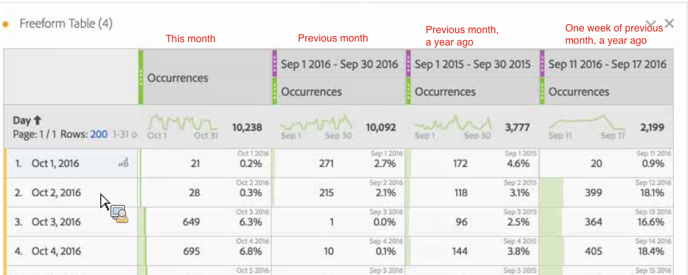

# Datumvergelijking

Met Datumvergelijking in Analysis Workspace kunt u elke kolom met een datumbereik gebruiken en een algemene datumvergelijking maken, zoals: jaar-over-jaar, kwartaal-over-kwartaal, maand-over-maand, enz.

Hier volgt een video over het onderwerp:

>[!VIDEO](https://video.tv.adobe.com/v/30753/?quality=12)

## Vergelijk tijdsperiodes {#section_C4E36BFE0F5C4378A74E705747C9DEE4}

>[!NOTE]
>[!UICONTROL Compare Time Periods] hefboomwerkingen geavanceerde Berekende Metriek. Dientengevolge, is het beschikbaar slechts aan klanten met Analytics Uitgezochte, eerste, en Ultimate SKUs.

De analyse vereist context, en vaak wordt die context verstrekt door een vorige tijdspanne. Bijvoorbeeld de vraag &quot;Hoeveel beter/slechter doen we dan op dit moment vorig jaar?&quot; is fundamenteel voor het begrijpen van uw zaken. De Vergelijking van de datum omvat automatisch een &quot;verschilkolom&quot;, die de percentageverandering in vergelijking met een gespecificeerde tijdspanne toont.

1. Maak een tabel voor vrije vorm met de afmetingen en metriek die u over een tijdsperiode wilt vergelijken.
1. Klik met de rechtermuisknop op een tabelrij en selecteer **[!UICONTROL Compare Time Periods]**.

   

   >[!IMPORTANT]
   >
   >Deze klikoptie is gehandicapt voor metrische rijen, de rijen van de datumwaaier, en de rijen van de tijddimensie.

1. Afhankelijk van de manier waarop u het datumbereik van de tabel hebt ingesteld, kunt u het volgende vergelijken:

   | Optie | Beschrijving |
   |---|---|
   | **[!UICONTROL Prior week/month/quarter/year to this date range]** | Vergelijkt met week/maand/enz. onmiddellijk voor dit datumbereik. |
   | **[!UICONTROL This week/month/quarter/year last year]** | Vergelijkt tot de zelfde datumwaaier een jaar geleden. |
   | **[!UICONTROL Select range]** | Hiermee kunt u een aangepast datumbereik selecteren. |

   >[!NOTE]
   >
   >Wanneer u een aangepast aantal dagen selecteert, bijvoorbeeld 7 oktober - 20 oktober (een bereik van 14 dagen), krijgt u slechts twee opties: **[!UICONTROL Prior 14 days before this date range]**, en **[!UICONTROL Select range]**.

1. De resulterende vergelijking ziet er als volgt uit:

   

   De rijen in de kolom Percentage wijziging worden rood weergegeven voor negatieve waarden en groen voor positieve waarden.

1. (Optioneel) Net als bij andere Workspace-projecten kunt u visualisaties maken op basis van deze tijdvergelijkingen. Hier ziet u bijvoorbeeld een staafgrafiek:

   

   Als u het percentage van de wijziging in het staafdiagram wilt weergeven, moet u beschikken over de optie [!UICONTROL Percentages] instelling ingecheckt in het dialoogvenster [!UICONTROL Visualization Settings].

## Een tijdspannekolom toevoegen ter vergelijking {#section_93CC2B4F48504125BEC104046A32EB93}

U kunt nu een tijdsperiode toevoegen aan elke tabelkolom. Zo kunt u een andere tijdsperiode toevoegen dan de periode waarop uw kalender is ingesteld. Dit is een andere manier om datums te vergelijken.

1. Klik met de rechtermuisknop op een kolom in de tabel en selecteer **[!UICONTROL Add Time Period Column]** 

1. Afhankelijk van de manier waarop u het datumbereik van de tabel hebt ingesteld, kunt u het volgende vergelijken:

   | Optie | Beschrijving |
   |---|---|
   | **[!UICONTROL Prior week/month/quarter/year to this date range]** | Voegt een kolom met de week/maand/enz. toe. onmiddellijk voor dit datumbereik. |
   | **[!UICONTROL This week/month/quarter/year last year]** | Hiermee voegt u hetzelfde datumbereik toe een jaar geleden. |
   | **[!UICONTROL Select range]** | Hiermee kunt u een aangepast datumbereik selecteren. |

   >[!NOTE]
   >
   >Wanneer u een aangepast aantal dagen selecteert, bijvoorbeeld 7 oktober - 20 oktober (een bereik van 14 dagen), krijgt u slechts twee opties: **[!UICONTROL Prior 14 days before this date range]**, en **[!UICONTROL Select range]**.

1. De tijdsperiode wordt ingevoegd vóór de kolom die u hebt geselecteerd:

   

1. U kunt zoveel tijdkolommen toevoegen als u wilt, maar u kunt ook verschillende datumbereiken combineren en met elkaar in overeenstemming brengen:

   

1. Bovendien kunt u op elke kolom sorteren, die de orde van dagen afhankelijk van de kolom zult veranderen u sorteert.

## Kolom-datums uitlijnen zodat deze op dezelfde rij beginnen {#section_5085E200082048CB899C3F355062A733}

Met een nieuwe instelling voor alle tabellen kunt u **[!UICONTROL Align Dates from each column to all start on the same row (applies to entire table)]**. &quot;Is van toepassing op volledige lijst&quot;betekent dat als u, bijvoorbeeld een uitsplitsing in de lijst doet, en als u dit het plaatsen voor de uitsplitsing verandert, het het plaatsen voor de volledige lijst zal veranderen.

>[!IMPORTANT]
>
>Deze instelling is **uitgeschakeld** (niet ingeschakeld) voor alle bestaande projecten en **enabled** (gecontroleerd) voor alle nieuwe projecten.

Voorbeeld: Wanneer u ervoor kiest om de datums op één lijn te brengen, als u een maand-over-maand vergelijking tussen oktober en september 2016 doet, zal de linkerkolom met 1 Oktober beginnen en de juiste kolom zal met 1 September beginnen:

<!-- 

See Jonny Moon's email from November 3. 

 -->
