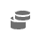

# Componentinformatie weergeven in gegevenswoordenboek

{{release-limited-testing}}

In het gegevenswoordenboek kunt u informatie weergeven over een component, zoals de componentbeschrijving, vergelijkbare componenten, andere componenten waarmee een component vaak wordt gebruikt en meer.

Informatie over een component weergeven in het gegevenswoordenboek:

1. Ga naar het Analysis Workspace-project dat de component bevat die u wilt bekijken.

1. Selecteer [!UICONTROL **Gegevenswoordenboek**] in de linkerspoorstaaf van Analysis Workspace. (Alternatieve manieren om toegang te krijgen tot het gegevenswoordenboek worden beschreven in &quot;Toegang tot het gegevenswoordenboek&quot; in [Overzicht van gegevenswoordenboek](/help/analyze/analysis-workspace/components/data-dictionary/data-dictionary-overview.md).)

   Het venster Gegevenswoordenboek wordt weergegeven.

   

   <!--double-check this screenshot. I mocked the admin view up a bit to get rid of the Dictionary health tab.-->

1. Controleer of de rapportsuite die de component bevat die u wilt weergeven, is geselecteerd in de vervolgkeuzelijst. Standaard wordt de rapportsuite weergegeven waarin u zich al bevindt.

1. (Optioneel) Typ in het zoekveld de naam van de component die u wilt weergeven.

   Pictogrammen worden naast componentnamen weergegeven om het type component aan te geven:

   | Pictogram | Betekenis |
   |---------|----------|
   |  | Geeft een **dimensie**. Dimension worden geleverd door Adobe. Bestaande afmetingen kunnen niet worden gewijzigd en er kunnen geen nieuwe afmetingen worden gemaakt. |
   |  | Geeft een **standaard metrisch** (niet berekend). De standaardmetriek worden verstrekt door Adobe en kan niet worden gewijzigd. |
   |  | Geeft een **berekend metrisch sjabloon** of **segmentsjabloon**. Deze componenten worden verstrekt door Adobe en kunnen niet worden gewijzigd. |
   |  | Geeft een **berekend metrisch** die door een beheerder van Analytics in uw organisatie werd gecreeerd. |
   |  | Geeft een **segment**. Deze kunnen segmenten zijn die door Adobe worden verstrekt of door een beheerder van Analytics in uw organisatie worden gecreeerd. |
   |  | Geeft een **datumbereik**. Dit kunnen datumwaaiers zijn die door Adobe worden verstrekt of door een beheerder van Analytics in uw organisatie worden gecreeerd. |

{{dd-filter-criteria}}

1. Selecteer in de lijst met componenten de component die u wilt weergeven.

   De volgende informatie over de component wordt weergegeven:

   {{dd-component-information}}

1. (Optioneel) Sleep een component van het gegevenswoordenboek naar Analysis Workspace.