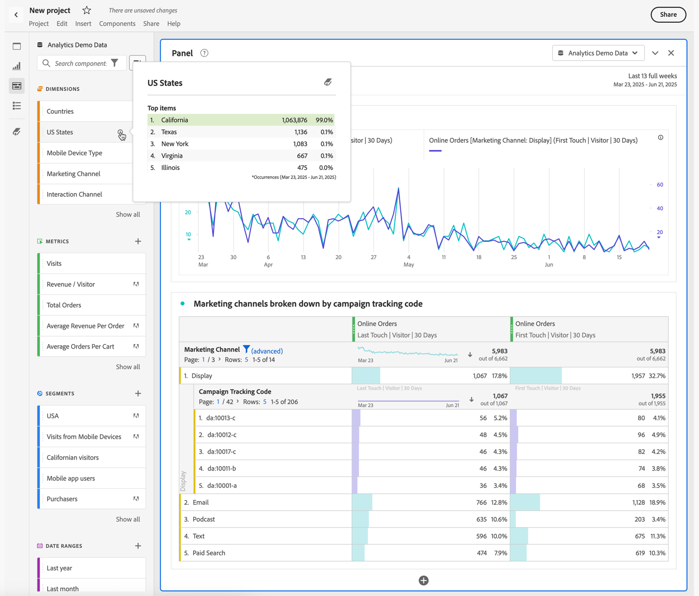

# Afmetingen voorvertonen in Analysis Workspace

U kunt [ componenteninfo ](/help/analyze/analysis-workspace/components/use-components-in-workspace.md#component-info) voor een component gebruiken om de hoogste punten voor een afmeting te tonen.

<!--
Now, by default, we show dynamic values instead of static ones, with the option to turn them into static values. Other things to note:

* As your data updates, the dynamic dimension columns will update to show the current 5/15 dimension items.
* A dynamic dimension column that is copied or moved will become static.
* When hovering a static dimension column you will see a lock icon, indicating that the dimension is static.

-->

## Dimensie-items tonen

Wanneer u  voor een afmeting in het componentenpaneel selecteert, verschijnt een lijst van zijn afmetingspunten. In de lijst met dimensie-items worden gewoonlijk de bovenste items voor de laatste 30 dagen weergegeven. Als er meer items beschikbaar zijn, selecteert u de koppeling buiten het geselecteerde datumbereik voor het deelvenster om meer items weer te geven. Bijvoorbeeld **[!UICONTROL Show items from last month]** .

<!--
# Preview dimensions

Hover over the information (i) icon next to a dimension. This shows the top 5 values for non-time dimensions (and 15 for time dimensions). We used to keep those values static (i.e., the 5 values picked never changed).

Now, by default, we show dynamic values instead of static ones, with the option to turn them into static values. Other things to note:

* As your data updates, the dynamic dimension columns will update to show the current 5/15 dimension items.
* A dynamic dimension column that is copied or moved will become static.
* When hovering a static dimension column you will see a lock icon, indicating that the dimension is static.

## Show dimension items

When you hover over a dimension and click the grey right-arrow next to it, a list of its dimension items appears. Any list of dimension items usually shows the top items for the last 30 days.

If you scroll down to the bottom of the list, you see **[!UICONTROL Show Top Items From Last 18 Months]**. Click this option to see top dimension items from the last 547 days.

-->
