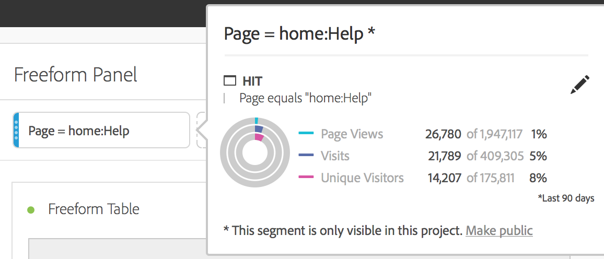

# Ad-hocsegmenten

Hier volgt een video over het maken van ad-hocsegmenten:

>[!VIDEO](https://video.tv.adobe.com/v/23978/?quality=12)

U kunt ad hoc segmenten tot stand brengen als u wilt snel onderzoeken hoe een segment uw project zou kunnen beïnvloeden, zonder naar de Bouwer van het Segment te gaan. Beschouw deze segmenten als tijdelijke segmenten op projectniveau. Ze maken normaal gesproken geen deel uit van uw segment &#39;bibliotheek&#39;, zoals componentsegmenten in de linkerrail. U kunt ze echter openbaar maken, zoals hieronder wordt weergegeven.

1. Zet om het even welk componenttype (afmeting, afmeting punt, gebeurtenis, metrisch, segment, segmentmalplaatje, datumwaaier) in de segment dalingsstreek bij de bovenkant van een paneel neer. Componenttypen worden automatisch omgezet in segmenten.
Hier ziet u hoe u een segment voor het Twitter-verwijzende domein kunt maken:

   

   Dit segment wordt automatisch toegepast in uw deelvenster en u kunt de resultaten direct zien.

1. Voeg maximaal drie ad-hocsegmenten toe aan een deelvenster.
1. Als u besluit dat u dit segment wilt opslaan, raadpleegt u de sectie &quot;Ad-hocsegmenten openbaar maken&quot;.

Houd rekening met het volgende:

* U **kunt niet** de volgende componenttypen in de segmentzone laten vallen: berekende metriek en afmetingen/metriek waarvan u geen segmenten kunt bouwen.
* Voor volledige afmetingen en gebeurtenissen maakt Analysis Workspace &#39;bestaande&#39; raaksegmenten. Voorbeelden: `Hit where eVar1 exists` of `Hit where event1 exists`.
* Als &quot;niet gespecificeerd&quot;of &quot;niets&quot;in de segment dalingsstreek wordt gelaten vallen, wordt het automatisch omgezet in een &quot;bestaat niet&quot;segment zodat het correct in segmentatie wordt behandeld.

>[!NOTE]
>
>Segmenten die op deze manier worden gemaakt, bevinden zich intern in het project.

## Ad-hocsegmenten openbaar maken {#ad-hoc-public}

U kunt ervoor kiezen om deze segmenten openbaar (algemeen) te maken door de volgende stappen uit te voeren:

1. Houd de cursor boven het segment in de neerzetzone en klik op het pictogram &quot;i&quot;.
1. Klik in het informatievenster dat wordt weergegeven op **[!UICONTROL Make public]**.

   

