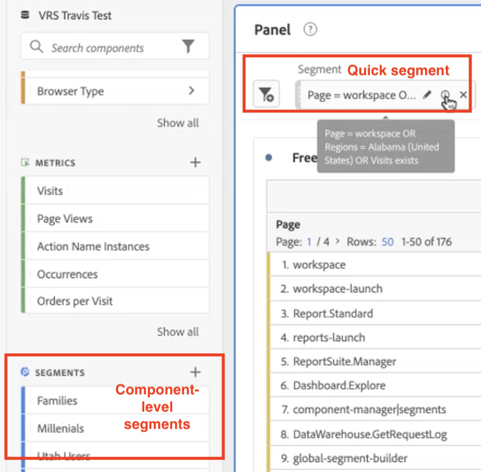
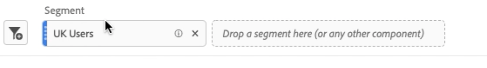

# Snelle segmenten

U kunt snelle segmenten binnen een project tot stand brengen om de ingewikkeldheid van volledige [segmentbouwer](/help/components/segmentation/segmentation-workflow/seg-build.md) te mijden. Voor een vergelijking van wat de snelle segmenten tegenover volledige component-vlakke segmenten kunnen doen, ga [hier](/help/analyze/analysis-workspace/components/segments/t-freeform-project-segment.md).

>[!IMPORTANT]
> Snelle segmenten worden momenteel beperkt getest en zijn nog niet algemeen beschikbaar.

## Snelle segmenten maken

1. Klik in een tabel voor vrije vorm op het pictogram filter+ in de koptekst van het deelvenster:

   

   Let op:

   - Er is één segmentcontainer slechts die u een afmeting/metrisch/datumwaaier in (of het van) het segment laat uitsluiten laat omvatten.
   - U kunt de container instellen op Actief, Bezoek of Bezoekerniveau. Standaard is Actief.

1. Voeg op drie manieren een dimensie/metrisch/datumbereik toe:

   - Begin te typen en de snelle bouwer van het Segment vindt automatisch de aangewezen component.
   - Gebruik de vervolgkeuzelijst om de component te zoeken.
   - Sleep componenten vanuit de linkerspoorstaaf.

1. Geef de eerste regel op, bijvoorbeeld `Page equals workspace`. U kunt tot drie regels in de segmentdefinities hebben. Klik op het plusteken (+) om een andere regel toe te voegen. U kunt &quot;EN&quot;of &quot;OF&quot;bepalende eigenschappen aan de regels toevoegen, maar u kunt &quot;EN&quot;en &quot;OF&quot;in één enkele segmentdefinitie niet mengen.

   Hier is een voorbeeld van een segment waarin afmetingen en metriek worden gecombineerd:

   

1. Klik **[!UICONTROL Apply]** om dit segment op het paneel toe te passen.
Het segment wordt bovenaan weergegeven. Let op de grijze zijbalk, in tegenstelling tot de blauwe balk voor segmenten op componentniveau links.

   

## Snelle segmenten openbaar maken

U kunt ervoor kiezen om deze segmenten openbaar (algemeen) te maken door de volgende stappen uit te voeren:

1. Houd de muisaanwijzer boven het snelsegment en klik op het pictogram &quot;i&quot;.
1. Klik op **[!UICONTROL Open builder]**.
Dit opent het segment in de Bouwer van het Segment.
   >[!NOTE]
   >Nadat u het segment hebt toegepast of opgeslagen in Segment Builder, kunt u het segment niet meer bewerken in de Quick Segment Builder.
1. Klik op **[!UICONTROL OK]**.
1. Klik in de Segment Builder op **[!UICONTROL Apply]**.
1. Ga terug naar Workspace en zie hoe het segment nu een blauw zijpaneel heeft, wat aangeeft dat het segment deel uitmaakt van de componentbibliotheek.

   

