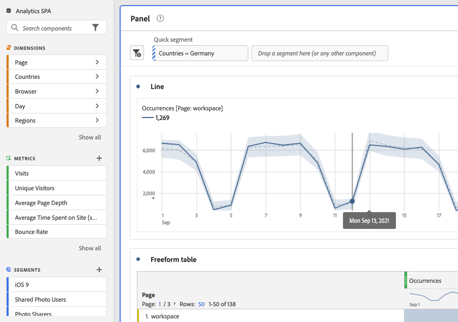

# Snelle segmenten

U kunt snelle segmenten binnen een project maken om de complexiteit van de volledige [segmentbuilder](/help/components/segmentation/segmentation-workflow/seg-build.md). Snelle segmenten

* Toepassen als [projectgebonden segmenten](https://experienceleague.adobe.com/docs/analytics/analyze/analysis-workspace/components/segments/quick-segments.html?lang=en#what-are-project-only-segments%3F).
* Sta voor maximaal 3 regels toe.
* Plaats geen geneste containers of opeenvolgende regels.

Voor een vergelijking van wat de snelle segmenten tegenover volledige component-lijst segmenten kunnen doen, ga [hier](/help/analyze/analysis-workspace/components/segments/t-freeform-project-segment.md).

Hier volgt een video-overzicht van snelle segmenten:

>[!VIDEO](https://video.tv.adobe.com/v/341466/?quality=12&learn=on)

## Vereisten

Iedereen kan een [!UICONTROL Quick Segment]. U hebt echter de [!UICONTROL Segment Creation] toestemming in de [Adobe Admin Console](https://experienceleague.adobe.com/docs/analytics/admin/admin-console/permissions/summary-tables.html?lang=en#analytics-tools) om een snel segment op te slaan of te openen in het dialoogvenster [!UICONTROL Segment Builder].

## Snelle segmenten maken

Klik in een tabel voor vrije vorm op het pictogram filter+ in de koptekst van het deelvenster:

Vorm het snelle segment van deze lege lei:

| Instelling | Beschrijving |
| --- | --- |
| Naam | De standaardnaam van een segment is een combinatie van de regelnamen in het segment. U kunt de naam van het segment wijzigen. |
| Opnemen/uitsluiten | U kunt of componenten in uw segmentdefinitie omvatten of uitsluiten, maar niet allebei. |
| Handje/Bezoek/Bezoeker container | Snelle segmenten omvatten één [segmentcontainer](https://experienceleague.adobe.com/docs/analytics/components/segmentation/seg-overview.html?lang=en#section_AF2A28BE92474DB386AE85743C71B2D6) alleen dat u een dimensie/metrisch/datumbereik in het segment kunt opnemen (of het van) het segment kunt uitsluiten. [!UICONTROL Visitor] bevat overkoepelende gegevens die specifiek zijn voor de bezoeker in verschillende bezoeken en paginaweergaven. A [!UICONTROL Visit] Met de container kunt u regels instellen om de gegevens van de bezoeker op basis van bezoeken te splitsen, en een [!UICONTROL Hit] Met de container kunt u bezoekersinformatie onderverdelen op basis van afzonderlijke paginaweergaven. De standaardcontainer is [!UICONTROL Hit]. |
| Onderdelen (Dimension/metrisch/datumbereik) | Definieer maximaal 3 regels door componenten (afmetingen en/of metriek en/of datumbereiken) en hun waarden toe te voegen. Er zijn drie manieren om de juiste component te vinden:<ul><li>Begin met typen en [!UICONTROL Quick Segment] de bouwer vindt automatisch de aangewezen component.</li><li>Gebruik de vervolgkeuzelijst om de component te zoeken.</li><li>Sleep componenten vanuit de linkerspoorstaaf.</li></ul> |
| Operator | Gebruik het vervolgkeuzemenu om standaardoperatoren te zoeken en [!UICONTROL Distinct Count] operatoren. [Meer informatie](https://experienceleague.adobe.com/docs/analytics/components/segmentation/segment-reference/seg-operators.html?lang=en) |
| plusteken (+) | Een andere regel toevoegen |
| EN/OF kwalificatietekens | U kunt &quot;EN&quot;of &quot;OF&quot;bepalende eigenschappen aan de regels toevoegen, maar u kunt &quot;EN&quot;en &quot;OF&quot;in één enkele segmentdefinitie niet mengen. |
| Toepassen | Pas dit segment toe op het deelvenster. Als het segment geen gegevens bevat, wordt u gevraagd of u wilt doorgaan. |
| Opbouwfunctie openen | Opent de Segment Builder. Zodra u sparen of het segment in de Bouwer van het Segment toepast, wordt het niet meer beschouwd als &quot;Snel Segment&quot;. Het wordt deel van de component-lijst segmentbibliotheek. |
| Annuleren | Annuleer dit snelle segment - pas het niet toe. |
| Datumbereik | De validator gebruikt het datumbereik van het deelvenster voor het opzoeken van de gegevens. Maar elk datumbereik dat in een snel segment wordt toegepast, overschrijft het datumbereik van het deelvenster boven in het deelvenster. |
| Voorvertoning (rechtsboven) | Hiermee kunt u zien of u een geldig segment hebt en hoe breed het segment is. Geeft de uitsplitsing aan van de gegevensset die u kunt verwachten wanneer u dit segment toepast. U zou een bericht kunnen krijgen dat erop wijst dat dit segment geen gegevens heeft. Als dit het geval is, kunt u de segmentdefinitie te werk gaan of veranderen. |

Hier is een voorbeeld van een segment waarin afmetingen en metriek worden gecombineerd:

Het segment wordt bovenaan weergegeven. Let op de zijbalk met een blauw streepjespatroon, in tegenstelling tot de blauwe zijbalk voor segmenten op componentniveau in de segmentbibliotheek aan de linkerkant.

## Snel segmenten bewerken

1. Houd de cursor boven het snelle segment en selecteer het potloodpictogram.
1. Bewerk de segmentdefinitie en/of de segmentnaam.
1. Klik op [!UICONTROL Apply].

## Snelle segmenten opslaan

>[!IMPORTANT]
>Zodra u sparen of het segment toepast, kunt u het niet meer uitgeven in de Snelle Bouwer van het Segment, slechts in de regelmatige Bouwer van het Segment.

1. Zodra u het snelle segment hebt toegepast, houdt u de muisaanwijzer boven het segment en selecteert u het pictogram Info (&quot;i&quot;).

   

1. Klik op **[!UICONTROL Make available to all projects and add to your component list]**.
1. (Optioneel) Wijzig de naam van het segment.
1. Klik op **[!UICONTROL Save]**.

De zijbalk van het segment verandert van gestreept blauw in lichter blauw. Het wordt nu ook weergegeven in uw lijst met onderdelen van het linkerspoor.

## Wat zijn projectgebonden segmenten?

Alleen voor projecten bestemde segmenten zijn segmenten die alleen van toepassing zijn op het huidige project waarin ze zijn gemaakt. Ze zijn niet beschikbaar in andere projecten en kunnen niet worden gedeeld met andere gebruikers. Ze zijn bedoeld voor een snelle verkenning van uw gegevens zonder dat u een segment hoeft te maken en op te slaan in de linkerrail. U kunt projectgebonden segmenten maken in de neerzetzone van het deelvenster door middel van snelle segmenten of [ad-hocsegmenten](https://experienceleague.adobe.com/docs/analytics/analyze/analysis-workspace/components/segments/ad-hoc-segments.html?lang=en).

Als een project-slechts segment in wordt geopend [!UICONTROL Segment Builder], verschijnt een bericht dat alleen voor het project geldt. Als u &quot;Dit segment beschikbaar maken..&quot; niet inschakelt. en klik op **[!UICONTROL APPLY]**, blijft het segment een project-slechts segment. Opmerking: als u een Snel segment van de Bouwer van het Segment toepast, kan het niet meer in worden geopend [!UICONTROL Quick Segment Builder].

Als u &quot;Dit segment beschikbaar maken..&quot; selecteert en klik op **[!UICONTROL SAVE]**, wordt het segment beschikbaar in de linkerlijst van spoorcomponenten voor gebruik in andere projecten. Het kan ook met andere gebruikers van de Manager van het Segment worden gedeeld.

