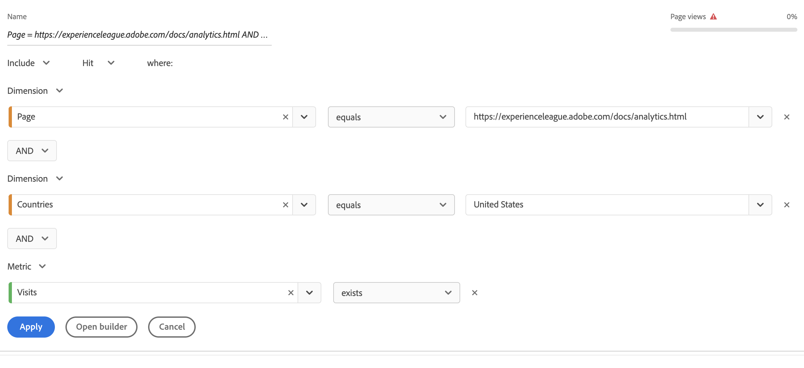

# Snelle segmenten

De snelle segmenten staan u toe om gegevens binnen een bepaald project gemakkelijk te onderzoeken, zonder de behoefte om een meer complex component-lijst segment in te creëren [segmentbuilder](/help/components/segmentation/segmentation-workflow/seg-build.md).

Houd rekening met het volgende wanneer u snelle segmenten maakt:

* De snelle segmenten zijn slechts op het project van toepassing waar zij werden gecreeerd. Ze zijn niet beschikbaar in andere projecten en kunnen niet worden gedeeld met andere gebruikers.
* Er zijn maximaal drie regels toegestaan.
* Geneste containers of opeenvolgende regels worden niet ondersteund.

In de volgende video ziet u hoe u snelle segmenten kunt gebruiken:

>[!VIDEO](https://video.tv.adobe.com/v/341466/?quality=12&learn=on)

## Een snel segment maken

Elke gebruiker in de Anlysis-werkruimte kan een snel segment maken.

Een snel segment maken:

1. Kies een van de volgende methoden om het snelsegment te maken:

   * **Ad hoc (slepen en neerzetten):** Sleep een component van de linkerspoorstaaf naar de neerzetzone naast de **Segment** in de koptekst van het deelvenster en selecteert u vervolgens het pictogram **Bewerken** pictogram om het segment aan te passen.

     

     >[!NOTE]
     >
     > Houd rekening met het volgende wanneer u een snel segment ad hoc maakt (slepen en neerzetten):
     > * De volgende componenttypen worden niet ondersteund: berekende metriek en dimensies, evenals metriek waaruit u geen segmenten kunt bouwen.
     > * Voor volledige afmetingen en gebeurtenissen maakt Analysis Workspace &#39;bestaande&#39; raaksegmenten. Voorbeelden: `Hit where eVar1 exists` of `Hit where event1 exists`.
     > * Als &quot;niet gespecificeerd&quot;of &quot;niets&quot;in de sectie van de segmentdaling wordt gelaten vallen, wordt het automatisch omgezet in een &quot;bestaat niet&quot;segment zodat het correct in segmenten wordt behandeld.

   * **Het segmentpictogram gebruiken:** Selecteer in een tabel met vrije vorm de optie **Segment** in de koptekst van het deelvenster.

     

1. Pas een van de volgende instellingen aan:

   | Instelling | Beschrijving |
   | --- | --- |
   | [!UICONTROL Name] | De standaardnaam van een segment is een combinatie van de regelnamen in het segment. U kunt de naam van het segment wijzigen in een vriendelijkere naam. |
   | [!UICONTROL Include/exclude] | U kunt of componenten in uw segmentdefinitie omvatten of uitsluiten, maar niet allebei. |
   | [!UICONTROL Hit/Visit/Visitor] container | Snelle segmenten omvatten één [segmentcontainer](https://experienceleague.adobe.com/docs/analytics/components/segmentation/seg-overview.html#section_AF2A28BE92474DB386AE85743C71B2D6) alleen dat u een dimensie/metrisch/datumbereik in het segment kunt opnemen (of het van) het segment kunt uitsluiten. [!UICONTROL Visitor] bevat overkoepelende gegevens die specifiek zijn voor de bezoeker in verschillende bezoeken en paginaweergaven. A [!UICONTROL Visit] Met de container kunt u regels instellen om de gegevens van de bezoeker op basis van bezoeken te splitsen, en een [!UICONTROL Hit] Met de container kunt u bezoekersinformatie onderverdelen op basis van afzonderlijke paginaweergaven. De standaardcontainer is [!UICONTROL Hit]. |
   | [!UICONTROL Components] (Dimension/metrisch/datumbereik) | Definieer maximaal 3 regels door componenten (afmetingen, metriek, datumbereiken of afmetingswaarden) toe te voegen. Er zijn drie manieren om de juiste component te vinden:<ul><li>Begin typend en de snelle segmentbouwer vindt automatisch de aangewezen component.</li><li>Gebruik de vervolgkeuzelijst om de component te zoeken.</li><li>Sleep componenten vanuit de linkerspoorstaaf.</li></ul> |
   | [!UICONTROL Operator] | Gebruik het vervolgkeuzemenu om standaardoperatoren te zoeken en [!UICONTROL Distinct Count] operatoren. Zie [Segmentoperatoren](/help/components/segmentation/seg-reference/seg-operators.md). |
   | plusteken (+) | Een andere regel toevoegen |
   | EN/OF kwalificatietekens | U kunt &quot;EN&quot;of &quot;OF&quot;bepalende eigenschappen aan de regels toevoegen, maar u kunt &quot;EN&quot;en &quot;OF&quot;in één enkele segmentdefinitie niet mengen. |
   | [!UICONTROL Apply] | Pas dit segment toe op het deelvenster. Als het segment geen gegevens bevat, wordt u gevraagd of u wilt doorgaan. |
   | [!UICONTROL Open builder] | Opent de Segment Builder. Nadat u sparen of het segment in de Bouwer van het Segment toepast, wordt het niet meer beschouwd als een &quot;snel segment&quot;. Het wordt deel van de component-lijst segmentbibliotheek. 
Als u de component beschikbaar wilt maken voor al uw projecten en in het linkerspoor, selecteert u de optie [!UICONTROL **Maak dit segment beschikbaar aan al uw projecten en voeg het aan uw componentenlijst toe**].

Zie de sectie voor meer informatie [Snel segment opslaan als een segment met een lijst met componenten](#save-a-quick-segment-as-a-component-list-segment) in dit artikel.

**Opmerking:** Alleen gebruikers met de machtiging Segment maken in het dialoogvenster [Adobe Admin Console](/help/admin/admin-console/permissions/analytics-tools.md) U kunt de Segment Builder openen.
 |
   | [!UICONTROL Cancel] | Annuleer dit snelle segment (pas het niet toe). |
   | [!UICONTROL Date range] | De validator gebruikt het datumbereik van het deelvenster voor het opzoeken van de gegevens. Maar elk datumbereik dat in een snel segment wordt toegepast, overschrijft het datumbereik van het deelvenster boven in het deelvenster. |
   | Voorvertoning (rechtsboven) | Hiermee kunt u zien of u een geldig segment hebt en hoe breed het segment is. Geeft de uitsplitsing aan van de gegevensset die u kunt verwachten wanneer u dit segment toepast. U zou een bericht kunnen krijgen dat erop wijst dat dit segment geen gegevens heeft. In dit geval kunt u doorgaan of de segmentdefinitie wijzigen. |

1. Selecteren [!UICONTROL **Toepassen**] om uw wijzigingen op te slaan.

## Snel segmenten bewerken

1. Houd de muisaanwijzer boven het snelle segment en selecteer de optie **Bewerken** pictogram.

   

1. Bewerk de segmentdefinitie en/of de segmentnaam.

1. Selecteren [!UICONTROL **Toepassen**].

## Snel segmenten opslaan als een segment met een lijst met componenten

>[!IMPORTANT]
>
> Houd rekening met het volgende wanneer u een snel segment opslaat:
> 
> * Als u een snel segment wilt opslaan, hebt u de machtiging Segment maken nodig in het dialoogvenster [Adobe Admin Console](/help/admin/admin-console/permissions/analytics-tools.md).
> 
> * Nadat u sparen of het segment toepast, kan het niet meer in de snelle segmentbouwer worden uitgegeven. In plaats daarvan moet u de gewone Segment Builder gebruiken.

U kunt snelle segmenten opslaan als een lijst met componenten. De voordelen van component-lijst segmenten omvatten:

* Beschikbaarheid voor al uw werkruimteprojecten
* Ondersteuning voor meer complexe segmenten en opeenvolgende segmenten

U kunt segmenten opslaan vanuit de snelle segmentBuilder of vanuit de [!UICONTROL Filter Builder].

### Opslaan in de functie Snel segment maken {#save2}

1. Nadat u het snelle segment hebt toegepast, houdt u de muisaanwijzer boven het segment en selecteert u het pictogram Info (&quot;i&quot;).
1. Selecteren **[!UICONTROL Make available to all projects and add to your component list]**.
1. (Optioneel) Wijzig de naam van het segment.
1. Selecteren **[!UICONTROL Save]**.

   Het segment wordt nu weergegeven in de lijst met componenten in de linkertrack. Let er ook op dat de zijbalk van het segment verandert van lichtblauw in donkerder blauw, wat aangeeft dat het segment niet langer kan worden bewerkt of geopend in de snelle segmentbuilder.

### Opslaan in de Segment Builder {#save3}

1. Nadat u het snelle segment hebt toegepast, houdt u de muisaanwijzer boven het segment en selecteert u het pictogram Info (&quot;i&quot;).
1. Selecteren **[!UICONTROL Save segment]**
1. (Optioneel) Wijzig de naam van het segment en selecteer [!UICONTROL **Toepassen**].

   Ga terug naar Workspace en merk op dat de zijbalk van het segment verandert van lichtblauw in donkerder blauw om aan te geven dat deze niet langer kan worden bewerkt of geopend in de snelle segmentbuilder. En door het op te slaan, wordt het onderdeel van de componentenlijst.

Nadat u het segment toepast, kunt u verkiezen om het aan uw lijst van de segmentcomponent toe te voegen en het ter beschikking te stellen van al uw projecten.

1. Houd de cursor boven het opgeslagen segment en selecteer het potloodpictogram.

1. Selecteren [!UICONTROL **Opbouwfunctie openen**].

1. Boven aan de Segment Builder ziet u de [!UICONTROL **Segment met alleen project**] dialoogvenster:

   

1. Schakel het selectievakje in naast **[!UICONTROL Make available to all your projects and add to your component list.]**

1. Selecteren **[!UICONTROL Save]**.

   Het segment verschijnt nu in uw lijst van de segmentcomponent voor al uw projecten.
U kunt [delen in het segment](https://experienceleague.adobe.com/docs/analytics/analyze/analysis-workspace/curate-share/curate.html#concept_4A9726927E7C44AFA260E2BB2721AFC6) met andere mensen in uw organisatie.

## Voorbeeld van snel segment

In het volgende voorbeeld van een segment worden afmetingen en metriek gecombineerd:

## Bekend probleem

1. Een snel segment maken met 2 items en **[!UICONTROL Save]** als test1.
1. Klikken **[!UICONTROL Save as]** en sla dit snelle segment als Test2 op.
1. Bewerk het snelle segment Test2 en sla het opnieuw op als Test2.
Bericht dat het Test1 snelle segment door Test2 wordt gewijzigd.
