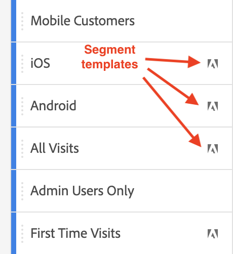

# Segmenten {#topic_DC2917A2E8FD4B62816572F3F6EDA58A}

U kunt verschillende typen segmenten maken in Workspace, afhankelijk van hoe complex ze moeten zijn, of ze alleen op dit project moeten worden toegepast, enzovoort. Hier volgt een overzicht van segmenttypen:

| Segmenttype | Waar gemaakt? | Waar van toepassing? | Wanneer gebruiken |
| --- | --- | --- | --- |
| Segment op lijst met componenten | Klik +, wat u aan [Segment Builder](/help/components/segmentation/segmentation-workflow/seg-build.md) | Al uw projecten van de Werkruimte | Voor complexere segmenten, opeenvolgende segmenten |
| Snel segment | [Quick segment builder](/help/analyze/analysis-workspace/components/segments/quick-segments.md) | [Alleen project](https://experienceleague.adobe.com/docs/analytics/analyze/analysis-workspace/components/segments/quick-segments.html?#what-are-project-only-segments%3F), maar u kunt de segmentlijst wel opslaan en uitbreiden. | Flexibiliteit om een of meer regels toe te voegen/te bewerken |
| Ad-hocsegmenten: |  |  |  |
| - Ad hoc-projectsegment van Workspace | [Sleep in segment dalingsstreek in een project](/help/analyze/analysis-workspace/components/segments/ad-hoc-segments.md) | [Alleen project](https://experienceleague.adobe.com/docs/analytics/analyze/analysis-workspace/components/segments/quick-segments.html?#what-are-project-only-segments%3F), maar u kunt de segmentlijst wel opslaan en uitbreiden. | Voor segmenten met één regel |
| - Op basis van cijfers berekend segment | [Berekende metrische builder](https://experienceleague.adobe.com/docs/analytics/components/calculated-metrics/calcmetric-workflow/metrics-with-segments.html) | Op berekende individuele metrieke waarde | Segment/s toepassen binnen uw metrische definitie |
| - op VRS gebaseerd segment | [Samenstellen van virtuele rapportsuite](https://experienceleague.adobe.com/docs/analytics/components/virtual-report-suites/vrs-workflow/vrs-create.html) | Naar afzonderlijke virtuele rapportsuite | Segment/s toepassen binnen uw VRS-definitie |

## Video&#39;s

Segmenten gebruiken in Analysis Workspace:

>[!VIDEO](https://video.tv.adobe.com/v/23977/?quality=12)

Segmenten zoeken en maken:

>[!VIDEO](https://video.tv.adobe.com/v/334092/?quality=12)

Schuivende datumbereiken in segmenten:

>[!VIDEO](https://video.tv.adobe.com/v/25403/?quality=12)

## Segmenten maken {#section_693CFADA668B4542B982446C2B4CF0F5}

In Analysis Workspace kunt u verschillende typen segmenten maken:

* [Snelle segmenten](/help/analyze/analysis-workspace/components/segments/quick-segments.md)
* [Ad-hocsegmenten](/help/analyze/analysis-workspace/components/segments/ad-hoc-segments.md)
* Regelmatige component-lijst segmenten die u in de Bouwer van het Segment creeert en die omhoog in de segmentbibliotheek (zie hieronder) beëindigen

### Segmenten maken voor lijsten met componenten {#section_3B07D458C43E42FDAF242BB3ACAF3E90}

De segmentrail onder het menu Componenten toont
* Segmenten die u of uw bedrijf heeft gemaakt
* Segmentsjablonen, zoals aangegeven door het Adobe-pictogram:

Als u een segment van dit type wilt maken, hebt u twee opties. Beide nemen je naar de [Segment Builder](/help/components/segmentation/segmentation-workflow/seg-build.md) in Adobe Analytics, waar u verdere instructies kunt vinden.

* Klik in de linkertrack op het plusteken (+) naast [!UICONTROL Segments]:

of

* Ga naar [!UICONTROL Components] > [!UICONTROL Segments]en klik vervolgens op [!UICONTROL + Add].

### Andere methoden voor het toepassen van segmenten {#section_10FF2E309BA84618990EA5B473015894}

>[!VIDEO](https://video.tv.adobe.com/v/30994/?quality=12)

Er bestaan verschillende andere methoden voor het toepassen van segmenten op een vrije-vormproject.

| Handeling | Beschrijving |
|--- |--- |
| Segment maken van selectie | Maak een inline-segment. Dit segment is alleen van toepassing op het geopende project en wordt niet opgeslagen als een analysesegment. 1. Selecteer rijen.  2. Klik met de rechtermuisknop op de selectie.  3. Klikken *Segment maken van selectie*. |
| Componenten > Nieuw segment | Toont de Bouwer van het Segment. Zie [Segment Builder](https://experienceleague.adobe.com/docs/analytics/components/segmentation/segmentation-workflow/seg-build.html) voor meer informatie over segmentatie. |
| Delen > Project delen of Delen > Projectgegevens krommen | In [Curven en delen](https://experienceleague.adobe.com/docs/analytics/analyze/analysis-workspace/curate-share/curate.html#concept_4A9726927E7C44AFA260E2BB2721AFC6)leert u hoe de segmenten die u op het project toepast, beschikbaar zijn in een gedeelde analyse voor de ontvanger. |
| Segmenten gebruiken als Dimension | Video: [Segmenten gebruiken als Dimension in Analysis Workspace](https://experienceleague.adobe.com/docs/analytics-learn/tutorials/analysis-workspace/applying-segments/using-segments-as-dimensions-in-analysis-workspace.html) |

## Segment-IQ

Segment-IQ (ook wel Segment Comparison genoemd) omvat de volgende kenmerken:

* [Het vergelijkingspaneel voor segmenten:](/help/analyze/analysis-workspace/c-panels/c-segment-comparison/segment-comparison.md) De kernfunctie in Segment-IQ. Sleep twee segmenten naar het deelvenster en bekijk een uitgebreid rapport met statistisch significante verschillen en overlappingen tussen de twee soorten publiek.
* [Segmenten in fallout vergelijken:](/help/analyze/analysis-workspace/visualizations/fallout/compare-segments-fallout.md) Zie hoe verschillende soorten publiek met elkaar vergelijken in de context van een fallout-visualisatie.

## Meer informatie

Ga voor een diepgaande discussie over segmentatie in Adobe Analytics naar [hier](/help/components/segmentation/seg-overview.md).
