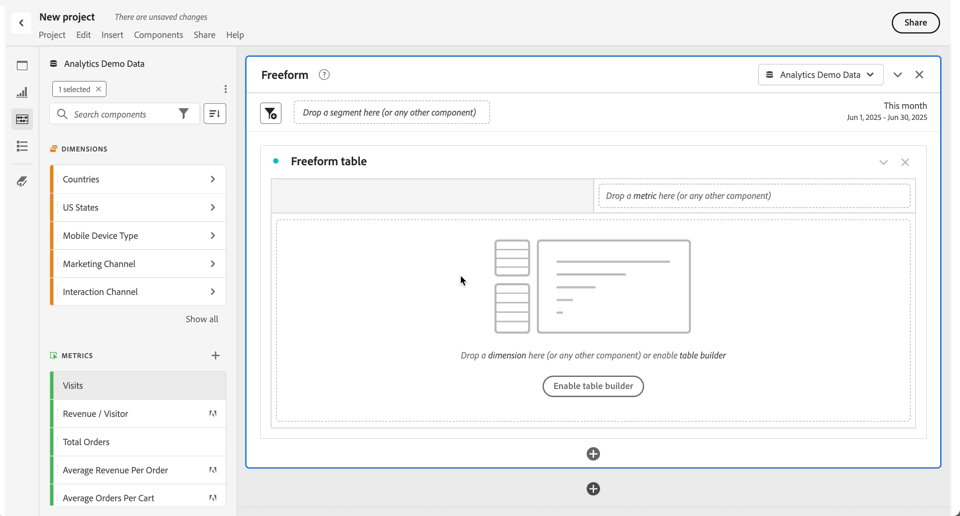

# Componenten in een project gebruiken

Componenten vormen de feitelijke gegevens van elk project in Analysis Workspace. Componenten bestaan uit afmetingen, metriek, segmenten en datumbereiken. U kunt componenten aan een project toevoegen door hen in visualisaties of panelen te slepen.

Zie het [ overzicht van Componenten ](/help/analyze/analysis-workspace/components/analysis-workspace-components.md) voor meer informatie over de types van componenten die u kunt toevoegen.

>[!TIP]
>
>Voor informatie over elke component, gebruik . Zie [ Info van de Component ](#component-info) voor meer informatie

## Componenten aan een project toevoegen

1. [ creeer een project in Analysis Workspace ](/help/analyze/analysis-workspace/build-workspace-project/create-projects.md).

1. [ voeg een paneel ](/help/analyze/analysis-workspace/c-panels/panels.md#create-a-panel) toe of [ voeg een visualisatie ](/help/analyze/analysis-workspace/visualizations/freeform-analysis-visualizations.md#add-visualizations-to-a-panel) aan het project in Analysis Workspace toe. Als u een component aan een leeg project toevoegt, wordt een vrije lijstvisualisatie reeds gecreeerd voor u.

1. Selecteer  **[!UICONTROL Components]** van het knooppaneel. Alle beschikbare componenten worden weergegeven in het linkerdeelvenster. Zie [ Interface ](/help/analyze/analysis-workspace/home.md#interface) voor meer details.

1. Blader naar of zoek naar de component die u wilt toevoegen en sleep deze naar een deelvenster of visualisatie in uw project.

1. U kunt een component naar keuze slepen naar de neerzetzone van het segment in een deelvensterkop. Met dit slepen en neerzetten definieert u de component als een segment en past u het segment toe op alle inhoud in het deelvenster.
Voor informatie over hoe u de sectie van het segmentdaling op een paneel kunt gebruiken om uw paneel te segmenteren, zie de [ streek van de Daling ](/help/analyze/analysis-workspace/c-panels/panels.md#drop-zone) in [ het overzicht van Comités ](/help/analyze/analysis-workspace/c-panels/panels.md).

1. Raadpleeg de volgende secties voor meer informatie:

   * [Afmetingen toevoegen aan een project](#add-dimensions-to-a-project)

   * [Metriek toevoegen aan een project](#add-metrics-to-a-project)

   * [Segmenten toevoegen aan een project](#add-segments-to-a-project)

   * [Datumbereiken toevoegen aan een project](#add-date-ranges-to-a-project)

### Afmetingen toevoegen aan een project

[ Afmetingen ](/help/components/dimensions/overview.md) zijn variabelen in Adobe Analytics die typisch koordwaarden bevatten. In tegenstelling, [ metriek ](/help/components/c-calcmetrics/cm-overview.md) bevatten numerieke waarden die aan een afmeting binden. Een basisrapport toont rijen van koordwaarden (afmeting), tegen een kolom van numerieke waarden (metrisch).

1. Begin toevoegend een afmeting aan uw project in Analysis Workspace, zoals die in [ wordt beschreven voegt componenten aan een project ](#add-components-to-a-project) toe.

1. Kies een van de volgende methoden om afmetingen toe te voegen en het type gegevens te bepalen dat u wilt analyseren:

    toe

   * Sleep een dimensie naar een visualisatie (zoals een vrije-vormlijst) in Analysis Workspace.

   * Sleep één of meerdere dimensies van het linkerpaneel op de gebied van het segmentdaling om een snel segment tot stand te brengen, zoals die in [ wordt beschreven voegt segmenten aan een project ](#add-filters-to-a-project) toe.

1. U kunt desgewenst dimensies en dimensie-items in Analysis Workspace opsplitsen met andere componenten. Voor meer informatie, zie [ de dimensies van de Onderbreking in Workspace ](/help/analyze/analysis-workspace/components/dimensions/t-breakdown-fa.md).

Voor meer informatie over hoe te om afmetingen in Analysis Workspace te gebruiken, zie &lbrace;de afmetingen van de Voorproef [, ](/help/analyze/analysis-workspace/components/dimensions/view-dimensions.md) de dimensies van de Onderbreking [, en ](/help/analyze/analysis-workspace/components/dimensions/t-breakdown-fa.md) tijd-ontledende dimensies [.](/help/analyze/analysis-workspace/components/dimensions/time-parting-dimensions.md)

### Metriek toevoegen aan een project

Met cijfers kunt u gegevenspunten in Analysis Workspace kwantificeren. Deze worden meestal gebruikt als kolommen in een visualisatie en zijn gekoppeld aan afmetingen.

Om metrisch aan een project in Analysis Workspace toe te voegen:

1. Begin metrisch aan uw project in Analysis Workspace toe te voegen, zoals die in [ wordt beschreven voegt componenten aan een project ](#add-components-to-a-project) toe.

1. Kies een van de volgende methoden om metrisch toe te voegen in Analysis Workspace:

   

   * Sleep metrisch aan de metrische dalingsstreek in een lege lijst Freeform om te zien dat metrisch over de de datumperiode van het project trended.

   * Sleep metrisch wanneer een afmeting aanwezig is om dat metrisch voor elk afmetingspunt te zien.

   * Sleep metrisch bovenop een bestaande metrische kopbal om het te vervangen.

   * Sleep metrisch naast de linkerzijde van juiste kant van een bestaande metrische kopbal om nieuwe metrisch toe te voegen.

   * Sleep metrische boven of onder een bestaande metrische kopbal om metrische overlapping tot stand te brengen.

Voor meer informatie over metriek, zie [ Metriek ](/help/analyze/analysis-workspace/components/apply-create-metrics.md).

### Segmenten toevoegen aan een project

[ Segmenten ](/help/components/segmentation/seg-overview.md) staan u toe om ondergroepen van personen, zittingen of gebeurtenissen te identificeren die op kenmerken of specifieke interactie worden gebaseerd.

U kunt segmenten in Analysis Workspace op de volgende manieren gebruiken:

* Segmenten toevoegen aan een deelvenster
Wanneer u segmenten toevoegt aan een deelvenster, worden de segmenten toegepast op alle inhoud in het deelvenster.
Voor informatie over hoe u de sectie van het segmentdaling op een paneel kunt gebruiken om uw paneel te segmenteren, zie de [ streek van de Daling ](/help/analyze/analysis-workspace/c-panels/panels.md#drop-zone) in [ het overzicht van Comités ](/help/analyze/analysis-workspace/c-panels/panels.md).

* Segmenten toevoegen aan een visualisatie
Wanneer u segmenten aan een kolom in een vrije-vormlijst toevoegt, zijn de segmenten op alle inhoud binnen de lijstkolom van toepassing. U kunt segmenten ook toevoegen als onderdeel van een uitvalvisualisatie.

* Segmenten in componenten gebruiken
Wanneer u componenten zoals [ berekende metriek ](/help/components/c-calcmetrics/c-workflow/cm-workflow/c-build-metrics/metrics-with-segments.md) bepaalt, [ annotaties ](/help/analyze/analysis-workspace/components/annotations/create-annotations.md#annotation-builder), of zelfs [ segmenten ](/help/components/segmentation/segmentation-workflow/seg-build.md) kunt u segmenten als deel van de definitie gebruiken.

### Datumbereiken toevoegen aan een project

[ de waaiers van de Datum ](/help/analyze/analysis-workspace/components/calendar-date-ranges/calendar.md) bepalen het rapporteringstijdkader in Analysis Workspace. En een gegevenswaaier kan op panelen binnen een project en ook op sommige visualisaties (zoals de lijst Freeform) worden toegepast.

Elk deelvenster bevat standaard een datumbereik. Er zijn meerdere manieren om een datumbereik voor een deelvenster bij te werken. Een manier om een datumbereik voor een deelvenster in Analysis Workspace bij te werken, is door een component met een datumbereik uit het linkerdeelvenster te slepen:

1. Naar keuze, voeg een datumwaaier aan uw project in Analysis Workspace toe, zoals die in [ wordt beschreven voegt componenten aan een project ](#add-components-to-a-project) toe.

1. Sleep een datumbereik vanuit het linkerdeelvenster naar:

   * Het huidige datumbereik om het datumbereik voor het deelvenster te wijzigen.

     

   * Een metrische of afmeting in de visualisatie van een Freeform-tabel. Zie [ de datumwaaiers van het Gebruik ](/help/analyze/analysis-workspace/components/calendar-date-ranges/calendar.md#use-date-ranges) voor meer informatie.

Voor meer informatie over hoe te om datumwaaiers in Analysis Workspace te gebruiken en te beheren, zie [ overzicht van de waaiers van de Datum ](/help/analyze/analysis-workspace/components/calendar-date-ranges/calendar.md).

## Componentinformatie

U kunt over om het even welke component bewegen om  te tonen. Wanneer u  selecteert, wordt popup getoond met extra informatie over de component.

Gebaseerd op uw toegangsbeheer, kunt u:

* Heb toegang tot de  &lbrace;voor de component.[!UICONTROL Data dictionary]
* Heb toegang tot  componentenbouwer waar de component wordt bepaald.

<!--
# Use components in Analysis Workspace

Components make up the actual data of any project in Analysis Workspace. Components consist of dimensions, metrics, segments, and date ranges. You can add components to a project by dragging them into visualizations or panels.

For overview information about the types of components you can add, see [Components overview](/help/analyze/analysis-workspace/components/analysis-workspace-components.md).

>[!TIP]
>
>For information about each component, select the Info icon next to a component's name in the left rail of Analysis Workspace, or see the [Analytics Components Guide](/help/components/home.md).

## Begin adding components to a project

1. [Create a project in Analysis Workspace](/help/analyze/analysis-workspace/build-workspace-project/create-projects.md) if you haven't already.

1. [Add a panel](/help/analyze/analysis-workspace/c-panels/panels.md) or [add a visualization](/help/analyze/analysis-workspace/visualizations/freeform-analysis-visualizations.md#add-visualizations-to-a-panel) to the project in Analysis Workspace. 

   If you add a component to a blank project, a freeform table visualization is automatically created.

1. Select the **[!UICONTROL Components]** icon in the left rail.

   

1. Scroll to or search for the component you want to add, then drag it to a panel or visualization within your project. 

1. (Optional) Drag a component to the segment drop zone in a panel header. 

   Segments apply to all content within the panel.

   For information about how you can use the segment drop zone on a panel to filter your panel, see [Drop zone](/help/analyze/analysis-workspace/c-panels/panels.md#drop-zone) in [Panels overview](/help/analyze/analysis-workspace/c-panels/panels.md).

   

1. For more detailed information, continue with one of the following sections, depending on the component type you are adding:

   * [Add dimensions to a project](#add-dimensions-to-a-project)

   * [Add metrics to a project](#add-metrics-to-a-project)

   * [Add segments to a project](#add-segments-to-a-project)

   * [Add date ranges to a project](#add-date-ranges-to-a-project)

## Add dimensions to a project

[Dimensions](/help/components/dimensions/overview.md) are variables in Adobe Analytics that typically contain string values. Common dimensions include [Page](/help/components/dimensions/page.md), [Referring domain](/help/components/dimensions/referring-domain.md), or an [eVar](/help/components/dimensions/evar.md). In contrast, [metrics](/help/components/metrics/overview.md) contain numeric values that tie to a dimension. A basic report shows rows of string values (dimension), against a column of numeric values (metric).

1. Start adding a dimension to your project in Analysis Workspace, as described in [Begin adding components to a project](#begin-adding-components-to-a-project).

1. Choose one of the following methods to add dimensions and determine the type of data you want to analyze:

   * Drag a dimension to a visualization (such as a freeform table) in Analysis Workspace.

     
   
   * Drag one or more dimensions from the left rail onto the segment drop zone to create an ad hoc segment, as described in [Add segments to a project](#add-segments-to-a-project).

     

1. (Optional) You can break down dimensions and dimension items in Analysis Workspace with other components. 

   For more information, see [Break down dimensions](/help/analyze/analysis-workspace/components/dimensions/t-breakdown-fa.md).

For more information about how to use dimensions in Analysis Workspace, see [Preview dimensions](/help/analyze/analysis-workspace/components/dimensions/view-dimensions.md), [Break down dimensions](/help/analyze/analysis-workspace/components/dimensions/t-breakdown-fa.md), and [Time-parting dimensions](/help/analyze/analysis-workspace/components/dimensions/time-parting-dimensions.md).

## Add metrics to a project

[Metrics](/help/analyze/analysis-workspace/components/apply-create-metrics.md) allow you to quantify data points in Analysis Workspace. They are most commonly used as columns in a visualization and tied to dimensions.

To add a metric to a project in Analysis Workspace:

1. Start adding a metric to your project in Analysis Workspace, as described in [Begin adding components to a project](#begin-adding-components-to-a-project).

1. Choose one of the following methods to add a metric in Analysis Workspace:

   * Drag a metric to the metric drop zone in an empty Freeform table to see that metric trended over the project's date period. 

     

   * Drag a metric when a dimension is present to see that metric compared to each dimension item. 

   * Drag a metric on top of an existing metric header to replace it.

   * Drag a metric next to a header to see both metrics side-by-side.

For more information about how to use metrics in Analysis Workspace, see [Metrics](/help/analyze/analysis-workspace/components/apply-create-metrics.md).

## Add segments to a project

[Segments](/help/components/segmentation/seg-overview.md) allow you to identify subsets of visitors based on characteristics or specific interactions.

You can use segments in Analysis Workspace in any of the following ways:

### Add segments to a panel

When you add segments to a panel, the segments apply to all content within the panel.

For information about how you can use the segment drop zone on a panel to filter your panel, see [Drop zone](/help/analyze/analysis-workspace/c-panels/panels.md#drop-zone) in [Panels overview](/help/analyze/analysis-workspace/c-panels/panels.md).

### Add segments to a column in a freeform table

When you add segments to a column in a freeform table, the segments apply to all content within the table column.

### Use segments when creating calculated metrics

In the Calculated metric builder, you can apply segments within your metric definition. 

For more information, see [Segmented metrics](/help/components/c-calcmetrics/c-workflow/cm-workflow/c-build-metrics/metrics-with-segments.md).

## Add date ranges to a project

[Date ranges](/help/analyze/analysis-workspace/components/calendar-date-ranges/custom-date-ranges.md) determine the reporting time frame in Analysis Workspace, and can be applied to one or more panels within a project.

Each panel includes a date range by default. There are multiple ways to update a date range for a panel. One way to update a date range for a panel in Analysis Workspace is to drag a date range component from the left rail:

1. Start adding a date range to your project in Analysis Workspace, as described in [Begin adding components to a project](#begin-adding-components-to-a-project).

1. Drag a date range from the left rail onto the current date range in the upper-right portion of the panel.

     

For more information about how to use calendars and date ranges in Analysis Workspace, see [Calendar and date ranges overview](/help/analyze/analysis-workspace/components/calendar-date-ranges/calendar.md).

-->