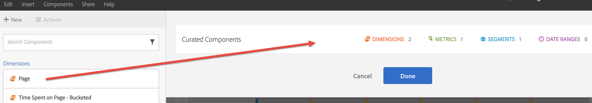

# Overzicht van Kromming/delen

Met Curatie kunt u de componenten beperken voordat u een project deelt. U kunt een project en zijn componenten met marketers en andere niet-analisten in uw zaken delen. Annoteer en pas markeringen op projecten toe.

**Video-overzicht**

>[!VIDEO](https://www.youtube.com/watch?v=LJJRskdmlOg&amp;index=79&amp;t=0s&amp;list=PL2tCx83mn7GuNnQdYGOtlyCu0V5mEZ8sS)

**[!UICONTROL Workspace]** > **[!UICONTROL Share]**> **[!UICONTROL Curate Project Data]**

## Projectgegevens wissen

1. Geef machtigingen op om projecten te maken en te beheren.

   Alvorens tot stand te brengen of een project van de Werkruimte van de Analyse te leiden, moeten de beheerders u aan een [groep](https://marketing.adobe.com/resources/help/en_US/reference/groups.html) met de toegelaten **[!UICONTROL Analysis Workspace Access]** toestemming, of aan de **[!UICONTROL All Report Access]** gebruikersgroep toevoegen. ( **[!UICONTROL Admin]** > **[!UICONTROL User Management]** > **[!UICONTROL Groups]**).

1. [Maak en sla](/help/analyze/analysis-workspace/build-workspace-project/t-freeform-project.md) een project op en klik vervolgens op **[!UICONTROL Share]** > **[!UICONTROL Curate Project Data]**.
1. Sleep componenten die u wilt delen van de sleepbare componentenstapel op de linkerzijde aan het **[!UICONTROL Curated Components]** gebied.

   

   >[!IMPORTANT]
   >
   >Het krommen van componenten wordt niet vereist voor het delen van een project. U kunt een project met alle beschikbare, standaardcomponenten, of met de geselecteerde componenten delen. Om alle standaardcomponenten in een project te bewaren, is een beste praktijk om een exemplaar van een project voor zich (het gebruiken **[!UICONTROL Save As]**) tot stand te brengen voorafgaand aan het krullen van componenten. Zodra u de componenten in een project leidt, zijn de andere componenten niet meer beschikbaar aan u voor dat project.

1. Klik op **[!UICONTROL Done]**.

Het resulterende project gedraagt zich als een typisch project in de Werkruimte van de Analyse, maar slechts met de gespecificeerde componenten om van te kiezen.

## Een beheerd project delen

Door delen is dit project beschikbaar voor andere gebruikers van de analysewerkruimte in uw organisatie. Elke curatie die u hebt uitgevoerd, wordt weerspiegeld wanneer anderen het project gebruiken.

1. Nadat u de componenten van een rapport hebt gebogen, klikt u **[!UICONTROL Share]** > **[!UICONTROL Share Project]**.

   

1. Ontvangers toevoegen.
1. (Optioneel) U kunt ingesloten projectcomponenten (segmenten, berekende metriek en datumbereiken) delen met alle ontvangers. Nadat deze componenten worden gedeeld, zullen deze in de componentendrop-down van de Werkruimte van de ontvanger verschijnen.

   >[!IMPORTANT]
   >
   >Deze instelling blijft niet bestaan. Het is een enkelvoudige actie op het moment van delen.

1. U kunt deze pagina desgewenst instellen als bestemmingspagina voor ontvangers.

   >[!IMPORTANT]
   >
   >Deze instelling blijft niet bestaan. Het is een enkelvoudige actie op het moment van delen.

1. Klik op **[!UICONTROL Share]**.

<!-- 

 <b>Annotate and tag a project</b> 
 

An alternative way to collaborate on a project is to use the Information panel. This panel will be re-introduced in an upcoming release. 
 

 
 
<ul id="ul_EFD045FD9F3B4BF8A70637B00EE0BC9C"> 
 <li id="li_EC6C5EAF9C234E76BDA7FF0226B82083">Tag reports for sharing. </li> 
 <li id="li_CF6A438C55F847F8890F8CB674CAA4F7">Specify the recipient (filter by permission group or user name), the storage folder. In-product notifications let users know that they have a shared report waiting. </li> 
 <li id="li_C8E088DA43024277908705CB0F3A142A">Write messages or report descriptions for recipients. </li> 
 <li id="li_342EB4758C344B859757E23691068FA3"> Select the dimensions, metrics, and segments to recommend to a non-analyst colleague, who can view the report you are curating and sharing. Curating the component gives the recipient access to those components, based on their permission settings. </li> 
 <li id="li_6487500F9315481599B7F3897998879F"> Add suggested items to a previously configured report. These new items exist as recommended selectable options. </li> 
</ul>

 -->

