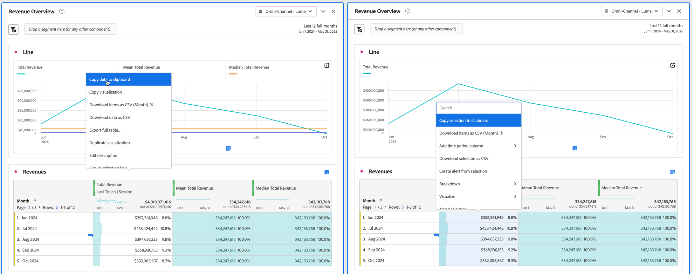

# Projecten en gegevens downloaden

U kunt Analysis Workspace-projecten en -gegevens downloaden naar uw lokale apparaat. Deze download kan gegevens, een CSV-bestand (door komma&#39;s gescheiden gegevens) of een PDF-document (Portable Document Format) zijn.

* Selecteer de optie PDF als u visualisaties wilt opnemen in het gedownloade bestand.
* Selecteer de CSV en gekopieerde gegevensopties als u eenvoudig gegevens zonder opmaak nodig hebt.

De extra methodes om de gegevens van Adobe Analytics uit te voeren worden beschreven in de [ gids van de Uitvoer ](/help/export/home.md).

## Een project downloaden als PDF- of CSV-bestand {#download-project}

### Een project downloaden als PDF-bestand

Houd rekening met het volgende wanneer u een project downloadt als een PDF:

* Laat het project pas over nadat het project naar het werkstation is gedownload. Het downloaden kan enkele minuten duren, aangezien het project opnieuw wordt uitgevoerd op Adobe-servers, zodat de PDF kan renderen. U kunt wijzigingen in het project blijven aanbrengen terwijl het downloaden wordt uitgevoerd. Als een PDF langer dan 5 minuten duurt om terug te geven, wordt u ertoe aangezet om [ PDF ](../curate-share/send-schedule-files.md) in plaats daarvan te e-mailen.
* Downloads worden weergegeven als één pagina zonder paginering.
* De PDF bevat wat zichtbaar is op de browserpagina in Analysis Workspace. Om afgekapte inhoud te vermijden, uitgezocht  aan auto-grootte om het even welke douane-gerangschikte visualisaties of panelen.
* [ Hyperlinks ](/help/analyze/analysis-workspace/visualizations/freeform-table/freeform-table-hyperlinks.md) binnen vrije vormlijsten zijn klikbaar in gedownloade PDF.

Een project downloaden als een PDF-bestand:

1. Selecteer **[!UICONTROL Project]** > **[!UICONTROL Download PDF]** .

   Een groene bar wordt getoond met het volgende bericht:  **[!UICONTROL Your download has been requested. Please wait.]**

1. Zodra uw download klaar is, verschijnt een groene bar met het volgende bericht:  **[!UICONTROL *Naam van het project *PDF is klaar.]**

1. Selecteer **[!UICONTROL Download]** op de groene balk.

   Afhankelijk van uw browserinstellingen wordt de PDF automatisch gedownload naar de map die u eerder hebt geconfigureerd, of wordt u gevraagd een map te kiezen waarin de PDF wordt gedownload.

   De dossier - naam wordt samengesteld uit *projectnaam* - *naam van de rapportreeks* - *datum*. Bijvoorbeeld `Example Project - Omni-Channel - Luma - Jun 30, 2025.pdf` .

### Een project downloaden als een CSV-bestand

1. Selecteer **[!UICONTROL Project]** > **[!UICONTROL Download CSV]** .

   Afhankelijk van de browserinstellingen wordt het CSV-bestand automatisch gedownload naar een map die u eerder hebt geconfigureerd, of wordt u gevraagd een map te kiezen waarin het CSV-bestand wordt gedownload.

   De dossier - naam wordt samengesteld uit *projectnaam* - *naam van de rapportreeks* - *datum*. Bijvoorbeeld `Example Project - Omni-Channel - Luma - Jun 30, 2025.csv` .

## Gegevens in een visualisatie kopiëren naar het klembord {#copy-data}

Met de optie **[!UICONTROL Copy to clipboard]** in het contextmenu kunt u snel gegevens van Analysis Workspace kopiëren en de gegevens in een hulpprogramma van derden plakken.

* Als u de getoonde lijstgegevens wilt kopiëren, selecteer de lijstkopbal en selecteer **gegevens van het Exemplaar aan klembord** van het contextmenu.
* Als u een ondergroep van de gekopieerde gegevens wilt, maak een selectie in de lijst en selecteer **selectie van het Exemplaar aan klembord** van het contextmenu.

>[!TIP]
>
>U kunt hotkey **_gebruiken cmd + c_** (macOS) of **_ctrl + c_** (Vensters) om uw selectie aan het klembord te kopiëren. Dan gebruik **_cmd + v_** (macOS) of **_ctrl + v_** (Vensters) om de gegevens te kleven.

{zoomable="yes"}

## Gegevens downloaden in een visualisatie als CSV-bestand {#download-data}

Met de download als CSV-opties in het contextmenu kunt u een gegevenslijst of de gegevensbron van een visualisatie als CSV downloaden.

Daartoe:

* Selecteer **[!UICONTROL Download data as CSV]** in het contextmenu in de koptekst van een tabel of visualisatie. Dit downloadt de getoonde gegevens in de lijst of de onderliggende gegevensbron voor visualisatie als CSV.

<!-- Only relevant as soon as CJA supports Map visualization 
  >[!NOTE]
  >
  >  Note: the Map visualization does not support this option.
-->

* Selecteer **[!UICONTROL Download selection as CSV]** in het contextmenu in een tabel. Alleen de selectie wordt met deze optie gedownload, in tegenstelling tot de volledige weergegeven tabel.

## Items downloaden als een CSV-bestand {#download-items}

Als u meer dan de zichtbare 400 rijen van gegevens in een lijst wilt analyseren, de uitgezochte **punten van de Download als CSV (_naam van Dimension_)** van het contextmenu van de lijstkopbal of om het even welke rij. Met deze optie exporteert u maximaal 50.000 dimensieitems (op basis van de tabelsortering) voor de geselecteerde dimensie, met sorteeropties en toegepaste filters. Als u deze optie boven aan de tabel selecteert, wordt de eerste afmeting in de tabel geëxporteerd.

Geen grenzen worden afgedwongen in de freeform lijst. Om optimale prestaties te garanderen, wordt aanbevolen deze optie te gebruiken in tabellen met minder dan 20 kolommen.

>[!TIP]
>
> Als uw afmeting meer dan 50.000 items bevat, downloadt u het bestand met verschillende maateenheden of past u een segment toe. U kunt bijvoorbeeld in één download aflopend sorteren op Bezoek en in een tweede download oplopend sorteren op Bezoek. Deze tip kan u helpen langer-staart punten terugwinnen.

U kunt meerdere taken uitvoeren in het project en zelfs naar een nieuw Workspace-project navigeren op hetzelfde tabblad terwijl het downloaden wordt uitgevoerd. Het downloaden wordt onderbroken als u een nieuw browsertabblad opent. Het downloaden wordt geannuleerd als u Workspace volledig verlaat of het browsertabblad sluit.

### Bestand met gedownloade items {#items-file}

De volgende functies van een vrije-vormtabel worden toegepast op het gedownloade bestand:

* Alle deelvenstersegmenten worden als filters toegepast.
* De onderbrekingen **boven** de geselecteerde afmeting in de lijst worden toegepast als filters boven elke kolom.
* De onderbrekingen **onder** worden de geselecteerde afmeting in de lijst verwijderd.

### Meldingen downloaden {#notifications}

Terwijl het bestand wordt gedownload, worden de volgende meldingen weergegeven:

* Een blauwe **[!UICONTROL _naam van de Lijst _-_ Dimension _.csv is gevraagd._ x _% volledig]**die op de vooruitgang wijzen. Selecteer **[!UICONTROL Cancel download]**als u het downloaden wilt annuleren. Selecteer  als u het bericht wilt sluiten, dat niet de download annuleert.
* Een groene **[!UICONTROL _naam van de Lijst _-_ Dimension _.csv is gedownload]**voltooiingsbericht zodra de dossierdownload wordt voltooid. Het bestand wordt gedownload naar de downloadmap die voor uw browser is geconfigureerd.

Als u meer dan één download tegelijk aanvraagt, ontvangt u een melding dat elke extra download in de wachtrij wordt geplaatst totdat de vorige download is voltooid.

## Veelgestelde vragen {#faq}

| Vraag | Antwoord |
| --- | --- |
| Waarom bestaat mijn gedownloade PDF uit slechts één pagina? | De [ functionaliteit van de Download PDF ](#download-as-csv-or-pdf) pagineert gedownloade PDFs niet. |
| Kan ik meer dan 50.000 items exporteren met de optie **[!UICONTROL Download items as CSV]** ? | Terwijl elke download tot 50.000 afmetingspunten kan bevatten, kunt u het soort van uw lijst veranderen om langere eindpunten terug te winnen, of een filter toepassen om specifiekere punten te downloaden. |
| Wat doet **[!UICONTROL Copy visualization]**? | In tegenstelling tot [!UICONTROL **gegevens van het Exemplaar aan klembord**] of [!UICONTROL **selectie van het Exemplaar aan klembord**], is de **[!UICONTROL Copy visualization]** optie van het contextmenu geen uitvoeroptie. Deze optie staat u toe om een visualisatie [ te kopiëren of ](/help/analyze/analysis-workspace/visualizations/freeform-analysis-visualizations.md#context-menu) een paneel [ van één plaats in Workspace aan een andere te kopiëren. ](/help/analyze/analysis-workspace/c-panels/panels.md#context-menu) Bijvoorbeeld van het ene naar het andere deelvenster in hetzelfde project of van het ene naar het andere project. |

<!--

# Download 

There are several ways to export data from Analysis Workspace. The method you choose depends on what set of data you want to analyze and who needs to access it.

Exported data can be in the form of copied data, CSV, or PDF. A PDF is typically preferred if you want visualizations included in the file. CSV and copied data is preferred if you simply want plain-text data.

## Download a project as CSV or PDF {#download-project}

Consider the following when downloading projects:

* When downloading projects as a CSV or PDF, the project can be saved or unsaved when you request a project download. However, only saved projects can be [scheduled](/help/analyze/analysis-workspace/curate-share/t-schedule-report.md). 

* When downloading projects as a PDF:
  * Downloads can take several minutes to export because the project is re-run on Adobe servers before rendering in PDF format. We recommend not leaving the project until the PDF downloads in your browser. However, you can continue to make changes to the project while you wait. If a PDF takes longer than 5 minutes to render, you will be prompted to email it instead.
  * Downloads are rendered as a single page with no pagination applied.
  * PDF renderings contain what is on the page in Workspace. If a project has custom-sized visualizations and panels, you need to change them to be auto-sized (button in top-right corner) so that there will be no truncated content.
  * Any [hyperlinks](/help/analyze/analysis-workspace/visualizations/freeform-table/freeform-table-hyperlinks.md) that exist within freeform tables are not functional in the downloaded PDF. 

To download a project as a CSV or PDF file:

1. Do either of the following, depending on what format you want to download the project in:

   * **PDF:** Select **[!UICONTROL Project]** > **[!UICONTROL Download PDF]**.

     Choose this option if you want the downloaded file to contain all the displayed (visible) tables and visualizations in the project.

   * **CSV:** Select **[!UICONTROL Project]** > **[!UICONTROL Download CSV]**. 

     Choose this option if you want plain-text data.

   

1. (Conditional) If you chose to download a PDF, a message is shown after the project is ready to be downloaded. Click [!UICONTROL **Download**].
1. Click the **[!UICONTROL Download this file]** icon and save the file to a folder of your choice.

## Copy data to clipboard (hotkey: cmd + c) {#copy-data}

The right-click option **[!UICONTROL Copy to clipboard]** lets you quickly copy data from Workspace and paste it in a third-party tool. 

* If you want the displayed table copied, right-click the table header and choose **Copy data to clipboard**. 
* If you want a subset of data copied, make a selection in the table and then right-click > **Copy selection to clipboard**.

>[!TIP]
>
>You can use the hotkey `Ctrl+C` to copy your selection to the clipboard, then use `Ctrl+V` to paste it into a third-party tool.

## Download data as CSV {#download-data}

The right-click option **[!UICONTROL Download data as CSV]** allows you to download a table of data or the data source of any visualization as a CSV.

* From the header of any table or visualization, right-click and choose **[!UICONTROL Download data as CSV]**. This downloads the displayed data in the table or the underlying data source for a visualization as a CSV. 

  >[!NOTE]
  >
  >  Note: the Map visualization does not support this option.

* Within a table, right-click and choose **[!UICONTROL Download selection as CSV]**. Only the selection is downloaded with this option, as opposed to the full, displayed table.

## Download items as CSV {#download-items}

If you want to analyze more than the visible 400 rows of data in a table, right-click the table header or any row and select **Download items as CSV (_Dimension name_)**. This option exports up to 50,000 dimension items (based on the table sort) for the selected dimension, with filters and segments applied. If you chose this option from the top of the table, the first dimension in the table will be exported. While no limits are enforced in the freeform table, it is recommended that the Download items option be used in tables with less than 20 columns to ensure optimal performance.

>[!TIP]
>
> If your dimension exceeds 50,000 items, download the file with different sort metrics applied or apply a filter. For example, sort descending by Visits in one download and then ascending by Visits in a second download. This tip can help you retrieve longer-tail items.

You can multi-task within the project and even navigate to a new Workspace project in the same tab while the download is in progress. The download pauses if you open a new browser tab. The download is canceled if you leave Workspace completely or close the browser tab.

### Downloaded items file 

Features of the table will be applied to the downloaded file as follows:

* All panel segments are applied as filters.
* Breakdowns **above** the selected dimension in the table are applied as filters above each column. 
* Breakdowns **below** the selected dimension in the table are removed.

In the example above, Page items are downloaded with the panel segment (New Visitors Customers) and components above (Marketing Channel = Email) applied as filters, and the components below (Mobile Device Type) removed from the downloaded CSV.

### Download notifications

As the file downloads, you will see an informational notification with the progress. At any time, you can cancel the download by clicking **[!UICONTROL Cancel download]**. Closing the toast **will not** cancel the download. 

Once the file completes, you will see a completion notification and the file will download to your browser.

If you request more than one download at a time, you will receive a notification that each additional download will be queued until the prior download completes.

## FAQ {#faq}

| Question | Answer |
| --- | --- |
| Why is my downloaded PDF one page? | Workspace does not paginate downloaded PDFs at this time. |
| Can I export more than 50,000 items with the "Download items as CSV" option? | While each download can contain up to 50,000 dimension items, you can change the sort of your table to retrieve longer tail items, or apply a filter to download more specific items. |
| What does **[!UICONTROL Copy visualization]** do? | Unlike [!UICONTROL **Copy data to clipboard**] or [!UICONTROL **Copy selection to clipboard**], the **[!UICONTROL Copy visualization]** right-click option is not an export option. It allows you to copy a visualization or panel from one place in Workspace to another. For example, from one panel to another in the same project, or from one project to another project. [Intra-linking video](https://experienceleague.adobe.com/docs/analytics-learn/tutorials/analysis-workspace/visualizations/intra-linking-in-analysis-workspace.html) |

-->