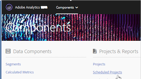

# Geplande projectmanager

Beheer de geplande projecten van de Werkruimte van de Analyse.

**[!UICONTROL Analytics]** > **[!UICONTROL Components]** > **[!UICONTROL Scheduled Projects]**.

In de Geplande Manager van Projecten, kunt u terugkomende projectleveringen uitgeven en schrappen. U kunt leveringsschema&#39;s maken die uw rapporten via e-mail naar een opgegeven adres verzenden. U kunt deze programma&#39;s vormen om de rapporten met gespecificeerde intervallen voor een tijdsduur of voor onbepaalde tijd automatisch te verzenden, of de levering van een terugkerend project tegen te houden.

De Geplande Manager van Projecten toont de punten die een specifieke gebruiker heeft gecreeerd. Als de gebruikersaccount in de toepassing is uitgeschakeld, worden alle geplande leveringen gestopt.

* Bewerk de geplande projecten.
* Bekijk identiteitskaart van het Programma van een project (die hoofdzakelijk voor het zuiveren doeleinden wordt gebruikt).
* Zoeken naar geplande projecten.
* Gepaste projecten labelen.
* Geef de eigenaar van een gepland project op of wijzig deze.
* Voeg andere filters toe, zoals Goedgekeurd, Mislukt, Favorieten, Mijnbouw, Alles tonen en Verlopen projecten.

* Definieer een geplande vervaldatum voor projecten.

