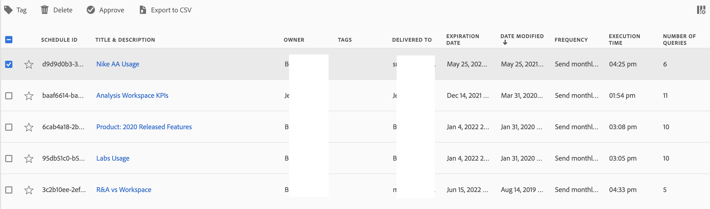

# Projecten plannen

Vanuit de werkruimte **Menu Delen**, kunt u Analysis Workspace-projecten via e-mail naar geselecteerde ontvangers verzenden. Bestanden kunnen in CSV- of PDF-indeling worden verzonden.

## Bestand nu verzenden

Een bestand direct via e-mail naar ontvangers verzenden:

1. Klik op **[!UICONTROL Share]>[!UICONTROL Send File Now]**.
1. Geef het bestandstype op (CSV of PDF).
1. (Optioneel) Voeg een beschrijving toe die in de e-mail wordt opgenomen om uit te leggen welk bestand wordt ontvangen.
1. Voeg ontvangers of groepen toe. U kunt ook e-mailadressen invoeren.
1. Klik op **[!UICONTROL Send Now]**.
1. (Optioneel) Klik op **[!UICONTROL Show scheduling options]** om een leveringsschema op te geven.

## Bestand verzenden volgens schema

Een bestand volgens een terugkerend schema via e-mail naar ontvangers verzenden:

1. Klik op **[!UICONTROL Share]>[!UICONTROL Send File on Schedule]**.
1. Geef het bestandstype op (CSV of PDF).
1. (Optioneel) Voeg een beschrijving toe die in de e-mail wordt opgenomen om uit te leggen welk bestand wordt ontvangen.
1. Voeg ontvangers of groepen toe. U kunt ook e-mailadressen invoeren.
1. Geef het bereik op waarover de planning moet worden geleverd door Starten op en Eindigen op de invoer te wijzigen. De einddatum moet binnen een jaar zijn vanaf de dag dat het schema wordt opgesteld of gewijzigd.
1. Geef de leveringsfrequentie op. Elke frequentie maakt verschillende aanpassingen mogelijk.
1. Klik op **[!UICONTROL Send on schedule]**.

## Geplande projectmanager

Geplande Analysis Workspace-projecten kunnen worden beheerd in het kader van **Analyse > Componenten > Geplande projecten**.

In de Geplande Manager van Projecten, kunt u terugkomende projectprogramma&#39;s uitgeven en schrappen. Zoek naar een programma in de onderzoeksbar of door de filteropties in het linkerspoor te gebruiken. U kunt filteren op tag, goedgekeurde schema&#39;s, eigenaars en meer.

| Veld | Beschrijving |
| --- | --- |
| [!UICONTROL Favorites] | Als u het sterpictogram selecteert, wordt dit schema een favoriet. |
| [!UICONTROL Schedule ID] | Deze id wordt vooral gebruikt voor foutopsporingsdoeleinden. |
| [!UICONTROL Title and Description] | Titel en beschrijving van dit project. |
| [!UICONTROL Owner] | De persoon die het project heeft gemaakt en bezit. |
| [!UICONTROL Tags] | (facultatief) het etiketteren is een goede manier om projecten te organiseren. Alle gebruikers kunnen labels maken en een of meer tags toepassen op een project. U kunt echter alleen labels zien voor de projecten die u hebt of die met u zijn gedeeld. |
| [!UICONTROL Delivered To] | De ontvanger(s) van dit geplande project. |
| [!UICONTROL Expiration Date] | Voor om het even welke geplande projectfrequentie, kunt u de vervaldatum voor maximaal één jaar in de toekomst plaatsen. |
| [!UICONTROL Frequency] | Hoe vaak wilt u dat dit planningsproject naar de ontvanger(s) wordt verzonden. |
| [!UICONTROL Execution Time] | Op welk tijdstip van de dag dit geplande project wordt verzonden. |
| [!UICONTROL Number of Queries] | Het aantal vragen tegen dit project. |

## Gemeenschappelijke acties

Het volgende is gemeenschappelijke acties in de Geplande Manager van Projecten:

| Handeling | Beschrijving |
|---|---|
| **[!UICONTROL Edit schedule]** | Klik op de titel van de planning om de leveringsinstellingen bij te werken. |
| **[!UICONTROL Delete schedule]** | Selecteer het geplande project in de lijst en klik dan Schrapping van het menu. Hiermee verwijdert u het geselecteerde schema voor het project. het project zelf wordt niet verwijderd . |
| **[!UICONTROL Add tags]** | Selecteer het geplande project in de lijst en kies &quot;Tag&quot; of &quot;Goedkeuren&quot; om uw schema&#39;s te ordenen en ze gemakkelijker te maken om naar te zoeken. |
| **[!UICONTROL View failed schedules]** | Navigeer naar de linkertrack > Overige filters > Kan geen mislukte planningen zien. |
| **[!UICONTROL View expired schedules]** | Navigeer naar de linkerrail > Andere filters > Verlopen om programma&#39;s te zien die zijn verlopen. Klik de titel van het programma aan opstelling een nieuw leveringsprogramma. |
| **[!UICONTROL View schedule ID]** | Navigeer naar kolomopties rechtsboven en voeg de kolom Id van planning toe aan de tabel. De geplande id is vaak handig voor foutopsporing. |

De Geplande Manager van Projecten toont de punten die een specifieke gebruiker heeft gecreeerd. Als de gebruikersaccount in de toepassing is uitgeschakeld, worden alle geplande leveringen gestopt. De geplande projecteigendom kan worden **overgedragen** aan een nieuwe gebruiker onder **Beheer > Gebruikers en middelen voor analyse > Middelen voor gegevensoverdracht**.
