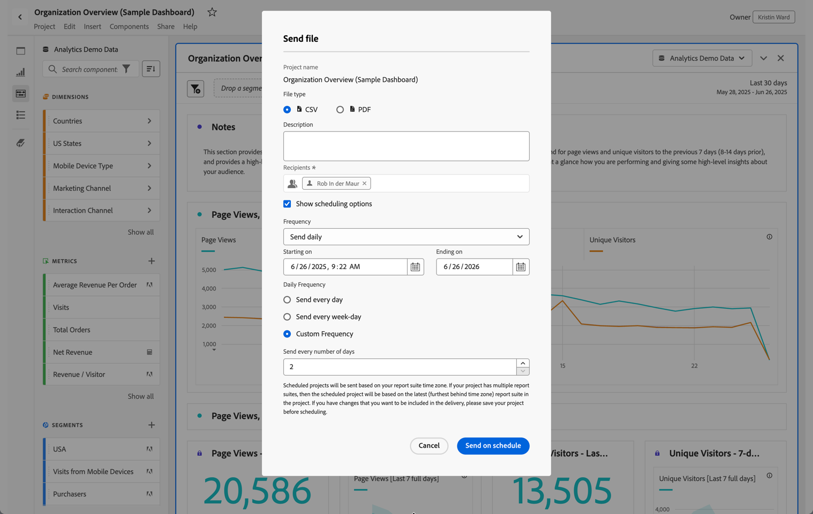
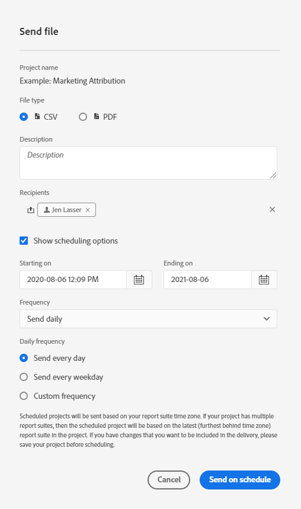

# Projecten verzenden en plannen

U kunt Adobe Analytics-projecten als bestanden via e-mail naar geselecteerde gebruikers verzenden. U kunt bestanden ad hoc verzenden of u kunt bestanden configureren voor verzending volgens een schema.

Houd rekening met het volgende wanneer u bestanden verzendt:

* Bestanden kunnen in CSV- of PDF-indeling worden verzonden.

* Alle tags die op het project zijn toegepast, worden automatisch toegepast op het exporteren.

Andere methodes om de gegevens van Adobe Analytics uit te voeren zijn ook beschikbaar, zoals die in [&#x200B; wordt beschreven Overzicht van de Uitvoer &#x200B;](/help/export/home.md).

## Bestand verzenden

Een bestand ad-hoc naar ontvangers verzenden via e-mail:

1. Selecteer **[!UICONTROL Share]>[!UICONTROL Send file]** .
1. Geef het bestandstype op:
   * [!UICONTROL **CSV**]: Kies deze optie als u onbewerkte-tekstgegevens wilt.
   * [!UICONTROL **PDF**]: Kies deze optie als u het gedownloade dossier alle getoonde (zichtbare) lijsten en visualisaties in het project wilt bevatten.
1. (Optioneel) Gebruik **[!UICONTROL Description]** om een beschrijving toe te voegen die u in de e-mail wilt opnemen.
1. Voeg ontvangers of groepen toe. U kunt ook e-mailadressen invoeren.
1. (Facultatief) selecteer **[!UICONTROL Show scheduling options]** om [&#x200B; een dossieruitvoer &#x200B;](#schedule-file-export) te plannen.
1. Klik op **[!UICONTROL Send Now]**. Selecteer **[!UICONTROL Cancel]** om te annuleren.

## Bestanden exporteren plannen {#schedule}

Een bestand volgens een schema per e-mail naar ontvangers verzenden:

1. Selecteer **[!UICONTROL Share]>[!UICONTROL Schedule file export]** .
1. Geef het bestandstype op:
   * [!UICONTROL **CSV**]: Kies deze optie als u onbewerkte-tekstgegevens wilt.
   * [!UICONTROL **PDF**]: Kies deze optie als u het gedownloade dossier alle getoonde (zichtbare) lijsten en visualisaties in het project wilt bevatten.
1. (Optioneel) Gebruik **[!UICONTROL Description]** om een beschrijving toe te voegen die u in de e-mail wilt opnemen.
1. Voeg ontvangers of groepen toe. U kunt ook e-mailadressen invoeren.
1. (Slechts voor de klanten van het Schild van de Gezondheidszorg) verstrek een wachtwoord aan [&#x200B; wachtwoord-beschermt een gepland rapport &#x200B;](#password-protect-a-new-scheduled-project).
1. Zorg ervoor dat **[!UICONTROL Show scheduling options]** is geselecteerd.
1. Selecteer een **[!UICONTROL Frequency]** . U kunt kiezen tussen:

   | Frequentie | Opties |
   |---|---|
   | **[!UICONTROL Send hourly]** | Voer een waarde in voor **[!UICONTROL Send every number of hours]** . |
   | **[!UICONTROL Send daily]** | Selecteer een **[!UICONTROL Daily frequency]**: **[!UICONTROL Send every day]**, **[!UICONTROL Send every weekday]** of **[!UICONTROL Custom frequency]** .  Als u **[!UICONTROL Custom frequency]** selecteert, ga een waarde voor **[!UICONTROL Send every number of days]** in. |
   | **[!UICONTROL Send weekly]** | Voer een waarde in voor **[!UICONTROL Send every number of weeks]** . Selecteer een **[!UICONTROL Day of week]** . |
   | **[!UICONTROL Send monthly by day of the week]** | Selecteer een **[!UICONTROL Day of week]** en een **[!UICONTROL Week of month]** . |
   | **[!UICONTROL Send monthly by day of the month]** | Selecteer een waarde in **[!UICONTROL Send on this day of the month]** . |
   | **[!UICONTROL Send yearly by day of the month]** | Selecteer een **[!UICONTROL Day of week]** , selecteer een **[!UICONTROL Week of month]** en selecteer een **[!UICONTROL Monthly of year]** . |
   | **[!UICONTROL Send yearly by specific date]** | Selecteer een **[!UICONTROL Month of year]** en selecteer een waarde in **[!UICONTROL Send on this day of the month]** . |

1. Voer een begindatum in in **[!UICONTROL Starting on]** . Alternatief, selecteer  om een begindatum van de kalender te kiezen.

1. Voer een einddatum in in **[!UICONTROL Ending on]** . Alternatief, selecteer  om een einddatum van de kalender te kiezen.
1. Selecteer **[!UICONTROL Send on schedule]** . Selecteer **[!UICONTROL Cancel]** om te annuleren.

## Geplande projectmanager {#manager}

Geplande Analysis Workspace-projecten kunnen worden beheerd vanuit de hoofdinterface via **[!UICONTROL Components]** > **[!UICONTROL Scheduled Projects]** . Voor meer informatie, zie [&#x200B; Geplande projecten &#x200B;](/help/components/scheduled-projects-manager.md).

<!--
# Schedule projects

From the Workspace **Share menu**, you can send Analysis Workspace projects using email to selected recipients. Files can be sent in CSV or PDF format. After you share scheduled projects, you can edit the schedule settings to modify the frequency, receipient list, or file type using the Scheduled Projects manager.

## Send file now

To send a file immediately to recipients via email:

1. Click **[!UICONTROL Share] > [!UICONTROL Export file]**.
1. Specify the file type:
   * [!UICONTROL **CSV**]: Choose this option if you want plain-text data.
   * [!UICONTROL **PDF**]: Choose this option if you want the downloaded file to contain all the displayed (visible) tables and visualizations in the project.
1. (Optional) Add a description to include in the email to explain the file being received. 
1. Add recipients or groups. Email addresses can also be entered. 
1. Click **[!UICONTROL Send Now]**.
1. (Optional) Click **[!UICONTROL Show scheduling options]** to specify a delivery schedule.

## Send file on schedule

To send a file on a recurring schedule to recipients via email:

1. Click **[!UICONTROL Share] > [!UICONTROL Schedule file export]**.
1. Specify the file type (CSV or PDF).
1. (Optional) Add a description that will be included in the email to explain the file being received. 
1. Add recipients or groups. Email addresses can also be entered. 
1. Specify the range the schedule should be delivered over by modifying Starting on and Ending on inputs. The end date must be within a year from the day the schedule is created or modified.
1. Specify the delivery frequency. Each frequency allows for different customizations. 
1. Click **[!UICONTROL Send on schedule]**.

## Manage scheduled projects

When you manage scheduled projects, you can edit and delete recurring project schedules:

*  Change the file type (.csv or PDF)
*  Update the project description
*  Add or remove recipients
*  Change the frequency

Scheduled Analysis Workspace projects can be managed under **Analytics > Components > Scheduled Projects**.

For more information, see [Scheduled projects](/help/components/scheduled-projects-manager.md)
-->
