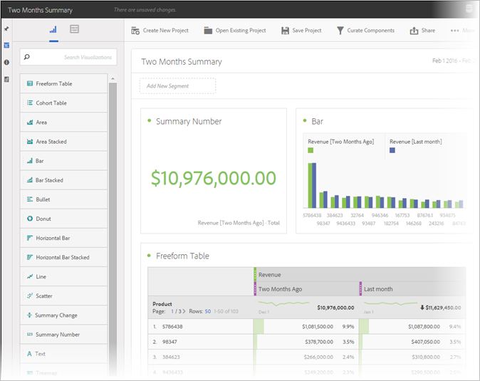
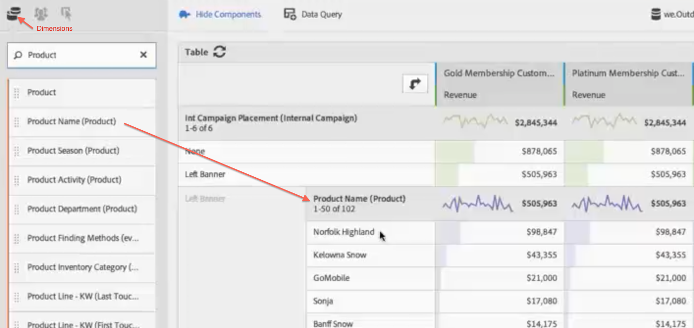
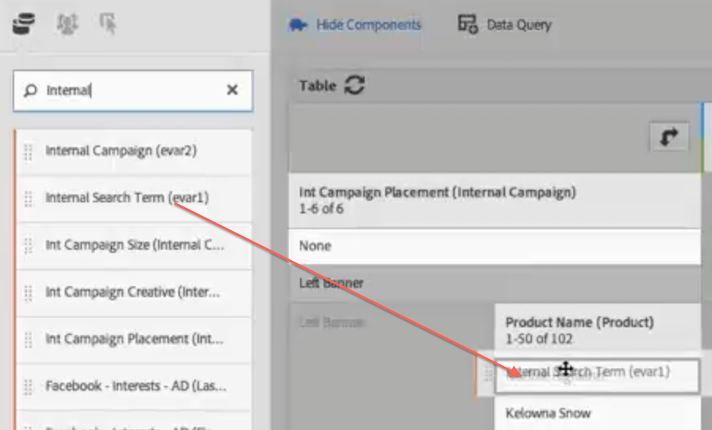

# Analysis Workspace-gebruiksscenario&#39;s

Gebruiksvoorbeelden van datatabellen en segmenten, en gebruikscenario&#39;s voor Analysis Workspace.

U kunt dataonderzoek richten op specifieke vragen en verhalen samenstellen over de interacties van uw klant en de interesses van uw doelgroep. In een vrije-vormomgeving kunt u dimensies, metrics, en segmenten over een tijdspanne toepassen en direct doelgerichte data ophalen. Geef uw analyse de gewenste vorm en pas deze aan voor specifieke vragen. Publiceer de informatie in overzichtelijke rapporten met media en visualisaties die heel eenvoudig kunnen worden gedeeld en geïnterpreteerd, zelfs als de zakelijke frontline-gebruiker het erg druk heeft.

**Voorbeelden**

* Als mediabedrijf wilt u waarschijnlijk nieuwe bezoekers vergelijken met uw terugkerende bezoekers en uw meest loyale bezoekers om te zien hoe de consumptie van content in de loop der tijd voor elk ander segment verandert.
* Vergelijk de conversiepercentages voor trefwoorden met en zonder merknaam.
* Splits paginaweergaven op per interne of externe zoekopdracht of per landingspagina, enz. en achterhaal waarom termen met en zonder merknaam verschillend presteren.
* Vergelijk dagen met voorgaande dagen en vergelijk kolommen en rijen om de groeiresultaten voor meerdere metrics te analyseren.
* Voer een eenvoudige query uit, zoals het aantal &#39;bounces&#39; per dimensie.

## Voorbeeld van detailhandel {#section_9EFDEF038CAD4954BCFB118A8F33A96F}

Stel dat u marketinganalist bent voor een retailer in outdoorskleding en u wordt gevraagd om het succes van een recente herfstpromotie te onderzoeken en aanbevelingen te doen voor het verbeteren van lokale campagnes. Dit voorbeeld toont hoe u de data van de campagneopbrengst voor verschillende segmenten kunt vergelijken en onderverdelingen toevoegen voor een diepgaande analyse van de campagne.

1. Selecteer de gewenste rapportsuite.
1. Zoek bijvoorbeeld naar de dimensie voor interne campagneplaatsingen en sleep deze naar de linkersectie van het tabelcanvas (deze data vormen de tabelrijen.)

   

1. Klik nu op het segmentpictogram linksboven en sleep verschillende klantloyaliteitssegmenten naar de rechterhelft van het canvas. U gaat de segmenten direct met elkaar vergelijken. Dit worden de tabelkolommen.

   

1. Klik op het pictogram voor gebeurtenissen (metrics) linksboven en voeg de metric voor omzet toe onder elk segment. Merk op hoe het rapport automatisch wordt vernieuwd. Nu kunt u de campagneomzet voor deze klantensegmenten vergelijken.

   

1. Als u bijvoorbeeld wilt zien welke producten in de linkerbanner van uw pagina&#39;s het meest effectief waren, splitst u de linkerbanner uit op de productnaam. Klik op het pictogram voor dimensies en sleep en plaats de dimensie voor de productnaam op de linkerbanner.

   

1. Maar u kunt nog gedetailleerder analyseren. U kunt zich bijvoorbeeld afvragen met welke zoektermen werd gezocht naar uw meest verkochte product, Norfolk Highland. In dat geval hoeft u alleen maar de dimensie voor de interne zoekterm te slepen en op de productnaam te plaatsen:

   

   Er wordt een nieuw uitsplitsingsresultaat weergegeven:

   

   U hebt de data al zo uitgesplitst dat u aanbevelingen en cross-sell-opties kunt bieden aan uw merchandisingteams die ze in andere campagnes kunnen implementeren om de bedrijfsomzet te verhogen. U kunt meer gedetailleerde uitsplitsingen maken tot u de gewenste resultaten krijgt.

   Nu kunt u het rapport [delen](/help/analyze/analysis-workspace/curate-share/curate.md) met de merchandisingteams.

## Cross-sell Analysis in Analysis Workspace

Hier volgt een video over dit onderwerp:

>[!VIDEO](https://video.tv.adobe.com/v/25864/?quality=12)

## Analyse op verschillende tabbladen gebruiken voor standaardmarketingtoewijzing

Er zijn vele manieren u uw attributiemethodologie aan het volgende niveau met Adobe Analytics kunt nemen. In deze video, benadrukken wij hoe u diepere inzichten uit het rapport van de Kanalen van de Marketing kunt voortbrengen gebruikend dwars-lusanalyse in Werkruimte.

>[!VIDEO](https://video.tv.adobe.com/v/39237/?quality=12)

## Deelnamemetriek gebruiken in Analysis Workspace

In deze video wordt getoond hoe u participatiemetriek kunt ophalen aan de hand van berekende meetgegevens:

>[!VIDEO](https://video.tv.adobe.com/v/41266/?quality=12)
