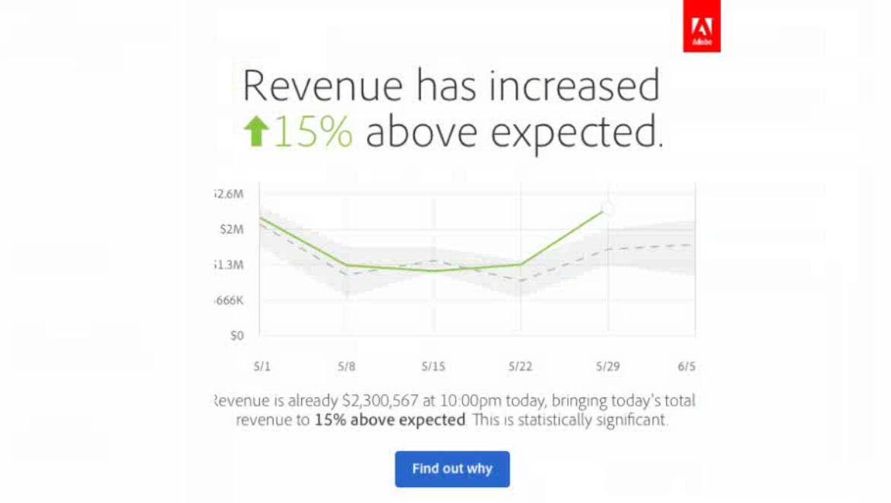
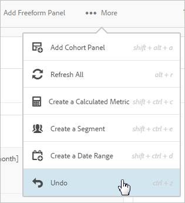
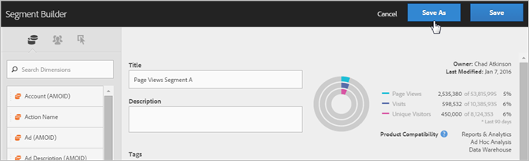
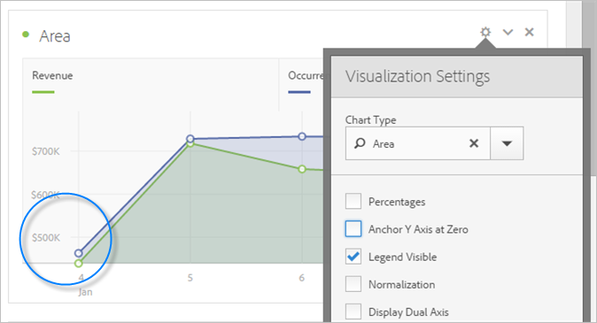
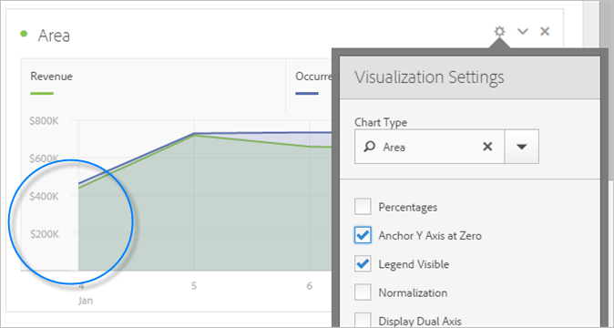

# Nieuwe functies in de analysewerkruimte

## april 2020

Nieuwe functie uitgebracht op 16 april 2020.

| Functie | Beschrijving |
|--- |--- |
| Automatisch samenstellen [!UICONTROL Freeform Tables] vanuit een leeg frame | Eerder kon u componenten niet direct in een leeg project of leeg paneel laten vallen; u moest eerst een vrije vormlijst toevoegen. U kunt componenten nu rechtstreeks in een leeg project of deelvenster neerzetten. Een vrije-vormtabel wordt automatisch voor u gemaakt in een aanbevolen indeling. Bovendien zijn verbeteringen aangebracht in de manier waarop gemengde componenttypen (zoals afmetingen en metriek) worden verwerkt wanneer deze samen in een lege component worden neergezet [!UICONTROL Freeform Table] . |

## maart 2020

Nieuwe functies uitgebracht op 12 maart 2020.

| Functie | Beschrijving |
|--- |--- |
| Ondersteuning voor meerdere rapportsuite in Workspace | U kunt gegevens van veelvoudige rapportreeksen in één enkel project nu brengen om zij aan zij te bekijken. [Meer informatie...](https://docs.adobe.com/content/help/en/analytics/analyze/analysis-workspace/build-workspace-project/multiple-report-suites.html) |
| Sjabloon voor trainingszelfstudie | Dit nieuwe standaardmalplaatje begeleidt u door gemeenschappelijke terminologie en stappen voor het bouwen van uw eerste analyse in Werkruimte. Het is beschikbaar als standaardmalplaatje in Nieuw Project modaal en vervangt het steekproefproject dat vandaag voor nieuwe gebruikers bestaat die geen andere projecten in hun lijst hebben. [Meer informatie...](/help/analyze/analysis-workspace/build-workspace-project/starter-projects.md) |

## februari 2020

Nieuwe functies uitgebracht op 20 februari 2020.

| Functie | Beschrijving |
|--- |--- |
| Nieuwe werkruimtemalplaatje voor organisaties die Apparaatanalyse gebruiken | In deze sjabloon ziet u hoe effectief CDA is bij het samenvoegen van bezoeken en leert u over exclusieve CDA-dimensies en metriek. Er is een rapportenpakket met CDA vereist. Zie [Apparaatanalyse](https://docs.adobe.com/content/help/en/analytics/components/cda/cda-setup.html) instellen voor meer informatie. |
| Nieuwe sneltoetsen in Workspace | <ul><li>Alle deelvensters samenvouwen/uitvouwen: `alt + m`</li><li>Actief deelvenster samenvouwen/uitvouwen: `alt + ctrl + m`</li><li>Linkerspoor zoeken: `ctrl + /`</li><li>Naar volgend deelvenster gaan: `alt + Right Key`</li><li>Naar vorig deelvenster gaan: `alt + Left Key`</li></ul>[Meer informatie...](https://docs.adobe.com/content/help/en/analytics/analyze/analysis-workspace/build-workspace-project/fa-shortcut-keys.html) |
| Andere werkruimtesamenhogingen | <ul><li>Wanneer een deelvenster of visualisatie in Workspace wordt neergezet, wordt automatisch overgeschakeld naar componenten voor een naadloze workflow.</li><li>Sjablooncomponenten kunnen nu worden geactiveerd (bijvoorbeeld gelabeld, geprivilegieerd, goedgekeurd).</li><li>De gefilterde metrische lijst en de segmentlijsten bieden + knoop aan om een nieuwe component toe te voegen als u niet vindt wat u nodig hebt.</li></ul> |
| Foutopsporing werkruimte | Foutopsporing van de Werkruimte is toegevoegd aan het menu van de Hulp, die u een naadloze manier geeft om het voor het zuiveren van de verzoeken van de Werkruimte toe te laten. [Meer informatie...](https://www.adobe.io/apis/experiencecloud/analytics/docs.html#!AdobeDocs/analytics-2.0-apis/master/reporting-tricks.md) |

## januari 2020

Nieuwe functie uitgebracht op 16 januari 2020.

| Functie | Beschrijving |
|--- |--- |
| [Freeform Table Builder](https://docs.adobe.com/content/help/en/analytics/analyze/analysis-workspace/visualizations/freeform-table.html) | Met toegelaten de Bouwer van de Lijst, kunt u slepen en in vele dimensies, onderverdelingen, metriek en segmenten laten vallen om lijsten te bouwen die complexere bedrijfsvragen beantwoorden. Gegevens worden niet meteen bijgewerkt. In plaats daarvan vindt de update plaats nadat u hebt geklikt **[!UICONTROL Build]**, zodat u tijd bespaart wanneer u weet welke tabel u wilt samenstellen. Bovendien biedt deze functie:<ul><li>**Voorvertoning**: U kunt een voorvertoning van de indeling van een tabel weergeven voordat u tijd besteedt aan het renderen van echte gegevens.</li><li>**Flexibele instellingen voor** rij en uitsplitsing: U kunt uw rij en verdelingsniveaus voor elke afmetingsrij plaatsen. Eerder werden in Workspace standaardinstellingen ingesteld die pas konden worden gewijzigd nadat de gegevens waren geretourneerd.</li><li>**Uitsplitsing naar positie**: U kunt afmetingsrijen instellen op altijd _uitsplitsing naar positie_ in plaats van _op een bepaald item_ (de standaardinstelling).</li><li>**Handmatige statische rijvolgorde**: U kunt statische rijen handmatig ordenen, zodat de tabelrijen precies zo worden weergegeven als u ze nodig hebt. Eerder konden statische rijen alleen worden gesorteerd met een metrische kolom of alfabetisch.</li></ul> |

## Oktober 2019

Verbeteringen die zijn uitgebracht op 10 oktober 2019.

| Verbetering | Beschrijving |
|--- |--- |
| Totalen van tabellen voor vrije vorm bijwerken | Vrije-vormtabellen bevatten nu twee totalen, a **[!UICONTROL Table total]** en a **[!UICONTROL Grand total]**. De tabel totaal rijrekeningen voor toegepaste [rapportfilters](https://docs.adobe.com/content/help/en/analytics/analyze/analysis-workspace/build-workspace-project/pagination-filtering-sorting.html) . Voorheen beïnvloedde alleen de segmentatie de totalen. [Meer informatie](https://docs.adobe.com/content/help/en/analytics/analyze/analysis-workspace/build-workspace-project/workspace-totals.html) Daarnaast zijn **[!UICONTROL Show Totals]** en **[!UICONTROL Show Grand Total]** opties toegevoegd aan **[!UICONTROL Column Settings]**. Met deze wijziging in de totalen van Freeform worden afhankelijke visualisaties bijgewerkt (bijv. gekoppelde **[!UICONTROL Summary Number]** visualisaties) en worden geëxporteerde CSV- en PDF-gegevens. |
| Optie voor het verwijderen van Niet-opgegeven/Geen | De mogelijkheid om &quot;Niet gespecificeerd (niets)&quot; gemakkelijk te verwijderen is toegevoegd als optie om filters te melden. |
| Afwijking van componenten van paarse korreligheid | De componenten voor de paarse korreligheid (Minuut, Uur, Dag, Week, Maand, Kwart, Jaar) zijn afgekeurd. De componenten voor paarse tijd hebben zich altijd precies gedragen als hun tegenhangers voor oranje dimensies, zodat deze verandering de ervaring zal vereenvoudigen. **Er hoeft geen actie** te worden ondernomen als u eerder een van de paarse tijdcomponenten hebt gebruikt. Door deze wijziging is de naam van de paarse **[!UICONTROL Time]** sectie ook gewijzigd in **[!UICONTROL Date Ranges]**. |

## augustus 2019

Verbetering uitgebracht op 8 augustus 2019.

| Verbetering | Beschrijving |
|--- |--- |
| De itemlimiet voor het vervolgkeuzemenu verhogen van 50 naar 200 | De limiet voor items die in een vervolgkeuzelijst kunnen worden geplaatst, is verhoogd van 50 naar 200. Deze verbetering past een groot aantal gebruiksgevallen aan, zoals het toevoegen van alle landen (195) aan een filter, of alle staten en provincies in de VS (52). |

## juli 2019

Verbeteringen die zijn uitgebracht op 18 juli 2019.

| Verbetering | Beschrijving |
|--- |--- |
| Verbeteringen voor Cohortanalyse | Er zijn nieuwe instellingen [voor](https://docs.adobe.com/content/help/en/analytics/analyze/analysis-workspace/visualizations/cohort-table/t-cohort.html) Cohortanalyse toegevoegd: <ul><li>Alleen percentage weergeven</li><li>Percentage afronden naar dichtstbijzijnde gehele getal</li><li>Gemiddelde percentagerij weergeven</li></ul> |
| Objecten van afgelopen 18 maanden weergeven | In het linkerspoor, hebben de gebruikers nu de optie om punten van afgelopen 18 maanden _te_ tonen. Eerder was de terugzoekperiode maximaal zes maanden. Dit maakt het gemakkelijker om met pagina&#39;s of campagnes van vorig jaar, tot 18 maanden geleden te vergelijken. |
| Nieuw sjabloon voor analysewerkruimte | We hebben een nieuwe sjabloon met de naam [&quot;Magento&quot; toegevoegd: Marketing en handel&quot;](https://docs.adobe.com/content/help/en/analytics/analyze/analysis-workspace/build-workspace-project/starter-projects.html) in de werkruimte Analyse. Het wordt ontworpen specifiek voor Magento e-commerce klanten, maar om het even welke detailhandelaar kan het gebruiken om unieke inzichten in hun handelsactiviteiten te krijgen. |

## Juni 2019

Verbetering uitgebracht op 13 juni 2019.

| Verbetering | Beschrijving |
|--- |--- |
| Nieuwe filters buiten de box | Nieuwe filters uit de doos aan de linkerspooronderzoek toegevoegd. Buiten wat u vandaag ziet (Afmetingen, Metriek, Goedgekeurd, enz.), nieuwe filters zoals Berekende Metriek, Klantkenmerken, Vars, Props, Video, enz. zijn toegevoegd om het gemakkelijker te maken om de gewenste componenten te vinden. |

## Mei 2019

Verbetering uitgebracht op 9 mei 2019.

| Verbetering | Beschrijving |
|--- |--- |
| Er is een nieuwe instelling toegevoegd aan de instellingen voor stroomvisualisatie: Inclusief herhalingsinstanties. | [Stroominstellingen](/help/analyze/analysis-workspace/visualizations/c-flow/flow-settings.md) |

## April 2019

Verbetering uitgebracht op 11 april 2019.

| Verbetering | Beschrijving |
|--- |--- |
| Verbeteringen voor optimale werkwijzen | [Prestaties optimaliseren](/help/analyze/analysis-workspace/new-features-in-analysis-workspace.md) |

## januari 2019

Nieuwe functies en verbeteringen die zijn uitgebracht op 17 januari 2019.

| Functie | Beschrijving |
|--- |--- |
| [Cohortanalyse](/help/analyze/analysis-workspace/visualizations/cohort-table/cohort-analysis.md) | Met de belangrijkste verbeteringen in Cohort Analysis kunt u:<ul><li>Pas afzonderlijk een segmentopname en retourcijfers toe. </li><li>Churn weergeven in plaats van retentie.</li><li>Latentietabellen tonen (tijd die is verstreken voor en na een insluitingsgebeurtenis).</li><li>Pas de cohortdimensie aan (om bezoekers te groeperen op basis van een eVar en niet alleen de tijd).</li><li>Een rolcohortberekening uitvoeren: de retentie/keten berekenen op basis van de voorafgaande periode, niet op basis van de oorspronkelijke cohort. </li><li>Voeg in veelvoudige metriek in opname &amp; terugkeergebieden toe, evenals pas segmenten toe. (Berekende meetgegevens worden niet ondersteund)</li></ul> |
| [Dichtheid weergeven](/help/analyze/analysis-workspace/build-workspace-project/view-density.md) | Met deze nieuwe instelling kunt u meer gegevens op één scherm zien door de verticale opvulling van de linkerspoorstaaf, vrije-vormtabellen en cohortabellen te verminderen. Toegankelijk via Project > Projectinfo en -instellingen. |
| [Ondersteuning voor gemultiwaardeerde variabelen in Attribution IQ](attribution-iq.md) | Sommige afmetingen in Analytics kunnen veelvoudige waarden op één enkele klap, zoals listVars, de productvariabele, lijstuitdrukkingen, of koopvaardijeVars bevatten. Met de analysewerkruimte kunt u kenmerk IQ op elk van deze typen variabelen op aanraakniveau toepassen. |
| Prestatieverbeteringen | De verbeteringen van de snelheid aan het breken visualisaties - de projecten met veel onderbrekingen zullen sneller laden. |

## november 2018

Nieuwe functies en verbeteringen die zijn uitgebracht op 1 november 2018.

| Functie | Beschrijving |
|--- |--- |
| [VRS en projectcursus - verbeteringen](/help/analyze/analysis-workspace/curate-share/curate-projects-vrs.md) | Deze wijzigingen zijn in oktober 2018 ingevoerd. Er zijn wijzigingen aangebracht in welke componentbeheerders en niet-beheerders kunnen zien in samengevoegde Workspace-projecten en beheerde virtuele rapporten (VRS&#39;s).   Eerder kon iedereen de niet-gebogen componenten zien wanneer het klikken toont alle Componenten. De bijgewerkte curvaring maakt het mogelijk om met meer korrel te bepalen welke componenten zichtbaar zijn.  |

## Oktober 2018

Nieuwe functies en verbeteringen die zijn uitgebracht op 11 oktober 2018.

<table id="table_3DDC812B2F66416F868004416D248BF3"> 
 <thead> 
  <tr> 
   <th colname="col1" class="entry"> Functie </th> 
   <th colname="col2" class="entry"> Beschrijving </th> 
  </tr> 
 </thead>
 <tbody> 
  <tr> 
   <td colname="col1"> 
<b>Deelvenstervervolgbeheer</b> 
 </td> 
   <td colname="col2"> 
We hebben een aantal wijzigingen aangebracht in het beheer van de dropdowns van panels, die in september zijn geïntroduceerd in de MR. Wanneer u met de rechtermuisknop op het vervolgkeuzemenu klikt, kunt u nu 
 
    <ul id="ul_4BDEC66EEB2243628FE32B43E377E5BD"> 
     <li id="li_EF8277BE972540D3B2604D82BC7C0918">Een vervolgkeuzelijst verwijderen (deze optie is altijd aanwezig.) </li> 
     <li id="li_6A991208F2744274817DBE1E9D1B443F">Verwijder een label (als er een label wordt weergegeven). </li> 
     <li id="li_5C1CFC465C2E41D2B35E8841EFDC82AA">Voeg een label toe (als er geen label wordt weergegeven). </li> 
    </ul> </td> 
  </tr> 
  <tr> 
   <td colname="col1"> 
<b>Koppelingen in het deelvenster en knopinfo voor visualisatie</b> 
 </td> 
   <td colname="col2"> 
We hebben koppelingen naar relevante video's en documentatie toegevoegd aan de knopinfo voor deelvensters en visualisatie. 
 </td> 
  </tr> 
 </tbody> 
</table>

## september 2018

Nieuwe en verbeterde functies die zijn uitgebracht op 13 september 2018.

<table id="table_137719BFA03C44A78FDE872DF8B228A4"> 
 <thead> 
  <tr> 
   <th colname="col1" class="entry"> Functie </th> 
   <th colname="col2" class="entry"> Beschrijving </th> 
  </tr> 
 </thead>
 <tbody> 
  <tr> 
   <td colname="col1"> 
<b>Deelvensterdownloads</b> 
 </td> 
   <td colname="col2"> 
De dropzone van het deelvenster heeft nu vervolgkeuzemogelijkheden. De dalingen laten eind toe - gebruikers om met de gegevens in een project op een gecontroleerde manier in wisselwerking te staan. Voorbeeld: Veronderstel u verscheidene versies van een project hebt om land-specifieke rapportering te verstrekken. U kunt deze projecten nu samenvouwen tot één project en in plaats daarvan een vervolgkeuzelijst met landen toevoegen. 
 </td> 
  </tr> 
  <tr> 
   <td colname="col1"> 
<b>Kleurenpaletten</b> 
 </td> 
   <td colname="col2"> 
U kunt nu het kleurenschema wijzigen dat wordt gebruikt in Workspace door een ander kleurenpalet te kiezen of uw eigen palet op te geven. Dit beïnvloedt vele dingen in Werkruimte, met inbegrip van de meeste visualisaties. Het heeft <b>GEEN</b> invloed op Summiere Verandering, voorwaardelijke het formatteren in de lijsten van de Vrije vorm, en de visualisatie van de Kaart. 
 
Opmerking:  Ondersteuning van kleurenpaletten is niet ingeschakeld voor Internet Explorer 11. 
 </td> 
  </tr> 
  <tr> 
   <td colname="col1"> 
<b>Nieuwe sjabloon: Audioverbruik</b> 
 </td> 
   <td colname="col2"> 
Zie <a href="https://marketing.adobe.com/resources/help/en_US/sc/appmeasurement/hbvideo/media-workspace-templates.html"  > Audio Analytics </a>. 
 </td> 
  </tr> 
 </tbody> 
</table>
## augustus 2018

Nieuwe functies en verbeteringen die zijn uitgebracht op 9 augustus 2018.

<table id="table_DD77C02344414DCD9AC0A6A22E648B72"> 
 <thead> 
  <tr> 
   <th colname="col1" class="entry"> Functie </th> 
   <th colname="col2" class="entry"> Beschrijving </th> 
  </tr> 
 </thead>
 <tbody> 
  <tr> 
   <td colname="col1"> 
<b>Hulplijnen voor neerzetzone</b> 
 </td> 
   <td colname="col2"> 
Deze hulplijnen geven u gemakkelijker inzicht in de handelingen voor slepen en neerzetten. Als u de cursor bijvoorbeeld op een kolom plaatst, worden bijvoorbeeld de volgende zaken weergegeven: Toevoegen, Vervangen, Filteren op en Onderverdeling. 
 
Er zijn ook gele/rode hulplijnen toegevoegd die u waarschuwen wanneer u een handeling uitvoert die niet wordt aanbevolen of verboden, zoals het boven elkaar plaatsen van twee metriek (wat leidt tot ongeldige gegevens). 
 </td> 
  </tr> 
  <tr> 
   <td colname="col1"> 
<b>Optie Leeg deelvenster toevoegen</b> 
 </td> 
   <td colname="col2"> 
Er is een plus-symbool toegevoegd onder het beginvenster, zodat u gemakkelijker extra deelvensters kunt toevoegen. 
 </td> 
  </tr> 
 </tbody> 
</table>

## juli 2018

Nieuwe en verbeterde functies die zijn uitgebracht op 19 juli 2018.

<table id="table_336E121310204DC492EA004F40830B0F"> 
 <thead> 
  <tr> 
   <th colname="col1" class="entry"> Functie </th> 
   <th colname="col2" class="entry"> Beschrijving </th> 
  </tr> 
 </thead>
 <tbody> 
  <tr> 
   <td colname="col1"> 
<b> <a href="attribution-iq.md"  > Attributie-IQ </a></b> 
 </td> 
   <td colname="col2"> 
Met Attribution IQ kunt u geavanceerde en intelligente analyses uitvoeren op het gebied van marketingprestaties. De nieuwe attributiemodellen kunnen op metriek in de Werkruimte van de Analyse (op om het even welke lijst of op om het even welke verdeling) en in berekende metriek worden gebruikt. Een nieuw deelvenster Kenmerken biedt een betere visualisatie en vergelijking. 
 </td> 
  </tr> 
  <tr> 
   <td colname="col1"> 
<b> Verbeteringen aan het linkerspoor </b> 
 </td> 
   <td colname="col2"> 
Verbeterde links spoorstaaf om het intuïtiever en gebruiksvriendelijker te maken: 
 
    <ul id="ul_087BEDF4338946DA857CD82CB69F98C2"> 
     <li id="li_C751AACAC60442DC93118F0819F8EEA7"> De functie Maken (+) voor componenten (metriek, segmenten, datums) is in overeenstemming met de kopteksten. </li> 
     <li id="li_DE2EB184A02D4CE58C23F518DB85EFDD"> ‘+ Alles bekijken’ toegevoegd onder aan elke sectielijst om duidelijk te maken dat er meer dan vijf opties zijn. </li> 
     <li id="li_5208F3C6026647B09F4A85131B175175">Opgeslagen acties (zoals tags, favorieten) met pictogrammen wanneer componenten worden geselecteerd. </li> 
     <li id="li_11E601488A844515928231E09889BC54">Verbeterde de gebruikersinterface. </li> 
    </ul> </td> 
  </tr> 
  <tr> 
   <td colname="col1"> 
<b>Totalen voor berekende cijfers </b> 
 </td> 
   <td colname="col2"> 
Waar mogelijk geven we nu totalen weer voor berekende metriek, inclusief voor percentages 
 </td> 
  </tr> 
  <tr> 
   <td colname="col1"> 
<b>Nieuwe <a href="/help/analyze/analysis-workspace/components/calendar-date-ranges/calendar.md"  > datumbereikvoorinstelling </a></b> 
 </td> 
   <td colname="col2"> 
'Laatste 13 volledige weken' toegevoegd aan de voorinstellingen voor het datumbereik in de analysewerkruimte. 
 </td> 
  </tr> 
 </tbody> 
</table>

## Juni 2018

Nieuwe en verbeterde functies die zijn uitgebracht op 14 juni 2018.

<table id="table_57035A06D99447A6BE6ED825A648ED3F"> 
 <thead> 
  <tr> 
   <th colname="col1" class="entry"> Functie </th> 
   <th colname="col2" class="entry"> Beschrijving </th> 
  </tr> 
 </thead>
 <tbody> 
  <tr> 
   <td colname="col1"> 
<b> Kolommen <a href="/help/analyze/analysis-workspace/components/dimensions/view-dimensions.md"  > van dynamische afmeting </a></b> 
 </td> 
   <td colname="col2"> 
Eerder, toen een afmeting op een kolom werd gelaten vallen, toonden wij de top 5 waarden voor niet-tijddimensies (en 15 voor tijddimensies) en hielden die waarden statisch (d.w.z., de 5 gekozen waarden onveranderd). 
 
Van nu toe, door gebrek, tonen wij dynamische waarden in plaats van statische degenen, met de optie om hen in statische waarden te veranderen. Andere zaken om op te merken: 
 
    <ul id="ul_C802BC32CB084E30B4E58E9E90B9A63D"> 
     <li id="li_452466AB416F4737B532849C604BD4CC">Klik op i) voor de dynamische dimensie en u ziet de rangschikking (boven 1 van 5) en het type dimensie. </li> 
     <li id="li_588F6199E38D47869AC855A4C2A4D1B7">Terwijl uw gegevens worden bijgewerkt, worden de dynamische dimensiekolommen bijgewerkt met de huidige 5/15-dimensiepunten. </li> 
     <li id="li_19D47638D4D94416B0DAD2B2FB835ABE">Een dynamische dimensiekolom die wordt gekopieerd of verplaatst, wordt statisch. </li> 
     <li id="li_B95411689AE04774B7B9BA128F2DB96F">Wanneer u de muis boven een kolom met een statische afmeting houdt, ziet u een vergrendelingspictogram dat aangeeft dat de afmeting statisch is. </li> 
    </ul> </td> 
  </tr> 
  <tr> 
   <td colname="col1"> 
<b>Nieuwe functies voor werkruimte, modaal </b> 
 </td> 
   <td colname="col2"> 
Net als de tips van de dag die vorige maand is geïntroduceerd, worden in dit modaal de nieuwe functies van de werkruimte weergegeven wanneer u zich voor het eerst na een nieuwe release aanmeldt bij Workspace. 
 </td> 
  </tr> 
 </tbody> 
</table>

## Mei 2018

Nieuwe en verbeterde functies die zijn uitgebracht op 10 mei 2018.

<table id="table_EE4C690A178B4F80BDAF2BB4424D6020"> 
 <thead> 
  <tr> 
   <th colname="col1" class="entry"> Functie </th> 
   <th colname="col2" class="entry"> Beschrijving </th> 
  </tr> 
 </thead>
 <tbody> 
  <tr> 
   <td colname="col1"> 
<b>Tips van de dag</b> 
 </td> 
   <td colname="col2"> 
Wij zullen Uiteinden van de Dag (samen met een korte video) in de bodem juiste hoek van de interface verstrekken. Deze tips zijn bedoeld om u vertrouwd te maken met een groot aantal coole functies in de analysetechniek. U kunt deze tips op elk gewenst moment negeren of openen via  Help  &gt;  Tips  . 
 
 
 </td> 
  </tr> 
  <tr> 
   <td colname="col1"> 
<b> <a href="/help/analyze/analysis-workspace/components/t-freeform-project-segment.md"  > Segmentsjablonen </a> en <a href="/help/analyze/analysis-workspace/components/apply-create-metrics.md"  > berekende metriesjablonen </a></b> 
 </td> 
   <td colname="col2"> 
De linkerspoorlijn toont nu segmentmalplaatjes en berekende metriesjablonen. 
 </td> 
  </tr> 
  <tr> 
   <td colname="col1"> 
<b>Schuiven tijdens slepen componenten</b> 
 </td> 
   <td colname="col2"> 
U kunt nu omhoog en omlaag schuiven terwijl u componenten naar een nieuwe locatie sleept. 
 </td> 
  </tr> 
  <tr> 
   <td colname="col1"> 
<b>Aanvullende informatie over <a href="/help/analyze/analysis-workspace/virtual-analyst/c-anomaly-detection/view-anomalies.md"  > anomalieën </a></b> 
 </td> 
   <td colname="col2"> 
Als u de muis boven een anomalie in een lijndiagram houdt, worden nu de datum en de onbewerkte waarde van de anomalie weergegeven. 
 </td> 
  </tr> 
 </tbody> 
</table>

## April 2018

Nieuwe functies en verbeteringen die zijn uitgebracht op 12 april 2018.

<table id="table_B9E784CD14A1453EB360FCCDC612250F"> 
 <thead> 
  <tr> 
   <th colname="col1" class="entry"> Functie </th> 
   <th colname="col2" class="entry"> Beschrijving </th> 
  </tr> 
 </thead>
 <tbody> 
  <tr> 
   <td colname="col1"> 
 <a href="/help/analyze/analysis-workspace/build-workspace-project/column-row-settings/column-settings.md"  > Tekst voor tekstomloop is standaard ingeschakeld </a> 
 </td> 
   <td colname="col2"> 
De kolominstelling voor Tekst  omloop koptekst  is nu standaard ingeschakeld voor tabellen met vrije vorm. 
 </td> 
  </tr> 
  <tr> 
   <td colname="col1"> 
 <a href="/help/analyze/analysis-workspace/build-workspace-project/column-row-settings/table-settings.md"  > Nieuwe rij-instelling </a> 
 </td> 
   <td colname="col2"> 
Met het nieuwe percentage  Berekenen op basis van de rij-  instelling wordt de tabel Vrije vorm gedwongen om de celpercentages in de rij te berekenen in plaats van de kolomwaarden omlaag. Dit is vooral nuttig voor het trending percentages, zoals het trending hoe één afmetingswaarde tegen de rest in tijd evenaart. Deze optie is standaard ingeschakeld wanneer u op het pictogram  Visualiseren  klikt. 
 </td> 
  </tr> 
  <tr> 
   <td colname="col1"> 
 <a href="/help/analyze/analysis-workspace/visualizations/freeform-analysis-visualizations.md#section_D3BB5042A92245D8BF6BCF072C66624B"  > Instelling voor 100% gestapelde visualisatie </a> 
 </td> 
   <td colname="col2"> 
Met een nieuwe visualisatie-instelling op een gebied met gestapelde/gestapelde/horizontale staafgestapelde visualisatie wordt het diagram omgezet in een '100% gestapelde' visualisatie, zodat u relatieve verhoudingen kunt meten. 
 
 
 </td> 
  </tr>
  <tr> 
   <td colname="col1"> 
 <a href="/help/analyze/analysis-workspace/virtual-analyst/overview.md"  > Analyse van de Anomaly Detection and Contribution </a> nu beschikbaar slechts via de Werkruimte van de Analyse 
 </td> 
   <td colname="col2"> 
Analyse van de Anomaly Detection and Contribution is verwijderd uit de set met functies Rapporten &amp; Analytics en is nu alleen beschikbaar via de Analyse Workspace. 
 
Klanten van Adobe Analytics Select en Adobe Analytics Foundation hebben alleen toegang tot Anomaly Detection in Workspace. 
 </td> 
  </tr> 
 </tbody> 
</table>

## maart 2018

Nieuwe en verbeterde functies die zijn uitgebracht op 8 maart 2018.

<table id="table_580CF2C1322E4FB78870BE2B1F497B2F"> 
 <thead> 
  <tr> 
   <th colname="col1" class="entry"> Functie </th> 
   <th colname="col2" class="entry"> Beschrijving </th> 
  </tr> 
 </thead>
 <tbody> 
  <tr> 
   <td colname="col1"> 
 <a href="/help/analyze/analysis-workspace/build-workspace-project/column-row-settings/column-settings.md"  > Tekstomloop koptekst </a> 
 </td> 
   <td colname="col2"> 
U kunt de koptekst nu laten omlopen in Freeform-tabellen om kopteksten leesbaarder te maken en tabellen beter deelbaar te maken. Er is een optie toegevoegd in Kolominstellingen, genaamd 'Koptekst tekstomloop'. Dit is vooral handig voor .pdf-rendering en voor metriek met lange namen. 
 </td> 
  </tr> 
  <tr> 
   <td colname="col1"> 
 <a href="/help/analyze/analysis-workspace/components/apply-create-metrics.md"  > Klik met de rechtermuisknop om metrisch te maken </a> 
 </td> 
   <td colname="col2"> 
Om het gemakkelijker te maken om berekende metriek snel tot stand te brengen,  creeer metrisch van selectie  is toegevoegd aan het met de rechtermuisknop aanklikken menu in de Lijsten van de Vrije Vorm. Deze optie wordt weergegeven wanneer een of meer cellen in de kopkolom zijn geselecteerd. 
 </td> 
  </tr> 
  <tr> 
   <td colname="col1"> 
 <a href="/help/analyze/analysis-workspace/visualizations/map-visualization.md"  > Verbeterde visualisatie toewijzen </a> 
 </td> 
   <td colname="col2"> 
Om periode-over-periode (zoals jaar-over-jaar) vergelijkingen in de visualisatie van de Kaart te kunnen tonen, hebben wij deze verhogingen toegevoegd: 
 
    <ul id="ul_F570E6AB174C45788620CF50E2742A08"> 
     <li id="li_746E329037764644A9CCF79161C26350">De Kaartweergave kan nu negatieve getallen tonen. Als u bijvoorbeeld een metrische waarde uitzet die elk jaar wordt overschreden, kan de kaart -33% weergeven ten opzichte van New York. </li> 
     <li id="li_E05F0380627044E6A4E8A60C98494BF7">Met metriek die van type "percenten"zijn, groepert zich het gemiddelde van de percentages samen. </li> 
     <li id="li_44C04306EA1B413E91B8256B340D5296">Een nieuw kleurenschema: Positief/negatief (groen/rood) </li> 
    </ul> </td> 
  </tr> 
  <tr> 
   <td colname="col1"> 
 <a href="/help/analyze/analysis-workspace/build-workspace-project/starter-projects.md"  > Aangepaste sjabloonupdates </a> 
 </td> 
   <td colname="col2"> 
Voor de onlangs vrijgegeven aangepaste sjablonen hebben we 
 
    <ul id="ul_787F48253F454163B99F6DD50F199FE2"> 
     <li id="li_828DD547DDB54A81B9FFB9FE92790F6C">Een sjabloonpictogram boven aan het project (in de buurt van de titel) toegevoegd om de modus Sjabloon bewerken beter te onderscheiden van het gebruik van een sjabloon als beginpunt voor een project. </li> 
     <li id="li_EEAA4D115CB74A57BABD524B2561E0CC">Sta niet-admins toe om (sparen-as) tot stand te brengen en het projectmalplaatjes van de Werkruimte uit te geven, op voorwaarde dat zij de Create/Curate Projecten in de toestemming van de Werkruimte van de Analyse hebben gekregen. (  Admin  &gt;  Gebruikersbeheer  &gt;  Groepen  &gt; Alle rapporttoegang bewerken  &gt; Analytische gereedschappen aanpassen       &gt; Projecten maken/krullen maken in analysegerelateerde werkruimte). </li> 
    </ul> </td> 
  </tr> 
 </tbody> 
</table>

## februari 2018

Nieuwe functie en verbeteringen uitgebracht op 8 februari 2018.

<table id="table_824BBE4A554B4DB092ADA9044383D0FA"> 
 <thead> 
  <tr> 
   <th colname="col1" class="entry"> Functie </th> 
   <th colname="col2" class="entry"> Beschrijving </th> 
  </tr> 
 </thead>
 <tbody> 
  <tr> 
   <td colname="col1"> 
 <a href="/help/analyze/analysis-workspace/build-workspace-project/starter-projects.md#create-custom-template"  > Aangepaste werkruimtesjablonen </a> 
 </td> 
   <td colname="col2"> 
U kunt nu uw eigen werkruimtesjablonen maken en deze opslaan zodat andere gebruikers in uw organisatie kunnen beginnen met gegevens die voor hen van belang zijn. 
 </td> 
  </tr> 
  <tr> 
   <td colname="col1"> 
 <a href="/help/analyze/analysis-workspace/build-workspace-project/t-freeform-project.md"  > Nieuwe projectlanceringsmodaal </a> 
 </td> 
   <td colname="col2"> 
Als u op "nieuw project" klikt, wordt een nieuw scherm geopend dat u de keuze geeft om te beginnen 
 
    <ul id="ul_FE90E6B9AF334A029D66A43901F8FA0B"> 
     <li id="li_F1DFD9AE140C4E5B849D4C522D5968DB">een leeg project, of </li> 
     <li id="li_23BD391D68674C299858A97BFE10598B">een standaard (ingebouwde) werkruimtemalplaatje, of </li> 
     <li id="li_04D84FE375B84BF88843AA0D43A234BF">een aangepaste werkruimtemalplaatje (zie hierboven) </li> 
    </ul> </td> 
  </tr> 
  <tr> 
   <td colname="col1"> 
Klikken met rechtermuisknop op ondersteuning voor kopiëren 
 </td> 
   <td colname="col2"> 
We hebben een klik toegevoegd met de rechtermuisknop op de optie 'Kopiëren naar klembord', zodat u cellen/tabellen consistent kunt kopiëren. 
 </td> 
  </tr> 
  <tr> 
   <td colname="col1"> 
 <a href="/help/analyze/analysis-workspace/build-workspace-project/column-row-settings/column-settings.md"  > Verbetering voor kolom % </a> 
 </td> 
   <td colname="col2"> 
Het in kolommen weergegeven "percentage van het totaal" is beperkt tot 100%, zelfs als bepaalde scenario's ertoe leiden dat rijen meer dan 100% van het totaal bedragen (bijvoorbeeld met gemiddelden). 
 
We laten nu percentages zien die hoger zijn dan 100 procent, om nauwkeuriger te zijn. We verplaatsen het bovenste gebonden plafond ook naar 1000% om ervoor te zorgen dat kolommen te groot kunnen worden. 
 </td> 
  </tr> 
  <tr> 
   <td colname="col1"> 
 <a href="/help/analyze/analysis-workspace/build-workspace-project/column-row-settings/column-settings.md#section_3DD847151DA14914888A70FC4FD7BDFB"  > Voorwaardelijke opmaak ingeschakeld voor onderverdelingen </a> 
 </td> 
   <td colname="col2"> 
Het toepassen van voorwaardelijke opmaak (kleuren, enz.) in Freeform-tabellen is nu automatisch ingeschakeld voor onderverdelingen, tenzij "Aangepaste" limieten zijn geselecteerd. 
 </td> 
  </tr> 
  <tr> 
   <td colname="col1"> 
Wijzigingen in de standaardweergave van de <a href="/help/analyze/analysis-workspace/components/calendar-date-ranges/calendar.md"  > kalender </a> 
 </td> 
   <td colname="col2"> 
De werkruimtekalender wordt nu standaard de huidige maand en vorige maand weergegeven in plaats van de huidige maand en volgende maand. 
 </td> 
  </tr> 
  <tr> 
   <td colname="col1"> 
Verbeterde lever-/selectiekleuren in Workspace-tabellen 
 </td> 
   <td colname="col2"> 
Het verschil in kleuren wanneer u de muisaanwijzer boven een cel van een Freeform houdt en wanneer u op een cel klikt, is duidelijker. 
 </td> 
  </tr> 
 </tbody> 
</table>

## januari 2018

Nieuwe functies en verbeteringen die zijn uitgebracht op 18 januari 2018.

<table id="table_7A2E678577F94BDABB1276C826E6554F"> 
 <thead> 
  <tr> 
   <th colname="col1" class="entry"> Functie </th> 
   <th colname="col2" class="entry"> Beschrijving </th> 
  </tr> 
 </thead>
 <tbody> 
  <tr> 
   <td colname="col1"> 
Meer opties voor het filteren van dimensiepunten  in vrije-vormtabellen 
 </td> 
   <td colname="col2"> 
Deze (geavanceerde) filteropties voor dimensie-items zijn toegevoegd (behalve de bestaande opties "bevat" en "bevat geen"): 
 
    <ul id="ul_869B3E943E304C0282D56AD96BB79E18"> 
     <li id="li_81A49BA0CA3041C7AB892FAD2D129E5A">Bevat alle termen </li> 
     <li id="li_2AB564F917844F82839A91949D0B684A">Bevat een term </li> 
     <li id="li_16C7938EDC8F422EA006FB63F2881EF1">Bevat de woordgroep </li> 
     <li id="li_5130EBE9A7A54CCFA313F3C3C268B367">Bevat geen term </li> 
     <li id="li_861825154EDC49EBA57514FD0A2AE462">Bevat niet de uitdrukking </li> 
     <li id="li_5364BFB73ECF4B92A6663693ABD4BCF5">Gelijk </li> 
     <li id="li_1EBF3119B6364842A35D39BAD645F4AF">Is niet gelijk aan </li> 
     <li id="li_487886E0A6EC4245A0E85D2E8B4A20FB">Begint met </li> 
     <li id="li_A73F54DFBAAB44D4A4134342A3124E47">Eindigt met </li> 
    </ul> </td> 
  </tr> 
  <tr> 
   <td colname="col1"> 
 <a href="/help/analyze/analysis-workspace/visualizations/freeform-analysis-visualizations.md#section_05B7914D4C9E443F97E2BFFDEC70240C"  > Visualisaties/deelvensters kopiëren en plakken </a> in deelvensters en projecten 
 </td> 
   <td colname="col2"> 
U kunt nu met de rechtermuisknop klikken en een visualisatie of een deelvenster kopiëren en vervolgens dat gekopieerde element in een andere plaats in het project of in een ander project plakken. 
 
U kunt deze mogelijkheid gebruiken om "bouwstenen" (vooraf gedefinieerde visualisaties/deelvensters) te maken die naar andere projecten kunnen worden gekopieerd om sneller aan de slag te gaan, met gegevens die specifiek zijn voor uw bedrijf. 
 </td> 
  </tr> 
  <tr> 
   <td colname="col1"> 
 <a href="/help/analyze/analysis-workspace/build-workspace-project/starter-projects.md"  > Nieuwe mobiele sjablonen voor "Berichten" en "Locatie" </a> 
 </td> 
   <td colname="col2"> 
Er zijn twee nieuwe projectsjablonen toegevoegd: 
 
    <ul id="ul_2F5976C849474A2B8A6BCDA2559F2855"> 
     <li id="li_51B7830E062A4CFDBDF219C56249A733">Een nieuw Mobiel projectmalplaatje voor "Overseinen"dat zich op in-app en duw overseinenprestaties concentreert. </li> 
     <li id="li_D2FB258EF3AF4EB19CEB258D08F4EBBE">Een nieuw Mobiel projectmalplaatje voor "Plaats"die een Kaart omvat die plaatsgegevens toont. </li> 
    </ul> </td> 
  </tr> 
  <tr> 
   <td colname="col1"> 
Verbetering van kolomgrootte 
 </td> 
   <td colname="col2"> 
Wanneer het resizing van de uiterst linkse kolom, handhaaft de Werkruimte nu de breedtepercentages van de rest kolommen (niet eenvoudig past de volgende kolombreedte op het recht aan). Deze wijziging versnelt het maken van tabellen voor zowel analyse als delen. 
 </td> 
  </tr> 
  <tr> 
   <td colname="col1"> 
400 <a href="/help/analyze/analysis-workspace/visualizations/freeform-table.md"  > rijen </a> in een tabel weergeven 
 </td> 
   <td colname="col2"> 
U kunt nu 400 rijen in een tabel weergeven (maximaal 200), zodat u trends van 365 dagen kunt weergeven. 
 </td> 
  </tr> 
  <tr> 
   <td colname="col1"> 
 <a href="/help/analyze/analysis-workspace/visualizations/map-visualization.md"  > Ondersteuning voor </a> kaartvisualisatie in PDF 
 </td> 
   <td colname="col2"> 
De in oktober 2017 geïntroduceerde Kaartweergave kan nu worden weergegeven in PDF. 
 </td> 
  </tr> 
  <tr> 
   <td colname="col1"> 
 <a href="/help/analyze/analysis-workspace/build-workspace-project/t-freeform-project.md"  > Relatieve intra-links </a> bij het kopiëren/opslaan-als Project 
 </td> 
   <td colname="col2"> 
Eerder, toen u een project kopieerde of "sparen als"deed, richten alle intra-verbindingen bewaard in het project op het originele project, niet het gekopieerde project. 
 
De intra-verbindingen zijn nu met betrekking tot het project zij binnen leven, nadat u kopieert/sparen-as. 
 </td> 
  </tr> 
  <tr> 
   <td colname="col1"> 
Bijdrage-analyse: Melding <a href="https://marketing.adobe.com/resources/help/en_US/analytics/contribution/ca_main.html"  > token </a> 
 </td> 
   <td colname="col2"> 
Als uw bedrijf een beperkt aantal tokens van de Analyse van de Bijdrage heeft, toont UI van de Werkruimte van de Analyse nu een bericht wanneer u een teken verbruikt. Het laat je weten hoeveel tokens je nog hebt.&amp;nbsp; 
 
(Admin-gebruikers: u kunt beperken wie deze tokens kan gebruiken, door de groepstoestemming uit te geven. De toestemming wordt genoemd "Anomaly Detection and Contribution Analysis" onder  Analytics  &gt;  Admin  &gt;  User Management &gt;  Edit groups  &gt;  Edit All Report Access     &gt; Customize Report Suite Tools &amp; Reports. ) 
 </td> 
  </tr> 
  <tr> 
   <td colname="col1"> 
CSV-bestanden met tekens van meerdere afstanden 
 </td> 
   <td colname="col2"> CSV-bestanden met multi-bytetekens kunnen nu in MS Excel worden geopend. </td> 
  </tr> 
  <tr> 
   <td colname="col1"> 
Wijzigingen in gebeurtenis#, eVar# en prop# 
 </td> 
   <td colname="col2"> 
Event#, eVar#, en prop#, die aan afmetingsnamen in het linkerspoor (in 2017) werden toegevoegd, zullen slechts verschijnen wanneer u <b>naar de component zoekt</b> . 
 
(Ook van toepassing op de Virtual Report Suite-builder.) 
 </td> 
  </tr> 
  <tr> 
   <td colname="col1"> 
Wijzigingen in Geen/Niet opgegeven 
 </td> 
   <td colname="col2"> 
Veranderde hoe niets/niet gespecificeerd in de Werkruimte van de Analyse zodat het met Rapporten &amp; Analytics, de Bouwer van het Segment en het menu van afmetingswaarden in de Werkruimte van de Analyse verenigbaar is. 
 
Dit betekent dat de waarde als "Niet gespecificeerd"in plaats van "Geen"in de meeste projecten in de Werkruimte van de Analyse zal verschijnen. 
 </td> 
  </tr> 
 </tbody> 
</table>

## november 2017

Nieuwe functie uitgebracht op 9 november 2017.

<table id="table_C502E81253634E6CBAE7F12C7B62F7B6"> 
 <thead> 
  <tr> 
   <th colname="col1" class="entry"> Functie </th> 
   <th colname="col2" class="entry"> Beschrijving </th> 
  </tr> 
 </thead>
 <tbody> 
  <tr> 
   <td colname="col1"> 
Lijst met niet-compatibele componenten 
 </td> 
   <td colname="col2"> 
Soms worden niet alle componenten inbegrepen in een project inbegrepen in de rapportreeks. Het resulterende "Incompatible Report Suite"bericht dat toont wanneer het laden van een project of het schakelen naar een rapportreeks nu een lijst van de componenten die niet compatibel zijn. 
 </td> 
  </tr> 
 </tbody> 
</table>

## Oktober 2017

Nieuwe functies uitgebracht op 26 oktober 2017.

<table id="table_892279F2B4AF4DB38C64AA9AFC5657A7"> 
 <thead> 
  <tr> 
   <th colname="col1" class="entry"> Functie </th> 
   <th colname="col2" class="entry"> Beschrijving </th> 
  </tr> 
 </thead>
 <tbody> 
  <tr> 
   <td colname="col1"> 
 <a href="/help/analyze/analysis-workspace/visualizations/map-visualization.md"  > Visualisatie toewijzen </a> 
 </td> 
   <td colname="col2"> 
Het nieuwe&amp;nbsp;Kaart Visualisatie&amp;nbsp;laat u uw klanteninteractie binnen de context van hun plaats gemakkelijk bekijken. Van een macro (globale) mening tot een micro (stad) mening, kunt u gemakkelijk binnen en uit diverse hiërarchische niveaus in visualisatie zoemen om clusters van gebruikers over regio's te zien. 
 
U kunt locatiegegevens visualiseren via IP-adres (voor niet-mobiele gegevenssets) of u kunt breedte- en &amp;mapgegevens;nbsp;longitude-gegevens (voor klanten die de Mobile SDK gebruiken) tot leven brengen in de Analyse-werkruimte.&amp;nbsp; 
 </td> 
  </tr> 
  <tr> 
   <td colname="col1"> 
 <a href="/help/analyze/analysis-workspace/visualizations/line.md"  > Korreligheidskiezer voor trended visualizaties </a> 
 </td> 
   <td colname="col2"> 
U kunt nu gemakkelijk schakelen tussen tijdsgranulariteiten wanneer de dimensie in de gegevensbron een tijddimensie is. U kunt granulariteiten van een drop-down in de visualiseringsmontages schakelen. 
 </td> 
  </tr> 
  <tr> 
   <td colname="col1"> 
 <a href="/help/analyze/analysis-workspace/components/t-freeform-project-segment.md"  > Volledige afmetingen en gebeurtenissen in neerzetzone van segment </a> 
 </td> 
   <td colname="col2"> 
Eerder, kon u slechts afmeting punten, datumwaaiers, of segmenten in segment laten vallen dalingsstreken. U kunt een volledige afmeting of een gebeurtenis in de gebied van de segmentdaling nu laten vallen. In beide gevallen worden raaksegmenten ‘bestaande’ gemaakt in de analysewerkruimte. 
 
Voorbeelden: "Druk op de plaats waar eVar1 bestaat" of "Druk op de plaats waar event1 bestaat". 
 
Opmerking:  U kunt berekende metriek niet in een segmentstreek laten vallen. Alleen die dimensies/metriek waarvoor u segmenten kunt bouwen komen in aanmerking voor de segmentzone. 
 </td> 
  </tr> 
  <tr> 
   <td colname="col1"> 
 <a href="/help/analyze/analysis-workspace/visualizations/t-sync-visualization.md"  > Aangesloten visualisaties die worden vermeld in Instellingen gegevensbron </a> 
 </td> 
   <td colname="col2"> 
Als er visualisaties zijn die zijn verbonden met een vrije vorm- of cohorttabel, wordt de aangesloten visualisatie nu weergegeven in de linkerbovenpunt (Instellingen gegevensbron). Als u de muis boven de gekoppelde visualisatie houdt, gaat u naar de koppeling als u erop klikt. 
 
Daarnaast is er het selectievakje Gegevenstabel tonen/verbergen ingeschakeld waarmee u de gegevenstabel kunt weergeven of verbergen. 
 </td> 
  </tr> 
  <tr> 
   <td colname="col1"> 
 <a href="/help/analyze/analysis-workspace/build-workspace-project/t-freeform-project.md"  > Event# toegevoegd aan left-rail gebeurtenisnamen </a> 
 </td> 
   <td colname="col2"> 
Voorafgaand aan Oktober 2017, werden evar# en prop# toegevoegd aan de afmetingsnamen, en u kon op die aantallen zoeken. Dezelfde functionaliteit is nu beschikbaar voor gebeurtenissen. 
 
Voorbeeld: "Abonnementen" worden nu in de linkertrack weergegeven als "Abonnementen (event1)". 
 
Houd rekening met: 
 
    <ul id="ul_5DF85C65F7004539949DDC4F23922296"> 
     <li id="li_A685834B4914460D87568583BB39C474">Het gebeurtenisnummer wordt niet in de tabel weergegeven (om de titels kort te houden). </li> 
     <li id="li_D742D04470244633900335B7F5A79FD9">Ter wille van de consistentie worden ook de nummers van de props en de eVars niet meer in tabellen weergegeven. </li> 
    </ul> </td> 
  </tr> 
  <tr> 
   <td colname="col1"> 
 <a href="/help/analyze/analysis-workspace/build-workspace-project/t-freeform-project.md"  > Afmetingen buiten de box worden standaard in logische volgorde gesorteerd </a> 
 </td> 
   <td colname="col2"> 
De standaardsorteervolgorde voor bepaalde afmetingen buiten het vak is in de volgende gevallen bijgewerkt: 
 
    <ul id="ul_B9C0C761F39E43A4977EC028F4D4525C"> 
     <li id="li_FE72ADDCD32A4FF7907462726D6E7758">Wanneer ze naar een vrije-vormtabel worden gesleept. </li> 
     <li id="li_5D78DD0DCB7347AC85E260F53109010C">Als ze in de linkerspoorstaaf worden bekeken. </li> 
    </ul> 
Als 'Uur van dag' bijvoorbeeld in een tabel wordt neergezet, wordt deze gesorteerd van 12.00 tot 11.00 uur. U hebt nog steeds de optie om op elke metrische kolom te sorteren. 
 </td> 
  </tr> 
  <tr> 
   <td colname="col1"> 
 <a href="/help/analyze/analysis-workspace/virtual-analyst/c-anomaly-detection/view-anomalies.md"  > Optie om betrouwbaarheidsinterval toe te staan van het opnieuw schalen van een grafiek </a> 
 </td> 
   <td colname="col2"> 
Met het Anomaly-detectiebetrouwbaarheidsinterval wordt de y-as van een visualisatie niet automatisch geschaald om de grafiek beter leesbaar te maken. 
 
U hebt nu de optie om het betrouwbaarheidsinterval toe te staan om de grafiek te schalen. 
 </td> 
  </tr> 
  <tr> 
   <td colname="col1"> 
 <a href="/help/components/c-alerts/alert-manager.md"  > Waarschuwingen: Optie voor <b>verlenging</b> toegevoegd </a> 
 </td> 
   <td colname="col2"> 
Als er een of meer waarschuwingen zijn geselecteerd in Waarschuwingsbeheer, kunnen deze worden vernieuwd door op  Verlengen te klikken . 
 
Hierdoor worden de vervaldatums verlengd tot één jaar vanaf de dag waarop op  Verlenging  is geklikt, ongeacht de oorspronkelijke vervaldatum. 
 </td> 
  </tr> 
  <tr> 
   <td colname="col1"> 
UI-verbeteringen 
 </td> 
   <td colname="col2"> 
    <ul id="ul_645B43AC6F554353B887DD58F0AA86E8"> 
     <li id="li_05B16A84008E4DA3A5DE91AF3C942D55">Leeg deelvenster: We beginnen nu met het benadrukken van alle visualisaties die u aan het deelvenster kunt toevoegen, zoals Kaart, Fallout, Stroom, Histogram, Cohort en Venn. U kunt dit deelvenster opslaan als de standaardstartstatus van het project. </li> 
     <li id="li_9F1ED138DB0E453DA6BD4B4A512492CC">Door de nieuwe stijl voor het linkerspoor worden deelvensters, visualisaties en componenten op de linkerspoorstaaf zichtbaarder en bruikbaarder. </li> 
     <li id="li_5DF6177F0EFD4D4D9D432768DEA3F37D">Vrije-vormentabel: Lege vrije-vormlijsten zullen nu een geanimeerde GIF tonen die het belemmering-en-dalingsparadigma van de Werkruimte van de Analyse aantoont. </li> 
    </ul> </td> 
  </tr> 
 </tbody> 
</table>

## september 2017

Nieuwe functies uitgebracht op 21 september 2017.

<table id="table_DC0DA93B8A3B481080FCB2BA8F985753"> 
 <thead> 
  <tr> 
   <th colname="col1" class="entry"> Functie </th> 
   <th colname="col2" class="entry"> Beschrijving </th> 
  </tr> 
 </thead>
 <tbody> 
  <tr> 
   <td colname="col1"> 
 <a href="/help/analyze/analysis-workspace/components/dimensions/time-parting-dimensions.md"  > Time-paring afmetingen in analysewerkruimte </a> 
 </td> 
   <td colname="col2"> 
Dimensies die zijn gebaseerd op tijdstempel, zijn offline toegevoegd aan de analysewerkruimte. Afmetingen zijn: 
 
    <ul id="ul_9BDBC0B344504E85840040E493873A47"> 
     <li id="li_826A8CBF4FDB4C98AC176C7145C09DB2">Uur van de dag (bijvoorbeeld 01, 12, 15, 23) </li> 
     <li id="li_FD6AAD4D3F544224A757D8124F973BE5">AM/PM (bv. AM PM) </li> 
     <li id="li_5CAE35FB8E3E490A8FCF72DF8AC619CC">Dag van de week (bijvoorbeeld maandag, dinsdag, woensdag enz.) </li> 
     <li id="li_930DFC6BFCC740A392EC7FA859FF0E73">Weekend/Weekdag (bijvoorbeeld Weekend, Weekdag) </li> 
     <li id="li_C09F8BF8C598498392732C183C5BB720">Dag van de maand (bv. 1, 2, .... 30, 31) </li> 
     <li id="li_E80A8932C32B4410A9BC703090FB5CFF">Maand van jaar (bijvoorbeeld januari, februari, maart) </li> 
     <li id="li_67620F09B58244B2B17317E0DB97067A">Dag van het jaar (bijvoorbeeld dag 1, dag 2, enz.) </li> 
     <li id="li_A96CD77357064FC19D92EFA8244560D6">Kwartaal van het jaar (bijv. Q1, Q2, enz.) </li> 
    </ul> </td> 
  </tr> 
  <tr> 
   <td colname="col1"> 
 <a href="/help/analyze/analysis-workspace/build-workspace-project/column-row-settings/column-settings.md"  > Meerdere kolommen tegelijk beheren in Freeform-tabellen </a> 
 </td> 
   <td colname="col2"> 
U kunt nu de instellingen voor meerdere kolommen tegelijk wijzigen. Selecteer enkel veelvoudige kolommen en klik het montagespictogram van om het even welk van die kolommen. Alle wijzigingen die u aanbrengt, worden toegepast op alle kolommen met daarin geselecteerde cellen. 
 </td> 
  </tr> 
  <tr> 
   <td colname="col1"> 
 <a href="/help/analyze/analysis-workspace/visualizations/c-flow/multi-dimensional-flow.md"  > Stroom: Interdimensionale etikettering </a> 
 </td> 
   <td colname="col2"> 
Een nieuw afmetingslabel boven aan elke stroomkolom maakt het gebruik van meerdere dimensies in een stroomvisualisatie intuïtiever. 
 </td> 
  </tr> 
  <tr> 
   <td colname="col1"> 
 <a href="/help/analyze/analysis-workspace/visualizations/histogram.md#section_09D774C584864D4CA6B5672DC2927477"  > Methode voor het tellen van histogrammen </a> 
 </td> 
   <td colname="col2"> 
Eerder waren er 2 telmethoden in een histogramvisualisatie: Bezoek en bezoeker (standaard). 
 
U kunt nu een derde telmethode, "Actief", gebruiken als een segmentcontainer. "Voorkomen"wordt gebruikt als y-as metrisch in de vrije vormlijst. 
 </td> 
  </tr> 
  <tr> 
   <td colname="col1"> 
  Ontruim Alle knoop voor de Configuratie van de Vergelijking van het Segment en van de Analyse van de Bijdrage 
 </td> 
   <td colname="col2"> 
In plaats van elk element handmatig te verwijderen, kunt u nu alle elementen in de volgende werkruimtegebieden wissen: 
 
    <ul id="ul_73E06D64CDCA4E83B9FEC2FD99D41CD3"> 
     <li id="li_A51EF8FADFA04CC19FD79C1675597659"> <a href="/help/analyze/analysis-workspace/virtual-analyst/contribution-analysis/run-contribution-analysis.md#section_F6932F4BF74544B5872164E7B1E0C6FC"  > Uitgesloten componenten van bijdrageanalyse </a> </li> 
     <li id="li_30E612D5A7584484967260931DB9E30E"> <a href="/help/analyze/analysis-workspace/c-panels/c-segment-comparison/segment-comparison.md"> Uitgesloten componenten van segmentvergelijking </a> </li> 
    </ul> </td> 
  </tr> 
  <tr> 
   <td colname="col1"> 
 <a href="/help/analyze/analysis-workspace/visualizations/summary-number-change.md"  > Bijgewerkte namen voor de weergavetypen Summary Change </a> 
 </td> 
   <td colname="col2"> 
De naam van twee huidige opties voor het wijzigen van de samenvatting is gewijzigd om de betekenis ervan te verduidelijken: 
 
    <ul id="ul_7301D1C73E72424F911EE8DAAD9247A0"> 
     <li id="li_89D94632E0C94263A84887AF5B360E27">Wijziging tonen &gt; Wijziging percentage tonen </li> 
     <li id="li_D48EB4055019449DAF2998CB9A5D23DF">Verschil tonen &gt; Onbewerkt verschil tonen </li> 
    </ul> </td> 
  </tr> 
  <tr> 
   <td colname="col1"> 
 <a href="/help/analyze/analysis-workspace/visualizations/summary-number-change.md"  > Uitgebreide decimalen voor afgekorte samenvatting van aantal/wijzigingen </a> 
 </td> 
   <td colname="col2"> 
Eerder, afgekorte Summiere aantal/veranderingsvisualisaties toonde 0 decimalen aan. 
 
U kunt nu 0-3 decimalen kiezen om de rapportage te verbeteren. 
 </td> 
  </tr> 
 </tbody> 
</table>

## augustus 2017

Nieuwe functies uitgebracht op 17 augustus 2017.

<table id="table_C29887097C894B1C91AD7086F0DAEC73"> 
 <thead> 
  <tr> 
   <th colname="col1" class="entry"> Functie </th> 
   <th colname="col2" class="entry"> Beschrijving </th> 
  </tr> 
 </thead>
 <tbody> 
  <tr> 
   <td colname="col1"> 
 <a href="/help/analyze/analysis-workspace/build-workspace-project/t-freeform-project.md"  > Een project coderen tijdens het opslaan </a> 
 </td> 
   <td colname="col2"> 
U kunt nu labels aan een project toevoegen terwijl u het project opslaat. 
 </td> 
  </tr> 
  <tr> 
   <td colname="col1"> 
 <a href="/help/analyze/analysis-workspace/build-workspace-project/freeform-overview.md"  > De kolom van markeringen in de pagina van de projectlijst </a> 
 </td> 
   <td colname="col2"> 
Een kolom van  Codes  aan de pagina van de het projectlijst van de Werkruimte toegevoegd. Deze kolom toont de markeringen voor elk project. 
 </td> 
  </tr> 
  <tr> 
   <td colname="col1"> 
 <a href="/help/analyze/analysis-workspace/visualizations/c-flow/flow.md"  > Stroomvisualisaties exporteren als CSV-bestanden </a> 
 </td> 
   <td colname="col2"> 
U kunt stroomvisualisaties downloaden als .csv-bestanden, waarmee u de stroomresultaten kunt analyseren in Microsoft Excel (weergegeven als een tabel) of elders. 
 </td> 
  </tr> 
  <tr> 
   <td colname="col1"> 
 <a href="/help/components/c-alerts/intellligent-alerts.md"  > Intelligente waarschuwingen: Aanvullende betrouwbaarheidsintervallen </a> 
 </td> 
   <td colname="col2"> 
Voor waarschuwingen op basis van anomaly-detectie zijn twee nieuwe betrouwbaarheidsniveaus toegevoegd (99,75% en 99,9%). De standaardinstellingen voor bepaalde selecties voor granulariteit zijn ook gewijzigd: 
 
    <ul id="ul_EB1F07A4D2204D57B2DDD9838CE4F5D9"> 
     <li id="li_542AAACE703F4EBFBD91F11F5ABC2929">uur: nu 99,75% </li> 
     <li id="li_D01E4598FB33473FAAC5D60441FD081B"> dagelijks: nu 99% </li> 
    </ul> </td> 
  </tr> 
 </tbody> 
</table>

## juli 2017

Nieuwe functies uitgebracht op 20 juli 2017.

<table id="table_64E3A9960F314E2F9FFC738696EACDF7"> 
 <thead> 
  <tr> 
   <th colname="col1" class="entry"> Functie </th> 
   <th colname="col2" class="entry"> Beschrijving </th> 
  </tr> 
 </thead>
 <tbody> 
  <tr> 
   <td colname="col1"> 
<b> <a href="/help/analyze/analysis-workspace/visualizations/text.md"  > RTF-editor </a></b> 
 </td> 
   <td colname="col2"> 
Hiermee kunt u de lettertype-instellingen (vet, cursief, enzovoort) en de hyperlink in het tekstvak visualisaties en in de deelvenster-/visualisatiebeschrijvingen wijzigen. 
 </td> 
  </tr> 
  <tr> 
   <td colname="col1"> 
<b> <a href="/help/analyze/analysis-workspace/analysis-workspace-features.md#section_253EA04E067F4A29A8B54CE2B7631086"  > Intra-linking (snelkoppelingen visualiseren) </a></b> 
 </td> 
   <td colname="col2"> 
<b>Met Intra-linking</b> kunt u vanuit een tekstvak een koppeling maken naar specifieke deelvensters en visualisaties in een project, bijvoorbeeld om een inhoudsopgave van een project te maken. U kunt deze koppelingen delen, zoals u een projectkoppeling deelt, om iemand naar een specifieke visualisatie of een bepaald deelvenster binnen een project te sturen. De nieuwe met de rechtermuisknop aangeklikte opties genoemd "krijgen de Verbinding van het Comité"en "krijgen Visualisatiekoppeling"zijn toegevoegd. 
 </td> 
  </tr> 
  <tr> 
   <td colname="col1"> 
<b> <a href="/help/analyze/analysis-workspace/visualizations/freeform-analysis-visualizations.md#section_94F1988CB4B9434BA1D9C6034062C3DE"  > Legenda voor bewerken van label </a></b> 
 </td> 
   <td colname="col2"> 
Hiermee kunt u de namen van reeksen wijzigen in visualisatieklegends (Fallout, Area, Area Stapated, Bar, Stapelde balk, Donut, Histogram, Horizontale balk, Horizontale balk Gestapeld, Lijn, Spreiding en Venn) om de visuele kwaliteit consumptiever te maken. 
 
Legenda bewerken is <b>niet</b> van toepassing op: Treemap, Opsommingsteken, Samenvattingswijziging of Nummer, Tekst, Vrije vorm, Histogram, Cohort- of Flow-visualisaties. 
 </td> 
  </tr> 
  <tr> 
   <td colname="col1"> 
<b> <a href="/help/analyze/analysis-workspace/visualizations/t-sync-visualization.md"  > Updates voor "Gegevensbronnen beheren" </a></b> 
 </td> 
   <td colname="col2"> 
We hebben opnieuw ontwikkeld hoe gegevensbronnen (waardoor de visualisaties worden ingeschakeld) worden beheerd. Er zijn geen afzonderlijke, verborgen tabellen meer wanneer u de gegevensbron vergrendelt op een tabel. 
 
In plaats daarvan houden we de visuele koppeling aan de tabel waaruit u deze hebt gemaakt. Dit zal ook een insect met levende-verbonden lijsten oplossen, waar u granularity verandert en dan aan de oude granulariteit op de volgende projectlading terugkeert. 
 </td> 
  </tr> 
  <tr> 
   <td colname="col1"> 
<b> <a href="/help/analyze/analysis-workspace/virtual-analyst/contribution-analysis/run-contribution-analysis.md"  > Mogelijkheid om een specifieke anomalie te benadrukken </a></b> 
 </td> 
   <td colname="col2"> 
We benadrukken nu de anomalie met een blauwe stip in de analyse van de bijdrage en de intelligente waarschuwingsprojecten die eraan gekoppeld zijn. Dit geeft een duidelijkere indicatie van de anomalie die wordt geanalyseerd. 
 </td> 
  </tr> 
  <tr> 
   <td colname="col1"> 
<b>'Projectkoppeling ophalen' voor Experience Cloud-aanmeldingen</b> 
 </td> 
   <td colname="col2"> 
Als u zich eerder hebt aangemeld met uw Experience Cloud-gebruikersgegevens en naar Analytics hebt genavigeerd, kunt u de functie  Delen  &gt;  Projectkoppeling ophalen niet gebruiken    . We hebben dit probleem opgelost. U moet het project nog bewaren alvorens deze optie klikbaar wordt. 
 </td> 
  </tr> 
  <tr> 
   <td colname="col1"> 
<b> Het <a href="/help/analyze/analysis-workspace/curate-share/schedule-projects.md"  > filter "Verlopen Projecten"in Geplande Projectmanager </a></b> 
 </td> 
   <td colname="col2"> 
U kunt verlopen projecten in de Geplande projectmanager nu filtreren. U kunt dan besluiten of deze projecten opnieuw te beginnen of te schrappen. 
 </td> 
  </tr> 
 </tbody> 
</table>

## Juni 2017

Nieuwe functies uitgebracht op 8 juni 2017.

<table id="table_5B859A64363A44A98FC55E7AFB3C1D0C"> 
 <thead> 
  <tr> 
   <th colname="col1" class="entry"> Functie </th> 
   <th colname="col2" class="entry"> Beschrijving </th> 
  </tr> 
 </thead>
 <tbody> 
  <tr> 
   <td colname="col1"> <b> Verbeterde <a href="/help/analyze/analysis-workspace/visualizations/fallout/configuring-fallout.md"  > uitvalfunctie </a></b> </td> 
   <td colname="col2"> 
    <ul id="ul_8A979BC0BE0F4D008F68B019A2D83A08"> 
     <li id="li_C8093834980B43A094FA9E2A7906E135">Onbeperkte segmenten ter vergelijking </li> 
     <li id="li_45D709C9B04F4E6A9BD94FD03E0C80FA">Mogelijkheid om aanraakpuntgroepen een naam te geven en ze eenvoudiger te beheren (toevoegen, verwijderen, verplaatsen, enz.) </li> 
     <li id="li_BC609CDFD9AA4EB081987922DB318040">Klik met de rechtermuisknop &gt;  Trend Touchpoint % : tendensen de totale reservecapaciteit </li> 
     <li id="li_C72BB725368644DDA3FCE479A918CDB3">Klik met de rechtermuisknop &gt;  Alle aanraakpunten trenderen % : Hiermee worden alle aanraakpuntpercentages in de fallout (behalve  Alle bezoeken  als deze worden opgenomen) op dezelfde grafiek weergegeven. </li> 
     <li id="li_40D0A8B481B04F21BEC0A4E421C77865">Mogelijkheid om afzonderlijke aanraakpunten te beperken tot de volgende aanraakpunten (in tegenstelling tot uiteindelijk) binnen het pad </li> 
    </ul> </td> 
  </tr> 
  <tr> 
   <td colname="col1"> <a href="/help/analyze/analysis-workspace/visualizations/c-flow/flow-settings.md"  > <b>Stroomverbeteringen</b> </a> </td> 
   <td colname="col2"> 
    <ul id="ul_54675DB3F59E4B24AF0C8F6E6AB2F3C1"> 
     <li id="li_DEF7D9BF03CD4A2D86A4BDD89FB3731A">Er is een nieuwe visualisatie-instelling toegevoegd met de naam  Labelafkapping uitschakelen  (standaard = uitgeschakeld). </li> 
    </ul> </td> 
  </tr> 
  <tr> 
   <td colname="col1"> <b> <a href="/help/analyze/analysis-workspace/components/calendar-date-ranges/calendar.md"  > Wijzigingen in agenda </a></b> </td> 
   <td colname="col2"> Wijzigingen in de kalender om deze in overeenstemming te brengen met de agenda voor rapporten en analyses: 
    <ul id="ul_BD706B07369F4339BF4925F22FEC1C7F"> 
     <li id="li_33A47BAAD3C04C8784D2FC00A6F6782E">Met de eerste klik begint u een datumbereikselectie. Markeer vervolgens het bereik in beide richtingen tot de tweede klik, waarmee het einde van het datumbereik wordt geselecteerd. Als u Shift ingedrukt houdt (of met de rechtermuisknop klikt) terwijl u op de eerste datum klikt, wordt de Shift-toets aan het bereik toegevoegd. </li> 
     <li id="li_C3BEC56ABCED482C82A41EA0550B3077">Uitgebreide terugkijkperiodes voor de verschillende roldatumstukken (bv. dagen toestaan om terug te gaan tot twee jaar) </li> 
    </ul> </td> 
  </tr> 
  <tr> 
   <td colname="col1"> 
<b>Verbeterde zoekopdracht voor Dimension-items</b> 
 </td> 
   <td colname="col2"> 
    <ul id="ul_E955585818FF4553A869003B94DDB697"> 
     <li id="li_A37D2DB6290842578FE752DD8E712B73">Verbeterde snelheid </li> 
     <li id="li_BADFD0FF3D574F1C8F19EFB37F95969C">A  Show Top Items from the Last 6 Months  option that pulls in more data, if necessary </li> 
    </ul> </td> 
  </tr> 
  <tr> 
   <td colname="col1"> 
<b> Selectievakje <a href="/help/analyze/analysis-workspace/build-workspace-project/column-row-settings/column-settings.md"  > Percentagelimieten gebruiken </a></b> 
 </td> 
   <td colname="col2"> 
    <ul id="ul_7B6B794EDF874A4D87770AB9BAB42F33"> 
     <li id="li_0B403D892320434FBAD9A7F7B808947C"> Selectievakje toegevoegd om percentagecijfers aan te geven, vooral voor op percentage-gebaseerde metriek (werkt ook met op niet-percent gebaseerde metriek). </li> 
    </ul> </td> 
  </tr> 
  <tr> 
   <td colname="col1"> 
<b>Verbeteringen </b>voor Componentbeheer 
 </td> 
   <td colname="col2"> 
    <ul id="ul_BB22F84ABFB04685A9752AD4BDE6E60A"> 
     <li id="li_B3D460C15C454911A9D7254F50815355">Toegevoegde vervaldata voor waarschuwingen en geplande projecten </li> 
    </ul> </td> 
  </tr> 
  <tr> 
   <td colname="col1"> 
<b> <a href="/help/components/c-alerts/alert-manager.md"  > Waarschuwingenbeheer </a> </b>verbeterd 
 </td> 
   <td colname="col2"> 
    <ul id="ul_72464DC499744290BA37DB3B1E143F74"> 
     <li id="li_C687F0A3A99F4CC39B482BDA0F7B75DD">De mogelijkheid toegevoegd om waarschuwingen in of uit te schakelen. </li> 
     <li id="li_F7415EE7DF29417FAF416594E36A38A4">Een ingeschakelde/uitgeschakelde kolom toegevoegd. </li> 
     <li id="li_61B3A60A2AFB4BD0AA4D83803AB95B1E">Filter toegevoegd voor in-/uitgeschakeld waarschuwingen. </li> 
    </ul> </td> 
  </tr> 
  <tr> 
   <td colname="col1"> 
Nieuwe <b> <a href="/help/analyze/analysis-workspace/build-workspace-project/fa-shortcut-keys.md"  > sneltoetsen </a></b> 
 </td> 
   <td colname="col2"> 
De volgende sneltoetsen toegevoegd: 
 
    <ul id="ul_5AE965D910DA4883BC2067CDFDBBA75A"> 
     <li id="li_6DBD6DFB9CA54F89B9A0627F3B1D5928">alt + shift + 1 = Ga naar deelvenster Deelvensters </li> 
     <li id="li_1B7E7C1115A84DB8A1BC07EA1C3AB15F">alt + shift + 2 = Ga naar deelvenster Visualisatie </li> 
     <li id="li_1BDB09DDEEDC4E7DB0D1C08A4E02A613">alt + shift + 3 = Ga naar deelvenster Componenten </li> 
    </ul> </td> 
  </tr> 
 </tbody> 
</table>

## April 2017

Nieuwe functies uitgebracht op 20 april 2017.

<table id="table_53EEFB870ED943F5BFD71FAB2DBCE49B"> 
 <thead> 
  <tr> 
   <th colname="col1" class="entry"> Functie </th> 
   <th colname="col2" class="entry"> Beschrijving </th> 
  </tr> 
 </thead>
 <tbody> 
  <tr> 
   <td colname="col1"> 
 <a href="/help/analyze/analysis-workspace/build-workspace-project/starter-projects.md"  > Personensjabloon </a> 
 </td> 
   <td colname="col2"> 
Opmerking:  De sjabloon Personen en de bijbehorende maatstaf Personen zijn alleen beschikbaar voor gebruik als onderdeel van de Adobe Experience Cloud Device Co-op . 
 
Het malplaatje is gebaseerd op metrisch van Mensen, die een de-gedupliceerde versie van de Unieke metrische Bezoekers is. Met de maatstaf Mensen wordt gemeten hoe vaak consumenten die meerdere apparaten gebruiken, met uw merk communiceren. 
 </td> 
  </tr> 
  <tr> 
   <td colname="col1"> 
De optie Verbeteringen voor Ongedaan maken/Opnieuw 
 </td> 
   <td colname="col2"> 
Deze lijsten tonen wat u in de Werkruimte van de Analyse kunt en kunt ongedaan <a href="/help/analyze/analysis-workspace/build-workspace-project/undo-redo.md"  > maken/opnieuw doen </a>. 
 </td> 
  </tr> 
 </tbody> 
</table>

## februari 2017

Nieuwe functie uitgebracht op 16 februari 2017:

<table id="table_227D3668E9FD4FF4A1906FC619DCAFBF"> 
 <thead> 
  <tr> 
   <th colname="col1" class="entry"> Functie </th> 
   <th colname="col2" class="entry"> Beschrijving </th> 
  </tr> 
 </thead>
 <tbody> 
  <tr> 
   <td colname="col1"> 
 <a href="/help/analyze/analysis-workspace/build-workspace-project/column-row-settings/table-settings.md"  > Uitsplitsing naar positie </a> 
 </td> 
   <td colname="col2"> 
Hiermee wordt uitsplitsing naar tabelpositie toegestaan. Voorbeeld: "Ik wil altijd de top 7 rijen in een lijst van de Vrije vorm worden verdeeld." Er is nu een selectievakje wanneer u een tabel voor vrije vorm maakt waarmee u "Onderverdeling op positie" kunt inschakelen. Deze instelling is standaard uitgeschakeld. 
 
Eerder was de lijst met waarden in de uitsplitsing "vergrendeld". Dit leidde tot een situatie waarin, bijvoorbeeld, als u een verdeling van  Datum  door  Pagina deed , u een lijst van de hoogste 50 pagina's voor uw geselecteerde datumwaaier kreeg. 
 
Als u dat rapport hebt opgeslagen en het een maand later hebt uitgevoerd, zijn de bovenste 50 pagina's waarschijnlijk gewijzigd. Nochtans, "vertrouwde op"de Werkruimte van de Analyse de resultaten van de originele uitsplitsing en keerde de zelfde pagina's, maar met de huidige maand als datumwaaier terug. 
 </td> 
  </tr> 
 </tbody> 
</table>

## januari 2017

Nieuwe functie uitgebracht op 19 januari 2017:

<table id="table_0AB06B81BFA34521A9BF1150E64663C3"> 
 <thead> 
  <tr> 
   <th colname="col1" class="entry"> Functie </th> 
   <th colname="col2" class="entry"> Beschrijving </th> 
  </tr> 
 </thead>
 <tbody> 
  <tr> 
   <td colname="col1"> 
 <a href="/help/analyze/analysis-workspace/curate-share/download-send.md"  > Een PDF verzenden en downloaden zonder het project op te slaan </a> 
 </td> 
   <td colname="col2"> 
U kunt nu een PDF verzenden en downloaden in Workspace zonder het project op te slaan. De naam van het PDF-bestand komt overeen met de huidige naam van het project. De gedownloade PDF bevat de niet-opgeslagen wijzigingen in het project. Niet-opgeslagen projecten kunt u niet plannen. (U kunt ook niet-opgeslagen CSV-bestanden verzenden en downloaden, maar u kunt deze niet plannen.) 
 </td> 
  </tr> 
  <tr> 
   <td colname="col1"> 
 <a href="/help/analyze/analysis-workspace/curate-share/curate.md"  > Projectcomponenten automatisch delen </a> 
 </td> 
   <td colname="col2"> 
U hebt nu de optie om projectcomponenten (segmenten, berekende metriek, en datumwaaiers) met alle ontvangers automatisch te delen. Nadat deze componenten worden gedeeld, zullen deze in de componentendrop-down van de Werkruimte van de ontvanger verschijnen. 
 </td> 
  </tr> 
  <tr> 
   <td colname="col1"> 
Uitvalvisualisatie in CSV-indeling 
 </td> 
   <td colname="col2"> 
Extra ondersteuning voor Fallout-visualisatie in CSV-indeling. 
 </td> 
  </tr> 
  <tr> 
   <td colname="col1"> 
 <a href="/help/analyze/analysis-workspace/components/t-freeform-project-segment.md"  > Datumbereiken in segmenten </a> 
 </td> 
   <td colname="col2"> 
U kunt datumbereiken laten vallen op segment dropzones (bijvoorbeeld neerzetzones voor deelvenstersegmenten, neerzetzones voor uitvalvisualisatiesegmenten enzovoort). De datumbereiken worden automatisch omgezet in segmenten. De datumbereiken kunnen aangepaste en niet-aangepaste waarden zijn, maar geen granulariteit zoals uur/dag/week/maand/kwartaal/jaar. 
 </td> 
  </tr> 
  <tr> 
   <td colname="col1"> 
 <a href="/help/analyze/analysis-workspace/components/calendar-date-ranges/time-comparison.md"  > Een tijdsperiode toevoegen aan elke kolom in een tabel </a> 
 </td> 
   <td colname="col2"> 
U kunt nu een tijdsperiode toevoegen aan elke kolom in een tabel, zodat u een andere tijdsperiode kunt toevoegen dan de periode waarop uw kalender is ingesteld. Met deze functie kunt u ook datums vergelijken. U kunt ook datums uit elke kolom uitlijnen, zodat alle datums in dezelfde rij beginnen. 
 </td> 
  </tr> 
 </tbody> 
</table>

## november 2016

Nieuwe functie uitgebracht op 10 november 2016:

<table id="table_9B2B9CC7A3574A99A716BF1C9745E32B"> 
 <thead> 
  <tr> 
   <th colname="col1" class="entry"> Functie </th> 
   <th colname="col2" class="entry"> Beschrijving </th> 
  </tr> 
 </thead>
 <tbody> 
  <tr> 
   <td colname="col1"> 
 <a href="/help/analyze/analysis-workspace/components/calendar-date-ranges/time-comparison.md"  > Datumvergelijking </a> 
 </td> 
   <td colname="col2"> 
Met de nieuwe functie Datumvergelijking kunt u elke kolom maken en een algemene datumvergelijking maken, zoals: jaar-over-jaar, kwartaal-over-kwartaal, maand-over-maand, en doen. 
 
De Vergelijkingen van de datum omvatten automatisch een kolom van het Verschil, die de percentageverandering toont. 
 </td> 
  </tr> 
 </tbody> 
</table>

## Oktober 2016

Nieuwe functies uitgebracht op 20 oktober 2016:

<table id="table_56258080C60F480AA83E1D5DE7D2C782"> 
 <thead> 
  <tr> 
   <th colname="col1" class="entry"> Nieuwe functie </th> 
   <th colname="col2" class="entry"> Hoe wordt het gebruikt </th> 
  </tr> 
 </thead>
 <tbody> 
  <tr> 
   <td colname="col1"> <b> <a href="/help/analyze/analysis-workspace/visualizations/fallout/fallout-flow.md"  > Fallout Analyse </a></b> </td> 
   <td colname="col2"> 
De nieuwe reserveeigenschap zal de functionaliteit van de handelingstunnel aan de Werkruimte van de Analyse brengen. Met een trechter kunt u bepalen waar klanten een marketingcampagne verlaten of van een gedefinieerd conversiepad afwijken tijdens het werken met uw website- of kanaalcampagne. De Analyse van de reserve staat u toe om robuuste trechters met nieuwe visualisaties en de inherente flexibiliteit te bouwen die de Werkruimte van de Analyse verstrekt om omzetting voor zeer belangrijke succesmetriek te identificeren. De Analyse van de val laat u 
 
 
 
    <ul id="ul_E7C8255BA5D84F74ABBC6CC0E148DFB0"> 
     <li id="li_B7AC104F2A9348DCB2BCAA2FC9D3F3E6">Taalstappen slepen, neerzetten en opnieuw rangschikken (aanraakpunten) </li> 
     <li id="li_CC85524BC64546CD84794CC02C24CF21">Multidimensionale uitval analyseren (waarden van verschillende afmetingen en metingen combineren) </li> 
     <li id="li_FA59CEE0211E4894B9109FF6A2FA3F80">Volgende stappen identificeren om te weten waar klanten direct na het vallen gaan </li> 
    </ul> 
 
 </td> 
  </tr> 
  <tr> 
   <td colname="col1"> <b> <a href="/help/analyze/analysis-workspace/visualizations/c-flow/flow.md"  > Stroomvisualisatie </a></b> </td> 
   <td colname="col2"> 
Met de nieuwe flowfunctie kunt u de doorstroming van klanten/toepassingen bekijken via nieuwe, bijgewerkte en flexibele visualisaties in de analysewerkruimte om te zien hoe klanten hun sites/apps gaan doorlopen en hoe ze vooruitgang boeken. Met stroom kunt u 
 
 
 
    <ul id="ul_F1D4A99743664CB3B17E9485CF5E72FC"> 
     <li id="li_0F7AF953EAB746DC95032FF9A533E560">De reis van de klant door activa visualiseren </li> 
     <li id="li_697A47BE06CF4284ACA3DBE4CA4012BF">Analyseer directe volgende stappen van ingang, uitgang, of een specifiek afmetingspunt in de klantenreis </li> 
     <li id="li_D13AD928AC434D599D43836FB334B14D">Maak dynamisch een gebruikerssegment door een specifiek punt in een gekozen pad aan te wijzen </li> 
    </ul> 
 
 </td> 
  </tr> 
  <tr> 
   <td colname="col1"> <b> <a href="/help/components/c-alerts/intellligent-alerts.md"  > Intelligente waarschuwingen </a></b> </td> 
   <td colname="col2"> 
Als het nieuwe waarschuwingssysteem voor alle Adobe Analytics, laat het Intelligente Alarm u alarm in de Werkruimte van de Analyse tot stand brengen en leiden, volledig met alarm voorproef en regelbijdrage. U kunt: 
 
 
 
    <ul id="ul_02BD64D3047942009880B8F1DA1F2A40"> 
     <li id="li_01504AABBC514DF38354683843222541">Berichten opstellen op basis van anomalieën (90%, 95% of 99% drempelwaarden); % wijziging; boven/onder). </li> 
     <li id="li_9BFE2B4C429D441287F1A37A08E62A40">Een voorvertoning weergeven van hoe vaak een waarschuwing wordt geactiveerd. </li> 
     <li id="li_08D310196581483DB499C00358835B73">Verzend alarm door e-mail of SMS met verbindingen naar auto-geproduceerde projecten van de Werkruimte van de Analyse. </li> 
     <li id="li_2ADF9465EE474CDB839ED867662CCE6F">Maak 'gestapelde' waarschuwingen die meerdere meetgegevens vastleggen in één waarschuwing. </li> 
    </ul> 
 
 </td> 
  </tr> 
  <tr> 
   <td colname="col1"> <b> <a href="/help/analyze/analysis-workspace/virtual-analyst/c-anomaly-detection/anomaly-detection.md"  > Analyse van anomalische detectie en bijdrage </a></b> </td> 
   <td colname="col2"> 
Hiermee kunt u zien of een wijziging in trendgegevens significant is en wat de oorzaak is. 
 
Zowel Anomaly Detection als de Analyse van de Bijdrage zijn nu kernwerkschema's in de Werkruimte van de Analyse. 
 
Belangrijk:  De analyse van de bijdrage is beschikbaar slechts aan klanten van de Premie van de Analyse van Adobe. 
 
U kunt: 
 
 
 
    <ul id="ul_9CEE47788F3640838D8598F2E2C020D6"> 
     <li id="li_787236BB5EA545B8833B311C06C24337">Detecteer automatisch statistisch significante gegevensanomalieën in uw gegevens. </li> 
     <li id="li_2FB3D94DEEF14DD5ADA6AD69E15F243D">De Analyse van de Bijdrage van de looppas tegen om het even welke dagelijkse anomalie en bedt het in uw project van de Werkruimte van de Analyse. </li> 
    </ul> 
 
 
 
 </td> 
  </tr> 
  <tr> 
   <td colname="col1"> <b> <a href="/help/analyze/analysis-workspace/build-workspace-project/starter-projects.md"  > Starten van projecten </a></b> </td> 
   <td colname="col2"> Om het voor gebruikers gemakkelijker te maken om met de Werkruimte van de Analyse te beginnen, hebben wij sommige pre-gebouwde projectmalplaatjes voor gemeenschappelijke bedrijfsproblemen, zoals gecreeerd 
 
 
    <ul id="ul_603F5ACC16F74D53AEB9F762FAC91656"> 
     <li id="li_6B3F2E5D4B044EC19D45E5501E33DB91">Gebruikersinhoud </li> 
     <li id="li_7240EE8852FC4642B3AD4837C990A775">Mobiele toepassing ophalen </li> 
    </ul> 
 
 </td> 
  </tr> 
  <tr> 
   <td colname="col1"> <b> Visualisatie <a href="/help/analyze/analysis-workspace/visualizations/freeform-analysis-visualizations.md"> histogram </a></b> </td> 
   <td colname="col2"> 
Met histogrammen kunnen gebruikers distributies van gebruikers zien over elke succesgebeurtenis. U kunt de emmers en de emmergrootte aanpassen om het even welke distributie aan te passen en high-value en laag-waardegebruikers te identificeren. 
 
 
 </td> 
  </tr> 
  <tr> 
   <td colname="col1"> Overige updates </td> 
   <td colname="col2"> 
    <ul id="ul_2585F74DC7754C819017F280E16BF06F"> 
     <li id="li_412446013E7F42DBB1BF50F9E2C4D92F"> 
      <!--AN-124610: -->Toegevoegde "Aantal Herhaalde Instanties"als project-vlakke plaatsen (  Project  &gt; de Info &amp; de Montages van het  Project ). Met deze instelling wordt opgegeven of herhalingsinstanties worden geteld in rapporten. Als u meerdere opeenvolgende waarden voor dezelfde variabele hebt, kunt u deze als één of als meerdere instanties van de variabele tellen. </li> 
     <li id="li_480E1B307C62418CBC2F50ADE32B9EE9">Er is een nieuwe knop met de naam "Toepassen op alle deelvensters" toegevoegd naast "Annuleren" en "Uitvoeren" in de kalender. Veranderd "Uitvoeren" in "Toepassen". Als u op de nieuwe knop klikt, wordt niet alleen het geselecteerde datumbereik voor het huidige deelvenster gewijzigd, maar ook voor alle andere deelvensters in het project. </li> 
     <li id="li_4D10DFE307344D06AA60792FABE5B57E"> 
      <!--AN-124168: -->Er is een knop "Handelingen" toegevoegd op de linkernavigatieregel die de volgende handelingen bevat: Tag, Favoriet, Goedkeuren, <b>Delen (nieuw!)</b>, <b>Verwijderen (nieuw!)</b>. </li> 
     <li id="li_946EC05568D4447193E9307546DF6F9B">Er is een filter toegevoegd aan de zoekbalk waarmee u kunt filteren op tags, favorieten, goedgekeurde items en componenten. </li> 
     <li id="li_4EA118ACCD3B4F88B0ECF72717F631FA">Een voorvertoningspictogram is toegevoegd aan handmatige rijen (niet aan dynamische rijen met opties voor dimensies) waarmee u segmenten, metrische gegevens en datumbereiken kunt voorvertonen. </li> 
     <li id="li_81D5241EA3FD49CEA0E9F412837D87A8"> 
      <!--AN-128702: -->De YouTube-koppeling voor zelfstudies voor analysewerkruimte is bijgewerkt naar: <a href="https://www.youtube.com/playlist?list=PL2tCx83mn7GuNnQdYGOtlyCu0V5mEZ8sS"  > https://www.youtube.com/playlist?list=PL2tCx83mn7GuNnQdYGOtlyCu0V5mEZ8sS </a>. </li> 
     <li id="li_D81DB98C49664D2884CCCC1DB0058CD8"> 
      <!--AN-124004:-->Voor visualisaties, hebben wij een met de rechtermuisknop aangeklikte optie genoemd  Begin over  van het contextmenu (zal voor Stroom, Venn, Histogram) werken, die de configuratie voor de huidige visualisatie schrapt en een nieuw paneel opent waar u het kunt re-vormen. </li> 
     <li id="li_84632BFCE1794B49A31FF45067FA04B7">Met een nieuwe visualisatie-instelling genaamd "Legend Visible" kunt u de tekst met filterdetails verbergen voor de visualisatie Samenvattingsnummer/Samenvattingswijziging. </li> 
     <li id="li_EE8C48642DD54A04B08F4222F9565BF6">Met een nieuwe visualisatie-instelling voor de weergave Samenvattingswijziging kunt u 'Verschil tonen' tussen twee percentages. Als u de optie Verschil tonen selecteert voor waarden die geen percentage zijn, wordt een getal weergegeven. </li> 
     <li id="li_17AAABCA7B3A477182FB70453CA2EEBB">Het aantal rijen is aangepast voor de tijdafmetingen. </li> 
     <li id="li_35A91D50CD514CD0B939C24AEEC64BF4">Bijgewerkt de blik en het gevoel van de linkernavigatiespoor in de Bouwer van het Segment en Berekende Metrische Bouwer om als de Werkruimte van de Analyse te kijken. </li> 
    </ul> </td> 
  </tr> 
 </tbody> 
</table>

## Juni 2016

Nieuwe functies uitgebracht op 16 juni 2016:

* [Nieuwe groepsmachtigingen](https://marketing.adobe.com/resources/help/en_US/reference/groups.html) waarmee beheerders toegang tot het tabblad **[!UICONTROL Analytics]** **[!UICONTROL Workspace]** > voor gebruikers kunnen toestaan of weigeren. Vanaf 16 juni 2016 hebben alle gebruikers toegang tot dit tabblad. Om toegang te ontkennen, verwijder enkel gebruikers uit de groep van de Toegang van de Werkruimte van de Analyse.
* Het [paneel van de Vergelijking van het Segment](/help/analyze/analysis-workspace/c-panels/c-segment-comparison/segment-comparison.md)ontdekt de statistisch meest significante verschillen tussen om het even welke twee segmenten door een geautomatiseerde analyse van elke enige metrisch en afmeting u toegang tot hebt.
* [De nieuwe structuur](/help/analyze/analysis-workspace/build-workspace-project/freeform-overview.md) van het Menu van Projecten die het hoogste menu opnieuw schikt en het uitbreidbaarder maakt. Als u bijvoorbeeld een **nieuw deelvenster** Cohort maakt, maakt u een leeg deelvenster en sleept u in de visualisatie van een kleurentabel.
* [Nieuwe linkerspoorstaaf](/help/analyze/analysis-workspace/build-workspace-project/freeform-overview.md): Deelvensters, visualisaties, componenten
* Een nieuw visualisatietype [van](/help/analyze/analysis-workspace/visualizations/venn.md) Venn dat u in maximaal 3 segmenten en metrisch laat slepen en een diagram van de Venn bouwt.
* [Trend Selection](/help/analyze/analysis-workspace/analysis-workspace-features.md#section_34930C967C104C2B9092BA8DCF2BF81A) (regeldiagram) op een gerangschikte tabel is nu gekoppeld.
* [Pictogram](/help/analyze/analysis-workspace/visualizations/freeform-analysis-visualizations.md)&#39;Zichtbaar maken&#39;: als u op dit pictogram klikt, wordt er een intelligente gok weergegeven bij de volgende handeling (staafdiagram, venn...).
* Uitgebreide functionaliteit [Handmatige rijen](/help/analyze/analysis-workspace/build-workspace-project/column-row-settings/manual-vs-dynamic-rows.md)
* [Segment](/help/analyze/analysis-workspace/components/t-freeform-project-segment.md) neerzetzone toevoegen
* Kleine updates:

   * De mogelijkheid om alle visualisaties in een deelvenster en alle deelvensters in een project te verwijderen. (Eerder moest u minstens één visualisatie of één paneel houden.)
   * Hiermee wijzigt u de [sneltoetsen](/help/analyze/analysis-workspace/build-workspace-project/fa-shortcut-keys.md) (sneltoetsen) waarmee u gemakkelijker kunt werken met de analysewerkruimte.
   * Stijlwijzigingen: Kleinere lettertypen in visualisaties; kleurstalen op rijen; de datumkiezer naar beneden heeft verplaatst (in deelvensters).

## April 2016

Nieuwe functies uitgebracht op 21 april 2016:

<table id="table_2649645FDED84B71952F741ABB3FC20E"> 
 <thead> 
  <tr> 
   <th colname="col1" class="entry"> Functie </th> 
   <th colname="col2" class="entry"> Beschrijving </th> 
  </tr> 
 </thead>
 <tbody> 
  <tr> 
   <td colname="col1"> Bestand verzenden </td> 
   <td colname="col2"> 
Verzend een project van de Werkruimte van de Analyse via e-mail, of planning het voor levering. Zie Bestand verzenden - Een project plannen voor levering . 
 </td> 
  </tr> 
  <tr> 
   <td colname="col1"> PDF downloaden </td> 
   <td colname="col2"> 
Vanuit het menu Actie kunt u een project Analyse Workspace in PDF-indeling downloaden (vergelijkbaar met downloaden in CSV-indeling). 
 </td> 
  </tr> 
 </tbody> 
</table>

## januari 2016

Nieuwe functies uitgebracht op 21 januari 2016.

* [Handelingen ongedaan maken](/help/analyze/analysis-workspace/new-features-in-analysis-workspace.md#section_12890C393D5E4FC8A3CF050318BD8482)
* [Koppeling naar dit project](/help/analyze/analysis-workspace/new-features-in-analysis-workspace.md#section_453E70F7409F4501B8E976A0D18C9A46)
* [Bullet Graph, Scatterplot en Treemap Visualizations](/help/analyze/analysis-workspace/new-features-in-analysis-workspace.md#section_B19EA50EBF5546E99D3A142827153FD6)
* [Opslaan als voor segmenten, metriek en datums](/help/analyze/analysis-workspace/new-features-in-analysis-workspace.md#section_04C8B10A0751453AAE5F1BC35938C6CE)
* [Knop Nieuw segment toevoegen](/help/analyze/analysis-workspace/new-features-in-analysis-workspace.md#section_85CC88C02C79456EA2B41F2BFBB64FC4)
* [Voorwaardelijke opmaak](/help/analyze/analysis-workspace/new-features-in-analysis-workspace.md#section_5775B505D83041408B8C3EAEC5D7C32B)
* [Voorvertoning dimensie](/help/analyze/analysis-workspace/new-features-in-analysis-workspace.md#section_F519EBF889B244E8B25BB6BA2833325A)
* [Legenda zichtbaar](/help/analyze/analysis-workspace/new-features-in-analysis-workspace.md#section_28D10D86CAE343AB838808C1DD2E7983)
* [Y-as verankeren op nul](/help/analyze/analysis-workspace/new-features-in-analysis-workspace.md#section_83DF5DE79EF04F9F8DCB3154F5E799B3)
* [Projectnaam op tabblad Titel](/help/analyze/analysis-workspace/new-features-in-analysis-workspace.md#section_497C61A030984BCCA2CEA553312C3226)
* [Eigendom van overdrachtsproject](/help/analyze/analysis-workspace/new-features-in-analysis-workspace.md#section_989C2CCB80B5408EB85E6B12C8D943E3)

## Handelingen ongedaan maken {#section_12890C393D5E4FC8A3CF050318BD8482}

U kunt nu de meeste handelingen die u uitvoert, ongedaan maken in de analysewerkruimte.

Als u de bewerking ongedaan wilt maken, klikt u in het **[!UICONTROL Undo]** actiemenu.

U kunt ook standaard Windows- en Mac- [sneltoetsen](/help/analyze/analysis-workspace/build-workspace-project/fa-shortcut-keys.md) (ctrl of cmd + z) gebruiken voor Ongedaan maken.

*`Undo`* is vooral handig wanneer u uitsplitsingen in de tabel ongedaan maakt.

Handelingen die *`not`* ongedaan kunnen worden gemaakt:

* De configuratie van een document wijzigen [!UICONTROL Cohort Table] (zoals metriek slepen en waarden wijzigen). U kunt echter klikken **[!UICONTROL Undo]** nadat u hebt geklikt **[!UICONTROL Run]**.

* Het formaat van deelvensters en subdeelvensters wijzigen of deelvensters verplaatsen.

Handelingen die uw historie voor ongedaan maken wissen:

* Het project opslaan.
* Het wijzigen van de rapportsuite.

## Koppeling naar dit project {#section_453E70F7409F4501B8E976A0D18C9A46}

In een project, klik **[!UICONTROL Link to This Project]** van het menu van Acties om URL van een bewaard project aan andere gebruikers te e-mailen. Administratieve ontvangers kunnen een op deze manier gedeeld project bewerken en opslaan. Anders zijn deze projecten alleen-lezen.

>[!NOTE] Het delen van rapportkoppelingen is niet beschikbaar als uw bedrijf gebruikmaakt van Single Sign-On (zowel het oude Single Sign-On als het aanmelden via de Experience Cloud).

## Bullet Graph, Scatterplot en Treemap Visualizations {#section_B19EA50EBF5546E99D3A142827153FD6}

De volgende nieuwe visualisaties zijn beschikbaar in de release van januari 2016.

**Bullet Graph**

U kunt zien hoe een waarde u in vergelijkt met of tegen andere prestatieswaaiers (doelstellingen) geinteresseerd bent.

De grafiek van het opsommingsteken bevat één enkele, primaire maatregel (bijvoorbeeld de huidige-aan-datum-inkomsten), vergelijkt die maatregel met één of meerdere andere maatregelen om zijn betekenis te verrijken (bijvoorbeeld, in vergelijking met een doelopbrengst), en toont het in de context van kwalitatieve waaiers van prestaties, zoals hoog, midden, en laag. U kunt doelbereiken opgeven in [!UICONTROL Visualization Settings].

**Scatterplot**

Toont geserveerde indrukken en hoeveel unieke gebruikers die indrukken hebben gezien. De grootte van elk gegevenspunt geeft een visuele indicatie over het gemiddelde aantal keren dat een viewer aan een advertentie is blootgesteld. De grootte en gegevens variëren afhankelijk van de afmetingen, datumbereiken en filters die u selecteert.

>[!NOTE] Voor een tabel die is gekoppeld aan een Scatterplot-diagram zijn ten minste twee kolommen vereist. De eerste kolom definieert de X-as en de tweede kolom definieert de Y-as. Als er een derde kolom beschikbaar is, gebruikt de grafiek van het Scatterplot het om de straal van de punt te bepalen. Met andere woorden, de kolommen *1*, *2* en *3* zijn toegewezen aan *X*, *Y*** en de  puntstraal.

**Treemap**

Hiermee worden hiërarchische gegevens (met structuur van structuur) weergegeven als een set geneste rechthoeken. Elke vertakking van de boomstructuur krijgt een rechthoek die vervolgens naast elkaar wordt geplaatst met kleinere rechthoeken die subvertakkingen vertegenwoordigen.

Wanneer de kleur- en afmetingen op de een of andere manier zijn gecorreleerd met de boomstructuur, kunt u vaak gemakkelijk patronen zien die moeilijk op andere manieren te vinden zijn, bijvoorbeeld wanneer een bepaalde kleur bijzonder relevant is. Een tweede voordeel van loopvlakken is dat ze door hun constructie efficiënt gebruikmaken van de ruimte.

## Opslaan als voor segmenten, metriek en datums {#section_04C8B10A0751453AAE5F1BC35938C6CE}

Wanneer het uitgeven van een bestaand (bewaarde) segment de Bouwer van het Segment van de Werkruimte van de Analyse, klik **[!UICONTROL Save As]** om een exemplaar te maken.

Het nieuwe segment wordt weergegeven in de [!UICONTROL Segments] groep in het [!UICONTROL Components] deelvenster.

*`Save As`* is ook beschikbaar voor de [!UICONTROL Calculated Metric Builder] en [!UICONTROL Date Range Builder].

## Knop Nieuw segment toevoegen {#section_85CC88C02C79456EA2B41F2BFBB64FC4}

De **[!UICONTROL Add New Segment]** knoop is toegevoegd aan de plaats waar u - en - dalingssegmenten op een project sleept.

Deze verbetering is nuttig als u verkiest om segmenten direct tot stand te brengen wanneer het werken in een project, eerder dan het gebruiken van het [!UICONTROL Segment] paneel om segmenten tot stand te brengen.

## Voorwaardelijke opmaak {#section_5775B505D83041408B8C3EAEC5D7C32B}

In Kolominstellingen kunt u voorwaardelijke opmaak toepassen op celgegevens.

<table id="table_4285E6982FBD4B66AC95AAF6C5C7B347"> 
 <thead> 
  <tr> 
   <th colname="col1" class="entry"> Element </th> 
   <th colname="col2" class="entry"> Beschrijving </th> 
  </tr> 
 </thead>
 <tbody> 
  <tr> 
   <td colname="col1"> Voorwaardelijke opmaak </td> 
   <td colname="col2"> 
 Past de volgende kleuren op cellen toe, die op gegevenswaarden worden gebaseerd: 
 
    <ul id="ul_97E3AD5F6B41460C882D8B4EE0A8C77A"> 
     <li id="li_88874B4250224DE781C03E4A5931D6A2">Groen: hoge waarden </li> 
     <li id="li_B4863F967C7544D7AA2847696FB85525">Geel: middenpuntwaarden </li> 
     <li id="li_5B06D7CD0C39437898DA55EA653A1124">Rood: lage waarden </li> 
    </ul> 
Als u een dimensie in de tabel vervangt, worden de limieten voor voorwaardelijke opmaak opnieuw ingesteld. Wanneer u een metrische waarde vervangt, worden de grenswaarden voor die kolom opnieuw berekend (wanneer een metrische waarde zich op de X-as bevindt en een dimensie zich op de Y-as bevindt). 
 </td> 
  </tr> 
  <tr> 
   <td colname="col1"> Automatisch gegenereerd </td> 
   <td colname="col2"> 
Hiermee worden automatisch limieten voor voorwaardelijke opmaak gegenereerd. De bovengrens is de hoogste waarde in deze kolom. De ondergrens is de laagste en het middelpunt is het gemiddelde van de boven- en ondergrens. 
 </td> 
  </tr> 
  <tr> 
   <td colname="col1"> Aangepast </td> 
   <td colname="col2"> 
U kunt de waarden voor de velden  Boven ,  Middelpunt en   Ondergrens handmatig toewijzen voor voorwaardelijke opmaak. Dit geeft u de flexibiliteit om te bepalen wanneer een kolomwaarde goed, gemiddeld, of slecht wordt. 
 </td> 
  </tr> 
 </tbody> 
</table>

## Voorvertoning dimensie {#section_F519EBF889B244E8B25BB6BA2833325A}

In het deelvenster [!UICONTROL Dimensions] Componenten kunt u de muisaanwijzer boven het informatiepictogram naast een dimensie plaatsen en een voorvertoning van maximaal vijf pagina&#39;s weergeven.

## Legenda zichtbaar {#section_28D10D86CAE343AB838808C1DD2E7983}

In [!UICONTROL Visualization Settings] de **[!UICONTROL Legend Visible]** optie toont of verbergt u de legenda van een visualisatie.

## Y-as verankeren op nul {#section_83DF5DE79EF04F9F8DCB3154F5E799B3}

Afhankelijk van wat de getallen zijn voor een lijn- en vlakgrafiek, is de onderkant van de Y-as mogelijk niet nul. Als u **[!UICONTROL Anchor Y Axis at Zero]** de Y-as inschakelt, [!UICONTROL Visualization Settings] wordt de Y-as op nul gezet voor een nauwkeurigere weergave van trends. In het volgende voorbeeld ziet u hoe een inkomstendiagram verandert wanneer deze instelling is ingeschakeld en uitgeschakeld:

**Y-as verankeren op nul uitgeschakeld**

**Y-as verankeren op nul**

## Projectnaam op tabblad Titel {#section_497C61A030984BCCA2CEA553312C3226}

Wanneer het bewaren van een project, zal de titel op het browser lusje als &quot;`<Project Name>` - de Werkruimte van de Analyse&quot;worden getoond. Deze verbetering is nuttig als u veelvoudige projecten in veelvoudige browser lusjes opent.

## Eigendom van overdrachtsproject {#section_989C2CCB80B5408EB85E6B12C8D943E3}

Beheerders kunnen [!UICONTROL Analysis Workspace] projecten van de ene gebruiker naar de andere overbrengen.

Navigeer naar **[!UICONTROL Admin]** > **[!UICONTROL User Management]** > **[!UICONTROL Transfer]** om projecten over te brengen.
