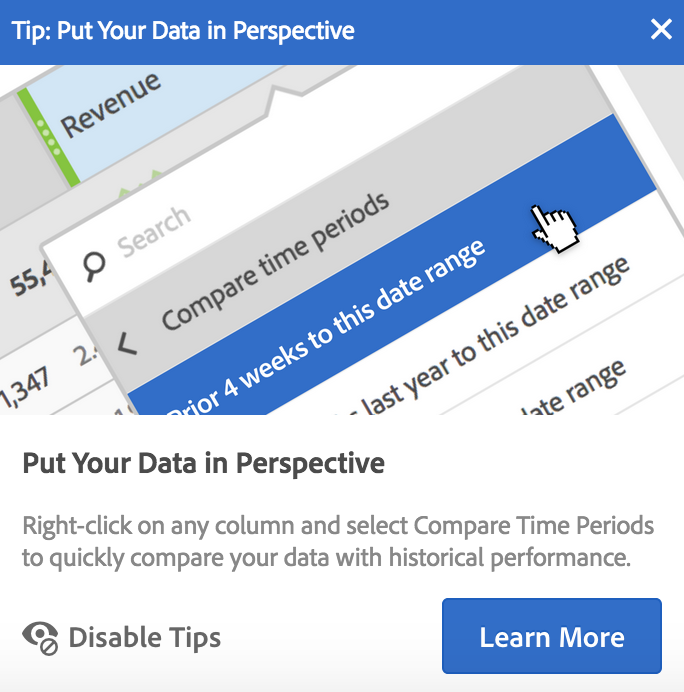

# Nieuwe functies in Analysis Workspace

>[!IMPORTANT]
>Meer Analysis Workspace-updates zijn toegevoegd aan de [Updates van Adobe Analytics-documentatie](/help/release-notes/doc-updates.md) pagina.

Zie [Opmerkingen bij de release van Adobe Experience Cloud](https://experienceleague.adobe.com/docs/release-notes/experience-cloud/current.html) voor updates van het overkoepelende product.

## Maart 2021

| Functie | Doeldatum | Beschrijving |
| --- | --- | --- |
| [!UICONTROL Components] > [!UICONTROL User preferences] | 25 maart 2021 | De [!UICONTROL Components] > [!UICONTROL User preferences] pagina laat u toe leiden [!UICONTROL Analysis Workspace] instellingen en de bijbehorende componenten voor uw gebruiker. [!UICONTROL User preferences] van toepassing op alle nieuwe projecten en panels.  **Opmerking:** de volgende instellingen zijn verplaatst naar de [!UICONTROL User preferences] pagina:<ul><li>Rapportinstellingen: Scheidingsteken voor duizendtallen (nu _Getalnotatie_)</li><li>Rapportinstellingen: CSV-scheidingsteken</li><li>Werkruimteprojecten: Help > Tips inschakelen</li><li>Werkruimteprojecten: Leeg deelvenster _Nieuwe projecten starten met dit deelvenster_ option</li></ul> |
| [!UICONTROL Histogram Smart Bucket Prediction] | 25 maart 2021 | [!UICONTROL Histogram Smart Bucket Prediction] biedt hulp bij histogrammen met hoge cardinaliteit door automatisch de juiste breedte en het juiste aantal emmers voor de gegevensspread te identificeren. Voor metingen met lage cardinaliteit gedraagt de visualisatie zich op dezelfde manier als voorheen. |

## Februari 2021

| Functie | Doeldatum | Beschrijving |
| --- | --- | --- |
| Componentselectie | 4 februari 2021 | De component drop-down/drop zone gevonden in [!UICONTROL Quick Insights] wordt toegevoegd aan alle neerzetzones in [!UICONTROL Workspace]. Dankzij deze verbetering kunt u kiezen uit een vervolgkeuzelijst met compatibele componenten of de ruimte blijven gebruiken als een neerzetzone. |

## Januari 2021

| Functie | Doeldatum | Beschrijving |
| --- | --- | --- |
| Afbeeldings-URL&#39;s | 14 januari 2021 | U kunt afbeeldingen toevoegen aan Workspace-projecten door te verwijzen naar een openbare afbeeldings-URL. |
| Beheer van gecombineerde bron en instellingen voor visualisatie | 14 januari 2021 | De [!UICONTROL Data Source] Beheer (punt) en instellingenbeheer (versnelling) voor visualisatie zijn gecombineerd tot één pop-up, zodat u de bron en instellingen eenvoudig vanaf dezelfde locatie kunt beheren. |

## Oktober 2020

| Functie | Beschrijving |
| --- | --- |
| Lijnvisualisatie: [Gemiddelde trendline verplaatsen, optie](https://experienceleague.adobe.com/docs/analytics/analyze/analysis-workspace/visualizations/line.html) | **[!UICONTROL Moving average]** is toegevoegd aan [!UICONTROL Line] instellingen voor visualisatietendline. Ook gekend als voortschrijdend gemiddelde, gebruikt een voortschrijdend gemiddelde een specifiek aantal gegevenspunten (die door a worden bepaald **[!UICONTROL Periods]** (selecteert), gemiddeld deze en gebruikt het gemiddelde als een punt op de regel. |
| [Help-pagina voor prestaties](https://experienceleague.adobe.com/docs/analytics/analyze/analysis-workspace/workspace-faq/optimizing-performance.html) | Op de pagina met Help over Analysis Workspace-prestaties worden verschillende factoren weergegeven die van invloed zijn op de projectprestaties en worden koppelingen naar tips voor optimalisatie weergegeven. |

## September 2020

| Functie | Beschrijving |
| --- | --- |
| [Download 50 kB items voor één dimensie](https://experienceleague.adobe.com/docs/analytics/analyze/analysis-workspace/curate-share/download-send.html#download-items) | U kunt nu 50.000 items downloaden voor één dimensie in een vrije-vormtabel, met toegepaste segmenten en filters. Hierdoor hebt u toegang tot meer dan de 400 rijen gegevens buiten Analysis Workspace. |
| [Verbeteringen voor lijnvisualisatie](https://experienceleague.adobe.com/docs/analytics/analyze/analysis-workspace/visualizations/line.html) | <ul><li>U kunt de x-as en de y-as van om het even welk tonen of verbergen [!UICONTROL Line] visualisatie. Dit kan vooral handig zijn als uw [!UICONTROL Line] visualisaties zijn compacter.</li><li>U kunt een minimum- en maximumwaardelabel bedekken op elke Lijnvisualisatie om de pieken en dalen snel in metrische vorm te markeren.</li><li>U kunt verschillende regressietendellijnen op om het even welke Lijn visualisatie bedekken om de trend in de gegevens gemakkelijker te zien. Opties omvatten [!UICONTROL Linear], [!UICONTROL Logarithmic], [!UICONTROL Exponential], [!UICONTROL Power] en [!UICONTROL Quadratic].</li></ul> |
| Nieuwe datumbereiken | We hebben vijf nieuwe datumbereiken toegevoegd, zodat u kunt kiezen uit datumbereiken die geen gegevens van vandaag voor een gedeeltelijke dag bevatten: Laatste 7 volledige dagen, Laatste 14 volledige dagen, Laatste 30 volledige dagen, Laatste 60 volledige dagen, Laatste 90 volledige dagen |

## Augustus 2020

Geen nieuwe functies uitgebracht in augustus 2020.

## Juli 2020

Nieuwe functie uitgebracht op 16 juli 2020.

| Functie | Beschrijving |
| --- | --- |
| Nieuwe voorinstellingen voor datumbereik | Vier nieuwe datumbereiken toegevoegd: ([!UICONTROL This week/month/quarter/year (excluding today)]). Dit laat u van datumwaaiers kiezen die delen-daggegevens van vandaag niet omvatten. |

## Juni 2020

Nieuwe functies uitgebracht op 18 juni 2020.

| Functie | Beschrijving |
|--- |--- |
| Attribution IQ: algorithmische attributie | Het Algorithmic Attribution model in Analysis Workspace gebruikt statistische technieken om dynamisch de optimale allocatie van krediet voor de geselecteerde metrische waarde te bepalen. Beschikbaar voor klanten van Adobe Analytics Ultimate. [Meer informatie...](https://experienceleague.adobe.com/docs/analytics/analyze/analysis-workspace/attribution/algorithmic.html) |
| Attribution IQ: aangepaste terugblikvensters | U kunt nu elk attributiemodel in Attribution IQ zo configureren dat er aanraakpunten aanwezig zijn van maximaal 90 dagen vóór de periode van de rapporttijd. Dit verhoogt doorgaans de attributienauwkeurigheid voor gebeurtenissen die zich vroegtijdig in de verslagperiode voordoen, door interacties die in de voorafgaande maand(en) hebben plaatsgevonden, te verklaren. Beschikbaar voor klanten van Adobe Analytics Foundation, Select, Premium, Premium, Premium Attribution, Premium Complete en Ultimate. [Meer informatie...](https://experienceleague.adobe.com/docs/analytics/analyze/analysis-workspace/attribution/models.html#lookback-windows) |
| Projectrollen voor gedeelde Workspace-projecten | Bij het delen van een Workspace-project kunt u ontvangers nu in één van drie projectrollen plaatsen, afhankelijk van de projectervaring die u hun wilt geven: Bewerken, Dupliceren en Weergeven. [Meer informatie...](https://experienceleague.adobe.com/docs/analytics/analyze/analysis-workspace/curate-share/share-projects.html) |
| Workspace-projecten voor alleen-weergeven | Workspace-projecten kunnen met gebruikers worden gedeeld als ‘alleen weergeven’. Wanneer een ontvanger voor Weergaven het gedeelde project opent, ontvangt hij/zij een beperktere projectervaring zonder linkerrail en met beperkte interactie. [Meer informatie...](https://experienceleague.adobe.com/docs/analytics/analyze/analysis-workspace/curate-share/view-only-projects.html) |
| Mogelijkheid om Workspace-projecten gezamenlijk te bewerken | Ontvangers die aan de rol voor Bewerken zijn toegevoegd, kunnen een project opslaan dat met hen is gedeeld. Dit geldt zowel voor beheerders als niet-beheerders. [Meer informatie...](https://experienceleague.adobe.com/docs/analytics/analyze/analysis-workspace/curate-share/share-projects.html) |
| Bijgewerkt leeg deelvenster | Het lege deelvenster bevat nu deelvensters en visualisaties, zodat u naadloos de analyseworkflow kunt kiezen die het beste voor u werkt. |
| Deelvenster Snelle inzichten (25 juni 2020) | Quick Insights biedt richtlijnen voor niet-analisten en nieuwe gebruikers van Analysis Workspace hoe ze zakelijke vragen snel en eenvoudig kunnen beantwoorden. [Meer informatie...](/help/analyze/analysis-workspace/c-panels/quickinsight.md) |
| Deelvenster Analytics for Target in Workspace (25 juni 2020) | Met het deelvenster Analytics for Target (A4T) kunt u uw Adobe Target-activiteiten en -ervaringen in Analysis Workspace met lift en vertrouwen analyseren. [Meer informatie...](/help/analyze/analysis-workspace/c-panels/a4t-panel.md) |
| Pagina Werkruimte | De pagina Info Workspace biedt informatie over uw Analysis Workspace-omgeving, over uw Adobe Analytics-beheerders (als u ondersteuning nodig hebt) en een manier om feedback in het product te geven. U vindt deze in Workspace > Help > Info over Werkruimte. |

## Mei 2020

Nieuwe functies uitgebracht op 21 mei 2020.

| Functie | Beschrijving |
|--- |--- |
| Automatisch Freeform-tabellen maken op basis van een leeg frame | Eerder kon u componenten niet direct in een leeg project of leeg paneel laten vallen; u moest eerst een Lijst Freeform toevoegen. U kunt componenten nu rechtstreeks in een leeg project of deelvenster neerzetten en een tabel voor vrije vorm wordt automatisch voor u gemaakt in een aanbevolen indeling. Bovendien zijn er verbeteringen toegevoegd in de manier waarop gemengde onderdeeltypen (zoals dimensies en cijfers) wanneer deze samen in een lege vrije-vormtabel worden neergezet. |
| Toegankelijkheidsverbeteringen | Het Adobe Analytics-team heeft verschillende toegankelijkheidsverbeteringen doorgevoerd in Analysis Workspace, waaronder verbeterde toetsenbordnavigatie, kleurcontrast en ondersteuning voor schermlezers. [Meer informatie...](https://experienceleague.adobe.com/docs/analytics/analyze/analysis-workspace/workspace-faq/aw-accessibility.html) |

## April 2020

Nieuwe functie uitgebracht op 16 april 2020.

| Functie | Beschrijving |
|--- |--- |
| Automatisch [!UICONTROL Freeform Tables] bouwen vanuit een beginsituatie | Voorheen kon u componenten niet rechtstreeks in een leeg project of leeg deelvenster plaatsen en moest u eerst een vrije-vormtabel toevoegen. Nu kunt u componenten direct in een leeg project of deelvenster plaatsen. Een vrije-vormtabel wordt automatisch voor u gemaakt in een aanbevolen indeling. Bovendien zijn er verbeteringen aangebracht in de manier waarop gemengde componenttypen (zoals dimensies en metrics) worden verwerkt wanneer ze samen in een lege [!UICONTROL Freeform Table] worden geplaatst. |

## Maart 2020

Nieuwe functies uitgebracht op 12 maart 2020.

| Functie | Beschrijving |
|--- |--- |
| Ondersteuning voor meerdere rapportsuites in Workspace | U kunt data van meerdere rapportsuites nu in één enkel project samenbrengen en naast elkaar bekijken. [Meer informatie...](https://experienceleague.adobe.com/docs/analytics/analyze/analysis-workspace/build-workspace-project/multiple-report-suites.html) |
| Sjabloon voor trainingszelfstudie | Met deze nieuwe standaardsjabloon leert u over algemene terminologie en wordt u stapsgewijs begeleid bij het bouwen van uw eerste analyse in Workspace. De sjabloon is beschikbaar als standaardsjabloon in het modale dialoogvenster voor nieuwe projecten en vervangt het huidige voorbeeldproject voor nieuwe gebruikers die geen andere projecten in hun lijst hebben. [Meer informatie...](/help/analyze/analysis-workspace/build-workspace-project/starter-projects.md) |

## Februari 2020

Nieuwe functies uitgebracht op 20 februari 2020.

| Functie | Beschrijving |
|--- |--- |
| Nieuwe Workspace-sjabloon voor voor bedrijven die CDA (Cross-Device Analytics) gebruiken | In deze sjabloon ziet u hoe effectief CDA is bij het samenvoegen van bezoeken en leert u over exclusieve CDA-dimensies en metrics. Een rapportsuite met CDA is vereist. Zie [Apparaatanalyse instellen](/help/components/cda/setup.md) voor meer informatie . |
| Nieuwe sneltoetsen in Workspace | <ul><li>Alle deelvensters samenvouwen/uitvouwen: `alt + m`</li><li>Actief deelvenster samenvouwen/uitvouwen: `alt + ctrl + m`</li><li>Zoeken in linkerrail: `ctrl + /`</li><li>Naar volgend deelvenster gaan: `alt + Right Key`</li><li>Naar vorig deelvenster gaan: `alt + Left Key`</li></ul>[Meer informatie...](https://experienceleague.adobe.com/docs/analytics/analyze/analysis-workspace/build-workspace-project/fa-shortcut-keys.html) |
| Andere verbeteringen in Workspace | <ul><li>Wanneer een deelvenster of visualisatie in Workspace wordt geplaatst, schakelt de linkerrail nu automatisch naar componenten voor een naadloze workflow.</li><li>Sjablooncomponenten kunnen nu worden bewerkt (bijvoorbeeld voorzien van tags, als favoriet ingesteld of goedgekeurd).</li><li>De gefilterde metrische lijsten en segmentlijsten bevatten nu een plusknop (+) waarmee u een nieuwe component kunt toevoegen als u niet vindt wat u nodig hebt.</li></ul> |
| Foutopsporing voor Workspace | Het Help-menu van Workspace bevat nu een optie voor foutopsporing, zodat u deze naadloos kunt inschakelen bij Workspace-verzoeken voor foutopsporing. [Meer informatie...](https://www.adobe.io/apis/experiencecloud/analytics/docs.html#!AdobeDocs/analytics-2.0-apis/master/reporting-tricks.md) |

## Januari 2020

Nieuwe functie uitgebracht op 16 januari 2020.

| Functie | Beschrijving |
|--- |--- |
| [Vrije-vormtabellen samenstellen](https://experienceleague.adobe.com/docs/analytics/analyze/analysis-workspace/visualizations/freeform-table/freeform-table.html) | Als u de functie voor samenstellen van tabellen inschakelt, kunt u allerlei dimensies, uitsplitsingen, metrics en segmenten plaatsen om tabellen te bouwen waarmee complexe zakelijke vragen worden beantwoord. Gegevens worden niet meteen bijgewerkt. In plaats daarvan vindt de update plaats nadat u op **[!UICONTROL Build]** klikt, zodat u tijd bespaart wanneer u weet welke tabel u wilt samenstellen. Bovendien biedt deze functie:<ul><li>**Voorvertoning**: u kunt een voorbeeld van de tabelindeling bekijken voordat gaat werken aan het renderen van echte gegevens.</li><li>**Flexibele instellingen voor rij en uitsplitsing**: u kunt nu een rij- en uitsplitsingsniveau instellen voor elke dimensierij. Eerder werden in Workspace standaardinstellingen ingesteld die pas konden worden gewijzigd nadat de gegevens waren geretourneerd.</li><li>**Uitsplitsing naar positie**: u kunt dimensierijen zo instellen dat ze altijd _worden uitgesplitst op positie_ in plaats van _op een bepaald item_ (de standaardinstelling).</li><li>**Handmatige statische rijvolgorde**: u kunt statische rijen handmatig ordenen, zodat tabelrijen precies zo worden weergegeven als nodig is. Voorheen konden statische rijen alleen worden gesorteerd op een kolom met metrics, of alfabetisch.</li></ul> |

## Oktober 2019

Verbeteringen uitgebracht op 10 oktober 2019.

| Verbetering | Beschrijving |
|--- |--- |
| Bijwerken naar totalen in vrije-vormtabellen | Vrije-vormtabellen bevatten nu twee totalen, een **[!UICONTROL Table total]** en een **[!UICONTROL Grand total]**. De rij Tabeltotaal werkt op basis van de toegepaste [rapportfilters](https://experienceleague.adobe.com/docs/analytics/analyze/analysis-workspace/visualizations/freeform-table/pagination-filtering-sorting.html). Voorheen werden totalen alleen beïnvloed door segmentatie. [Meer informatie](https://experienceleague.adobe.com/docs/analytics/analyze/analysis-workspace/visualizations/freeform-table/workspace-totals.html) Daarnaast zijn de opties **[!UICONTROL Show Totals]** en **[!UICONTROL Show Grand Total]** toegevoegd aan **[!UICONTROL Column Settings]**. Met deze wijziging in de vrije-vormtotalen worden afhankelijke visualisaties bijgewerkt (bijvoorbeeld gekoppelde **[!UICONTROL Summary Number]** visualisaties), net als geëxporteerde CSV- en PDF-data. |
| Optie voor het verwijderen van Niet-opgegeven/Geen | Bij de rapportagefilters kunt u nu de optie &quot;Niet-opgegeven (Geen)&quot; gemakkelijk verwijderen. |
| Paarse granulariteitscomponenten buiten gebruik | De paarse tijdcomponenten voor granulariteit (Minuut, Uur, Dag, Week, Maand, Kwartaal, Jaar) zijn verouderd en buiten gebruik gesteld. De paarse tijdcomponenten gedragen zich exact hetzelfde als hun oranje tegenhangers voor dimensies. De gebruikservaring is met deze verwijdering vereenvoudigd. U hoeft **geen actie** te ondernemen als u voorheen een van de paarse tijdcomponenten hebt gebruikt. Door deze wijziging is de naam van de paarse **[!UICONTROL Time]**-sectie ook gewijzigd in **[!UICONTROL Date Ranges]**. |

## Augustus 2019

Verbetering uitgebracht op 8 augustus 2019.

| Verbetering | Beschrijving |
|--- |--- |
| De limiet voor het aantal items in een vervolgkeuzefilter is verhoogd van 50 naar 200 | We hebben de limiet voor het aantal items dat in een vervolgkeuzelijst kan worden geplaatst, verhoogd van 50 naar 200. Deze verbetering is nuttig voor een groot aantal gebruikssituaties, zoals het toevoegen van alle landen (195) aan een filter, of alle staten en provincies in de VS (52). |

## Juli 2019

Verbeteringen uitgebracht op 18 juli 2019.

| Verbetering | Beschrijving |
|--- |--- |
| Verbeteringen voor cohortanalyse | Er zijn nieuwe instellingen voor [cohortanalyse](https://experienceleague.adobe.com/docs/analytics/analyze/analysis-workspace/visualizations/cohort-table/t-cohort.html) toegevoegd: <ul><li>Alleen percentages weergeven</li><li>Percentages afronden naar dichtstbijzijnde gehele getal</li><li>Rij met gemiddelde percentages weergeven</li></ul> |
| Items van de afgelopen 18 maanden weergeven | In de linkerrail kunnen gebruikers voortaan _items van de afgelopen 18 maanden_ weergeven. De maximale periode was eerder zes maanden. Hierdoor kunnen pagina&#39;s of campagnes van het afgelopen jaar tot 18 maanden terug met elkaar worden vergeleken. |
| Nieuwe Analysis Workspace-sjabloon | We hebben de nieuwe sjabloon [&quot;Magento: Marketing &amp; Commerce&quot;](https://experienceleague.adobe.com/docs/analytics/analyze/analysis-workspace/build-workspace-project/starter-projects.html) toegevoegd aan Analysis Workspace. De sjabloon is specifiek ontworpen voor klanten van Magento e-commerce, maar elke retailer kan de sjabloon gebruiken voor unieke inzichten in hun bedrijfsactiviteiten. |

## Juni 2019

Verbetering uitgebracht op 13 juni 2019.

| Verbetering | Beschrijving |
| --- |--- |
| Nieuwe kant-en-klare filters | Nieuwe kant-en-klare filters zijn toegevoegd aan de zoekfunctie in de linkerrail. Naast de al beschikbare filters (Dimensies, Metrics, Goedgekeurd, enz.) zijn nu ook nieuwe filters, zoals voor berekende standaarden, klantkenmerken, eVars, props, video, enzovoorts. toegevoegd zodat u snel en gemakkelijk de gewenste componenten kunt vinden. |

## Mei 2019

Verbetering uitgebracht op 9 mei 2019.

| Verbetering | Beschrijving |
|--- |--- |
| Er is een nieuwe instelling toegevoegd aan de instellingen voor flowvisualisatie: Include Repeat Instances (Inclusief herhalingsinstanties). | [Flowinstellingen](/help/analyze/analysis-workspace/visualizations/c-flow/flow-settings.md) |

## April 2019

Verbetering uitgebracht op 11 april 2019.

| Verbetering | Beschrijving |
|--- |--- |
| Verbeteringen voor optimale werkwijzen | [Prestaties optimaliseren](/help/analyze/analysis-workspace/new-features-in-analysis-workspace.md) |

## Januari 2019

Nieuwe functies en verbeteringen die zijn uitgebracht op 17 januari 2019.

| Functie | Beschrijving |
|--- |--- |
| [Cohortanalyse](/help/analyze/analysis-workspace/visualizations/cohort-table/cohort-analysis.md) | Met de belangrijkste verbeteringen in cohortanalyse kunt u:<ul><li>Afzonderlijk een segment insluiten en metrics retourneren. </li><li>De uitval weergeven in plaats van de retentie.</li><li>Latentietabellen tonen (de tijd die is verstreken voor en na een insluitingsgebeurtenis).</li><li>Een cohortdimensie op maat maken (om bezoekers te groeperen op basis van een eVar en niet alleen op tijd).</li><li>Een doorlopende cohortberekening uitvoeren: de retentie of de uitval berekenen op basis van de voorafgaande periode, niet op basis van het oorspronkelijke cohort. </li><li>Meerdere metrics toevoegen aan insluitings- en retourvelden, en segmenten toepassen. (Berekende standaarden worden niet ondersteund)</li></ul> |
| [Dichtheid weergeven](/help/analyze/analysis-workspace/build-workspace-project/view-density.md) | Met deze nieuwe instelling kunt u meer data op één scherm weergeven door de verticale opvulling van de linkerrail, vrije-vormtabellen en cohortabellen te verminderen. Toegankelijk via Project > Projectinfo en instellingen. |
| [Ondersteuning voor variabelen met meerdere waarden in Attribution IQ](attribution/overview.md) | Sommige dimensies in Analytics bevatten meerdere waarden voor een enkele &#39;hit&#39;, zoals listVars, de productvariabele, lijstprops of merchandising eVars. In Analysis Workspace kunt u Attribution IQ nu op elk van deze typen variabelen toepassen op hitniveau. |
| Betere prestaties | Snellere uitsplitsing van visualisaties; projecten met veel uitsplitsingen worden sneller geladen. |

## November 2018

Nieuwe functies en verbeteringen die zijn uitgebracht op 1 november 2018.

| Functie | Beschrijving |
|--- |--- |
| [VRS- en projectcurering: verbeteringen](/help/analyze/analysis-workspace/curate-share/curate.md) | Deze wijzigingen zijn in oktober 2018 ingevoerd. Er zijn wijzigingen aangebracht in welke componenten door beheerders en niet-beheerders kunnen worden bekeken in gecureerde Workspace-projecten en gecureerde virtuele rapportsuites (VRS&#39;s).   Voorheen kon iedereen niet-gecureerde componenten zien door te klikken op &#39;Show all Components&#39; (Alle componenten weergeven). Met de bijgewerkte cureringsfunctie kunt u tot in detail bepalen welke componenten zichtbaar zijn.  |

## Oktober 2018

Nieuwe functies en verbeteringen die zijn uitgebracht op 11 oktober 2018.

<table id="table_3DDC812B2F66416F868004416D248BF3">
 <thead>
  <tr>
   <th colname="col1" class="entry"> Functie </th>
   <th colname="col2" class="entry"> Beschrijving </th>
  </tr>
 </thead>
 <tbody>
  <tr>
   <td colname="col1"> 
<b>Beheer van vervolgkeuzelijsten in deelvensters</b> 
 </td>
   <td colname="col2"> 
We hebben een aantal wijzigingen aangebracht voor het beheer van de vervolgkeuzelijsten in deelvensters. Deze zijn geïntroduceerd in de MR van september. Wanneer u met de rechtermuisknop op de vervolgkeuzelijst klikt, kunt u nu het volgende doen 

    <ul id="ul_4BDEC66EEB2243628FE32B43E377E5BD">
     <li id="li_EF8277BE972540D3B2604D82BC7C0918">Een vervolgkeuzelijst verwijderen (deze optie is altijd aanwezig). </li>
     <li id="li_6A991208F2744274817DBE1E9D1B443F">Een label verwijderen (als er een label wordt weergegeven). </li>
     <li id="li_5C1CFC465C2E41D2B35E8841EFDC82AA">Een label toevoegen (als er geen label wordt weergegeven). </li>
    </ul> </td>
  </tr>
  <tr>
   <td colname="col1"> 
<b>Koppelingen in het deelvenster en de knopinfo voor visualisaties</b> 
 </td>
   <td colname="col2"> 
We hebben koppelingen naar relevante video's en documentatie toegevoegd aan de knopinfo voor deelvensters en visualisaties. 
 </td>
  </tr>
 </tbody>
</table>

## September 2018

Nieuwe functies en verbeteringen die zijn uitgebracht op 13 september 2018.

<table id="table_137719BFA03C44A78FDE872DF8B228A4">
 <thead>
  <tr>
   <th colname="col1" class="entry"> Functie </th>
   <th colname="col2" class="entry"> Beschrijving </th>
  </tr>
 </thead>
 <tbody>
  <tr>
   <td colname="col1"> 
<b>Vervolgkeuzelijsten in het deelvenster</b> 
 </td>
   <td colname="col2"> 
De neerzetzone van het deelvenster heeft nu vervolgkeuzemogelijkheden. Met vervolgkeuzelijsten kunnen eindgebruikers op een gecontroleerde manier werken met projectdata. Voorbeeld: stel dat verscheidene versies van een project hebt om landspecifieke rapporten te verstrekken. U kunt deze projecten nu samenvouwen tot één project en een vervolgkeuzelijst met landen toevoegen. 
 </td>
  </tr>
  <tr>
   <td colname="col1"> 
<b>Kleurpaletten</b> 
 </td>
   <td colname="col2"> 
U kunt nu het kleurenschema van Workspace wijzigen door een ander kleurenpalet te kiezen of uw eigen palet op te geven. Dit is van invloed op allerlei zaken in Workspace, inclusief de meeste visualisaties. Het is <b>NIET</b> van invloed op de samenvatting van wijzigingen, de voorwaardelijke opmaak in vrije-vormtabellen of de kaartvisualisatie. 
 
Opmerking: ondersteuning voor kleurpaletten is niet ingeschakeld voor Internet Explorer 11. 
 </td>
  </tr>
  <tr>
   <td colname="col1"> 
<b>Nieuwe sjabloon voor audioverbruik</b> 
 </td>
   <td colname="col2"> 
Zie <a href="https://experienceleague.adobe.com/docs/media-analytics/using/media-reports/media-workspace-templates.html"  > Audio-analytics</a>. 
 </td>
  </tr>
 </tbody>
</table>

## Augustus 2018

Nieuwe functies en verbeteringen die zijn uitgebracht op 9 augustus 2018.

<table id="table_DD77C02344414DCD9AC0A6A22E648B72">
 <thead>
  <tr>
   <th colname="col1" class="entry"> Functie </th>
   <th colname="col2" class="entry"> Beschrijving </th>
  </tr>
 </thead>
 <tbody>
  <tr>
   <td colname="col1"> 
<b>Hulplijnen voor neerzetzone</b> 
 </td>
   <td colname="col2"> 
Deze hulplijnen geven u gemakkelijker inzicht in de handelingen voor slepen en neerzetten. Als u de cursor bijvoorbeeld boven een kolom houdt, worden bijvoorbeeld de volgende zaken weergegeven: Toevoegen, Vervangen, Filteren op en Uitsplitsing. 
 
We hebben ook ook gele en rode hulplijnen toegevoegd die u waarschuwen als u een handeling uitvoert die niet wordt aanbevolen of verboden is, zoals het op elkaar plaatsen van twee metrics (wat leidt tot ongeldige data). 
 </td>
  </tr>
  <tr>
   <td colname="col1"> 
<b>Optie voor leeg deelvenster toevoegen</b> 
 </td>
   <td colname="col2"> 
Het startdeelvenster bevat nu een plussymbool (+), waarmee u gemakkelijker extra deelvensters kunt toevoegen. 
 </td>
  </tr>
 </tbody>
</table>

## Juli 2018

Nieuwe functies en verbeteringen die zijn uitgebracht op 19 juli 2018.

<table id="table_336E121310204DC492EA004F40830B0F">
 <thead>
  <tr>
   <th colname="col1" class="entry"> Functie </th>
   <th colname="col2" class="entry"> Beschrijving </th>
  </tr>
 </thead>
 <tbody>
  <tr>
   <td colname="col1"> 
<b> <a href="attribution/overview.md"  > Attribution IQ </a> </b> 
 </td>
   <td colname="col2"> 
Met Attribution IQ kunt u geavanceerde en slimme analyses uitvoeren op het gebied van marketingprestaties. De nieuwe attributiemodellen kunnen worden toegepast op metrics in Analysis Workspace (op elke tabel of elke uitsplitsing), alsook voor berekende standaarden. Een nieuw attributiedeelvenster biedt een betere visualisaties en vergelijkingen. 
 </td>
  </tr>
  <tr>
   <td colname="col1"> 
<b> Verbeteringen aan de linkerrail </b> 
 </td>
   <td colname="col2"> 
Verbeteringen aan de linkerrail maken het programma intuïtiever en gebruiksvriendelijker: 

    <ul id="ul_087BEDF4338946DA857CD82CB69F98C2">
     <li id="li_C751AACAC60442DC93118F0819F8EEA7"> De functie Maken (+) voor componenten (metrics, segmenten, datums) is uitgelijnd met de kopteksten. </li>
     <li id="li_DE2EB184A02D4CE58C23F518DB85EFDD"> De optie "+ See All" (Alles weergeven) is onderaan elke sectielijst toegevoegd om duidelijk te maken dat er meer dan vijf opties zijn. </li>
     <li id="li_5208F3C6026647B09F4A85131B175175">Handelingen (zoals tags, favorieten) zijn verduidelijkt met pictogrammen wanneer componenten worden geselecteerd. </li>
     <li id="li_11E601488A844515928231E09889BC54">De gebruikersinterface is mooier geworden. </li>
    </ul> </td>
  </tr>
  <tr>
   <td colname="col1"> 
<b>Totalen voor berekende standaarden </b> 
 </td>
   <td colname="col2"> 
Waar mogelijk geven we nu totalen weer voor berekende standaarden, inclusief voor percentages 
 </td>
  </tr>
  <tr>
   <td colname="col1"> 
<b>Nieuwe voorinstelling voor <a href="/help/analyze/analysis-workspace/components/calendar-date-ranges/calendar.md"  >datumbereik</a> </b> 
 </td>
   <td colname="col2"> 
De optie 'Laatste 13 volledige weken' is toegevoegd aan de voorinstellingen voor het datumbereik in Analysis Workspace. 
 </td>
  </tr>
 </tbody>
</table>

## Juni 2018

Nieuwe functies en verbeteringen die zijn uitgebracht op 14 juni 2018.

<table id="table_57035A06D99447A6BE6ED825A648ED3F">
 <thead>
  <tr>
   <th colname="col1" class="entry"> Functie </th>
   <th colname="col2" class="entry"> Beschrijving </th>
  </tr>
 </thead>
 <tbody>
  <tr>
   <td colname="col1"> 
<b> <a href="/help/analyze/analysis-workspace/components/dimensions/view-dimensions.md"  > Kolommen met dynamische dimensies </a> </b> 
 </td>
   <td colname="col2"> 
Als u in eerdere versies een dimensie op een kolom had geplaatst, werden de top 5 waarden voor niet-tijddimensies (en 15 voor tijddimensies) getoond. Deze waarden waren bovendien statisch (dat wil zeggen: de 5 gekozen waarden veranderden nooit). 
 
Vanaf nu tonen we standaard dynamische waarden die u desgewenst kunt omzetten naar statische waarden. Andere opmerkzame zaken: 

    <ul id="ul_C802BC32CB084E30B4E58E9E90B9A63D">
     <li id="li_452466AB416F4737B532849C604BD4CC">Klik (i) op een dynamische dimensie en u ziet de rangschikking (top 1 van 5) en het type dimensie. </li>
     <li id="li_588F6199E38D47869AC855A4C2A4D1B7">Wanneer uw data worden bijgewerkt, worden ook de kolommen met dynamische dimensies bijgewerkt met de huidige 5/15-dimensie-items. </li>
     <li id="li_19D47638D4D94416B0DAD2B2FB835ABE">Als een kolom met een dynamische dimensie wordt gekopieerd of verplaatst, wordt deze statisch. </li>
     <li id="li_B95411689AE04774B7B9BA128F2DB96F">Wanneer u de muis boven een kolom met een statische dimensie houdt, ziet u een vergrendelingspictogram. Dit geeft aan dat de dimensie statisch is. </li>
    </ul> </td>
  </tr>
  <tr>
   <td colname="col1"> 
<b>Dialoogvenster voor nieuwe Workspace-functies </b> 
 </td>
   <td colname="col2"> 
Vergelijkbaar met de tips van de dag die vorige maand werden geïntroduceerd, toont dit modale dialoogvenster de nieuwe Workspace-functies wanneer u zich voor het eerst na een nieuwe release aanmeldt bij Workspace. 
 </td>
  </tr>
 </tbody>
</table>

## Mei 2018

Nieuwe functies en verbeteringen die zijn uitgebracht op 10 mei 2018.

<table id="table_EE4C690A178B4F80BDAF2BB4424D6020">
 <thead>
  <tr>
   <th colname="col1" class="entry"> Functie </th>
   <th colname="col2" class="entry"> Beschrijving </th>
  </tr>
 </thead>
 <tbody>
  <tr>
   <td colname="col1"> 
<b>Tips van de dag</b> 
 </td>
   <td colname="col2"> 
Rechtsonder in de interface vindt u de tips van de dag (samen met een korte video). Deze tips zijn bedoeld om u vertrouwd te maken met een groot aantal interessante functies van Analysis Workspace. U kunt deze tips desgewenst negeren. U kunt ze namelijk altijd later bekijken via Help &gt; Tips. 
 
 
 </td>
  </tr>
  <tr>
   <td colname="col1"> 
<b> <a href="/help/analyze/analysis-workspace/components/segments/t-freeform-project-segment.md"  > Segmentsjablonen </a> en <a href="/help/analyze/analysis-workspace/components/apply-create-metrics.md"  > sjablonen voor berekende standaarden </a></b> 
 </td>
   <td colname="col2"> 
De linkerrail biedt nu segmentsjablonen en sjablonen voor berekende standaarden. 
 </td>
  </tr>
  <tr>
   <td colname="col1"> 
<b>Schuiven tijdens het slepen van componenten</b> 
 </td>
   <td colname="col2"> 
U kunt nu omhoog en omlaag schuiven wanneer u componenten naar een nieuwe locatie sleept. 
 </td>
  </tr>
  <tr>
   <td colname="col1"> 
<b>Aanvullende informatie over <a href="/help/analyze/analysis-workspace/virtual-analyst/c-anomaly-detection/view-anomalies.md"  > anomalieën </a></b> 
 </td>
   <td colname="col2"> 
Als u de muis boven een anomalie in een lijndiagram houdt, worden nu de datum en de onbewerkte waarde van de anomalie weergegeven. 
 </td>
  </tr>
 </tbody>
</table>

## April 2018

Nieuwe functies en verbeteringen die zijn uitgebracht op 12 april 2018.

<table id="table_B9E784CD14A1453EB360FCCDC612250F">
 <thead>
  <tr>
   <th colname="col1" class="entry"> Functie </th>
   <th colname="col2" class="entry"> Beschrijving </th>
  </tr>
 </thead>
 <tbody>
  <tr>
   <td colname="col1"> 
 <a href="/help/analyze/analysis-workspace/visualizations/freeform-table/column-row-settings/column-settings.md"  > Tekstomloop voor kopteksten is standaard ingeschakeld </a> 
 </td>
   <td colname="col2"> 
De kolominstelling voor  tekstomloop voor kopteksten  is nu standaard ingeschakeld voor vrije-vormtabellen. 
 </td>
  </tr>
  <tr>
   <td colname="col1"> 
 <a href="/help/analyze/analysis-workspace/visualizations/freeform-table/column-row-settings/table-settings.md"  > Nieuwe rij-instelling </a> 
 </td>
   <td colname="col2"> 
De nieuwe instelling voor  percentage berekenen per rij forceert de vrije-vormtabel om celpercentages per rij te berekenen in plaats van per kolom. Dit is vooral nuttig voor het trending percentages, zoals het trending hoe één afmetingspunt tegen de rest in tijd evenaart. Deze optie is standaard ingeschakeld wanneer u op het pictogram  Visualiseren  klikt. 
 </td>
  </tr>
  <tr>
   <td colname="col1"> 
 <a href="/help/analyze/analysis-workspace/visualizations/freeform-analysis-visualizations.md#section_D3BB5042A92245D8BF6BCF072C66624B"  > Instelling voor 100% gestapelde visualisatie </a> 
 </td>
   <td colname="col2"> 
Met de nieuwe visualisatie-instelling voor gestapelde vlakken, staaf- en horizontale staafdiagrammen kunt u het diagram omzetten in een '100% gestapelde' visualisatie, zodat u de relatieve verhoudingen kunt meten. 
 
 
 </td>
  </tr>
  <tr>
   <td colname="col1"> 
 <a href="/help/analyze/analysis-workspace/virtual-analyst/overview.md"  > Anomaliedetectie en bijdrage-analyses</a> zijn nu alleen beschikbaar via Analysis Workspace 
 </td>
   <td colname="col2"> 
Anomaliedetectie en bijdrage-analyses zijn verwijderd uit de functieset met rapporten en analytics, en nu dus alleen beschikbaar via Analysis Workspace. 
 
Klanten van Adobe Analytics Select en Adobe Analytics Foundation hebben voortaan alleen via Workspace toegang tot anomaliedetectie voor dagelijkse granulariteit. 
 </td>
  </tr>
 </tbody>
</table>

## Maart 2018

Nieuwe functies en verbeteringen die zijn uitgebracht op 8 maart 2018.

<table id="table_580CF2C1322E4FB78870BE2B1F497B2F">
 <thead>
  <tr>
   <th colname="col1" class="entry"> Functie </th>
   <th colname="col2" class="entry"> Beschrijving </th>
  </tr>
 </thead>
 <tbody>
  <tr>
   <td colname="col1"> 
 <a href="/help/analyze/analysis-workspace/visualizations/freeform-table/column-row-settings/column-settings.md"  > Tekstomloop voor koptekst </a> 
 </td>
   <td colname="col2"> 
U kunt nu tekstomloop toepassen in de kopteksten van vrije-vormtabellen. Zo worden kopteksten leesbaarder en kunt u tabellen gemakkelijker delen met anderen. We hebben een optie voor tekstomloop toegevoegd voor de kolominstellingen. Dit is met name handig voor PDF-rendering en voor metrics met lange namen. 
 </td>
  </tr>
  <tr>
   <td colname="col1"> 
 <a href="/help/analyze/analysis-workspace/components/apply-create-metrics.md"  > Rechtsklikken om een metric te maken </a> 
 </td>
   <td colname="col2"> 
Om gemakkelijker en sneller berekende standaarden te maken is de optie Create metric from selection (Metric maken op basis van selectie) toegevoegd aan het rechtsklikmenu in vrije-vormtabellen. Deze optie wordt weergegeven wanneer een of meer cellen met kopteksten zijn geselecteerd. 
 </td>
  </tr>
  <tr>
   <td colname="col1"> 
 <a href="/help/analyze/analysis-workspace/visualizations/map-visualization.md"  > Verbeterde kaartvisualisatie</a> 
 </td>
   <td colname="col2"> 
Om vergelijkingen voor achtereenvolgende perioden (bijvoorbeeld voor een aantal jaren) in de kaartvisualisatie weer te geven, zijn de volgende verbeteringen geïmplementeerd: 

    <ul id="ul_F570E6AB174C45788620CF50E2742A08">
     <li id="li_746E329037764644A9CCF79161C26350">De kaartvisualisatie kan nu negatieve getallen tonen. Als u bijvoorbeeld een metric voor een aantal jaren plot, kan de kaart een waarde van -33% weergeven voor New York. </li>
     <li id="li_E05F0380627044E6A4E8A60C98494BF7">Met metrics van het type percentage, wordt het gemiddelde van de geclusterde percentages getoond. </li>
     <li id="li_44C04306EA1B413E91B8256B340D5296">Een nieuw kleurenschema: positief/negatief (groen/rood) </li>
    </ul> </td>
  </tr>
  <tr>
   <td colname="col1"> 
 <a href="/help/analyze/analysis-workspace/build-workspace-project/starter-projects.md"  > Aangepaste sjablonen zijn bijgewerkt</a> 
 </td>
   <td colname="col2"> 
Voor de onlangs uitgebrachte aangepaste sjablonen hebben we het volgende veranderd: 

    <ul id="ul_787F48253F454163B99F6DD50F199FE2">
     <li id="li_828DD547DDB54A81B9FFB9FE92790F6C">Bovenaan het project (bij de titel) is een sjabloonpictogram toegevoegd om de modus Sjabloon bewerken beter te onderscheiden van het gebruik van een sjabloon als beginpunt voor een project. </li>
     <li id="li_EEAA4D115CB74A57BABD524B2561E0CC">U kunt niet-beheerders toestaan om Workspace-projectsjablonen te maken (opslaan als) en te bewerken, op voorwaarde dat ze beschikken over de machtiging Projecten maken/cureren in Analysis Workspace. (   Beheer   &gt;  Alle beheerders   &gt;  Gebruikersbeheer   &gt;  Groepen   &gt;  Alle rapporttoegang bewerken   &gt;  Analyseprogramma's aanpassen   &gt;  Projecten maken/krullen in Analysis Workspace  ). </li>
    </ul> </td>
  </tr>
 </tbody>
</table>

## Februari 2018

Nieuwe functies en verbeteringen uitgebracht op 8 februari 2018.

<table id="table_824BBE4A554B4DB092ADA9044383D0FA">
 <thead>
  <tr>
   <th colname="col1" class="entry"> Functie </th>
   <th colname="col2" class="entry"> Beschrijving </th>
  </tr>
 </thead>
 <tbody>
  <tr>
   <td colname="col1"> 
 <a href="/help/analyze/analysis-workspace/build-workspace-project/starter-projects.md#create-custom-template"  > Aangepaste Workspace-sjablonen </a> 
 </td>
   <td colname="col2"> 
U kunt nu uw eigen Workspace-sjablonen maken en deze opslaan, zodat andere gebruikers in uw organisatie direct aan de slag kunnen met data die voor hen relevant zijn. 
 </td>
  </tr>
  <tr>  
   <td colname="col2"> 
Als u op "nieuw project" klikt, wordt een nieuw scherm geopend. Hierin krijgt u de keuze om te starten met: 

    <ul id="ul_FE90E6B9AF334A029D66A43901F8FA0B">
     <li id="li_F1DFD9AE140C4E5B849D4C522D5968DB">Een leeg project, of </li>
     <li id="li_23BD391D68674C299858A97BFE10598B">Een standaard (ingebouwde) Workspace-sjabloon, of </li>
     <li id="li_04D84FE375B84BF88843AA0D43A234BF">Een aangepaste Workspace-sjabloon (zie hierboven) </li>
    </ul> </td>
  </tr>
  <tr>
   <td colname="col1"> 
Optie voor kopiëren in rechtermuismenu 
 </td>
   <td colname="col2"> 
We hebben de optie 'Kopiëren naar klembord' toegevoegd aan het contextmenu dat verschijnt wanneer u op de rechtermuisknop klikt. Zo kunt u cellen en tabellen consistent kopiëren. 
 </td>
  </tr>
  <tr>
   <td colname="col1"> 
 <a href="/help/analyze/analysis-workspace/visualizations/freeform-table/column-row-settings/column-settings.md"  > Verbeteringen voor kolompercentages </a> 
 </td>
   <td colname="col2"> 
Het in kolommen weergegeven "percentage van het totaal" was beperkt tot 100%, zelfs als bepaalde scenario's ertoe leiden dat rijen meer dan 100% van het totaal bedragen (bijvoorbeeld bij gemiddelden). 
 
Om nog nauwkeuriger te zijn laten we nu percentages zien die hoger zijn dan 100 procent. De bovengrens is ook verhoogd naar 1000%, zodat kolommen niet worden beperkt in de breedte. 
 </td>
  </tr>
  <tr>
   <td colname="col1"> 
 <a href="/help/analyze/analysis-workspace/visualizations/freeform-table/column-row-settings/column-settings.md#section_3DD847151DA14914888A70FC4FD7BDFB"  > Voorwaardelijke opmaak ingeschakeld voor uitsplitsingen</a> 
 </td>
   <td colname="col2"> 
Voorwaardelijke opmaak (kleuren, enz.) wordt nu automatisch toegepast in vrije-vormtabellen voor uitsplitsingen, tenzij aangepaste limieten zijn geselecteerd. 
 </td>
  </tr>
  <tr>
   <td colname="col1"> 
Wijzigingen in de standaard <a href="/help/analyze/analysis-workspace/components/calendar-date-ranges/calendar.md"  >kalender</a>weergave 
 </td>
   <td colname="col2"> 
De Workspace-kalender toont nu standaard de huidige maand en de voorgaande maand, in plaats van de huidige maand en de volgende maand. 
 </td>
  </tr>
  <tr>
   <td colname="col1"> 
Betere kleuren voor selecteren en het plaatsen van de muis op Workspace-tabellen 
 </td>
   <td colname="col2"> 
Er is nu een duidelijk kleurverschil wanneer u de muisaanwijzer boven een cel van een vrije-vormtabel houdt, of op een cel klikt. 
 </td>
  </tr>
 </tbody>
</table>

## Januari 2018

Nieuwe functies en verbeteringen die zijn uitgebracht op 18 januari 2018.

<table id="table_7A2E678577F94BDABB1276C826E6554F">
 <thead>
  <tr>
   <th colname="col1" class="entry"> Functie </th>
   <th colname="col2" class="entry"> Beschrijving </th>
  </tr>
 </thead>
 <tbody>
  <tr>
   <td colname="col1"> 
Meer<a href="/help/analyze/analysis-workspace/visualizations/freeform-table/pagination-filtering-sorting.md"  > filteropties </a> voor dimensie-items in vrije-vormtabellen 
 </td>
   <td colname="col2"> 
De volgende (geavanceerde) filteropties voor dimensie-items zijn toegevoegd naast de bestaande opties "contains" en "does not contain" (respectievelijk "bevat" en "bevat niet"): 

    <ul id="ul_869B3E943E304C0282D56AD96BB79E18">
     <li id="li_81A49BA0CA3041C7AB892FAD2D129E5A">Contains all terms (Bevat alle termen) </li>
     <li id="li_2AB564F917844F82839A91949D0B684A">Contains any term (Bevat een term) </li>
     <li id="li_16C7938EDC8F422EA006FB63F2881EF1">Contains the phrase (Bevat de woordgroep) </li>
     <li id="li_5130EBE9A7A54CCFA313F3C3C268B367">Does not contain any term (Bevat geen enkele term) </li>
     <li id="li_861825154EDC49EBA57514FD0A2AE462">Does not contain the phrase (Bevat niet de woordgroep) </li>
     <li id="li_5364BFB73ECF4B92A6663693ABD4BCF5">Equals (Is gelijk aan) </li>
     <li id="li_1EBF3119B6364842A35D39BAD645F4AF">Does not equal (Is niet gelijk aan) </li>
     <li id="li_487886E0A6EC4245A0E85D2E8B4A20FB">Starts with (Begint met) </li>
     <li id="li_A73F54DFBAAB44D4A4134342A3124E47">Ends with (Eindigt met) </li>
    </ul> </td>
  </tr>
  <tr>
   <td colname="col1"> 
 <a href="/help/analyze/analysis-workspace/visualizations/freeform-analysis-visualizations.md#section_05B7914D4C9E443F97E2BFFDEC70240C"  > Visualisaties/deelvensters kopiëren en plakken </a> naar andere deelvensters en projecten 
 </td>
   <td colname="col2"> 
Door met de rechtermuisknop te klikken kunt u nu een visualisatie of een deelvenster kopiëren en het gekopieerde element vervolgens op een andere plaats in hetzelfde project of in een ander project plakken. 
 
Zo kunt u "bouwstenen" (vooraf gedefinieerde visualisaties/deelvensters) maken die naar andere projecten kunnen worden gekopieerd om sneller aan de slag te gaan, met data die specifiek zijn voor uw bedrijf. 
 </td>
  </tr>
  <tr>
   <td colname="col1"> 
 <a href="/help/analyze/analysis-workspace/build-workspace-project/starter-projects.md"  > Nieuwe mobiele sjablonen voor berichten en locatie </a> 
 </td>
   <td colname="col2"> 
Er zijn twee nieuwe projectsjablonen toegevoegd: 

    <ul id="ul_2F5976C849474A2B8A6BCDA2559F2855">
     <li id="li_51B7830E062A4CFDBDF219C56249A733">Een nieuwe mobiele projectsjabloon voor "Messaging" die speciaal is ontworpen voor in-app-prestaties en push-messaging. </li>
     <li id="li_D2FB258EF3AF4EB19CEB258D08F4EBBE">Een nieuwe mobiele projectsjabloon voor "Locatie" met een kaart waarop locatiedata worden getoond. </li>
    </ul> </td>
  </tr>
  <tr>
   <td colname="col1"> 
Gemakkelijker aanpassen van kolomgrootte 
 </td>
   <td colname="col2"> 
Wanneer u de meest linkse kolom verbreedt of verkleint, blijven de breedtepercentages van de overige kolommen nu in Workspace behouden (en wordt de breedte van de volgende kolom aan de rechterkant niet meer eenvoudigweg aangepast). Zo kunt u nog sneller tabellen maken voor analyse en delen. 
 </td>
  </tr>
  <tr>
   <td colname="col1"> 
In tabellen worden nu <a href="/help/analyze/analysis-workspace/visualizations/freeform-table/freeform-table.md"  > 400 rijen </a> weergegeven 
 </td>
   <td colname="col2"> 
U kunt nu 400 rijen in een tabel weergeven (dit was 200), zodat u ook trends van 365 dagen kunt weergeven. 
 </td>
  </tr>
  <tr>
   <td colname="col1"> 
 Ondersteuning voor <a href="/help/analyze/analysis-workspace/visualizations/map-visualization.md"  > kaartvisualisatie </a> in PDF 
 </td>
   <td colname="col2"> 
De kaartvisualisatie die in oktober 2017 is geïntroduceerd, kan nu worden weergegeven in PDF-bestanden. 
 </td>
  </tr>
  <tr>
   <td colname="col1"> 
 <a href="/help/analyze/analysis-workspace/home.md"  > Relatieve intrakoppelingen </a> bij het kopiëren/opslaan-als project 
 </td>
   <td colname="col2"> 
Als u voorheen een project kopieerde of "opsloeg als", waren alle intrakoppelingen van het project gericht op het originele project, en niet op het gekopieerde project. 
 
De intrakoppelingen zijn relatief met betrekking tot het project waarin ze staan, nadat u het project hebt gekopieerd/opgeslagen als. 
 </td>
  </tr>
  <tr>
   <td colname="col1"> 
Bijdrage-analyse: <a href="https://experienceleague.adobe.com/docs/analytics/analyze/analysis-workspace/virtual-analyst/anomaly-detection/anomaly-detection.html"  > melding voor tokens </a> 
 </td>
   <td colname="col2"> 
Als uw bedrijf een beperkt aantal tokens voor bijdrage-analyse heeft, wordt nu een melding weergegeven in de Analysis Workspace-interface wanneer u een token opgebruikt. Zo weet u precies hoeveel tokens u nog hebt. 
 
(Beheerder-gebruikers: door de groepstoestemmingen te bewerken kunt u aangeven wie deze tokens wel en niet kan gebruiken. De toestemming wordt genoemd "Anomaly Detection and Contribution Analysis" onder  Analyse  &gt;  Beheer  &gt;  Alle beheerders   &gt;  Gebruikersbeheer &gt;  Groepen bewerken  &gt;  Alle rapporttoegang bewerken  &gt;  De rapportsuite-gereedschappen aanpassen  &gt;  Gereedschappen en rapporten . ) 
 </td>
  </tr>
  <tr>
   <td colname="col1"> 
CSV-bestanden met multi-bytetekens 
 </td>
   <td colname="col2"> CSV-bestanden met multi-bytetekens kunnen nu in MS Excel worden geopend. </td>
  </tr>
  <tr>
   <td colname="col1"> 
Wijzigingen in event#, eVar# en prop# 
 </td>
   <td colname="col2"> 
Event#, eVar# en prop# werden in 2017 toegevoegd aan dimensienamen in de linkerrail. Deze verschijnen alleen wanneer u <b>naar de component zoekt</b>. 
 
(Ook van toepassing op de Virtual Report Suite-builder.) 
 </td>
  </tr>
  <tr>
   <td colname="col1"> 
Wijzigingen in Geen/Niet-opgegeven 
 </td>
   <td colname="col2"> 
Veranderde hoe niets/niet gespecificeerd in Analysis Workspace zodat het met Rapporten &amp; Analytics, de Bouwer van het Segment en het menu van afmetingspunten in Analysis Workspace verenigbaar is. 
 
Dit betekent dat de waarde in de meeste Analysis Workspace-projecten wordt getoond als "Niet-opgegeven" in plaats van "Geen". 
 </td>
  </tr>
 </tbody>
</table>

## November 2017

Nieuwe functie uitgebracht op 9 november 2017.

<table id="table_C502E81253634E6CBAE7F12C7B62F7B6">
 <thead>
  <tr>
   <th colname="col1" class="entry"> Functie </th>
   <th colname="col2" class="entry"> Beschrijving </th>
  </tr>
 </thead>
 <tbody>
  <tr>
   <td colname="col1"> 
Lijst met niet-compatibele componenten 
 </td>
   <td colname="col2"> 
Soms worden niet alle componenten die in een project zijn inbegrepen, opgenomen in de rapportsuite. Het bericht "Incompatible Report Suite" dat verschijnt bij het laden van een project of het schakelen naar een rapportsuite, bevat nu een lijst met componenten die niet compatibel zijn. 
 </td>
  </tr>
 </tbody>
</table>

## Oktober 2017

Nieuwe functies uitgebracht op 26 oktober 2017.

<table id="table_892279F2B4AF4DB38C64AA9AFC5657A7">
 <thead>
  <tr>
   <th colname="col1" class="entry"> Functie </th>
   <th colname="col2" class="entry"> Beschrijving </th>
  </tr>
 </thead>
 <tbody>
  <tr>
   <td colname="col1"> 
 <a href="/help/analyze/analysis-workspace/visualizations/map-visualization.md"  > Kaartvisualisatie </a> 
 </td>
   <td colname="col2"> 
De nieuwe Visualisatie van de Kaart laat u uw klanteninteractie binnen de context van hun plaats gemakkelijk bekijken. Van een macroweergave (wereldwijd) tot een microweergave (stad): voortaan kunt u gemakkelijk in- en uitzoomen op diverse hiërarchische niveaus in de visualisatie en clusters van gebruikers bekijken in meerdere regio's. 
 
U kunt locatiegegevens visualiseren via IP-adres (voor niet-mobiele gegevenssets) of u kunt breedte- en lengtegegevens (voor klanten die de Mobile SDK gebruiken) tot leven brengen in Analysis Workspace. 
 </td>
  </tr>
  <tr>
   <td colname="col1"> 
 <a href="/help/analyze/analysis-workspace/visualizations/line.md"  > Granulariteit instellen voor trendvisualisaties </a> 
 </td>
   <td colname="col2"> 
Schakel nu eenvoudig tussen tijdsgranulariteiten wanneer de dimensie in de databron een tijddimensie is. U kunt de granulariteit instellen via een vervolgkeuzelijst in de visualisatie-instellingen. 
 </td>
  </tr>
  <tr>
   <td colname="col1"> 
 <a href="/help/analyze/analysis-workspace/components/segments/t-freeform-project-segment.md"  > Volledige dimensies en gebeurtenissen in de neerzetzone voor een segment</a> 
 </td>
   <td colname="col2"> 
Voorheen kon u alleen dimensie-items, datumbereiken of segmenten plaatsen in de neerzetzone voor segmenten. Nu kunt u een volledige dimensie of gebeurtenis neerzetten. In beide gevallen maakt Analysis Workspace "Hit"-segmenten van het type "exists". 
 
Voorbeelden: "Hit where eVar1 exists" of "Hit where event1 exists". 
 
Opmerking: berekende standaarden kunnen niet in een segmentzone worden geplaatst. Alleen die dimensies/metrics waarvoor u segmenten kunt bouwen komen in aanmerking voor de segmentzone. 
 </td>
  </tr>
  <tr>
   <td colname="col1"> 
 <a href="/help/analyze/analysis-workspace/visualizations/t-sync-visualization.md"  > Gekoppelde visualisaties die worden vermeld in de instellingen voor de databron </a> 
 </td>
   <td colname="col2"> 
Als er visualisaties gekoppeld zijn aan een vrije-vorm- of cohorttabel, worden de gekoppelde visualisaties nu weergegeven in het punt linksboven (instellingen voor databron). Als u de muis hierboven houdt, wordt de gekoppelde visualisatie weergegeven. En als u erop klikt, gaat u direct naar de gekoppelde visualisatie. 
 
Ook is er nu een selectievakje "Show/Hide Data Table" waarmee u de datatabel kunt weergeven of verbergen. 
 </td>
  </tr>
  <tr>
   <td colname="col1"> 
 <a href="/help/analyze/analysis-workspace/home.md"  > Event# toegevoegd aan gebeurtenisnamen in de linkerrail</a> 
 </td>
   <td colname="col2"> 
Voor oktober 2017 werden evar# en prop# toegevoegd aan de dimensienamen, en kon u zoeken op basis van die getallen. Dezelfde functionaliteit is nu beschikbaar voor gebeurtenissen. 
 
Voorbeeld: Abonnementen worden nu in de linkerrail weergegeven als "Subscriptions (event1)". 
 
Houd rekening met het volgende: 

    <ul id="ul_5DF85C65F7004539949DDC4F23922296">
     <li id="li_A685834B4914460D87568583BB39C474">Het gebeurtenisnummer wordt niet in de tabel weergegeven (om de titels kort te houden). </li>
     <li id="li_D742D04470244633900335B7F5A79FD9">Vanwege de consistentie worden ook de nummers van props en eVars niet meer in tabellen weergegeven. </li>
    </ul> </td>
  </tr>
  <tr>
   <td colname="col1"> 
 <a href="/help/analyze/analysis-workspace/home.md"  > Kant-en-klare dimensies worden standaard in een logische volgorde gesorteerd </a> 
 </td>
   <td colname="col2"> 
De standaardsorteervolgorde voor bepaalde kant-en-klare dimensies is in de volgende gevallen bijgewerkt: 

    <ul id="ul_B9C0C761F39E43A4977EC028F4D4525C">
     <li id="li_FE72ADDCD32A4FF7907462726D6E7758">Wanneer dimensies in een vrije-vormtabel worden geplaatst. </li>
     <li id="li_5D78DD0DCB7347AC85E260F53109010C">Wanneer dimensies in de linkerrail worden bekeken. </li>
    </ul> 
Als u bijvoorbeeld 'Uur van dag' in een tabel plaatst, wordt de tabel gesorteerd van 12.00 tot 23.00 uur. U kunt de tabel nog steeds sorteren op een kolom met metrics. 
 </td>
  </tr>
  <tr>
   <td colname="col1"> 
 <a href="/help/analyze/analysis-workspace/virtual-analyst/c-anomaly-detection/view-anomalies.md"  > Optie om betrouwbaarheidsinterval toe te staan bij het opnieuw schalen van een grafiek </a> 
 </td>
   <td colname="col2"> 
Bij het vertrouwensinterval voor anomaliedetectie wordt de y-as van een visualisatie niet automatisch geschaald om de grafiek beter leesbaar te maken. 
 
U kunt het betrouwbaarheidsinterval nu toestaan om de grafiek te schalen. 
 </td>
  </tr>
  <tr>
   <td colname="col1"> 
 <a href="/help/components/c-alerts/alert-manager.md"  > Waarschuwingen: optie voor <b>verlenging</b> toegevoegd </a> 
 </td>
   <td colname="col2"> 
Als er een of meer waarschuwingen zijn geselecteerd in Waarschuwingsbeheer, kunnen deze worden vernieuwd door op  Verlengen te klikken. 
 
Hierdoor worden de vervaldatums verlengd tot één jaar vanaf de dag waarop op  Verlengen  is geklikt, ongeacht de oorspronkelijke vervaldatum. 
 </td>
  </tr>
  <tr>
   <td colname="col1"> 
Verbeteringen in de interface 
 </td>
   <td colname="col2">
    <ul id="ul_645B43AC6F554353B887DD58F0AA86E8">
     <li id="li_05B16A84008E4DA3A5DE91AF3C942D55">Leeg deelvenster: we beginnen nu met het markeren van alle visualisaties die u aan het deelvenster kunt toevoegen, zoals voor kaarten, uitval, flow, histogram, cohort en Venn-diagrammen. U kunt dit deelvenster opslaan als het standaard startpunt voor projecten. </li>
     <li id="li_9F1ED138DB0E453DA6BD4B4A512492CC">Door de nieuwe stijl van de linkerrail zijn deelvensters, visualisaties en componenten nog zichtbaarder en gemakkelijker te gebruiken. </li>
     <li id="li_5DF6177F0EFD4D4D9D432768DEA3F37D">Vrije-vormtabel: lege vrije-vormtabellen bieden nu een geanimeerde GIF waarmee de functie voor slepen en neerzetten in Analysis Workspace wordt getoond. </li>
    </ul> </td>
  </tr>
 </tbody>
</table>

## September 2017

Nieuwe functies uitgebracht op 21 september 2017.

<table id="table_DC0DA93B8A3B481080FCB2BA8F985753">
 <thead>
  <tr>
   <th colname="col1" class="entry"> Functie </th>
   <th colname="col2" class="entry"> Beschrijving </th>
  </tr>
 </thead>
 <tbody>
  <tr>
   <td colname="col1"> 
 <a href="/help/analyze/analysis-workspace/components/dimensions/time-parting-dimensions.md"  > Tijdgekoppelde dimensies in Analysis Workspace</a> 
 </td>
   <td colname="col2"> 
Dimensies die zijn gebaseerd op een tijdstempel, zijn nu kant en klaar beschikbaar in Analysis Workspace. Hieronder vallen de volgende dimensies: 

    <ul id="ul_9BDBC0B344504E85840040E493873A47">
     <li id="li_826A8CBF4FDB4C98AC176C7145C09DB2">Uur van de dag (bijvoorbeeld 01, 12, 15, 23) </li>
     <li id="li_FD6AAD4D3F544224A757D8124F973BE5">AM/PM (bv. AM PM) </li>
     <li id="li_5CAE35FB8E3E490A8FCF72DF8AC619CC">Dag van de week (bijvoorbeeld maandag, dinsdag, woensdag enz.) </li>
     <li id="li_930DFC6BFCC740A392EC7FA859FF0E73">Weekend/Weekdag (bijvoorbeeld Weekend, Weekdag) </li>
     <li id="li_C09F8BF8C598498392732C183C5BB720">Dag van de maand (bv. 1, 2, .... 30, 31) </li>
     <li id="li_E80A8932C32B4410A9BC703090FB5CFF">Maand van het jaar (bijvoorbeeld januari, februari, maart) </li>
     <li id="li_67620F09B58244B2B17317E0DB97067A">Dag van het jaar (bijvoorbeeld dag 1, dag 2, enz.) </li>
     <li id="li_A96CD77357064FC19D92EFA8244560D6">Kwartaal van het jaar (bijv. Kw. 1, Kw. 2, enz.) </li>
    </ul> </td>
  </tr>
  <tr>
   <td colname="col1"> 
 <a href="/help/analyze/analysis-workspace/visualizations/freeform-table/column-row-settings/column-settings.md"  > Meerdere kolommen tegelijk beheren in vrije-vormtabellen </a> 
 </td>
   <td colname="col2"> 
U kunt nu de instellingen voor meerdere kolommen tegelijk wijzigen. Dit is heel eenvoudig: selecteer meerdere kolommen en klik op het instellingenpictogram van een van de kolommen. Alle wijzigingen die u aanbrengt, worden toegepast op alle kolommen waarin u cellen hebt geselecteerd. 
 </td>
  </tr>
  <tr>
   <td colname="col1"> 
 <a href="/help/analyze/analysis-workspace/visualizations/c-flow/multi-dimensional-flow.md"  > Flow: interdimensionale labels </a> 
 </td>
   <td colname="col2"> 
Een nieuw dimensielabel boven aan elke flowkolom maakt het gebruik van meerdere dimensies in een flowvisualisatie intuïtiever. 
 </td>
  </tr>
  <tr>
   <td colname="col1"> 
 <a href="/help/analyze/analysis-workspace/visualizations/histogram.md#section_09D774C584864D4CA6B5672DC2927477"  > Nieuwe telmethode "Hit" in histogrammen </a> 
 </td>
   <td colname="col2"> 
Voorheen waren er 2 telmethoden in een histogramvisualisatie: bezoek en bezoeker (standaard). 
 
U kunt nu een derde telmethode, "Hit", gebruiken als segmentcontainer. "Occurrences" (Voorvallen) wordt gebruikt als de y-as-metric in de vrije-vormtabel. 
 </td>
  </tr>
  <tr>
   <td colname="col1"> 
  Alles wissen-knop voor de configuratie van de segmentvergelijking en de bijdrage-analyse 
 </td>
   <td colname="col2"> 
In plaats van elk element handmatig te verwijderen, kunt u nu alle elementen in de volgende Workspace-gebieden wissen: 

    <ul id="ul_73E06D64CDCA4E83B9FEC2FD99D41CD3">
     <li id="li_A51EF8FADFA04CC19FD79C1675597659"> <a href="/help/analyze/analysis-workspace/virtual-analyst/contribution-analysis/run-contribution-analysis.md#section_F6932F4BF74544B5872164E7B1E0C6FC"  > Uitgesloten componenten voor bijdrage-analyse </a> </li>
     <li id="li_30E612D5A7584484967260931DB9E30E"> <a href="/help/analyze/analysis-workspace/c-panels/c-segment-comparison/segment-comparison.md"> Uitgesloten componenten voor segmentvergelijking </a> </li>
    </ul> </td>
  </tr>
  <tr>
   <td colname="col1"> 
 <a href="/help/analyze/analysis-workspace/visualizations/summary-number-change.md"  > Bijgewerkte namen van weergaven in de samenvatting voor wijzigingen </a> 
 </td>
   <td colname="col2"> 
Twee opties in het wijzigingsoverzicht zijn hernoemd om de betekenis ervan te verduidelijken: 

    <ul id="ul_7301D1C73E72424F911EE8DAAD9247A0">
     <li id="li_89D94632E0C94263A84887AF5B360E27">Wijziging tonen &gt; Wijzigingspercentage tonen </li>
     <li id="li_D48EB4055019449DAF2998CB9A5D23DF">Verschil tonen &gt; Onbewerkt verschil tonen </li>
    </ul> </td>
  </tr>
  <tr>
   <td colname="col1"> 
 <a href="/help/analyze/analysis-workspace/visualizations/summary-number-change.md"  > Uitgebreid aantal decimalen bij afkorting van aantallen/wijzigingen in samenvatting</a> 
 </td>
   <td colname="col2"> 
Afgekorte visualisaties van aantallen/wijzigingen bevatten voorheen geen decimalen. 
 
U kunt nu 0-3 decimalen kiezen om uw rapportage te verbeteren. 
 </td>
  </tr>
 </tbody>
</table>

## Augustus 2017

Nieuwe functies uitgebracht op 17 augustus 2017.

<table id="table_C29887097C894B1C91AD7086F0DAEC73">
 <thead>
  <tr>
   <th colname="col1" class="entry"> Functie </th>
   <th colname="col2" class="entry"> Beschrijving </th>
  </tr>
 </thead>
 <tbody>
  <tr>
   <td colname="col1"> 
 <a href="/help/analyze/analysis-workspace/home.md"  > Tags aan een project koppelen tijdens het opslaan </a> 
 </td>
   <td colname="col2"> 
U kunt nu tags toevoegen aan een project terwijl u het project opslaat. 
 </td>
  </tr>
  <tr>
   <td colname="col1"> 
 <a href="/help/analyze/analysis-workspace/build-workspace-project/freeform-overview.md"  > De kolom Tags op de projectlijstpagina </a> 
 </td>
   <td colname="col2"> 
De kolom  Tags  is toegevoegd aan de projectlijstpagina van Workspace. Deze kolom toont de tags voor elk project. 
 </td>
  </tr>
  <tr>
   <td colname="col1"> 
 <a href="/help/analyze/analysis-workspace/visualizations/c-flow/flow.md"  > Flowvisualisaties exporteren als CSV-bestanden </a> 
 </td>
   <td colname="col2"> 
U kunt flowvisualisaties downloaden als CSV-bestanden en op die manier de flowresultaten analyseren in Microsoft Excel (weergegeven als een tabel) of elders. 
 </td>
  </tr>
  <tr>
   <td colname="col1"> 
 <a href="/help/components/c-alerts/intellligent-alerts.md"  > Slimme waarschuwingen: aanvullende betrouwbaarheidsintervallen </a> 
 </td>
   <td colname="col2"> 
Bij de waarschuwingen voor anomaliedetectie zijn nu twee nieuwe betrouwbaarheidsniveaus toegevoegd (99,75% en 99,9%). De standaardinstellingen voor bepaalde selecties voor granulariteit zijn ook gewijzigd: 

    <ul id="ul_EB1F07A4D2204D57B2DDD9838CE4F5D9">
     <li id="li_542AAACE703F4EBFBD91F11F5ABC2929">Per uur: nu 99,75% </li>
     <li id="li_D01E4598FB33473FAAC5D60441FD081B"> Per dag: nu 99% </li>
    </ul> </td>
  </tr>
 </tbody>
</table>

## Juli 2017

Nieuwe functies uitgebracht op 20 juli 2017.

<table id="table_64E3A9960F314E2F9FFC738696EACDF7">
 <thead>
  <tr>
   <th colname="col1" class="entry"> Functie </th>
   <th colname="col2" class="entry"> Beschrijving </th>
  </tr>
 </thead>
 <tbody>
  <tr>
   <td colname="col1"> 
<b> <a href="/help/analyze/analysis-workspace/visualizations/text.md"  > RTF-editor </a></b> 
 </td>
   <td colname="col2"> 
Hiermee kunt u lettertype-instellingen (vet, cursief, enzovoort), hyperlinks in tekstvakvisualisaties en de beschrijvingen van deelvensters/visualisaties wijzigen. 
 </td>
  </tr>
  <tr>
   <td colname="col1"> 
<b> <a href="/help/analyze/analysis-workspace/home.md#section_253EA04E067F4A29A8B54CE2B7631086"  > Intrakoppeling (koppelingen voor snelle visualisatie) </a></b> 
 </td>
   <td colname="col2"> 
<b>Met intrakoppelingen</b> kunt u vanuit een tekstvak een koppeling maken naar specifieke deelvensters en visualisaties in een project, bijvoorbeeld om een inhoudsopgave van een project te maken. Net als een projectkoppeling kunt u deze koppeling ook delen om iemand door te verwijzen naar een specifieke visualisatie of een bepaald deelvenster binnen een project. De nieuwe contextmenu-opties van de rechtermuisknop heten "Get Panel Link" and "Get Visualization Link" (respectievelijk "Deelvensterkoppeling ophalen" en "Visualisatiekoppeling ophalen"). 
 </td>
  </tr>
  <tr>
   <td colname="col1"> 
<b> <a href="/help/analyze/analysis-workspace/visualizations/freeform-analysis-visualizations.md#section_94F1988CB4B9434BA1D9C6034062C3DE"  > Labels in legenda bewerken </a></b> 
 </td>
   <td colname="col2"> 
Hiermee kunt u reeksen in de legenda's van visualisaties hernoemen (Uitval, Vlakdiagram, Gestapeld vlakdiagram, Staafdiagram, Gestapeld staafdiagram, Donut, Histogram, Horizontale staaf, Gestapelde horizontale staaf, Lijn, Spreiding en Venn) voor een betere visuele weergave. 
 
De functie voor het bewerken van legenda's is <b>niet</b> van toepassing op boomstructuren, opsommingstekens, samenvattingen van wijzigingen/aantallen en ook niet op tekst-, vrije-vorm-, histogram-, cohort- of flowvisualisaties. 
 </td>
  </tr>
  <tr>
   <td colname="col1"> 
<b> <a href="/help/analyze/analysis-workspace/visualizations/t-sync-visualization.md"  > Updates voor "Databronnen beheren" </a></b> 
 </td>
   <td colname="col2"> 
De beheermethode voor databronnen (de krachtbron achter visualisaties) is volledig nieuw ontworpen. Er zijn geen afzonderlijke, verborgen tabellen meer wanneer u de databron aan een tabel koppelt. 
 
In plaats daarvan blijft de visualisatie gekoppeld aan de tabel waaruit u de visualisatie hebt gemaakt. Dit is ook de oplossing voor een softwareprobleem waarbij u de granulariteit verandert, maar deze terugkeert naar de oude granulariteit bij de volgende projectlading. 
 </td>
  </tr>
  <tr>
   <td colname="col1"> 
<b> <a href="/help/analyze/analysis-workspace/virtual-analyst/contribution-analysis/run-contribution-analysis.md"  > Mogelijkheid om een specifieke anomalie te markeren </a></b> 
 </td>
   <td colname="col2"> 
Anomalieën worden nu in bijdrage-analyses gemarkeerd met een blauwe stip en met de intelligente waarschuwingsprojecten eraan gekoppeld. Dit geeft een duidelijkere indicatie van hoe de anomalie wordt geanalyseerd. 
 </td>
  </tr>
  <tr>
   <td colname="col1"> 
<b>'Projectkoppeling ophalen' voor Experience Cloud-aanmeldingen</b> 
 </td>
   <td colname="col2"> 
Als u zich in de oudere versie aanmeldde met uw Experience Cloud-gebruikersgegevens en vervolgens naar Analytics ging, was de functie   Delen  &gt;  Projectkoppeling ophalen   niet beschikbaar. Dit probleem is nu opgelost. U moet het project nog wel opslaan voordat deze optie klikbaar wordt. 
 </td>
  </tr>
  <tr>
   <td colname="col1"> 
<b> <a href="/help/analyze/analysis-workspace/curate-share/t-schedule-report.md"  > Filter voor "Verlopen projecten" in beheerfunctie voor geplande projecten </a></b> 
 </td>
   <td colname="col2"> 
U kunt nu ook verlopen projecten filteren in de beheerfunctie voor geplande projecten. Vervolgens besluit u of deze projecten opnieuw wilt starten, of juist schrappen. 
 </td>
  </tr>
 </tbody>
</table>

## Juni 2017

Nieuwe functies uitgebracht op 8 juni 2017.

<table id="table_5B859A64363A44A98FC55E7AFB3C1D0C">
 <thead>
  <tr>
   <th colname="col1" class="entry"> Functie </th>
   <th colname="col2" class="entry"> Beschrijving </th>
  </tr>
 </thead>
 <tbody>
  <tr>
   <td colname="col1"> Verbeteringen <b> <a href="/help/analyze/analysis-workspace/visualizations/fallout/configuring-fallout.md"  > in uitvalvisualisaties</a></b> </td>
   <td colname="col2">
    <ul id="ul_8A979BC0BE0F4D008F68B019A2D83A08">
     <li id="li_C8093834980B43A094FA9E2A7906E135">Onbeperkte segmenten voor vergelijking </li>
     <li id="li_45D709C9B04F4E6A9BD94FD03E0C80FA">Mogelijkheid om groepen van aanraakpunten een naam te geven en ze eenvoudiger te beheren (toevoegen, verwijderen, verplaatsen, enz.) </li>
     <li id="li_BC609CDFD9AA4EB081987922DB318040">Klik met de rechtermuisknop op &gt;  Trend Touchpoint % : hiermee houdt u het totale uitvalpercentage bij </li>
     <li id="li_C72BB725368644DDA3FCE479A918CDB3">Klik met de rechtermuisknop op &gt;  Trend Touchpoint % : hiermee worden alle aanraakpuntpercentages in de uitval op dezelfde grafiek weergegeven (behalve voor  alle bezoeken  als deze optie is opgenomen). </li>
     <li id="li_40D0A8B481B04F21BEC0A4E421C77865">Mogelijkheid om afzonderlijke aanraakpunten te beperken tot de volgende hit (in tegenstelling tot uiteindelijke hit) binnen het pad </li>
    </ul> </td>
  </tr>
  <tr>
   <td colname="col1"> Verbeteringen <a href="/help/analyze/analysis-workspace/visualizations/c-flow/flow-settings.md"  > <b> in flowvisualisaties</b></a> </td>
   <td colname="col2">
    <ul id="ul_54675DB3F59E4B24AF0C8F6E6AB2F3C1">
     <li id="li_DEF7D9BF03CD4A2D86A4BDD89FB3731A">Er is een nieuwe visualisatie-instelling toegevoegd met de naam  Disable Label Truncation (Labelafkapping uitschakelen)  (standaard = uitgeschakeld). </li>
    </ul> </td>
  </tr>
  <tr>
   <td colname="col1"> Wijzigingen in <b> <a href="/help/analyze/analysis-workspace/components/calendar-date-ranges/calendar.md"  > Kalender </a></b> </td>
   <td colname="col2"> Wijzigingen in de kalender om deze in overeenstemming te brengen met de kalender voor rapportage en analytics:
    <ul id="ul_BD706B07369F4339BF4925F22FEC1C7F">
     <li id="li_33A47BAAD3C04C8784D2FC00A6F6782E">Met de eerste klik begint u een datumbereikselectie. Markeer vervolgens het bereik vooruit of terug in de tijd, tot de tweede klik, waarmee u het einde van het datumbereik selecteert. Als u Shift ingedrukt houdt (of met de rechtermuisknop klikt) terwijl u op de eerste datum klikt, wordt de datum aan het bereik toegevoegd. </li>
     <li id="li_C3BEC56ABCED482C82A41EA0550B3077">Uitgebreide terugkijkperiodes voor de verschillende doorlopende datum-items (bv. dagen toestaan om tot twee jaar terug te gaan) </li>
    </ul> </td>
  </tr>
  <tr>
   <td colname="col1"> 
<b>Verbeterde zoekopdracht voor dimensie-items</b> 
 </td>
   <td colname="col2">
    <ul id="ul_E955585818FF4553A869003B94DDB697">
     <li id="li_A37D2DB6290842578FE752DD8E712B73">Verbeterde snelheid </li>
     <li id="li_BADFD0FF3D574F1C8F19EFB37F95969C">Met de optie  Top-items weergeven voor de laatste 6 maanden  kunt u desgewenst meer data opvragen </li>
    </ul> </td>
  </tr>
  <tr>
   <td colname="col1"> 
<b> <a href="/help/analyze/analysis-workspace/visualizations/freeform-table/column-row-settings/column-settings.md"  > Selectievakje "Use Percent Limits" (Percentagelimieten gebruiken) </a></b> 
 </td>
   <td colname="col2">
    <ul id="ul_7B6B794EDF874A4D87770AB9BAB42F33">
     <li id="li_0B403D892320434FBAD9A7F7B808947C"> Dit selectievakje is toegevoegd om percentagelimieten aan te geven, vooral voor op percentage-gebaseerde metrics (werkt ook met metrics die niet op percentages zijn gebaseerd). </li>
    </ul> </td>
  </tr>
  <tr>
   <td colname="col1"> 
Verbeteringen <b>voor componentbeheer</b> 
 </td>
   <td colname="col2">
    <ul id="ul_BB22F84ABFB04685A9752AD4BDE6E60A">
     <li id="li_B3D460C15C454911A9D7254F50815355">Vervaldatums toegevoegd voor waarschuwingen en geplande projecten </li>
    </ul> </td>
  </tr>
  <tr>
   <td colname="col1"> 
Verbeteringen <b> <a href="/help/components/c-alerts/alert-manager.md"  > in waarschuwingsbeheer </a> </b> 
 </td>
   <td colname="col2">
    <ul id="ul_72464DC499744290BA37DB3B1E143F74">
     <li id="li_C687F0A3A99F4CC39B482BDA0F7B75DD">Optie toegevoegd om waarschuwingen in of uit te schakelen. </li>
     <li id="li_F7415EE7DF29417FAF416594E36A38A4">Kolom toegevoegd voor de waarde ingeschakeld/uitgeschakeld. </li>
     <li id="li_61B3A60A2AFB4BD0AA4D83803AB95B1E">Filter toegevoegd voor in- en uitgeschakelde waarschuwingen. </li>
    </ul> </td>
  </tr>
  <tr>
   <td colname="col1"> 
Nieuwe <b> <a href="/help/analyze/analysis-workspace/build-workspace-project/fa-shortcut-keys.md"  > sneltoetsen </a></b> 
 </td>
   <td colname="col2"> 
De volgende sneltoetsen zijn toegevoegd: 

    <ul id="ul_5AE965D910DA4883BC2067CDFDBBA75A">
     <li id="li_6DBD6DFB9CA54F89B9A0627F3B1D5928">Alt + Shift + 1 = Ga naar deelvenster Deelvensters </li>
     <li id="li_1B7E7C1115A84DB8A1BC07EA1C3AB15F">Alt + Shift + 2 = Ga naar deelvenster Visualisaties </li>
     <li id="li_1BDB09DDEEDC4E7DB0D1C08A4E02A613">Alt + Shift + 3 = Ga naar deelvenster Componenten </li>
    </ul> </td>
  </tr>
 </tbody>
</table>

## April 2017

Nieuwe functies uitgebracht op 20 april 2017.

<table id="table_53EEFB870ED943F5BFD71FAB2DBCE49B">
 <thead>
  <tr>
   <th colname="col1" class="entry"> Functie </th>
   <th colname="col2" class="entry"> Beschrijving </th>
  </tr>
 </thead>
 <tbody>
  <tr>
   <td colname="col1"> 
 <a href="/help/analyze/analysis-workspace/build-workspace-project/starter-projects.md"  > De sjabloon Personen </a> 
 </td>
   <td colname="col2"> 
Opmerking: de sjabloon Personen en de gelijknamige bijbehorende metric kunnen alleen worden gebruikt als onderdeel van <a href="https://experienceleague.adobe.com/docs/device-co-op/using/data/people.html"  > Adobe Experience Cloud Device Co-op</a>. 
 
De sjabloon is gebaseerd op de metric Personen. Dit is een gededupliceerde versie van de metric voor unieke bezoekers. Met de sjabloon Personen wordt gemeten hoe vaak consumenten die meerdere apparaten gebruiken, met uw merk communiceren. 
 </td>
  </tr>
  <tr>
   <td colname="col1"> 
Verbeteringen voor Ongedaan maken/Opnieuw 
 </td>
   <td colname="col2"> 
Deze lijsten tonen welke handelingen u wel of niet  ongedaan kunt maken of opnieuw uitvoeren in Analysis Workspace</a>. 
 </td>
  </tr>
 </tbody>
</table>

## Februari 2017

Nieuwe functie uitgebracht op 16 februari 2017:

<table id="table_227D3668E9FD4FF4A1906FC619DCAFBF">
 <thead>
  <tr>
   <th colname="col1" class="entry"> Functie </th>
   <th colname="col2" class="entry"> Beschrijving </th>
  </tr>
 </thead>
 <tbody>
  <tr>
   <td colname="col1"> 
 <a href="/help/analyze/analysis-workspace/visualizations/freeform-table/column-row-settings/table-settings.md"  > Uitsplitsing naar positie </a> 
 </td>
   <td colname="col2"> 
Hiermee kunt u uitsplitsen op tabelpositie. Voorbeeld: "Ik wil altijd dat de bovenste 7 rijen in een vrije-vormtabel worden uitgesplitst." Er is nu een selectievakje wanneer u een vrije-vormtabel maakt. Hiermee kunt u "Uitsplitsing op positie" inschakelen. Deze instelling is standaard uitgeschakeld. 
 
Voorheen was de lijst met waarden in de uitsplitsing "vergrendeld". Dit leidde tot situaties waarin u een lijst met de 50 bovenste pagina's kreeg voor uw geselecteerde datumbereik als u  Datum  uitsplitste op  Pagina. 
 
Als u dat rapport opsloeg en een maand later weer zou uitvoeren, zouden de bovenste 50 pagina's waarschijnlijk allemaal anders zijn. Desondanks "vertrouwde" Analysis Workspace de resultaten van de originele uitsplitsing en werden dezelfde pagina's geretourneerd, maar met de huidige maand als datumbereik. 
 </td>
  </tr>
 </tbody>
</table>

## Januari 2017

Nieuwe functie uitgebracht op 19 januari 2017:

<table id="table_0AB06B81BFA34521A9BF1150E64663C3">
 <thead>
  <tr>
   <th colname="col1" class="entry"> Functie </th>
   <th colname="col2" class="entry"> Beschrijving </th>
  </tr>
 </thead>
 <tbody>
  <tr>
   <td colname="col1"> 
 <a href="/help/analyze/analysis-workspace/curate-share/download-send.md"  > PDF verzenden en downloaden zonder het project op te slaan </a> 
 </td>
   <td colname="col2"> 
U kunt nu een PDF verzenden en downloaden in Workspace zonder het project op te slaan. De naam van het PDF-bestand komt overeen met de huidige naam van het project. De gedownloade PDF bevat de niet-opgeslagen wijzigingen in het project. Let op: niet-opgeslagen projecten kunnen niet worden ingepland. (U kunt ook niet-opgeslagen CSV-bestanden verzenden en downloaden, maar u kunt deze niet inplannen.) 
 </td>
  </tr>
  <tr>
   <td colname="col1"> 
 <a href="/help/analyze/analysis-workspace/curate-share/curate.md"  > Projectcomponenten automatisch delen </a> 
 </td>
   <td colname="col2"> 
U kunt projectcomponenten (segmenten, berekende standaarden en datumbereiken) nu automatisch delen met alle ontvangers. Nadat deze componenten zijn gedeeld, worden ze weergegeven in de vervolgkeuzelijst met componenten in de Workspace van de ontvanger. 
 </td>
  </tr>
  <tr>
   <td colname="col1"> 
Uitvalvisualisatie in CSV-indeling 
 </td>
   <td colname="col2"> 
Ondersteuning toegevoegd voor uitvalvisualisaties in CSV-indeling. 
 </td>
  </tr>
  <tr>
   <td colname="col1"> 
 <a href="/help/analyze/analysis-workspace/components/segments/t-freeform-project-segment.md"  > Datumbereiken in segmenten </a> 
 </td>
   <td colname="col2"> 
U kunt datumbereiken plaatsen op neerzetzones voor segmenten (bijvoorbeeld zones voor deelvenstersegmenten, voor uitvalvisualisatiesegmenten enzovoort). De datumbereiken worden automatisch omgezet in segmenten. Bij de datumbereiken kan het gaan om aangepaste en niet-aangepaste waarden, maar niet om granulariteiten zoals uur/dag/week/maand/kwartaal/jaar. 
 </td>
  </tr>
  <tr>
   <td colname="col1"> 
 <a href="/help/analyze/analysis-workspace/components/calendar-date-ranges/time-comparison.md"  > Een tijdsperiode toevoegen aan elke kolom in een tabel </a> 
 </td>
   <td colname="col2"> 
U kunt nu een tijdsperiode toevoegen aan elke tabelkolom. Zo kunt u een andere tijdsperiode toevoegen dan de periode waarop uw kalender is ingesteld. Deze functie biedt een andere manier om datums te vergelijken. U kunt de datums van elke kolom ook uitlijnen, zodat ze allemaal op dezelfde rij beginnen. 
 </td>
  </tr>
 </tbody>
</table>

## November 2016

Nieuwe functie uitgebracht op 10 november 2016:

<table id="table_9B2B9CC7A3574A99A716BF1C9745E32B">
 <thead>
  <tr>
   <th colname="col1" class="entry"> Functie </th>
   <th colname="col2" class="entry"> Beschrijving </th>
  </tr>
 </thead>
 <tbody>
  <tr>
   <td colname="col1"> 
 <a href="/help/analyze/analysis-workspace/components/calendar-date-ranges/time-comparison.md"  > Datumvergelijking </a> 
 </td>
   <td colname="col2"> 
Met de nieuwe functie voor datumvergelijking kunt u voor elke kolom een algemene datumvergelijking maken, zoals: achtereenvolgende jaren, kwartalen en maanden, en 'uitvoeren op'. 
 
De datumvergelijkingen bevatten automatisch een verschillenkolom, waarin de verandering in percentages wordt getoond. 
 </td>
  </tr>
 </tbody>
</table>

## Oktober 2016

Nieuwe functies uitgebracht op 20 oktober 2016:

<table id="table_56258080C60F480AA83E1D5DE7D2C782">
 <thead>
  <tr>
   <th colname="col1" class="entry"> Nieuwe functie </th>
   <th colname="col2" class="entry"> Gebruik </th>
  </tr>
 </thead>
 <tbody>
  <tr>
   <td colname="col1"> <b> <a href="/help/analyze/analysis-workspace/visualizations/fallout/fallout-flow.md"  > Uitvalanalyse </a></b> </td>
   <td colname="col2"> 
Met de nieuwe functie voor uitvalanalyse beschikt Analysis Workspace voortaan ook over trechterfunctionaliteit voor marketingdoeleinden. Met een trechter kunt u bepalen waar klanten een marketingcampagne verlaten of van een gedefinieerd conversiepad afwijken terwijl ze op uw website zijn of met uw cross-channel campagne werken. Met de uitvalanalyse kunt u robuuste trechters bouwen met nieuwe visualisaties en met de inherente flexibiliteit die u gewend bent van Analysis Workspace. Zo kunt u precies aangeven welke succesmetrics essentieel zijn voor conversie. Met uitvalanalyse kunt u: 
 
 

    <ul id="ul_E7C8255BA5D84F74ABBC6CC0E148DFB0">
     <li id="li_B7AC104F2A9348DCB2BCAA2FC9D3F3E6">Trechterstappen (aanraakpunten) slepen, neerzetten en opnieuw rangschikken </li>
     <li id="li_CC85524BC64546CD84794CC02C24CF21">Multidimensionaal uitval analyseren (waarden van verschillende dimensies en metrics optimaal combineren) </li>
     <li id="li_FA59CEE0211E4894B9109FF6A2FA3F80">De volgende stappen van de klant identificeren, zodat u precies weet waar de klant naartoe gaat nadat hij de campagne of website verlaat. </li>
    </ul> 
 
 </td>
  </tr>
  <tr>
   <td colname="col1"> <b> <a href="/help/analyze/analysis-workspace/visualizations/c-flow/flow.md"  > Flowvisualisaties </a></b> </td>
   <td colname="col2"> 
Met de nieuwe flowfunctie kunt u het klanttraject via sites en apps bekijken in de nieuwe, bijgewerkte en flexibele Analysis Workspace-visualisaties. Zo ontdekt u hoe klanten hun sites/apps doorlopen en welke stappen ze nemen. Met flowvisualisaties kunt u 
 
 

    <ul id="ul_F1D4A99743664CB3B17E9485CF5E72FC">
     <li id="li_0F7AF953EAB746DC95032FF9A533E560">Het klanttraject via middelen visualiseren </li>
     <li id="li_697A47BE06CF4284ACA3DBE4CA4012BF">De stappen direct voor binnenkomst en direct na het verlaten van de site analyseren, of een specifiek dimensiepunt in het klanttraject bekijken </li>
     <li id="li_D13AD928AC434D599D43836FB334B14D">Dynamisch een gebruikerssegment aanmaken door een specifiek punt in een gekozen pad aan te wijzen </li>
    </ul> 
 
 </td>
  </tr>
  <tr>
   <td colname="col1"> <b> <a href="/help/components/c-alerts/intellligent-alerts.md"  > Slimme meldingen </a></b> </td>
   <td colname="col2"> 
Met slimme meldingen, het nieuwe waarschuwingssysteem voor de gehele Adobe Analytics-suite, kunt u meldingen in Analysis Workspace maken en beheren, inclusief een voorvertoning van de melding en de regelbijdrage. U kunt: 
 
 

    <ul id="ul_02BD64D3047942009880B8F1DA1F2A40">
     <li id="li_01504AABBC514DF38354683843222541">Meldingen opstellen op basis van anomalieën (met drempelwaarden van 90%, 95% of 99%); wijzigingspercentage; hoger dan/lager dan). </li>
     <li id="li_9BFE2B4C429D441287F1A37A08E62A40">Een voorvertoning bekijken van het aantal keren dat een melding is geactiveerd. </li>
     <li id="li_08D310196581483DB499C00358835B73">Een melding sturen via e-mail of sms, met koppelingen naar automatisch gegenereerde Analysis Workspace-projecten. </li>
     <li id="li_2ADF9465EE474CDB839ED867662CCE6F">'Gestapelde' meldingen maken waarbij meerdere metrics zijn opgenomen in één waarschuwing. </li>
    </ul> 
 
 </td>
  </tr>
  <tr>
   <td colname="col1"> <b> <a href="/help/analyze/analysis-workspace/virtual-analyst/c-anomaly-detection/anomaly-detection.md"  > Anomaliedetectie en bijdrage-analyse</a></b> </td>
   <td colname="col2"> 
Hiermee kunt u zien of een wijziging in trenddata significant is en wat de oorzaak ervan is. 
 
Zowel anomaliedetectie als bijdrage-analyse zijn nu kernworkflows van Analysis Workspace. 
 
Belangrijk: bijdrage-analyse is alleen beschikbaar voor klanten van Adobe Analytics Premium. 
 
U kunt: 
 
 

    <ul id="ul_9CEE47788F3640838D8598F2E2C020D6">
     <li id="li_787236BB5EA545B8833B311C06C24337">Automatisch statistisch significante anomalieën in uw data detecteren. </li>
     <li id="li_2FB3D94DEEF14DD5ADA6AD69E15F243D">De bijdrage-analyse uitvoeren voor een willekeurige dagelijkse anomalie en deze insluiten in uw Analysis Workspace-project. </li>
    </ul> 
 
 
 
 </td>
  </tr>
  <tr>
   <td colname="col1"> <b> <a href="/help/analyze/analysis-workspace/build-workspace-project/starter-projects.md"  > Projecten voor nieuwe gebruikers </a></b> </td>
   <td colname="col2"> Om het gebruikers nog makkelijker te maken om met Analysis Workspace aan de slag te gaan, hebben we sommige kant-en-klare projectsjablonen gemaakt voor algemene bedrijfsactiviteiten zoals 
 

    <ul id="ul_603F5ACC16F74D53AEB9F762FAC91656">
     <li id="li_6B3F2E5D4B044EC19D45E5501E33DB91">Gebruikersbehoud </li>
     <li id="li_7240EE8852FC4642B3AD4837C990A775">Mobiele app-acquisitie </li>
    </ul> 
 
 </td>
  </tr>
  <tr>
   <td colname="col1"> <b> <a href="/help/analyze/analysis-workspace/visualizations/freeform-analysis-visualizations.md"> Histogramvisualisatie </a></b> </td>
   <td colname="col2"> 
Met histogrammen kunt u de gebruikersverdeling bekijken voor elke succesgebeurtenis. U kunt de emmertjes en hun grootte aanpassen op elk type distributie, en u kunt 'high-value' en 'low-value' gebruikers identificeren. 
 
 
 </td>
  </tr>
  <tr>
   <td colname="col1"> Overige updates </td>
   <td colname="col2">
    <ul id="ul_2585F74DC7754C819017F280E16BF06F">
     <li id="li_412446013E7F42DBB1BF50F9E2C4D92F">
      <!--AN-124610: -->"Aantal herhaalde instanties" toegevoegd als instelling op projectniveau ( Project  &gt;  Projectinfo en Instellingen). Hiermee kunt u aangeven of herhalingsinstanties moeten worden geteld voor de rapportage. Als u meerdere opeenvolgende waarden voor dezelfde variabele hebt, kunt u deze als één of als meerdere instanties van de laten tellen. </li>
     <li id="li_480E1B307C62418CBC2F50ADE32B9EE9">De kalender bevat de nieuwe knop "Toepassen op alle deelvensters", naast "Annuleren" en "Uitvoeren". "Uitvoeren" is veranderd in "Toepassen". Als u op de nieuwe knop klikt, wordt het geselecteerde datumbereik niet alleen gewijzigd voor het huidige deelvenster, maar ook voor alle andere deelvensters in het project. </li>
     <li id="li_4D10DFE307344D06AA60792FABE5B57E">
      <!--AN-124168: -->De knop "Handelingen" is toegevoegd op de linkerrail. Deze knop biedt de volgende handelingen: Tag, Favoriet, Goedkeuren, <b>Delen (nieuw!)</b>, <b>Verwijderen (nieuw!)</b>. </li>
     <li id="li_946EC05568D4447193E9307546DF6F9B">Er is een filter toegevoegd aan de zoekbalk waarmee u kunt filteren op tags, favorieten, goedgekeurde items en componenten. </li>
     <li id="li_4EA118ACCD3B4F88B0ECF72717F631FA">Er is een voorvertoningspictogram toegevoegd aan handmatige rijen (niet aan dynamische rijen met dimensie-items). Hiermee kunt u een voorvertoning van segmenten, metrics en datumbereiken bekijken. </li>  
     <li id="li_D81DB98C49664D2884CCCC1DB0058CD8">
      <!--AN-124004:-->Voor visualisaties hebben wij de rechtermuisklikoptie Start over (Opnieuw beginnen) toegevoegd van het contextmenu (werkt voor flow, histogram en Venn-diagrammen). Hiermee wordt de configuratie voor de huidige visualisatie verwijderd en een nieuw deelvenster geopend waarin u de visualisatie opnieuw kunt configureren. </li>
     <li id="li_84632BFCE1794B49A31FF45067FA04B7">Met de nieuwe visualisatie-instelling "Legend Visible" (Legenda zichtbaar) kunt u de tekst met filtergegevens verbergen voor de visualisatie Samenvatting van aantallen/wijzigingen. </li>
     <li id="li_EE8C48642DD54A04B08F4222F9565BF6">Met de nieuwe visualisatie-instelling voor de visualisaties Samenvatting van wijzigingen kunt u het verschil tussen twee percentages tonen. Als u de optie "Show Difference" (Verschil tonen) selecteert voor waarden die geen percentage zijn, wordt een getal weergegeven. </li>
     <li id="li_17AAABCA7B3A477182FB70453CA2EEBB">Het aantal rijen is aangepast voor tijddimensies. </li>
     <li id="li_35A91D50CD514CD0B939C24AEEC64BF4">De linkerrail in de tools voor het maken van segmenten en berekende standaarden ziet er nu hetzelfde uit als de rail in Analysis Workspace. </li>
    </ul> </td>
  </tr>
 </tbody>
</table>

## Juni 2016

Nieuwe functies uitgebracht op 16 juni 2016:

* [Nieuwe groepsmachtigingen](https://experienceleague.adobe.com/docs/analytics/admin/user-product-management/user-groups/groups.html) waarmee beheerders de toegang tot het **[!UICONTROL Analytics]** > **[!UICONTROL Workspace]**-tabblad kunnen toestaan of weigeren voor gebruikers. Vanaf 16 juni 2016 hebben alle gebruikers toegang tot dit tabblad. Als u iemand de toegang wilt ontzeggen, moet u de gebruiker verwijderen uit de Analysis Workspace-toegangsgroep.
* Het [deelvenster Segmentvergelijking](/help/analyze/analysis-workspace/c-panels/c-segment-comparison/segment-comparison.md) toont de statistisch meest significante verschillen tussen twee segmenten door een geautomatiseerde analyse van elke individuele metric en dimensie waar u toegang tot hebt.
* [Met de nieuwe structuur van het projectmenu](/help/analyze/analysis-workspace/build-workspace-project/freeform-overview.md) kan dit hoogste menu eenvoudiger worden uitgebreid. Als u bijvoorbeeld een **nieuw cohortdeelvenster** maakt, hoeft u nu alleen maar een leeg deelvenster te maken en daarin een cohorttabelvisualisatie te plaatsen.
* [Nieuwe linkerrail](/help/analyze/analysis-workspace/build-workspace-project/freeform-overview.md): Deelvensters, visualisaties, componenten
* Een nieuw [Venn-visualisatietype](/help/analyze/analysis-workspace/visualizations/venn.md) waarmee u tot 3 segmenten en een metric kunt slepen om een Venn-diagram te maken.
* [Trendselectie](/help/analyze/analysis-workspace/home.md#section_34930C967C104C2B9092BA8DCF2BF81A) (lijndiagram) op een gerangschikte tabel is nu gekoppeld.
* [Pictogram &quot;Create Visual&quot;](/help/analyze/analysis-workspace/visualizations/freeform-analysis-visualizations.md) (Zichtbaar maken): als u op dit pictogram klikt, wordt er een intelligente schatting gedaan van uw volgende handeling (staafdiagram, Venn...).
* Uitgebreide functionaliteit voor [handmatige rijen](/help/analyze/analysis-workspace/visualizations/freeform-table/column-row-settings/manual-vs-dynamic-rows.md)
* Neerzetzone voor [toevoegen van segment](/help/analyze/analysis-workspace/components/segments/t-freeform-project-segment.md)
* Kleine updates:

   * Optie om alle visualisaties in een deelvenster en alle deelvensters in een project te verwijderen. (Voorheen moest u minstens één visualisatie of één paneel behouden.)
   * Met de wijzigingen in de [sneltoetsen](/help/analyze/analysis-workspace/build-workspace-project/fa-shortcut-keys.md) wordt werken in Analysis Workspace nu nog gemakkelijker.
   * Stijlwijzigingen: kleinere lettertypen in visualisaties; kleurstalen op rijen; de datumkiezer is naar beneden verplaatst (in deelvensters).

## April 2016

Nieuwe functies uitgebracht op 21 april 2016:

<table id="table_2649645FDED84B71952F741ABB3FC20E">
 <thead>
  <tr>
   <th colname="col1" class="entry"> Functie </th>
   <th colname="col2" class="entry"> Beschrijving </th>
  </tr>
 </thead>
 <tbody>
  <tr>
   <td colname="col1"> Bestand verzenden </td>
   <td colname="col2"> 
Verzend een Analysis Workspace-project via e-mail, of plan het voor levering. Zie <a href="/help/analyze/analysis-workspace/curate-share/t-schedule-report.md"  > Bestand verzenden - Een project plannen voor levering</a>. 
 </td>
  </tr>
  <tr>
   <td colname="col1"> PDF downloaden </td>
   <td colname="col2"> 
Vanuit het menu Handeling kunt u een Analysis Workspace-project in de PDF-indeling downloaden (vergelijkbaar met downloaden in de CSV-indeling). 
 </td>
  </tr>
 </tbody>
</table>

## Januari 2016

Nieuwe functies uitgebracht op 21 januari 2016.

* [Handelingen ongedaan maken](/help/analyze/analysis-workspace/new-features-in-analysis-workspace.md#section_12890C393D5E4FC8A3CF050318BD8482)
* [Koppeling naar dit project](/help/analyze/analysis-workspace/new-features-in-analysis-workspace.md#section_453E70F7409F4501B8E976A0D18C9A46)
* [Grafiek met opsommingstekens, spreidingsdiagrammen en boomstructuurvisualisaties](/help/analyze/analysis-workspace/new-features-in-analysis-workspace.md#section_B19EA50EBF5546E99D3A142827153FD6)
* [Opslaan als voor segmenten, metrics en datums](/help/analyze/analysis-workspace/new-features-in-analysis-workspace.md#section_04C8B10A0751453AAE5F1BC35938C6CE)
* [Knop Nieuw segment toevoegen](/help/analyze/analysis-workspace/new-features-in-analysis-workspace.md#section_85CC88C02C79456EA2B41F2BFBB64FC4)
* [Voorwaardelijke opmaak](/help/analyze/analysis-workspace/new-features-in-analysis-workspace.md#section_5775B505D83041408B8C3EAEC5D7C32B)
* [Voorvertoning van dimensie](/help/analyze/analysis-workspace/new-features-in-analysis-workspace.md#section_F519EBF889B244E8B25BB6BA2833325A)
* [Legenda zichtbaar](/help/analyze/analysis-workspace/new-features-in-analysis-workspace.md#section_28D10D86CAE343AB838808C1DD2E7983)
* [Y-as verankeren op nul](/help/analyze/analysis-workspace/new-features-in-analysis-workspace.md#section_83DF5DE79EF04F9F8DCB3154F5E799B3)
* [Projectnaam op tabblad Titel](/help/analyze/analysis-workspace/new-features-in-analysis-workspace.md#section_497C61A030984BCCA2CEA553312C3226)
* [Overdracht van projecteigendom](/help/analyze/analysis-workspace/new-features-in-analysis-workspace.md#section_989C2CCB80B5408EB85E6B12C8D943E3)

## Handelingen ongedaan maken {#section_12890C393D5E4FC8A3CF050318BD8482}

U kunt de meeste handelingen die u uitvoert, nu ongedaan maken in Analysis Workspace.

Als u de bewerking ongedaan wilt maken, klikt u op **[!UICONTROL Undo]** in het menu met handelingen.

U kunt ook standaard Windows- en Mac-[sneltoetsen](/help/analyze/analysis-workspace/build-workspace-project/fa-shortcut-keys.md) (Ctrl of Cmd + z) gebruiken voor Ongedaan maken.

*`Undo`* is vooral handig wanneer u uitsplitsingen in de tabel ongedaan maakt.

Handelingen die *`not`* ongedaan kunnen worden gemaakt:

* De configuratie van een [!UICONTROL Cohort Table] wijzigen (zoals metric slepen en waarden wijzigen). U kunt echter op **[!UICONTROL Undo]** klikken nadat u op **[!UICONTROL Run]** hebt geklikt.

* Het formaat van deelvensters en subdeelvensters wijzigen of deelvensters verplaatsen.

Handelingen waardoor uw historie voor ongedaan maken wordt gewist:

* Project opslaan.
* De rapportsuite wijzigen.

## Koppeling naar dit project {#section_453E70F7409F4501B8E976A0D18C9A46}

Klik in een project op **[!UICONTROL Link to This Project]** van het menu Handelingen om de URL van een opgeslagen project naar andere gebruikers te e-mailen. Beheerder-ontvangers kunnen een project dat op deze manier is gedeeld, bewerken en opslaan. In alle andere gevallen zijn deze projecten alleen-lezen.

>[!NOTE]
>
>Het delen van rapportkoppelingen is niet beschikbaar als uw bedrijf SSO-aanmeldingen gebruikt (dit geldt zowel voor de oudere versie van enkelvoudig aanmelden via SSO als voor aanmelden via de Experience Cloud).

## Grafiek met opsommingstekens, spreidingsdiagrammen en boomstructuurvisualisaties {#section_B19EA50EBF5546E99D3A142827153FD6}

De volgende nieuwe visualisaties zijn beschikbaar in de release van januari 2016.

**Grafiek met opsommingstekens**

Vergelijk of meet een waarde waarin u geïnteresseerd bent met andere prestatiebereiken (doelstellingen).

De grafiek met opsommingsteken bevat één enkel, primair meetelement (bijvoorbeeld de huidige inkomsten tot heden), vergelijkt dat element met één of meer andere elementen om de betekenis ervan te verdiepen (bijvoorbeeld, vergeleken met een doelopbrengst), en toont het element in de context van kwalitatieve prestatiebereiken, zoals hoog, midden, en laag. U kunt doelbereiken opgeven in [!UICONTROL Visualization Settings].

**Spreidingsdiagram**

Toont bediende impressies en hoeveel unieke gebruikers die impressies hebben gezien. De grootte van elk datapunt geeft een visuele indicatie over het gemiddelde aantal keren dat een kijker is blootgesteld aan een advertentie. De grootte en data variëren afhankelijk van de dimensies, datumbereiken en filters die u selecteert.

>[!NOTE]
>
>Voor een tabel die is gekoppeld aan een spreidingsdiagram zijn ten minste twee kolommen vereist. De eerste kolom definieert de X-as en de tweede kolom definieert de Y-as. Als er een derde kolom beschikbaar is, gebruikt de spreidingsgrafiek deze kolom om de radius van de punt te bepalen. Met andere woorden, de kolommen *1*, *2* en *3* worden toegewezen aan *X*, *Y*** en de radius van de punt.

**Boomstructuur**

Hiermee worden hiërarchische gegevens (in een boomstructuur) weergegeven als een set geneste rechthoeken. Elke tak van de boomstructuur krijgt een rechthoek die vervolgens als tegel naast kleinere rechthoeken wordt geplaatst die de subvertakkingen vertegenwoordigen.

Wanneer de kleur- en afmetingsdimensies op de een of andere manier zijn gecorreleerd met de boomstructuur, kunt u vaak gemakkelijk patronen zien die op andere manieren lastig te zien zijn, bijvoorbeeld of een bepaalde kleur bijzonder relevant is. Een tweede voordeel van boomstructuren is dat ze door hun constructie efficiënt gebruikmaken van de beschikbare ruimte.

## Opslaan als voor segmenten, metrics en datums {#section_04C8B10A0751453AAE5F1BC35938C6CE}

Als u een bestaand (opgeslagen) segment bewerkt in de tool voor het maken van segmenten in Analysis Workspace, kunt u op **[!UICONTROL Save As]** klikken om een kopie te maken.

Het nieuwe segment wordt weergegeven in de [!UICONTROL Segments]-groep in het [!UICONTROL Components]-deelvenster.

*`Save As`* is ook beschikbaar voor de [!UICONTROL Calculated Metric Builder] en [!UICONTROL Date Range Builder].

## Nieuw segment toevoegen

De **[!UICONTROL Drop a Segment here]** dropzone is toegevoegd, zodat u segmenten naar een project kunt slepen en neerzetten.

Deze verbetering is nuttig als u segmenten liever direct maakt wanneer u in een project werkt, in plaats van hiervoor het [!UICONTROL Segment]-deelvenster te gebruiken.

## Voorwaardelijke opmaak {#section_5775B505D83041408B8C3EAEC5D7C32B}

In de kolominstellingen kunt u voorwaardelijke opmaak toepassen op celgegevens.

<table id="table_4285E6982FBD4B66AC95AAF6C5C7B347">
 <thead>
  <tr>
   <th colname="col1" class="entry"> Element </th>
   <th colname="col2" class="entry"> Beschrijving </th>
  </tr>
 </thead>
 <tbody>
  <tr>
   <td colname="col1"> Voorwaardelijke opmaak </td>
   <td colname="col2"> 
 Hiermee worden de volgende kleuren toegepast op cellen, op basis van datawaarden worden: 

    <ul id="ul_97E3AD5F6B41460C882D8B4EE0A8C77A">
     <li id="li_88874B4250224DE781C03E4A5931D6A2">Groen: hoge waarden </li>
     <li id="li_B4863F967C7544D7AA2847696FB85525">Geel: middelpuntwaarden </li>
     <li id="li_5B06D7CD0C39437898DA55EA653A1124">Rood: lage waarden </li>
    </ul> 
Als u een dimensie in de tabel vervangt, worden de limieten voor voorwaardelijke opmaak opnieuw ingesteld. Wanneer u een metric vervangt, worden de limieten voor die kolom opnieuw berekend (waarbij de metric op de X-as staat en de dimensie op de Y-as). 
 </td>
  </tr>
  <tr>
   <td colname="col1"> Automatisch genereren </td>
   <td colname="col2"> 
Hiermee worden de limieten voor voorwaardelijke opmaak automatisch gegenereerd. De bovengrens is de hoogste waarde in deze kolom. De ondergrens is de laagste en het middelpunt is het gemiddelde van de boven- en ondergrens. 
 </td>
  </tr>
  <tr>
   <td colname="col1"> Aangepast </td>
   <td colname="col2"> 
U kunt de waarden voor de velden Boven, Middelpunt en Ondergrens handmatig toewijzen voor voorwaardelijke opmaak. Dit biedt u de flexibiliteit om te bepalen wanneer een kolomwaarde goed, gemiddeld, of slecht wordt. 
 </td>
  </tr>
 </tbody>
</table>

## Voorvertoning van dimensie {#section_F519EBF889B244E8B25BB6BA2833325A}

In het deelvenster [!UICONTROL Dimensions]-componenten kunt u de muisaanwijzer boven het informatiepictogram naast een dimensie plaatsen om een voorvertoning van de top-5 pagina&#39;s weer te geven.

## Legenda zichtbaar {#section_28D10D86CAE343AB838808C1DD2E7983}

In [!UICONTROL Visualization Settings] wordt de legenda van een visualisatie met de optie **[!UICONTROL Legend Visible]** getoond of juist verborgen.

## Y-as verankeren op nul {#section_83DF5DE79EF04F9F8DCB3154F5E799B3}

Afhankelijk van de getallen op een lijn- en vlakgrafiek, is de onderkant van de Y-as mogelijk niet nul. Als u **[!UICONTROL Anchor Y Axis at Zero]** inschakelt in [!UICONTROL Visualization Settings], wordt de Y-as op nul gezet voor een nauwkeurigere weergave van trends. In het volgende voorbeeld ziet u hoe een inkomstendiagram verandert wanneer deze instelling is ingeschakeld en uitgeschakeld:

**Y-as verankeren op nul uitgeschakeld**

**Y-as verankeren op nul ingeschakeld**

## Projectnaam op tabblad Titel {#section_497C61A030984BCCA2CEA553312C3226}

Als u een project opslaat, wordt de titel op het browsertabblad weergegeven als &quot;`<Project Name>` - Analysis Workspace&quot;. Deze verbetering is handig als u meerdere projecten in meerdere browsertabbladen opent.

## Overdracht van projecteigendom {#section_989C2CCB80B5408EB85E6B12C8D943E3}

Beheerders kunnen [!UICONTROL Analysis Workspace]-projecten van de ene gebruiker naar de andere overdragen.

Navigeren naar **[!UICONTROL Admin]** > **[!UICONTROL All admin]** > **[!UICONTROL User management]** > **[!UICONTROL Transfer]** projecten over te dragen.
