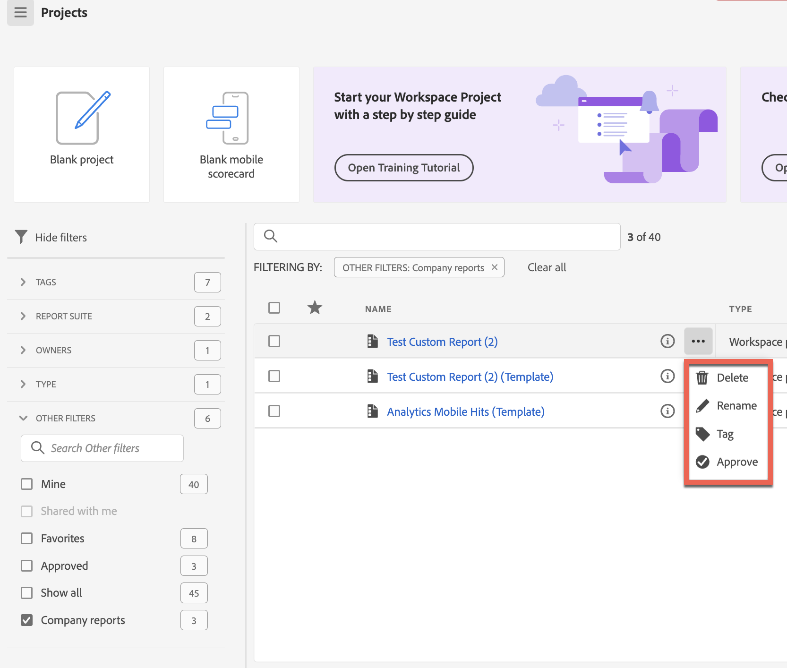

# Bedrijfssjablonen maken en beheren

U kunt aangepaste rapporten maken en deze opslaan zodat anderen deze kunnen gebruiken in uw aanmeldingsbedrijf. De malplaatjes van het bedrijf zijn beschikbaar om te kiezen wanneer het creëren van een project, zoals die in [ wordt beschreven een project van een leeg project of een rapport ](/help/analyze/analysis-workspace/build-workspace-project/create-projects.md#create-a-project-from-a-blank-project-or-a-report) in het artikel creëren, [ projecten in Analysis Workspace ](/help/analyze/analysis-workspace/build-workspace-project/create-projects.md) creëren.

## Een aangepaste bedrijfssjabloon maken

Een nieuwe bedrijfssjabloon maken:

1. Bouw een project in Analysis Workspace aan uw gewenste staat.
1. Selecteer [!UICONTROL **Project**] > **[!UICONTROL Save as company template...]**.

   

1. Werk de naam van het rapport bij, voeg een beschrijving toe, en voeg om het even welke markeringen toe, dan uitgezocht [!UICONTROL **sparen als bedrijfmalplaatje**].

   Het malplaatje wordt toegevoegd aan de lijst van de malplaatjes van het Bedrijf in Create Project modaal en is beschikbaar aan gebruikers in uw login bedrijf.

   Voor meer informatie over hoe de gebruikers een project kunnen tot stand brengen dat op een bedrijfmalplaatje wordt gebaseerd, zie &quot;een project van een leeg project of een rapport&quot;in [ creëren projecten ](/help/analyze/analysis-workspace/build-workspace-project/create-projects.md).

## Bedrijfssjablonen beheren

Beheerders kunnen de projectlijst filteren om bedrijfssjablonen weer te geven en te beheren. De vastgezette punten blijven vastgezet gevolgd door de lijst van bedrijfmalplaatjes die door het rapportpictogram  worden geïdentificeerd. In deze weergave kunt u een of meer rapporten verwijderen, hernoemen, labelen of goedkeuren.

Zo kunt u bedrijfssjablonen weergeven en beheren:

1. In het filterspoor, uitgezochte **ANDERE FILTERS** en selecteer dan **de malplaatjes van het Bedrijf**.

   Er wordt een lijst met bedrijfssjablonen weergegeven. Alle gewone projecten worden niet weergegeven, tenzij ze vastgezet zijn.

   

   Als bedrijfssjablonen worden weergegeven, kunnen beheerders het rapport verwijderen, hernoemen, toevoegen of goedkeuren.

1. Selecteer één rapport in de rapportlijst of selecteer meerdere rapporten.

1. Klik op het pictogram **..** elilpsis naast een rapport om de beschikbare opties weer te geven (Verwijderen, Naam wijzigen, Tags toevoegen en Goedkeuren).

   

1. Selecteer een optie (Verwijderen, Naam wijzigen, Label en Goedkeuren).

1. Om op de regelmatige mening terug te keren wanneer uw gedaan, in filterspoor, uncheck de optie van de malplaatjes van het Bedrijf opnieuw.

### Een bedrijfssjabloon verwijderen

Admins kunnen een rapport schrappen gebruikend de hierboven beschreven de lijstoptie van het Bedrijf malplaatjes of een rapport schrappen van Create project modaal.

