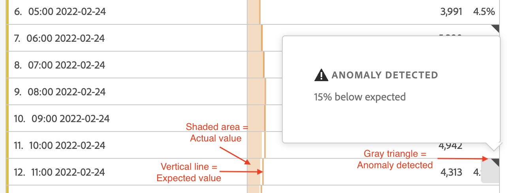

# anomalieën weergeven in de analysewerkruimte

U kunt anomalieën in een lijst of in een lijngrafiek bekijken.

## anomalieën in een tabel weergeven {#section_869A87B92B574A38B017A980ED8A29C5}

In een Freeform-tabel uit de tijdreeks wordt nu automatisch elke rij gemarkeerd met een donkergrijze uitroepteken als er een gegevensanomalie is gedetecteerd.

De verticale grijze lijn in elke rij geeft de verwachte waarde aan. Wanneer u de aanwijzer op het uitroepteken plaatst, wordt aangegeven in welke mate de afwijking afwijkt van de verwachte waarde (in + of - %).

## anomalieën weergeven in een lijndiagram {#section_7C1192AFDB4345A8A2CCFB3AE0C47D82}

Het lijndiagram toont de lichtgroene betrouwbaarheidsband met de afwijkende waarden (witte stippen).

Als u op een witte stip klikt, wordt deze groen en wordt het volgende weergegeven:

* De datum waarop de anomalie is opgetreden
* De onbewerkte waarde van de anomalie
* De percentagewaarde boven of onder de verwachte waarde, die door de stevige groene lijn wordt vertegenwoordigd.
* De koppeling Analyseren om [Contribute-analyse](/help/analyze/analysis-workspace/virtual-analyst/contribution-analysis/ca-tokens.md)te starten.

Als u veelvoudige metriek in het lijndiagram hebt, tonen wij slechts de anomalieën en u moet over elke anomalie bewegen om de betrouwbaarheidsband voor die metrisch te zien.

Met het betrouwbaarheidsinterval voor Anomaly-detectie wordt de y-as van een visualisatie niet automatisch geschaald om de grafiek beter leesbaar te maken.

U hebt de optie om het betrouwbaarheidsinterval toe te staan om de grafiek te schalen. Klik op het pictogram Instellingen (versnelling) en controleer **[!UICONTROL Allow Anomaly Detection to Scale Y Axis]**.

