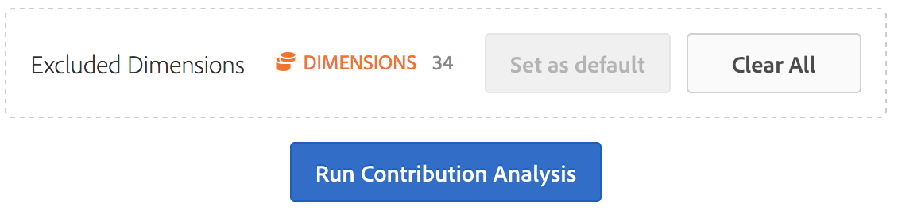

# Bijdrageanalyse uitvoeren

De analyse van de bijdrage is een intensief machine het leren proces dat wordt ontworpen om contribuanten aan een waargenomen anomalie in de Analytics van Adobe te ontdekken. De bedoeling is de gebruiker te helpen om gebieden van nadruk of mogelijkheden voor extra analyse veel sneller te vinden dan anders mogelijk zou zijn.

## Bijdrageanalyse uitvoeren {#section_7D2C5E48A5664727941DF4C90976D9DC}

Er zijn twee manieren om een beroep te doen op de analyse van de bijdrage in een project:

* In een vrije lijst met dagelijkse granulariteit, klik om het even welke rij met de rechtermuisknop aan en selecteer **[!UICONTROL Run Contribution Analysis]**. U kunt het zelfs op rijen in werking stellen die geen anomalie tonen.

   >[!NOTE]
   >
   >Wij steunen momenteel de analyse van de bijdragen alleen met de dagelijkse granulariteit.

   

* Houd de muisaanwijzer boven een afwijkend gegevenspunt in een lijndiagram in een lijndiagram. Klik op de **[!UICONTROL Analyze]** koppeling die wordt weergegeven.

   

1. (Optioneel) Nadat u in het regeldiagram of een tabel hebt geklikt, kunt u het bereik van de analyse (en dus de analyse versnellen) beperken door de afmetingen **[!UICONTROL Run Contribution Analysis]** uit te sluiten .

1. Wacht terwijl de analyse van uw bijdrage wordt geladen. Dit kan veel tijd in beslag nemen, afhankelijk van de grootte van uw rapportenpakket en het aantal dimensies. De analyse van de bijdrage voert analyse op de hoogste 50.000 punten per dimensie uit.
1. De Werkruimte van de analyse laadt dan een nieuw paneel van de Analyse van de Bijdrage direct binnen dit project. U zult veel vertrouwde panelen opmerken als u Analyse van de Bijdrage in Rapporten &amp; Analytics eerder hebt gebruikt:

   * Een visualisatie die het aantal **bezoeken** op die dag toont.
   * Een maandelijkse **Bezoek Tendelijn** voor context.
   * **Top Items** die tot deze anomalie hebben bijgedragen, gesorteerd op de [bijdragescore](https://marketing.adobe.com/resources/help/en_US/analytics/contribution/ca_contribution_score.html), plus de metrische waarde in kwestie, en een Unique Visitors (Unieke bezoekers) die metrische informatie in context vanuit een grootteperspectief plaatsen.

   * In de tabel [Gegenereerde segmenten](https://marketing.adobe.com/resources/help/en_US/analytics/contribution/ca_workflow_premium.html) (bovenste itemclusters) worden koppelingen van topitems aangegeven op basis van de bijdragingsscore, anomalieën en het totale percentage dat bijdraagt aan de afwijkende maatstaf. Dit wordt vervolgens vastgelegd als een publiekssegment (bijdragesegment 1, bijdragesegment 2, enz.). Als u op de knop &quot;i&quot; (info) klikt, krijgt u een weergave van de definitie van elk automatisch segment, inclusief de items die er bovenaan staan:

      

1. Aangezien de bijdrageanalyse nu deel van de Werkruimte van de Analyse uitmaakt, kunt u uit een aantal van zijn eigenschappen van het de klikmenu van een lijst van de met de rechtermuisknop aanklikken gebruiken om uw analyse nog betekenisvoller te maken, zoals:

   * [Elk afmetingsitem omlaag splitsen op een andere afmeting.](/help/analyze/analysis-workspace/components/dimensions/t-breakdown-fa.md)
   * [Een of meer rijen Trending.](/help/analyze/analysis-workspace/analysis-workspace-features.md#section_34930C967C104C2B9092BA8DCF2BF81A)
   * [Nieuwe visualisaties toevoegen.](/help/analyze/analysis-workspace/visualizations/freeform-analysis-visualizations.md)
   * [Waarschuwingen maken.](/help/components/c-alerts/intellligent-alerts.md)
   * [Segmenten maken of vergelijken.](/help/analyze/analysis-workspace/c-panels/c-segment-comparison/segment-comparison.md)

>[!NOTE] We benadrukken de anomalie die wordt geanalyseerd met een blauwe stip in de bijdrageanalyse en de projecten voor intelligente waarschuwingen die eraan gekoppeld zijn. Dit geeft een duidelijkere indicatie van de anomalie die wordt geanalyseerd.

## Afmetingen uitsluiten van bijdrageanalyse {#section_F6932F4BF74544B5872164E7B1E0C6FC}

Het kan voorkomen dat u bepaalde dimensies wilt uitsluiten van de Contribute-analyse. Het kan bijvoorbeeld zijn dat u helemaal niets aan uw browser of hardware kunt schelen en dat u de analyse wilt versnellen door deze te verwijderen.

1. Nadat u hebt geklikt **[!UICONTROL Run Contribution Analysis]** (of **[!UICONTROL Analyze]** in een lijndiagram), wordt het **[!UICONTROL Excluded Dimensions]** deelvenster weergegeven.

1. Sleep gewoon ongewenste afmetingen naar het **[!UICONTROL Excluded Dimensions]** deelvenster en sla de lijst op door op **[!UICONTROL Set as Default]** te klikken. Of klik **[!UICONTROL Clear All]** om opnieuw te beginnen met het selecteren van de afmetingen die u wilt uitsluiten.

   

1. Klik **[!UICONTROL Run Contribution Analysis]** opnieuw nadat u afmetingen hebt toegevoegd om uit te sluiten (of niet om te kiezen).
1. Als u ooit de lijst van uitgesloten afmetingen moet herzien, enkel tweemaal klikken Afmetingen, en de lijst van uitgesloten dimensies toont:

   

1. Verwijder ongewenste afmetingen door op de x naast de elementen te klikken en de lijst vervolgens op te slaan door op **[!UICONTROL Set as Default]**.

