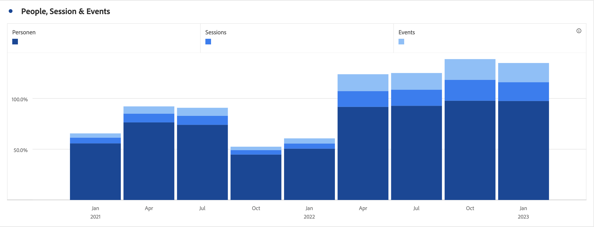

# Balkgrafiek en gestapelde-balkgrafiek

## Balk {#section_2E96E55D4E8E488CBCA6A3508DDF3918}

Bij deze visualisatie worden verticale balken weergegeven die verschillende waarden over een of meer meeteenheden vertegenwoordigen.

Met een keuzelijst met granulariteit in de visualisatie-instellingen kunt u een trendvisualisatie (bijvoorbeeld lijn, balk) wijzigen van dagelijks naar wekelijks, enz.

## Stapel {#section_9EA83779AE964635907EE5031A785A49}

Deze visualisatie is als een staafdiagram, maar met de reeksstaven bovenop elkaar gestapeld.

Met een nieuwe visualisatie-instelling op staafgestapelde visualisaties verandert u het diagram in een &#39;100% gestapelde&#39; visualisatie:

