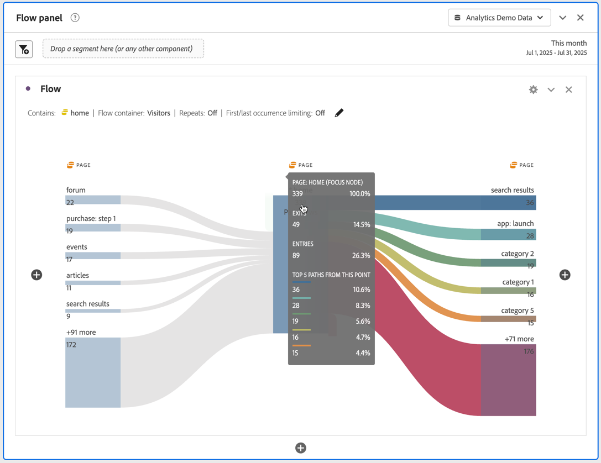

# Een stroomvisualisatie configureren

>[!NOTE]
>
>Deze nieuwe versie van de [!UICONTROL Flow] visualisatie vindt momenteel plaats in een persoonlijke bèta. Zie [deze pagina](/help/analyze/analysis-workspace/visualizations/c-flow/creating-flow-report.md) voor de huidige functionaliteit.

Met Flow kunt u de exacte reizen bijhouden die uw klanten maken via uw website of uw app. Het traceert een pad door uw dimensies (en dimensie-items) of metriek. Elke stroom heeft een uitgangspunt en een eindpunt, en metrisch of dimensie (of punt) die u volgt.

De nieuwe [!UICONTROL flow] De ervaring verbetert uw werkschema op verscheidene manieren:

* Hierdoor kunnen metriek worden bijgehouden, naast dimensies en dimensie-items.
* Bevat [!UICONTROL Advanced Settings] om u te laten verder aanpassen [!UICONTROL flow].
* Het laat u vormen [!UICONTROL flow] voordat u het gaat bouwen.

## Configuratiestappen {#configure}

1. Als u een stroomdiagram wilt maken, voegt u een leeg deelvenster toe aan uw project en klikt u op het pictogram voor visualisatie in de linkertrack. Sleep vervolgens de stroomvisualisatie naar het deelvenster. Of sleep de [!UICONTROL Flow] visualisatie in een bestaand project.

1. Veranker uw stroomvisualisatie met een van de volgende drie opties:

   * [!UICONTROL Starts with] (maateenheden, afmetingen of items), of
   * [!UICONTROL Contains] (afmetingen, of items), of
   * [!UICONTROL Ends with] (maateenheden, afmetingen of items)

   Elk van deze categorieën wordt op het scherm getoond als &quot;dalingsstreek.&quot; Sleep items uit de lijst Afmetingen of Metriek en zet ze neer in de gewenste neerzetzone.

   Stel bijvoorbeeld dat u alles wilt traceren wat tot een uitcheckgebeurtenis leidt. U zou een controle-verwante afmeting of metrisch (zoals slepen [!UICONTROL Order exists]) in de **[!UICONTROL Ends with]** dropzone.

1. Als u metrisch kiest, moet u ook verstrekken [!UICONTROL Pathing Dimension], zoals u hier ziet, die u gebruikt om het pad samen te stellen. De standaardwaarde is [!UICONTROL Page].

   

1. (Optioneel) Klik op **[!UICONTROL Show Advanced Settings]** Geavanceerde instellingen configureren:

   

   | Instelling | Beschrijving |
   | --- | --- |
   | **[!UICONTROL Include repeat instances]** | Stroomvisualisaties zijn gebaseerd op instanties van een dimensie. Met deze instelling kunt u herhaalde exemplaren, zoals opnieuw laden van pagina&#39;s, opnemen of uitsluiten. Herhalingen kunnen echter niet worden verwijderd uit Flow-visualisaties met multigetaxeerde afmetingen, zoals listVars, listProps, s.product, merchandising Vars, enz. Standaard = uitgeschakeld. |
   | **[!UICONTROL Wrap labels]** | Normaal gesproken worden de labels op de Flow-elementen ingekort om de schermruimte op te slaan, maar u kunt het volledige label zichtbaar maken door dit selectievakje in te schakelen.  Standaard = uitgeschakeld. |
   | **[!UICONTROL Limit to Entries/Exits]** | Resultaten beperkt tot paden wanneer het eerste/laatste aanraakpunt is en entry/exit. |
   | **[!UICONTROL Number of Columns]** | Hiermee bepaalt u hoeveel kolommen u in het stroomdiagram wilt opnemen. |
   | **[!UICONTROL Items expanded per Column]** | Hoeveel punten u in elke kolom wilt. |
   | **[!UICONTROL Flow Container]** | <ul><li>Bezoek</li><li>Bezoeker</li></ul> Hiermee kunt u schakelen tussen Bezoek en Bezoeker om het plakken van bezoekers te analyseren. Met deze instellingen kunt u de betrokkenheid van bezoekers op bezoekersniveau (verschillende bezoeken) begrijpen of de analyse beperken tot één bezoek. |

1. Klik op **[!UICONTROL Build]**.

## De stroomuitvoer weergeven en wijzigen {#output}

Een samenvatting van de configuratie van de Stroom verschijnt bij de bovenkant van het diagram. De paden in het diagram zijn proportioneel. Paden met meer activiteit lijken dikker.

Als u verder naar de gegevens wilt gaan, hebt u verschillende opties:

* Het stroomdiagram is interactief. Plaats de muis boven het diagram om de weergegeven details te wijzigen.

* Wanneer u op een knoop in het diagram klikt, verschijnen de details voor die knoop. Klik nogmaals op het knooppunt om het samen te vouwen.

   

* U kunt een kolom filteren om alleen bepaalde resultaten weer te geven, zoals inclusief en exclusief, het opgeven van criteria enzovoort.

* Klik op het plusteken (+) aan de linkerkant om een kolom uit te vouwen.

* Met de rechtermuisknop klikt u op de opties die hieronder worden uitgelegd, om de uitvoer verder aan te passen.

* Klik op het potloodpictogram naast het configuratieoverzicht om de flow verder te bewerken of opnieuw samen te stellen met andere opties.

* U kunt uw diagram van de Stroom als deel van het .CSV dossier van een project ook uitvoeren en verder analyseren door te gaan naar **[!UICONTROL Project]** > **[!UICONTROL Download CSV]**.

## Klikopties met de rechtermuisknop {#right-click}

| Optie | Beschrijving |
|--- |--- |
| [!UICONTROL Focus on this node] | Wijzig de focus in het geselecteerde knooppunt. Het focusknooppunt verschijnt in het midden van het stroomdiagram. |
| [!UICONTROL Start Over] | Hiermee gaat u terug naar de constructor van het Freeform-diagram, waar u een nieuw stroomdiagram kunt maken. |
| [!UICONTROL Create Segment from this point in flow] | Maak een segment. Dit neemt u in de Bouwer van het Segment, waar u het nieuwe segment kunt vormen. |
| [!UICONTROL Breakdown] | Verdeel de knoop neer door beschikbare Dimension, Metriek, of Tijd. |
| [!UICONTROL Trend] | Creeer een trended diagram voor de knoop. |
| [!UICONTROL Expand entire column] | Vouw een kolom uit om alle knooppunten weer te geven. Standaard worden alleen de bovenste vijf knooppunten weergegeven. |
| [!UICONTROL Collapse entire column] | Alle knooppunten in een kolom verbergen. |