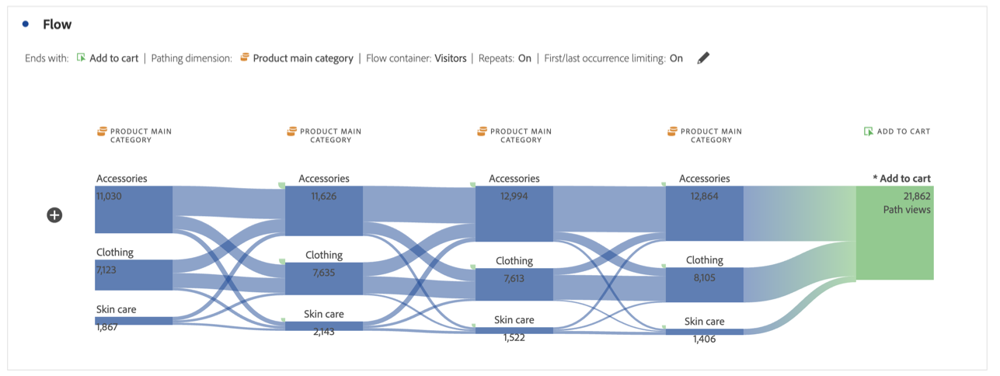

# Een stroomvisualisatie configureren {#configure-a-flow-visualization}

>[!CONTEXTUALHELP]
>id="workspace_flow_startswith"
>title="Starts with (Begint met)"
>abstract="Dit veld kan alleen worden ingesteld bij de eerste build. Als u dit veld wilt bijwerken, selecteert u **[!UICONTROL Reset]** om een nieuwe stroomvisualisatie te maken."

>[!CONTEXTUALHELP]
>id="workspace_flow_contains"
>title="Bevat"
>abstract="Dit veld kan alleen worden ingesteld bij de eerste build. Als u dit veld wilt bijwerken, selecteert u **[!UICONTROL Reset]** om een nieuwe stroomvisualisatie te maken."

>[!CONTEXTUALHELP]
>id="workspace_flow_endswith"
>title="Ends with (Eindigt met)"
>abstract="Dit veld kan alleen worden ingesteld bij de eerste build. Als u dit veld wilt bijwerken, selecteert u **[!UICONTROL Reset]** om een nieuwe stroomvisualisatie te maken."

>[!CONTEXTUALHELP]
>id="workspace_flow_pathingdimension"
>title="Dimensie verven"
>abstract="Selecteer een dimensie die u wilt gebruiken als het pad dat u wilt gebruiken voor of naar de geselecteerde component."

>[!CONTEXTUALHELP]
>id="workspace_flow_container"
>title="Stroomcontainer"
>abstract="Selecteer de container die u wilt gebruiken om het plakken weer te geven (nummers voor)."

>[!CONTEXTUALHELP]
>id="workspace_flow_include_repeats_disabled"
>title="Inclusief herhalingen (uitgeschakeld)"
>abstract="Herhalingen kunnen niet worden verwijderd uit stroomvisualisaties die multigetaxeerde afmetingen bevatten."

>[!CONTEXTUALHELP]
>id="workspace_flow_include_repeats_default"
>title="Inclusief herhalingen"
>abstract="Stroomvisualisaties zijn gebaseerd op instanties van een dimensie. Met deze instelling kunt u herhalende exemplaren opnemen of uitsluiten, bijvoorbeeld: Pagina wordt opnieuw geladen."

>[!CONTEXTUALHELP]
>id="workspace_flow_limit_occurrence"
>title="Beperken tot eerste/laatste voorkomen"
>abstract="De resultaten zijn beperkt tot wegen wanneer het eerste/laatste aanraakpunt een ingang/uitgang is."

>[!CONTEXTUALHELP]
>id="workspace_flow_numberofcolumns"
>title="Aantal kolommen"
>abstract="Dit veld kan alleen worden ingesteld bij de eerste build. Als u dit veld wilt bijwerken, selecteert u **[!UICONTROL Reset]** om een nieuwe stroomvisualisatie te maken."

>[!CONTEXTUALHELP]
>id="workspace_flow_itemsexpandedpercolumn"
>title="Items uitgevouwen per kolom"
>abstract="Dit veld kan alleen worden ingesteld bij de eerste build. Als u dit veld wilt bijwerken, selecteert u **[!UICONTROL Reset]** om een nieuwe stroomvisualisatie te maken."

>[!CONTEXTUALHELP]
>id="workspace_flow_resettoupdate"
>title="Herstellen om bij te werken"
>abstract="Dit veld kan alleen worden ingesteld bij de eerste build. Als u dit veld wilt bijwerken, selecteert u **[!UICONTROL Reset]** om een nieuwe stroomvisualisatie te maken."

Stroomvisualisaties helpen u de reis te begrijpen die voortvloeit uit of leidt tot een specifieke conversiegebeurtenis op uw website of uw app. Het traceert een pad door uw dimensies (en dimensie-items) of metriek.

Met stroomvisualisaties kunt u het begin of einde van het pad configureren waarin u bent geïnteresseerd, of alle paden analyseren die door een dimensie- of dimensie-item lopen.

## Gebruiken

1. Voeg a  **[!UICONTROL Flow]** visualisatie toe. Zie [ een visualisatie aan een paneel ](../freeform-analysis-visualizations.md#add-visualizations-to-a-panel) toevoegen.

1. Veranker uw stroomvisualisatie met een van de volgende opties:

   * [!UICONTROL **begint met**] (metriek, dimensies, of punten), of
   * [!UICONTROL **bevat**] (afmetingen, of punten), of
   * [!UICONTROL **eindigt met**] (metriek, dimensies, of punten)

   Elk van deze categorieën wordt getoond op het scherm als a *dalingsstreek*. U kunt de neerzetzone op drie manieren vullen:

   * Gebruik het keuzemenu om metriek of afmetingen te selecteren.
   * Sleep afmetingen of metriek vanuit het linkerdeelvenster.
   * Typ de naam van een dimensie of metrisch en selecteer deze wanneer deze in de vervolgkeuzelijst wordt weergegeven.

   >[!IMPORTANT]
   >
   >Berekende metriek kunnen niet worden gebruikt in de velden **[!UICONTROL Starts with]** en **[!UICONTROL Ends with]** .

1. Als u metrisch kiest, moet u ook a [!UICONTROL **het Schilderen Dimension**] verstrekken om als uw weg te gebruiken die aan of uit uw geselecteerde component leiden, zoals hier getoond. Het gebrek is [!UICONTROL **Pagina**].

   

1. (Optioneel) Selecteer **[!UICONTROL Show advanced settings]** om een van de volgende opties te configureren:

   | Instelling | Beschrijving |
   | --- | --- |
   | **[!UICONTROL Wrap labels]** | Normaal gesproken worden de labels op de Flow-elementen ingekort om de schermruimte op te slaan, maar u kunt het volledige label zichtbaar maken door dit selectievakje in te schakelen.  Standaard = uitgeschakeld. |
   | **[!UICONTROL Include repeat instances]** | Stroomvisualisaties zijn gebaseerd op instanties van een dimensie. Deze instelling biedt u de mogelijkheid om herhaalde exemplaren op te nemen of uit te sluiten, bijvoorbeeld Pagina opnieuw wordt geladen. Herhalingen kunnen echter niet worden verwijderd uit Flow-visualisaties met multigetaxeerde afmetingen, zoals listVars, listProps, s.product, merchandising Vars, enz. 
Deze optie is standaard uitgeschakeld.
 |
   | **[!UICONTROL Limit to first/last occurrence]** | Beperk paden tot paden die beginnen of eindigen met de eerste of laatste instantie van een dimensie, item of metrische waarde. Zie [ Beperken tot eerste/laatste voorkomen ](#example-scenario-for-limit-to-firstlast-occurrence) voor een meer gedetailleerde verklaring. |
   | **[!UICONTROL Number of columns]** | Het aantal kolommen u in uw diagram van de Stroom wilt. U kunt maximaal vijf kolommen opgeven. |
   | **[!UICONTROL Items expanded per column]** | Het aantal items dat u in elke kolom wilt opnemen. U kunt maximaal tien items opgeven die per kolom worden uitgevouwen. |
   | **[!UICONTROL Flow container]** | U kunt schakelen tussen **[!UICONTROL Sessions]** en **[!UICONTROL Person]** om het plakken te analyseren. Met deze instellingen kunt u de betrokkenheid van een persoon op persoonlijk niveau (tijdens verschillende sessies) begrijpen of de analyse beperken tot één sessie. |

   >[!IMPORTANT]
   >
   >De combinatie van **[!UICONTROL Number of columns]** en **[!UICONTROL Items expanded per column]** bepaalt het aantal onderliggende aanvragen dat vereist is om de flowvisualisatie te maken. Hoe hoger deze getallen, hoe langer het duurt om een visualisatie te renderen.

1. Selecteer **[!UICONTROL Build]** .

### Voorbeeld

Stel dat u het pad wilt overtrekken dat gebruikers naar en van de populairste pagina&#39;s op uw site hebben gekozen.

1. Maak een stroomvisualisatie zoals hierboven beschreven.
1. Sleep de [!UICONTROL **dimensie van de Pagina**] in het **[!UICONTROL Contains]** gebied, dan uitgezocht [!UICONTROL **bouwt**].
1. De stroomvisualisatie bouwt, met de meest bekeken pagina zichtbaar in de nadrukknoop, bij het centrum van de visualisatie. U ziet ook de bovenste pagina&#39;s die naar die pagina lopen (links van het focusknooppunt) en de bovenliggende pagina&#39;s die uit die pagina lopen (rechts van het focusknooppunt).
1. Analyseer gegevens in de stroom, zoals die in [ wordt beschreven vormt ](#configure).

## Configureren

Een overzicht van de configuratie van de Stroom verschijnt bij de bovenkant van visualisaties. De paden in het diagram zijn proportioneel. Paden met meer activiteit lijken dikker.

Als u verder naar de gegevens wilt gaan, hebt u verschillende opties:

* Het stroomdiagram is interactief. Plaats de muis boven het diagram om de weergegeven details te wijzigen.

* Wanneer u op een knoop in het diagram selecteert, verschijnen de details voor die knoop. Selecteer opnieuw de knoop om het samen te vouwen.

  

* U kunt een kolom filteren om alleen bepaalde resultaten weer te geven, zoals inclusief en exclusief, het opgeven van criteria enzovoort.

* Selecteer  op de linkerzijde of de rechterkant om een kolom uit te breiden.

* Om de output aan te passen, gebruik de [ opties van het contextmenu ](#context-menu).

* Om de stroom uit te geven of het met verschillende opties te herbouwen, uitgezocht  naast de configuratiesamenvatting uit.

## Filter

Boven elke kolom, verschijnt een filter  wanneer u over het beweegt. Als u het filter selecteert, krijgt u hetzelfde filterdialoogvenster als in de tabel Vrije vorm. Zie [ Filter en soort ](freeform-table/../../freeform-table/filter-and-sort.md).

* Gebruik **[!UICONTROL Show advanced]** om geavanceerde instellingen te configureren, zodat bepaalde criteria in een lijst met operatoren worden opgenomen of uitgesloten. Zie [ Filters en soort ](../freeform-table/filter-and-sort.md) voor meer informatie.
* Zodra u een kolom hebt gefilterd, wijst die specifieke kolom op het filtreren. Een blauw  wijst erop dat de kolom wordt gefiltreerd.  Het filter reduceert de kolom zodat alleen het item wordt weergegeven dat in het filter is toegestaan. Of alle items worden verwijderd, behalve het gewenste item in het filter.
* Alle stroomafwaartse en stroomopwaartse kolommen blijven bestaan, zolang er gegevens in de resterende knopen stromen.
* Om een filter te verwijderen, uitgezochte  om het filtermenu te openen. Verwijder eventueel toegepaste filters en selecteer vervolgens **[!UICONTROL Save]** . De flow moet terugkeren naar de vorige ongefilterde toestand.

## Contextmenu

Gebruik een contextmenu op een knooppunt in de stroomvisualisatie met de volgende opties:

| Optie | Beschrijving |
|--- |--- |
| **[!UICONTROL Focus on this node]** | Wijzig de focus in het geselecteerde knooppunt. Het focusknooppunt verschijnt in het midden van het stroomdiagram. |
| **[!UICONTROL Start over]** | Ga terug naar de constructor van het Freeform-diagram, waar u een nieuw stroomdiagram kunt maken. |
| **[!UICONTROL Create a filter for this path]** | Maak een filter. Deze selectie neemt u in de Bouwer van de Filter, waar u de nieuwe filter kunt vormen. |
| **[!UICONTROL Breakdown]** | Verdeel de knoop neer door beschikbare Dimensies, Metriek, of Tijd. |
| **[!UICONTROL Filter column]** | Dezelfde filteropties worden weergegeven als beschikbaar zijn in de tabel Vrije vorm. Voor meer informatie over de beschikbare opties, zie de sectie &quot;een eenvoudig of geavanceerd filter op een lijst&quot;in [ Filter en sorteerlijsten ](/help/analyze/analysis-workspace/visualizations/freeform-table/filter-and-sort.md) toepassen. |
| **[!UICONTROL Exclude item]** of **[!UICONTROL Restore excluded items]** | Hiermee verwijdert u een specifiek knooppunt uit de kolom en maakt u het automatisch als filter boven aan de kolom. Selecteer **[!UICONTROL Restore Excluded Item]** in het contextmenu om het uitgesloten item te herstellen. U kunt het filter ook boven aan de kolom openen en de pillarbox verwijderen met het item dat u zojuist hebt uitgesloten. |
| **[!UICONTROL Trend]** | Creeer een trended diagram voor de knoop. |
| **[!UICONTROL Show next column]** / **[!UICONTROL Show previous column]** | Geeft de volgende (rechts) of vorige (links) kolom van de visualisatie aan. |
| **[!UICONTROL Hide colum]**n | Hiermee verbergt u de geselecteerde kolom uit de visualisatie. |
| **[!UICONTROL Expand entire column]** | Breid een kolom uit om alle knopen te tonen. Standaard worden alleen de bovenste vijf knooppunten weergegeven. |
| **[!UICONTROL Create audience from selection]** | Hiermee maakt u een publiek op basis van de geselecteerde kolom. |
| **[!UICONTROL Collapse entire column]** | Alle knooppunten in een kolom verbergen. |

## Beperken tot eerste/laatste voorkomen

Houd er bij het gebruik van deze optie rekening mee dat:

* **[!UICONTROL Limit to first/last occurrence]** telt alleen het eerste/laatste exemplaar in de reeks. Alle andere gevallen van de criteria **[!UICONTROL Starts with]** of **[!UICONTROL Ends with]** worden genegeerd.
* Bij gebruik met een **[!UICONTROL Starts with]** -flow wordt alleen de eerste instantie die aan de begincriteria voldoet, opgenomen.
In het voorbeeld hieronder, **alle** voorkomen van *voeg aan kart* toe en *hoofdcategorie van het Product* in elke stap van de stroom is inbegrepen.
  

  In het voorbeeld hieronder, slechts worden de **eerste** voorkomen van *toegevoegd aan kart* en *de belangrijkste categorie van het Product* in elke stap van de stroom inbegrepen.
  
* Bij gebruik met een **[!UICONTROL Ends with]** -flow wordt alleen de laatste instantie opgenomen die aan de eindcriteria voldoet.
In het voorbeeld hieronder, **alle** voorkomen van *hoofdcategorie van het Product* en *voeg aan wortel* in elke stap van de stroom toe zijn inbegrepen.
  

  In het voorbeeld hieronder, slechts zijn de **laatste** voorkomen van *hoofdcategorie van het Product* en *toevoegen aan wortel* in elke stap van de stroom inbegrepen.
  
* De gebruikte reeks verschilt op basis van de container. Als u de container **[!UICONTROL Person]** gebruikt, is de reeks gebeurtenissen de sessie. Als u de container **[!UICONTROL Session]** gebruikt, zijn de reeks gebeurtenissen alle gebeurtenissen voor een bepaalde gebruiker in het opgegeven datumbereik.
* De optie **[!UICONTROL Limit to first/last occurrence]** kan in de geavanceerde instellingen worden geconfigureerd wanneer u een Metrisch of Dimension-item gebruikt in de velden **[!UICONTROL Starts with]** of **[!UICONTROL Ends with]** .

>[!MORELIKETHIS]
>
>[ voeg een visualisatie aan een paneel toe ](/help/analyze/analysis-workspace/visualizations/freeform-analysis-visualizations.md#add-visualizations-to-a-panel)
>[Visualisatie-instellingen ](/help/analyze/analysis-workspace/visualizations/freeform-analysis-visualizations.md#settings)
>[Contextmenu Visualisatie ](/help/analyze/analysis-workspace/visualizations/freeform-analysis-visualizations.md#context-menu)
>

<!--
## Create a flow visualization {#configure}

1. Add a blank panel to your project and click the visualizations icon in the left rail. 

   Or
   
   Add a visualization in any of the ways described in the "Add visualizations to a panel" section in [Visualizations overview](/help/analyze/analysis-workspace/visualizations/freeform-analysis-visualizations.md).

1. Anchor your Flow visualization using one of the following options:

   * [!UICONTROL **Starts with**] (metrics, dimensions, or items), or
   * [!UICONTROL **Contains**] (dimensions, or items), or
   * [!UICONTROL **Ends with**] (metrics, dimensions, or items)

   Each of these categories is shown onscreen as a "drop zone." You can populate the drop zone in 3 ways:

   * Use the drop-down menu to select metrics or dimensions.
   * Drag dimensions or metrics from the left rail.
   * Begin typing the name of a dimension or metric, then select it when it appears in the drop-down list.

   >[!IMPORTANT]
   >
   >Calculated metrics cannot be used in the  **[!UICONTROL Starts with]** or **[!UICONTROL Ends with]** fields.

1. If you choose a metric, you also need to provide a [!UICONTROL **Pathing Dimension**] to use as your path leading to or coming from your selected component, as shown here. The default is [!UICONTROL **Page**].

   

1. (Optional) Select **[!UICONTROL Show advanced settings]** to configure any of the following options:

   

   | Setting | Description |
   | --- | --- |
   | **[!UICONTROL Wrap labels]** | Normally, the labels on the Flow elements are truncated to save screen real estate, but you can make the entire label visible by checking this box.  Default = unchecked. |
   | **[!UICONTROL Include repeat instances]** | Flow visualizations are based on instances of a dimension. This setting gives you the option to include or exclude repeated instances, e.g. Page reloads. However, repeats cannot be removed from Flow visualizations that include multi-valued dimensions, such as listVars, listProps, s.product, merchandising eVars, etc. 
This option is disabled by default.
 |
   | **[!UICONTROL Limit to first/last occurrence]** | Limit paths to those that start/end with the first/last occurrence of a dimension/item/metric. See the section below, [Example scenario for 'limit to first/last occurrence'](#example-scenario-for-limit-to-firstlast-occurrence), for a more detailed explanation. |
   | **[!UICONTROL Number of columns]** | The number of columns you want in your Flow diagram. You can specify a maximum of 5 columns. |
   | **[!UICONTROL Items expanded per column]** | The number of items you want in each column. You can specify a maximum of 10 items expanded per column.  |
   | **[!UICONTROL Flow container]** | <ul><li>Visit</li><li>Visitor</li></ul> Lets you switch between Visit and Visitor to analyze visitor pathing. These settings help you understand visitor engagement at the visitor level (across visits), or constrain the analysis to a single visit.|

   >[!IMPORTANT]
   >
   >The combination of **[!UICONTROL Number of columns]** and **[!UICONTROL Items expanded per column]** determine the number of underlying requests required to create the flow visualization. The higher those numbers, the longer it takes to render a visualization.

1. Select **[!UICONTROL Build]**.

>[!INFO]
>
>**Example:** Suppose that you want to trace the path that users took both to and from the most popular pages on your site.
>
>To do this, you would
> 
>1. Begin creating a flow visualization as described above.
>1. Drag the [!UICONTROL **Page**] dimension into the **[!UICONTROL Contains]** field, then select [!UICONTROL **Build**].
>1. The Flow visualization builds with the most-viewed page visible in the focus node in the center of the visualization. You also see the top pages leading into that page (to the left of the focus node) as well as the top pages leading out of that page (to the right of the focus node).
>1. Analyze data in the flow, as described in [View and change the Flow output](#view-and-change-the-flow-output).

## View and change the Flow output {#output}

A summary of the Flow configuration appears at the top of the diagram. The thickness of a path in the diagram is proportional to its activity, with paths with more activity appearing thicker than those with less activity.

To drill down further into the data, you have several options:

* The flow diagram is interactive. Mouse over the diagram to change the details that are shown.

* When you select on a node in the diagram, the details for that node appear. Select on the node again to collapse it.

   

* You can filter a column to display only certain results, such as including and excluding, specifying criteria, and so forth.

* Select the plus sign (+) on the left to expand a column.

* Use the right-click options explained below to further customize the output.

* Select the pencil icon next to the configuration summary to further edit the flow or rebuild it with different options.

* You can also export and further analyze your Flow diagram as part of a project's .CSV file by going to **[!UICONTROL Project]** > **[!UICONTROL Download CSV]**.

## Filtering

Above each column, a filter appears when you hover over it. By selecting the filter, you get the same filter dialog that exists in the Freeform table today. This filter works the same as it does in the Freeform table.

* Use advanced settings to include or exclude certain criteria with our list of operators.
* Once you have filtered an item from the list, that specific column will reflect the filtering. (The filter either reduces it to only show the item allowed in the filter, or it removes all items except for the one item you want in the filter.
* All downstream and upstream columns should persist, as long as there is data flowing into the remaining nodes.
* Once applied, the filter icon appears in blue above the column it is filtering.
* To remove a filter, select the filter icon to open the filter menu. Remove any filters applied and then select **[!UICONTROL Save]**. The flow should return to its previous, unfiltered state.

## Right-click options {#right-click}

| Option | Description |
|--- |--- |
| [!UICONTROL Start over] | Returns you to the Freeform diagram builder, where you can build a new Flow diagram. |
| [!UICONTROL Create segment for this path] | Create a segment. This takes you into the Segment Builder, where you can configure the new segment. |
| [!UICONTROL Breakdown] | Break the node down by available Dimensions, Metrics, or Time. |
| [!UICONTROL Trend] | Create a trended diagram for the node. |
| Show next column / Show previous column | Reveals the next (right) or previous (left) column of the visualization. |
| Hide column | Hides the selected column from the visualization. | 
| [!UICONTROL Expand entire column] | Expand a column to show all nodes. By default, only the top five nodes display. |

## Example scenario for 'limit to first/last occurrence'

When using this option, keep in mind that:

* **[!UICONTROL Limit to first/last occurrence]** counts only the first/last occurrence in the series. All other occurrences of the **[!UICONTROL Starts with]** or **[!UICONTROL Ends with]** criteria are discarded.
* If used with a **[!UICONTROL Starts with]** flow, only the first occurrence that matches the start criteria is included.
* If used with an **[!UICONTROL Ends with]** flow, only the last occurrence that matches the end criteria will be included.
* The series used differs based on the container. If using the **[!UICONTROL Visit]** container, the series of hits will be the session. If using the **[!UICONTROL Visitor]** container, the series of hits will be all the hits for a given user in the provided date range.
* The **[!UICONTROL Limit to first/last occurrence]** option can be configured in the advanced settings when using a Metric or Dimension Item in the "Starts with" or "Ends with" fields.

Example series of hits:

Home > Products > Add to cart > Products > Add to Cart > Billing > Order Confirmation

### Consider a flow analysis using the following settings:

* Start with[!UICONTROL  Add to cart] (Dimension Item)
* [!UICONTROL Page] pathing dimension
* [!UICONTROL Visit] container

If **[!UICONTROL Limit to first/last occurrence]** is *disabled*, then this single series of hits counts 2 occurrences of "Add to Cart".
Expected Flow Output:
"Add to Cart" (2) —> "Products" (1)
                  -> "Billing" (1)

However, if **[!UICONTROL Limit to first/last occurrence]** is *enabled*, only the first occurrence of "Add to cart" is included in the analysis.
Expected Flow Output:
"Add to Cart" (1) —> "Products" (1)

### Consider the same series of hits but using the following settings:

* Ends with [!UICONTROL Add to cart] (Dimension Item)
* [!UICONTROL Page] pathing dimension
* [!UICONTROL Visit] container

If **[!UICONTROL Limit to first/last occurrence]** is *disabled*, then this single series of hits would count 2 occurrences of "Add to Cart".
Expected Flow Output:
"Products" (2) <— "Add to cart" (2)

However, if **[!UICONTROL Limit to first/last occurrence]** is *enabled*, only the last occurrence of [!UICONTROL Add to cart] would be included in the analysis.
Expected Flow Output:
"Products" (1) <— "Add to cart" (1)

-->